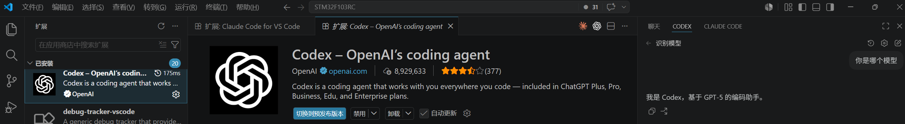
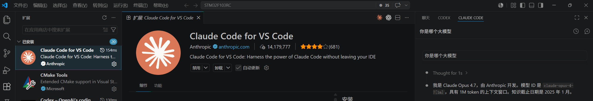

## 0、概念扫盲

[全网最全！60分钟全面掌握Claude Code~【附完整文档】](https://mp.weixin.qq.com/s/0Se4i8RHrtQc-wgGmUkfvw)

[40分钟学会Codex！“零基础”终级教程～【附完整文档】](https://mp.weixin.qq.com/s/rTE2vLqocDhyLeoaiXaHUg)

## 1、快速启用Agent

[快速开始 · ProAPI](https://newdocs.prorisehub.com/)

## 2、 如何使用CODEX

vscode安装codex插件

## 3、 如何使用CLAUDE CODE

vscode安装 Cladue Code插件

## 4、安装下载器的skill

百度云下载地址：

https://pan.baidu.com/s/1Dr8Ss16cBRWXtQpyOGrROg?pwd=zyo0 

github下载地址：

https://github.com/Aladdin-Wang/Mklink-AI-Probe

以codex为例：

将mklink-flash压缩包解压到C:\Users\akqbd\.codex\skills目录

或者直接发起对话，让AI自己安装到全局目录

## 5、演示AI使用下载器的skill 进行编译、下载、debug

