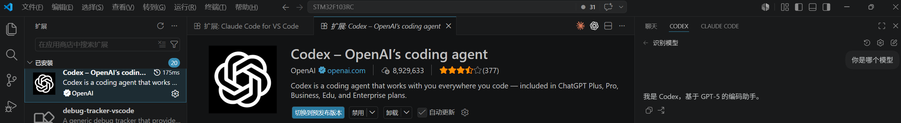
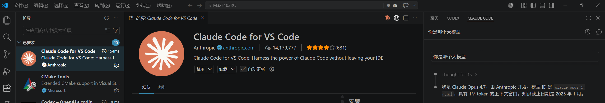

## 1、使用中转站快速启用Agent

### 1.1 注册中转站

https://newapi.prorisehub.com/sign-up?aff=o0Br

### 1.2 创建API秘钥（API Key）

1. 点击「创建API秘钥」
2. 填写令牌名称（随便起，方便自己辨认）
3. 选择分组（不知道选什么就选 `GPT(plus-pro混池)`）
4. 设置额度（可选，不设则跟随账户余额）

### 1.3 CC Switch 一键配置（推荐）

下载[CC Switch | Claude Code & Codex CLI 配置统一管理工具](https://cc-switch.cc/)

1. 登录 [HyueAPI 管理面板](https://hyueapi.com/)
2. 进入「API秘钥」页面
3. 找到你的令牌，点击旁边的 **「导入到 CCS」** 按钮
4. 浏览器会唤起 CC Switch 并自动写入配置
5. 在 CC Switch 中选择对应的 CLI 工具，点击「启动」即可

## 2、 如何使用CODEX

vscode安装codex插件

## 3、 如何使用CLAUDE CODE

vscode安装 Cladue Code插件

## 4、安装下载器的skill

参考[skill - MicroBoot](https://microboot.readthedocs.io/zh-cn/latest/tools/microlink/skill/)

