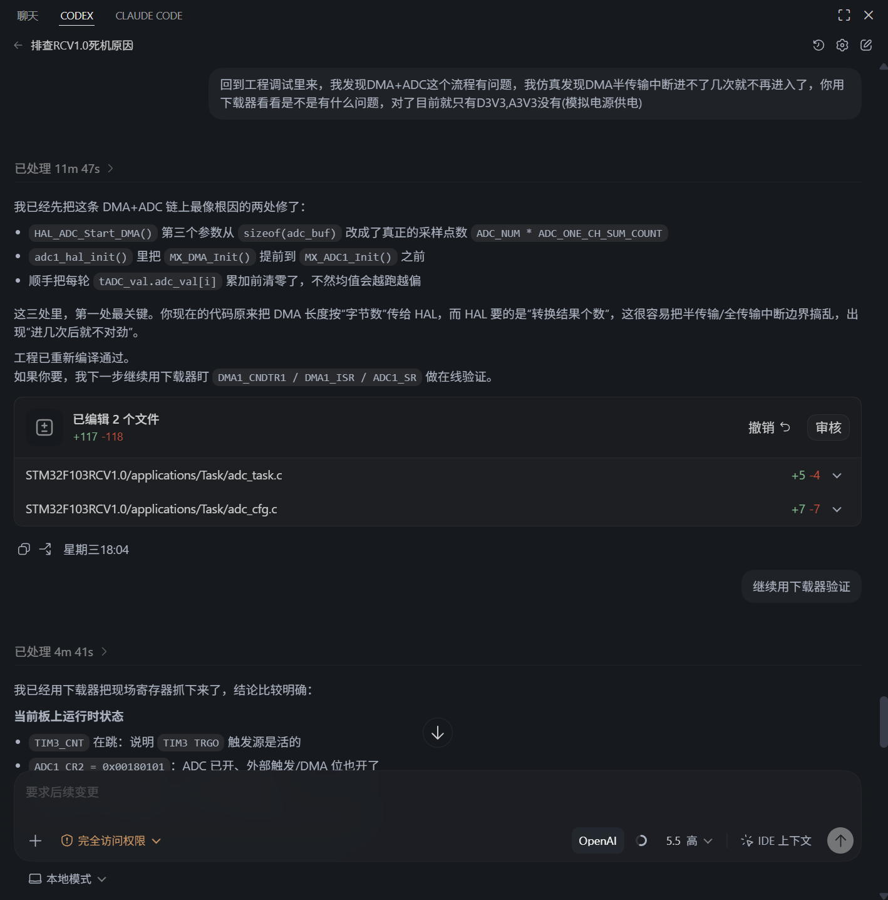
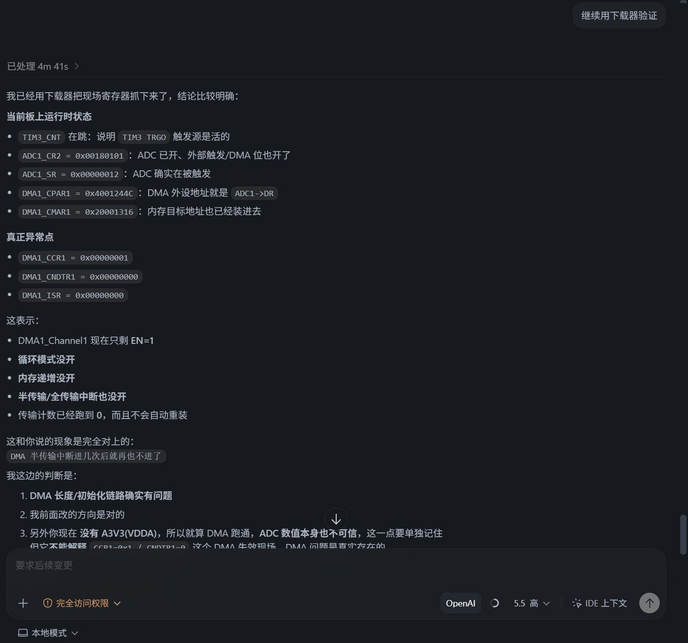
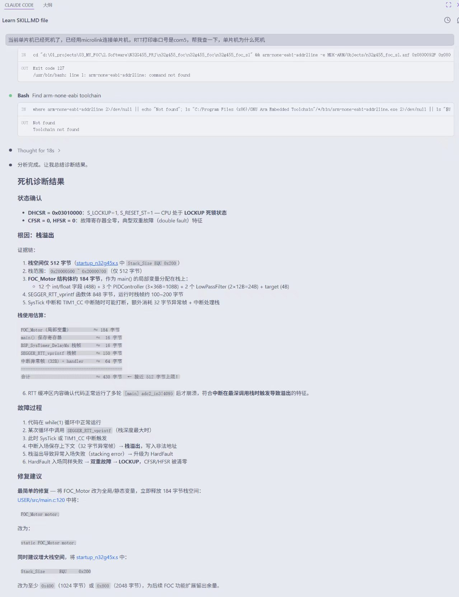
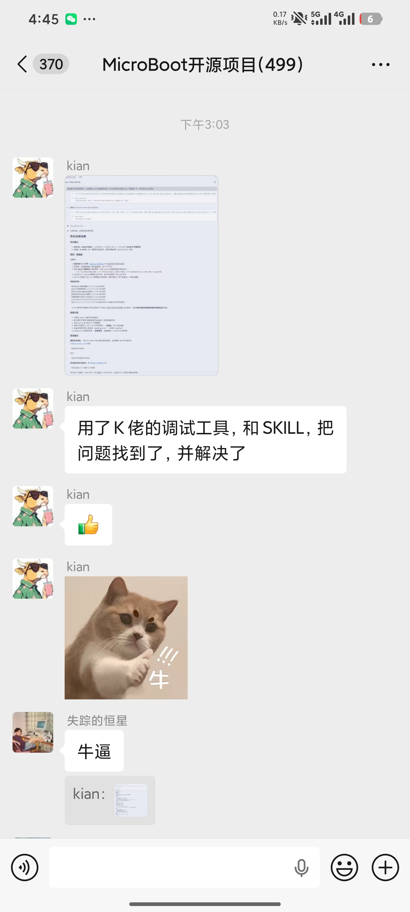
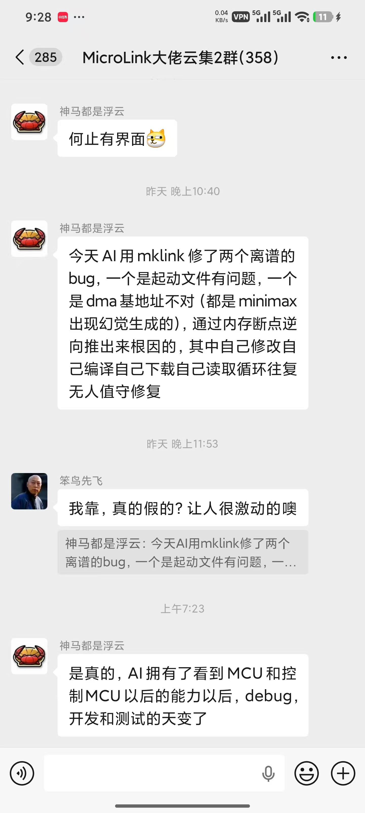

# 我可能做了一个全球最适合 AI Agent的多功能下载器

过去几十年，嵌入式开发里有一个默认前提：

**真正操作硬件的人，必须是工程师。**

所以我们的工具链一直是围绕“人”来设计的。

IDE 是给人看窗口的。

下载器是给人点按钮的。

变量窗口是给人展开的。

断点、单步、寄存器视图，是给人一点一点追现场的。

这套模式没有错。J-Link、OpenOCD、pyOCD、Keil、IAR、Ozone、GDB 这些工具链，支撑了嵌入式行业很长时间，也解决了大量真实工程问题。

但现在，一个新角色开始进入这个链路：

**AI Agent。**

AI 不再只是“帮你写一段代码”。它开始自己编译，自己下载，自己读 RAM，自己读寄存器，自己抓日志，自己判断修改有没有生效。

这件事的变化点不在于 AI 会不会写 C 代码。

真正的变化是：

**AI 开始进入硬件闭环。**

过去的嵌入式调试链路大概是：

```text
工程师
↓
IDE / 调试软件
↓
下载器 / 调试器
↓
MCU
```

而 AI Agent 出现后，链路开始变成：

```text
AI Agent
↓
Skills
↓
下载器 / 调试器
↓
MCU
↓
运行时状态
↓
AI 分析与修复
```

这不是“人被替代”。

更准确地说，是调试器的使用对象开始扩展了。

过去调试器主要服务人类工程师。

现在，它还需要服务 AI Agent。

## 为什么传统调试器对 AI 不够顺手

J-Link 和 OpenOCD 都很强。

这一点必须先说清楚。

它们的生态、稳定性、芯片支持、GDB 兼容、断点、watchpoint、寄存器访问、RTOS 调试能力，都已经非常成熟。

如果是工程师坐在电脑前调试，它们仍然是非常好的工具。

问题不在于它们“不强”。

问题在于它们很多能力最初是为人类交互设计的。

比如变量窗口很好，因为人可以看表格。

命令行很好，因为人可以输入命令、观察输出。

GDB 很强，因为人可以一边单步，一边脑子里维护代码上下文。

但 AI Agent 的工作方式不一样。

AI 最怕的不是没有工具。

AI 最怕的是：

1. 要连续发很多条命令才能拿到一个完整现场。
2. 每条命令都返回大量人类可读但机器难解析的文本。
3. 需要从窗口、日志、命令行输出里拼接事实。
4. 高频变化的数据，只能靠多次轮询，时间线不稳定。
5. 每轮交互都消耗大量 token，但硬件证据却不完整。

这就是为什么“有调试能力”和“适合 AI 调用”之间，还有一段距离。

对 AI 来说，传统变量窗口本质上是一种低效的人类观察方式。

AI 需要的不是 GUI。

**AI 需要的是 Hardware API。**

## AI 加上下载器，到底解决了什么痛点

在讨论 Hardware API 之前，先要回答一个更基础的问题：

**AI 加上下载器，到底解决了什么痛点？**

我觉得最核心的痛点不是“下载程序更方便”。

而是：

**AI 终于可以从代码联想，进入硬件求证。**

过去没有下载器参与时，AI 分析嵌入式问题，本质上大多只能靠三类信息：

1. 源代码。
2. 编译报错。
3. 工程师贴出来的日志或现象描述。

这些信息当然有价值。

但它们有一个共同问题：

**它们都不是完整的硬件现场。**

比如程序死机了，AI 可以看代码猜：

可能是数组越界。

可能是栈溢出。

可能是中断优先级问题。

可能是 DMA 没开循环模式。

可能是某个指针被踩了。

这些推理有时候是对的。

但如果 AI 只能停留在代码层面，它很容易进入一种危险状态：

**它会把一个“看起来合理”的解释，说成一个“已经被验证”的结论。**

这就是很多人用 AI 调嵌入式时最不放心的地方。

不是 AI 不聪明。

而是它没有证据。

没有真实 RAM。

没有真实寄存器。

没有异常栈帧。

没有 DMA 计数器。

没有 RTT 实时输出。

没有变量随时间变化的过程。

它只能根据代码结构和经验模式进行联想。

联想多了，就容易自圆其说。

自圆其说多了，就容易产生幻觉。

而下载器接入以后，这件事发生了根本变化。

AI 不再只能问：

“从代码看，可能是什么问题？”

它开始可以问：

“硬件现场到底是不是这样？”

比如：

- 怀疑 DMA 停了，就读 DMA 计数寄存器。
- 怀疑 HardFault，就读 CFSR、HFSR、PC、LR、SP 和异常栈帧。
- 怀疑变量被踩，就持续 dump 相关 RAM 区域。
- 怀疑初始化没生效，就读外设寄存器确认配置位。
- 怀疑修复没有生效，就重新下载后再读同一组现场数据。

这时 AI 的推理方式就变了。

过去是：

```text
代码
↓
经验联想
↓
看起来合理的解释
```

现在变成：

```text
代码
↓
提出假设
↓
读取硬件证据
↓
验证或推翻假设
↓
修改代码
↓
重新下载验证
```

这个变化非常关键。

因为它解决的不是一个工具效率问题，而是 AI 调试里的可信度问题。

**没有下载器，AI 很容易变成“会说话的代码阅读器”。**

**有了下载器，AI 才开始变成“能拿证据的硬件调试助手”。**

这也是为什么我认为 MKLink 这类工具真正有价值的地方，不只是“能下载程序”。

它让 AI 有机会把自己的判断放到真实硬件上验证。

这会显著减少大部分由信息缺失导致的幻觉。

当然，它不能消灭所有幻觉。

AI 仍然可能误读寄存器，可能误判时序，可能忽略模拟电路、电源、噪声、芯片 errata。

但只要 AI 能读到真实硬件证据，它就不再只能靠语言自洽。

它必须面对现场。

而嵌入式调试最重要的，恰恰就是现场。

## MKLink 到底做对了什么

MKLink 真正值得讨论的地方，是它把很多硬件操作做成了 Python API。

这看起来只是“多了一套接口”，但从 AI Agent 的角度看，意义很大。

因为 AI 调工具，最喜欢的是这种形式：

```python
cmd.read_ram(addr, size)
cmd.write_ram(addr, byte1, byte2, ...)
cmd.read_flash(addr, size)
cmd.write_flash(addr, byte1, byte2, ...)
cmd.read_cpu_reg(addr, size)
load.flm(path, flash_addr, ram_addr)
load.bin(path, addr, ...)
load.hex(path, ...)
RTTView.start(addr, size, channel)
SystemView.start(addr, size, channel)
vofa.send(addr, num, time)
cmd.dump_memory(addr1, size1, addr2, size2, ..., period)
```


这些 API 的文档可以直接看这里：

https://microboot.readthedocs.io/zh-cn/latest/tools/microlink/python_api/

重点是：

**AI 可以用一条明确的 Python 调用，完成一个明确的硬件动作。**

比如要看一段 RAM：

```python
cmd.read_ram(0x20000000, 128)
```

要改一个运行时变量：

```python
cmd.write_ram(0x20001000, 0xA5, 0x5A)
```

要加载 Flash 下载算法：

```python
load.flm("FLM/STM32F10x_1024.FLM", 0x08000000, 0x20000000)
```

要一次烧录 bootloader 和 app：

```python
load.bin("bootloader.bin", 0x08000000, "app.bin", 0x08005000)
```

要启动SEGGER  RTT：

```python
RTTView.start(0x20000200, 1024, 0)
```

这些动作如果给人使用，只是方便。

但如果给 AI 使用，就变成了闭环能力。

因为 AI 可以按这个流程自己跑：

```text
修改代码
↓
编译
↓
烧录
↓
启动 RTT
↓
读取 RAM / 寄存器
↓
判断现场
↓
继续修改
```

这里面最关键的一个 API，是 `dump_memory`。

```python
cmd.dump_memory(addr1, size1, addr2, size2, ..., period)
```

它不是简单的“读内存”。

它可以一次传入多组 `(addr, size)`，并按指定周期持续采样。

返回数据也不是一堆随缘文本，而是带协议结构的二进制帧：

```text
magic
timestamp_us
frame_length
region_count
region_data
flags
crc32
```

其中 `timestamp_us` 是设备端时间戳，`region_count` 表示这一帧里有几个内存区域，`flags` 可以标记 Tick overflow、Timing violation、Region error、Sample dropped，最后还有 CRC32。

翻译成人话就是：

**AI 不只是读到了某个变量的值，还读到了这个值在什么时间、从哪个区域、以什么状态、是否丢样、数据是否可信。**

这对 AI 很重要。

因为 AI 做硬件调试时，经常不是缺一个数值，而是缺一条时间线。

比如状态机为什么跳错？

DMA 计数什么时候归零？

ADC 缓冲区什么时候停止变化？

某个变量是在中断里被改的，还是在主循环里被覆盖的？

如果只能一条条命令轮询，AI 会拿到很多碎片。

如果用 `dump_memory`，AI 可以一次抓多个地址，并且拿到连续帧。

这就是它比传统“命令行读一下内存”更适合 AI 的地方。

不是因为传统工具不能读内存。

而是因为 MKLink 把“AI 需要的证据包”做成了更直接的 API。

从 token 成本看，这也很关键。

AI 不需要把一大屏命令行输出来回塞进上下文。

它只需要知道：

```text
这些地址是什么变量
每帧时间戳是多少
每个变量如何变化
有没有丢样或采样异常
结论是什么
```

这会明显降低 AI 调试时的上下文浪费。

## 从 Human-in-the-loop 到 Agent-in-the-loop

传统嵌入式调试是典型的 Human-in-the-loop。

人看日志。

人判断异常。

人设置断点。

人读寄存器。

人决定下一步查哪里。

MKLink 真正有意思的地方，不是“又多了几个命令”，而是它把 AI 和下载器之间的桥梁补上了。

### MKLink skill 是什么

`mklink-skill`  不是下载器本体，而是 AI 的调用入口。

它把 `python -m mklink ...` 这一套动作，包装成 AI 可以直接调用的标准任务。

API 解决的是“工具能不能被程序调用”。

skill 解决的是“AI 知不知道什么时候该调用什么工具”。

### 先把 skill 装好

先把 `mklink-flash` 安装进你正在使用的 AI 环境里。

如果是支持 skill 的 AI 平台，安装动作通常很简单：

- 让平台识别 `mklink-skill`
- 让 AI 读到这套工具说明
- 让它知道 MKLink 能做什么、该在什么场景下调用什么命令

安装好以后，AI 就不只是“看懂你的话”，而是能把你的话翻译成 MKLink 动作。

**如果要让 AI 把地址通过AXF/MAP文件帮你翻成函数名、把寄存器值帮你还原故障现场，还会用到 `arm-none-eabi-readelf`。**

### 普通人怎么用

你不需要先记命令。

你只要直接说结果目标：

- “帮我把程序烧进去，然后看 RTT”
- “帮我查这个 HardFault”
- “帮我看 DMA 还在不在搬”
- “帮我连续看这几个变量有没有抖动”

AI 会把它拆成 MKLink 的标准动作。

比如：

```text
用户：帮我烧录最新程序，并看看串口日志有没有输出。
AI：先 project-init，再 flash，再 RTT。
```

```text
用户：帮我查为什么死机。
AI：先 hardfault 读异常栈帧，再读 CFSR/HFSR，再结合 AXF/MAP 定位函数名。
```

```text
用户：帮我确认 DMA 有没有停住。
AI：读 DMA 相关寄存器，必要时用 superwatch 或 dump-mem 连续采样缓冲区。
```

```text
用户：帮我连续看这几个变量 10 秒。
AI：用 superwatch，必要时切到 `--dump-mem` 高速模式。
```

这就是 `Agent-in-the-loop`。

AI 不是只读代码。

AI 开始读硬件。

它读 RAM。

读寄存器。

读 RTT。

读状态机变量。

读 DMA 计数器。

读异常现场。

读连续时间线。

这时 AI 的角色就变了。

它不再只是 Code Agent。

它开始变成 Hardware Agent。

### 需要注意的一点

MKLink skill 的意义，不是让人学一堆命令。

而是让 AI 能把一句自然语言，稳定地变成一次硬件动作，再把结果带回来继续分析。

这就是它和传统“人点按钮”的工具链最大的不同。

## 案例一：DMA+ADC 不进中断，AI 不再靠猜





这个案例很典型。

现象是 ADC 采集只跑了一次，后面数据不再更新，中断也不再正常进入。

如果只看代码，AI 可以猜很多方向：

DMA 配置错了。

ADC 触发源错了。

中断没开。

缓冲区地址不对。

但这些都只是猜。

真正有效的办法，是让 AI 直接读硬件现场。

于是 AI 通过 MKLink 读取 DMA 相关寄存器和内存缓冲区：

```python
cmd.read_ram(dma_reg_addr, size)
cmd.read_ram(adc_buffer_addr, size)
```

读到的关键现象是：

```text
DMA1_CNDTR1 = 0
ADC buffer 不再变化
```

翻译成人话就是：

DMA 已经搬完了，但没有重新装载。

也就是说，DMA 停住了。

这时问题就从“ADC 为什么不工作”收敛成了一个更具体的问题：

**DMA 模式没有形成持续搬运。**

AI 再回头看初始化代码，就能定位到 DMA 循环模式、ADC 连续转换、触发关系之间的问题。

修复后重新编译、下载，再读同样的寄存器和 buffer。

如果 `CNDTR` 在周期性变化，buffer 也在刷新，就说明硬件证据闭环了。

这个案例里真正重要的不是 AI 猜中了 DMA。

而是：

**AI 第一次可以用硬件寄存器证明自己的判断。**

<iframe src="https://player.bilibili.com/player.html?bvid=BV1vRL465EUq" scrolling="no" border="0" frameborder="no" framespacing="0" allowfullscreen="true" width="640" height="480"> </iframe>

## 案例二：HardFault 不是玄学，是现场证据



HardFault 是嵌入式工程师最熟悉的老朋友。

程序突然死机。

串口没输出。

RTT 断了。

板子看起来像“卡死”。

这种问题过去通常要人接调试器，停住 CPU，看异常寄存器、堆栈、PC、LR，再结合 MAP 或 AXF 反查符号。

这套流程 AI 也能做。

前提是它能拿到现场。

MKLink 可以读取 CPU 寄存器和 RAM，AI 再结合编译产物里的 MAP/AXF 信息做分析：

```python
cmd.read_cpu_reg(0, 16)
cmd.read_ram(stack_addr, stack_size)
```

假设现场里看到：

```text
PC 落在异常处理附近
LR 是异常返回值
栈顶附近出现异常调用痕迹
某个任务栈边界被破坏
```

翻译成人话就是：

CPU 不是“随机死了”，而是进入了异常；异常之前的调用路径和栈内容还能还原；如果栈边界被踩，优先怀疑栈溢出或非法内存写。

AI 接下来可以做几件事：

1. 用 MAP/AXF 把地址翻译成函数名。
2. 判断 PC/LR 是否落在合理代码区。
3. 检查任务栈水位和边界。
4. 回到代码里找大数组、递归、越界写、错误指针。
5. 修改栈大小或修复越界逻辑。
6. 重新编译下载，再读异常现场确认是否消失。

这不是 AI “凭感觉修 HardFault”。

这是 AI 在按嵌入式工程师熟悉的方式做排查。

区别只是：

过去这些动作由人手工完成。

现在 AI 可以通过 API 自动完成一部分。



<iframe src="https://player.bilibili.com/player.html?bvid=BV1sm5L64EiL" scrolling="no" border="0" frameborder="no" framespacing="0" allowfullscreen="true" width="640" height="480"> </iframe>

## 案例三：高速变化的数据，不能只靠日志

还有一类问题，特别适合体现 `dump_memory` 的价值。

比如一个状态机偶发跳错。

比如电机控制里某个保护标志闪一下。

比如通信协议里的序号偶尔断。

比如某个变量被未知位置改写。

这些问题最难的地方在于：

**它们发生得太快，日志一多又会改变时序。**

传统做法是加打印、加断点、加变量窗口观察。

但打印会扰动系统。

断点会改变时间。

变量窗口刷新速度有限。

AI 如果只能读这些人类观察通道，也很难还原真实过程。

这时 `dump_memory` 的优势就出来了。

AI 可以一次性指定多个关键变量：

```python
cmd.dump_memory(state_addr, 4, error_flag_addr, 4, dma_cnt_addr, 2, 0.01)
```

这表示：

每 10ms 采一次状态变量、错误标志、DMA 计数。

更重要的是，它们在同一帧里返回，有时间戳，有区域编号，有 flags，有 CRC。

翻译成人话就是：

AI 拿到的不是“几个孤立变量值”，而是一段可对齐的运行时间线。

这对自动分析非常关键。

因为 AI 可以直接判断：

状态是不是先跳变？

错误标志是不是随后置位？

DMA 计数是不是先停住？

有没有采样丢失？

数据帧是否可信？

这类能力，和传统下载器“能不能读内存”不是一个层面的问题。

关键不在读。

关键在于：

**能不能用适合 AI 的方式持续、批量、低成本地读。**



<iframe src="https://player.bilibili.com/player.html?bvid=BV1rJ5M6aEzH" scrolling="no" border="0" frameborder="no" framespacing="0" allowfullscreen="true" width="640" height="480"> </iframe>

## 为什么这件事现在才开始发生

十年前也有脚本。

十年前也有 GDB。

十年前也能读内存、读寄存器。

为什么那个时候没有形成“AI 硬件闭环”？

原因不是单点技术不够，而是几个条件直到最近才同时成熟。

第一，LLM 的代码理解和工程推理能力成熟了。

它不只是补全几行代码，而是能读项目结构、理解初始化顺序、分析寄存器含义、结合日志和源码形成假设。

第二，Tool Calling 成熟了。

AI 不再只是聊天窗口里的文本模型，它可以调用编译器、脚本、下载器、调试 API。

第三，上下文长度增加了。

AI 可以同时放下源码、MAP 片段、RTT 日志、寄存器值、内存 dump 和自己的推理过程。

第四，自动编译链越来越容易接入。

Keil、CMake、Makefile、SCons、RT-Thread 工程，都可以被脚本化触发。

第五，嵌入式日志体系更标准了。

RTT、串口日志、SystemView、VOFA 这些工具，让运行时状态更容易被外部抓取。

第六，也是最容易被忽视的一点：

终于有人开始把下载器当成 AI 工具，而不只是 IDE 附件。

这就是 MKLink 这类工具真正有意思的地方。

它不是因为“能下载程序”而特殊。

能下载程序的工具太多了。

它特殊的地方在于：

**它开始把 MCU 的运行时状态，以 AI 可以直接调用的形式暴露出来。**

## 和 J-Link、OpenOCD 的关系

我不认为 MKLink 要和 J-Link、OpenOCD 做简单的替代关系。

J-Link 依然是非常强的工程工具。

OpenOCD 也依然是开放生态里非常重要的一环。

甚至从 AI 调用角度，J-Link 也可以通过 skill、脚本、Commander、GDB Server 做很多事情。

但是单纯站在 AI Agent 闭环验证的角度，MKLink 的 Python API 和 skill 有一个很直接的优势：

**它把 AI 常用动作做成了更粗粒度、更直接、更少文本噪声的硬件 API。**

AI 不需要模拟人点窗口。

也不需要在一堆命令行文本里抠信息。

它可以直接说：

读这几段 RAM。

写这个变量。

烧这个 bin。

启动 RTT。

持续 dump 这些地址。

把采样结果按时间线分析。

这才是我认为它更适合 AI 的原因。

不是因为它“功能碾压传统工具”。

而是因为它的接口形态更接近 AI Tool Calling。

## 工程师的位置不会消失，但会变化

我并不相信“AI 全自动修嵌入式 bug”这种说法。

真实嵌入式系统里有太多边界条件：

模拟电路。

电源纹波。

ESD。

总线时序。

芯片 errata。

传感器噪声。

多任务竞争。

偶发复位。

这些东西不是模型读几行代码就能完全解决的。

但我相信另一件事：

**大量原本由工程师手工完成的证据采集、重复验证、现场比对，会逐渐交给 AI Agent。**

工程师仍然负责判断方向。

负责定义问题。

负责确认风险。

负责做系统级取舍。

但 AI 可以越来越多地承担这些工作：

编译。

下载。

读 RAM。

读寄存器。

抓 RTT。

比对修改前后状态。

重复跑验证。

整理现场证据。

这不是替代工程师。

这是把工程师从大量机械闭环里解放出来。

## 结语：真正大的变化，是 AI 开始进入硬件闭环

我说“我可能做了一个全球最适合 AI 调用的多功能下载器”，这句话当然带一点个人判断。

它不是一个严谨排名。

也不是说传统下载器不重要。

更不是说 MKLink 已经解决了嵌入式调试里的所有问题。

我真正想表达的是另一件事：

**嵌入式调试器的设计对象，正在从单纯的人类工程师，扩展到人类工程师 + AI Agent。**

过去几十年，链路是：

```text
人
↓
IDE
↓
调试器
↓
芯片
```

现在，另一条链路开始出现：

```text
AI Agent
↓
Skills
↓
MKLink
↓
MCU
↓
RAM / 寄存器 / RTT / 时间线
↓
AI 分析
↓
代码修复
↓
重新验证
```

真正大的变化，可能不是 AI 能自动生成多少代码。

而是 AI 开始真正进入硬件闭环。

当 AI 能读代码，也能读硬件；

能提出假设，也能读取证据；

能修改程序，也能重新下载验证；

嵌入式开发的流程就会开始慢慢变化。

这件事不会一夜之间完成。

但方向已经很清楚：

**AI 正在从 Code Agent，变成 Hardware Agent。**

而下一代下载器和调试器，应该开始为这个变化预留接口。

MKLink 只是这个趋势里，一个提前长出来的东西。
