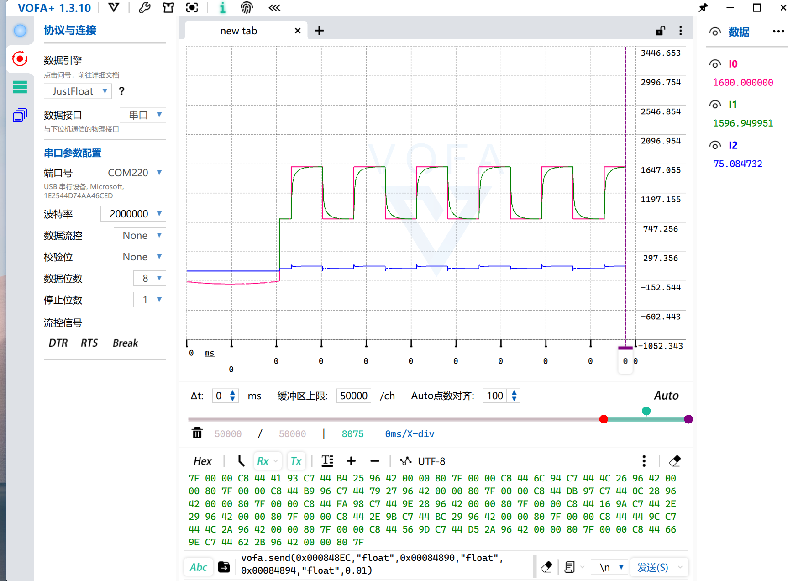

# AI 能否独立完成一次嵌入式调试？HPM5301 从改代码到故障定位实录

这次测试没有给 AI 准备一套理想化脚本。我提供了一块 HPM5301 EVK Lite、MKLink 下载器和 HPM SDK 自带的 FreeRTOS/SystemView 示例工程，然后开始录屏。AI 需要自己阅读工程、修改代码、调用 SEGGER Embedded Studio 编译、烧录真机、采集曲线、制造一次受控故障，最后恢复安全固件并整理官方教程。

目标不是证明 AI 会写几段 C 代码，而是验证它能否完成一次有硬件证据的闭环。

## 任务边界

本次目标是 `HPM5301xEGx`，开发板为 `hpm5301evklite`。工程使用 FreeRTOS，构建工具是 SEGGER Embedded Studio 8.24。HPM 固件只允许通过芯片 ROM API 下载，不使用 FLM。

AI 首先确认了三个容易出错的参数：

```text
目标型号：HPM5301xEGx
板型：hpm5301evklite
BIN 基址：0x80000400
```

随后把一次构建的 BIN、ELF、MAP 固定为同一组证据。最终 `demo.bin` 为 55,432 字节，SHA-256 为：

```text
9133B8A7C99F826BE7FA4CD76BB1A18B1AF04FD87379EBA92BA373007F6333DB
```

这个摘要后面又被用于在线烧录、脱机部署和故障恢复，避免同名文件混淆。

## AI 给 FreeRTOS 工程增加了什么

为了让观测不是一条静态直线，AI 在示例中加入了一个 10 ms PID 速度环和一阶电机对象。目标转速每 6 秒在 800 rpm 与 1600 rpm 之间切换，输出限制在 0–100%。同时保留原有 FreeRTOS 三个任务和 SystemView 事件。

新增变量包括目标、反馈、输出、温度、PID 参数、误差、积分、运行状态和告警码。RTT 每 100 ms 输出一帧，人可以看日志，SuperWatch 和 VOFA 可以看曲线，AI 则可以直接按 ELF 符号名读取。

AI 还增加了一个双钥匙保护的 RISC-V Trap 演示入口。只有两个 32 位钥匙都匹配时，程序才执行一条非法指令；异常处理函数把 `mcause/mepc/mtval/mstatus` 保存到 RAM。正常固件不会自行触发。

## 从编译到 ROM API 在线烧录

AI 使用 HPM SDK 的 CMake 配置重新生成 SES 工程，再调用 SES 构建工具。构建零错误后，Web GUI 选择精确型号、板型和 BIN 基址，页面明确显示“HPM ROM API / 无需 FLM”。


在线任务依次完成连接、擦除、编程、校验、复位和断开，用时约 13.9 秒。仅有 100% 进度还不算完成，后面必须证明 MCU 正在运行新代码。

## 真机日志与 PID 曲线

RTT 控制块由当前 MAP/ELF 定位为 `0x00087100`。AI 连续采集 12 秒，完整看到了升阶跃和降阶跃：

```text
HPM5301 t=90000 target=1600 speed=847 output=100 temp=38 state=1 alarm=0
HPM5301 t=92000 target=1600 speed=1571 output=74 temp=40 state=1 alarm=0
HPM5301 t=96000 target=800 speed=1541 output=0 temp=42 state=1 alarm=0
```


SuperWatch 直接按 ELF 符号读取目标、反馈和输出，10 ms 配置下实测约 84 Hz，连续运行超过 20 秒，传输和后端均未丢样。


同一组变量也可以交给第三方 VOFA+ 上位机。MKLink 从目标 RAM 采样，并通过 USB CDC 输出 JustFloat；VOFA+ 选择 MKLink 虚拟串口后直接显示曲线。它与 MKLink 内置 Web Viewer 是两个不同的上位机入口。



这里能看到 AI 调试控制系统的实际价值：它可以计算上升时间、超调、稳态误差和输出饱和比例，再提出参数调整建议。但真实电机或 FOC 调参不能只看曲线，电流、母线电压、温度、失速和急停边界仍由工程师定义。

## FreeRTOS 时间线不是“看见曲线就算成功”

SystemView 采集识别到 47,147 个事件、4 个任务和 360 MHz CPU 时钟，也看到了 MTimer、ECall 和 GPTMR ISR。


这次 8 秒高事件率采集出现了 `session dropped: 1934`。AI 没有把它包装成零丢包结果，而是把结论限制为“任务和 ISR 结构有效，精确占用需要重采”，并给出三个处理方向：缩短窗口、降低事件率、增大 RTT/SystemView 缓冲。

对工程调试来说，如实保留失败和限制比一张漂亮截图更重要。

## 一次真正的 RISC-V Trap 定位

HPM5301 是 RISC-V。这里不能照搬 STM32 的 CFSR/HFSR 和 Cortex-M 异常栈分析。AI 写入双钥匙后，目标进入非法指令 Trap，并立即读取保留 RAM：

```text
trap_state = 2
mcause      = 2
mepc        = 0x80008B1A
mtval       = 0xFFFFFFFF
mstatus     = 0x00001880
```


`mcause=2` 表示非法指令，`mtval=0xFFFFFFFF` 正是故意执行的指令字。AI 再用同一次构建的 ELF 映射 `mepc`：

```text
0x80008B1A -> trigger_illegal_instruction() -> src/main.c:68
```

这就形成了从 CSR、RAM、指令字到源码行的完整证据链，而不是“程序卡死，可能是非法指令”的猜测。

采集现场后，AI 重新通过 HPM ROM API 烧录默认安全固件。短 RTT 捕获再次看到 800→1600 rpm 阶跃，`state=1`、`alarm=0`，证明 FreeRTOS/PID 任务已经恢复。

## AI 还制作了脱机烧录任务

最后，AI 把同一份 BIN 和脚本部署到 MKLink V4。脚本核心只有 HPM ROM API：

```python
hpm.board("hpm5301evklite")
hpm.program("demo.bin", 0x80000400)
```

没有 FLM。触发测试前再次核对 U 盘文件大小和 SHA-256，真实日志显示：

```text
open fileName: demo.bin success,file size: 55432 byte
Download: 100% ,used 1793 ms
demo.bin loaded successfully.
auto download finished
```


中途确实发生过一次同名错误文件被选择的情况。AI 在触发前发现 U 盘文件只有 30,380 字节，于是停止操作，重新按正式构建路径部署并校验摘要。这个过程也说明自动化的价值不只是“更快点击”，还包括在关键步骤执行机器可验证的检查。

## 这次测试说明了什么

AI 已经可以完成大量操作级闭环：理解工程、修改代码、调用编译器、烧录固件、读取 RTT、采集变量时间线、解释 RTOS Trace、保存故障现场、定位源码并重新验证。

但工程师仍然不可缺席。工程师决定测试目标、允许的硬件动作、安全边界和最终验收标准；AI 负责把重复、容易漏项的步骤执行完整，并留下可复核证据。

更准确的分工是：

```text
工程师定义目标与边界
        ↓
AI 执行操作级闭环
        ↓
真机数据与构建产物
        ↓
工程师审核结论
```

购买下载器只是起点。真正有价值的是把编译、烧录、运行观测和故障定位连成稳定的工程流程，让 AI 不只会读代码，也能读取硬件现场。

完整参数、操作步骤和全部截图见 [HPM5301 + FreeRTOS 全功能实战](../tools/microlink/hpm5301-freertos-case.md)。
