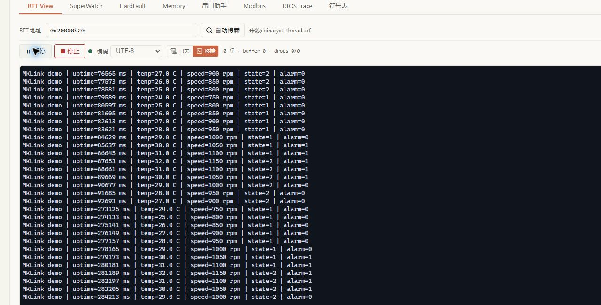
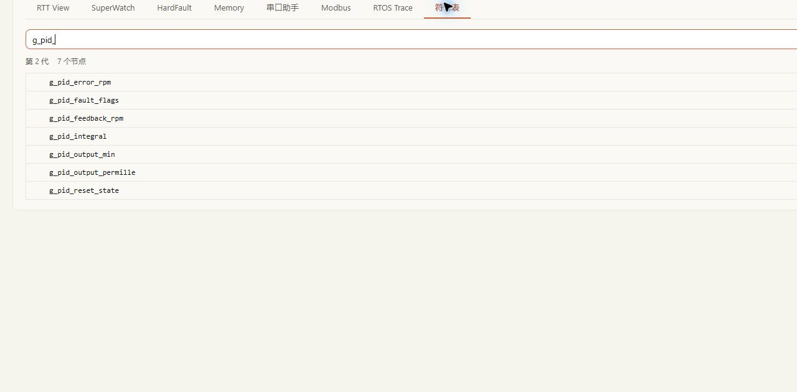
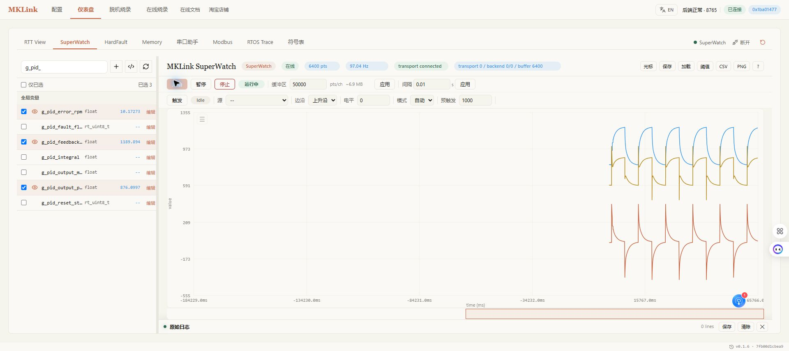
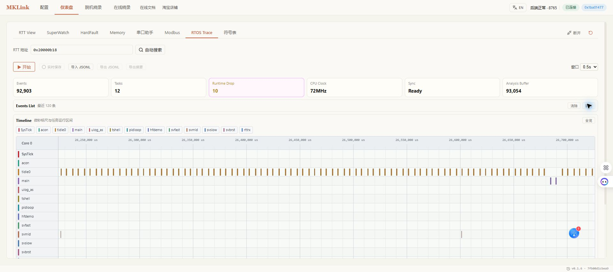

# STM32F103RET6 + RT-Thread 实战

本章使用真实开发板完成工程识别、Keil 构建、在线烧录、RTT 日志、变量监控和 SystemView 配置。所有地址和数据均来自本次构建与目标板实测。

## 1. 硬件和工程

目标器件为 `STM32F103RET6`。Keil DFP 中选择 `STM32F103RE`，下载算法使用 `STM32F10x_512.FLM`。

| 项目 | 参数 |
|---|---|
| CPU | Arm Cortex-M3 |
| Flash | 512 KiB，起始地址 `0x08000000` |
| SRAM | 64 KiB，起始地址 `0x20000000` |
| RTOS | RT-Thread 5.1.0 |
| IDE | Keil MDK |
| 调试接口 | SWD |
| RTT 日志通道 | Up/Down Channel 0 |
| SystemView 通道 | Channel 1 |

工程目录沿用了旧名称，其中出现的 `STM32F103RC` 不是本章目标型号。识别器件时始终以芯片丝印和 Keil Device 为准。

## 2. 演示程序

`applications/main.c` 中增加了独立的演示数据。程序每 100 ms 更新一次温度、转速、状态和告警，每秒通过 RTT 输出一行运行数据。

```c
typedef struct {
    rt_uint32_t uptime_ms;
    rt_uint32_t sample_count;
    rt_int16_t temperature_x10;
    rt_uint16_t motor_speed_rpm;
    rt_uint8_t operating_state;
    rt_uint8_t alarm_active;
} mklink_demo_data_t;

volatile mklink_demo_data_t g_mklink_demo;
```

为兼容符号快照和连续采样，还导出了以下标量变量：

| 变量 | 类型 | 说明 |
|---|---|---|
| `g_demo_uptime_ms` | `uint32_t` | 程序运行时间，单位 ms |
| `g_demo_sample_count` | `uint32_t` | 100 ms 采样计数 |
| `g_demo_temperature_x10` | `int16_t` | 温度乘 10 保存 |
| `g_demo_motor_speed_rpm` | `uint16_t` | 模拟电机转速 |
| `g_demo_operating_state` | `uint8_t` | 1 表示升温，2 表示降温 |
| `g_demo_alarm_active` | `uint8_t` | 温度达到 30.0°C 时置 1 |

温度在 24.0–32.0°C 间往返，转速在 750–1150 rpm 间同步变化，便于观察阈值和状态切换。

工程还增加了一个在 MCU 上运行的 PID 速度环仿真。它不驱动真实电机，只用于演示变量采样、阶跃响应和受约束调参：

| 变量 | 初值 | 说明 |
|---|---:|---|
| `g_pid_target_rpm` | 800 rpm | 每约 6 秒在 800/1200 rpm 间切换 |
| `g_pid_kp` | 0.60 | 比例系数 |
| `g_pid_ki` | 0.80 | 积分系数 |
| `g_pid_kd` | 0.005 | 微分系数 |
| `g_pid_output_permille` | 0–1000 | 限幅后的控制输出 |
| `g_pid_simulated_load_percent` | 15% | 模拟负载 |

## 3. 编译工程

在 Keil 中选择 `rt-thread` Target，执行 Rebuild。构建完成后确认以下文件的更新时间一致：

```text
build/keil/Obj/rt-thread.axf
build/keil/Obj/rt-thread.hex
build/keil/List/rt-thread.map
```

本次构建结果：

| 指标 | 实测值 |
|---|---:|
| RO Size | 约 113.8 KiB |
| RW + ZI | 约 37.1 KiB |
| ROM Total | 约 114.2 KiB |

构建成功后，Web GUI 的文件来源必须选择 `build/keil` 下的 AXF 和 MAP。工程根目录中可能存在旧日期的同名文件，不应混用。

## 4. 在线烧录

打开“在线烧录”，按以下顺序操作：

1. 选择 MKLink CMSIS-DAP 探针；
2. 搜索并选择 `STM32F103RE`；
3. 选择本次构建的 `rt-thread.hex`；
4. 检查器件 Flash 基址为 `0x08000000`，并核对 HEX 的实际数据范围；
5. 启动连接、擦除、编程、校验、复位和断开作业；
6. 等待状态变为 `succeeded`。


本次 HEX 的实际数据范围约为 `0x08005000–0x080218F8`，完整作业耗时约 10 秒。只有 `verify` 成功并完成复位，才进入下一步。

## 5. RTT 验证

当前 MAP 解析出的 `_SEGGER_RTT` 地址为 `0x20000B18`。重新编译后地址可能变化，应在 RTT View 中重新执行“自动搜索”。

目标复位后采集到的真实输出：

```text
RT-Thread 5.1.0 build Aug 12 2026 15:11:42
MKLink demo | uptime=4997 ms | temp=30.0 C | speed=1050 rpm | state=0 | alarm=1
MKLink demo | uptime=7013 ms | temp=32.0 C | speed=1150 rpm | state=2 | alarm=1
MKLink demo | uptime=10037 ms | temp=29.0 C | speed=1000 rpm | state=2 | alarm=0
```



日志证明阈值逻辑正常：温度达到 30.0°C 时告警置 1，降到 29.0°C 时恢复为 0。

## 6. 读取变量

加载同一次构建产生的 AXF 后，在“符号表”中搜索 `g_demo_`。一次真实快照为：

```text
g_demo_uptime_ms       = 45525
g_demo_sample_count    = 453
g_demo_temperature_x10 = 255
g_demo_motor_speed_rpm = 820
g_demo_operating_state = 2
g_demo_alarm_active    = 0
g_mklink_heartbeat     = 460
```

`temperature_x10=255` 表示 25.5°C，告警为 0，与 RTT 最近的下降阶段相符。



将温度、转速和告警添加到 SuperWatch，采样周期设置为 100 ms。温度与转速应形成重复的上升/下降曲线，告警在 30.0°C 阈值处切换。



进一步调试 PID 时，选择 `g_pid_error_rpm`、`g_pid_feedback_rpm` 和 `g_pid_output_permille`，采样间隔设为 10 ms，至少运行 10 秒。本次实测约 97 Hz、6400 点、后端丢样为 0，曲线清楚显示 800/1200 rpm 阶跃后的反馈、控制输出和误差收敛。完整调参步骤及 FOC 变量映射见[SuperWatch 与 PID 调试](../tools/microlink/superwatch.md)。

## 7. SystemView

工程启用了 RT-Thread hook list、SystemView 和 16 KiB Trace 缓冲，并创建四个不同周期的任务：

| 任务 | 周期 | 用途 |
|---|---:|---|
| `svfast` | 20 ms | 高频周期任务 |
| `svmid` | 75 ms | 中等周期任务 |
| `svslow` | 250 ms | 低频周期任务 |
| `svbrst` | 1000 ms | 突发计算任务 |

采集前停止 RTT View 和 SuperWatch，避免资源冲突；在“RTOS Trace”中重新自动搜索地址，再开始采集。若任务数为 0、时间单位异常或出现 Trace overflow，不应继续解释 CPU 占用，应先检查当前 AXF/MAP、事件频率和缓冲大小。



本次有效采集为 6.03 秒、20,840 个事件、9 个任务、72 MHz 时钟，目标缓冲无 `Trace overflow`。空闲任务约占 96.7%，说明演示负载较轻；不能把空闲任务高占用误判为业务任务饥饿。GUI 顶部的 `Runtime Drop` 是前端有界显示队列统计，不等于目标端溢出。

## 8. 完成检查

本案例只有同时满足以下条件才算完成：

- Keil 构建无错误，AXF/HEX/MAP 来自同一次构建；
- 在线烧录状态为 `succeeded`，包含校验和复位；
- RTT 输出包含新构建时间和周期数据；
- 变量快照与 RTT 数值一致；
- SuperWatch 曲线能反映阈值和状态变化；
- SystemView 数据无溢出且时间基准有效后，才分析任务占用。
