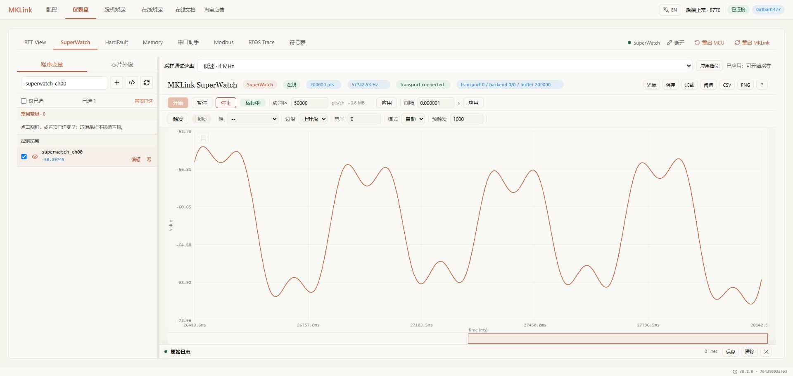
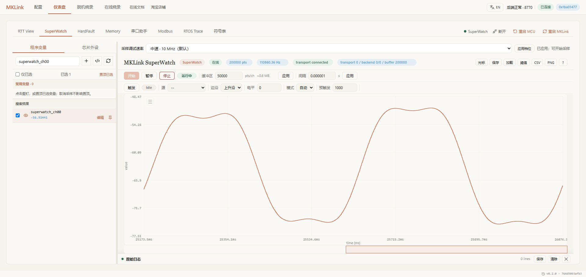
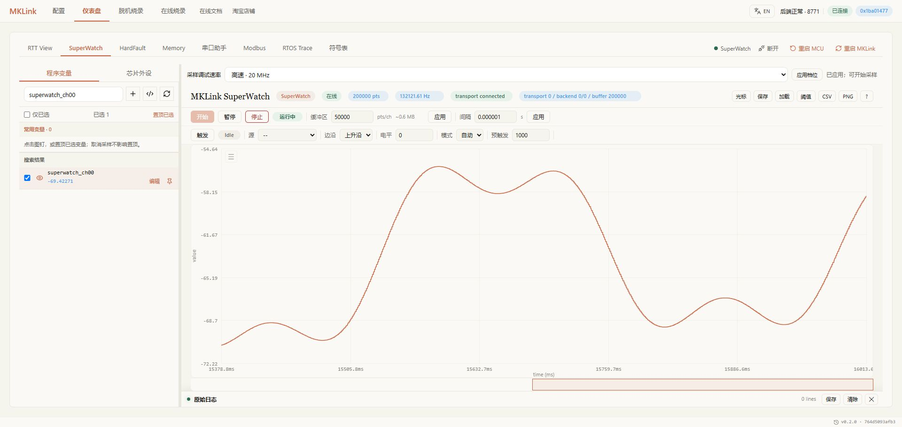
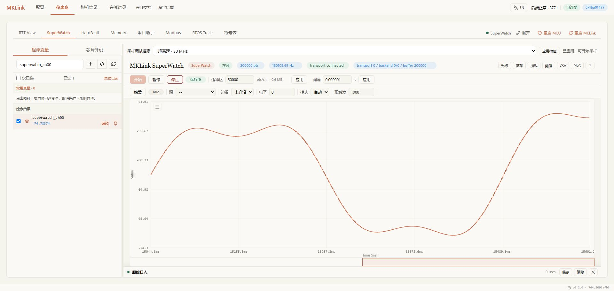
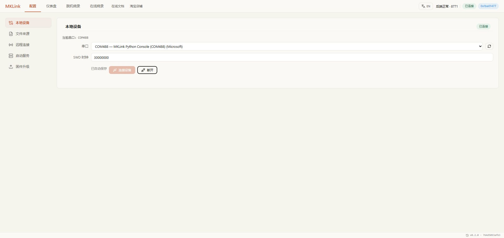

# STM32F103RET6 + RT-Thread 资料与口径

2026-09-13 真机资料。芯片完整料号由用户确认，工程目录中的 RC 不作为型号判断依据。DBGMCU_IDCODE 为 0x10036414，容量寄存器为 512 KiB，主频 72 MHz，RT-Thread 5.1.0，应用起点 0x08005000。

## 固件分开记录

| 构建 | BIN SHA-256 | 用途 |
| --- | --- | --- |
| 性能基准 | c7d47098ff312d676ae0335a971d5fcf17f533e4f2cd367b1d87a170362254af | 关闭后台压力任务，独立吞吐测量 |
| 演示 A | 6a0212f5697ad86fae0fd7751241e095cb8003e709812b448f240ba58707590d | PID、Memory、HardFault、RTOS、单变量截图 |
| 演示 B | 16c5e4fe438f47cf4041b6f5c137183816bb1b823a5684576b50dd0ca7179015 | 移除 rttrx 接收任务，验证 RTT 控制台交互 |

A 的 14 任务时间线不能用来说明 B 的任务数。B 不再启动 rttrx，任务数少 1。终端显示 Sep 7 是 RT-Thread 对象构建日期。

## 测量条件

稳定探针 UF2 SHA-256：5436f6e4164140916d2171027600a6ea7c7b5d5bb546e50a727a15031f4d6fdf。

4/10 MHz 名义档位的实测时钟为 3.904/10.549 MHz。20/30 MHz 未通过稳定验证，当前 STM32 路径拒绝这两档。不能套用 HPM 四档性能。

[14 项基准](stable-summary.json)；[第二轮 RTOS 结果](systemview-second.json)；[异常报告](hardfault-report.txt)。

HardFault 演示 A 的异常 PC 为 0x0801289C，对应 main.c:145；栈扫描候选不等同于精确调用栈。Memory 专用测试数组写入 11 22 33 44 后恢复 00 4D 54 53。重新构建后应重新解析符号地址。

演示 B 最终 Flash 0x08006000 的 4 KiB 与 BIN 对应片段完全一致，测试数组模式正确。设备寿命 invalid 计数为 3，不得表述为全部历史错误为零；性能表的零新增错误仅针对基准窗口。

## 构建与下载日志

- [性能构建](keil-build.log) / [下载校验](keil-flash.log)
- [演示 A 构建](keil-demo-build.log) / [下载校验](keil-demo-flash.log)
- [演示 B 构建](keil-demo-b-build.log) / [下载校验](keil-demo-b-flash.log)

脱机下载和选项字节没有本轮复测；串口、Modbus 没有本轮外设实接证据。

## 2026-09-14 连续四变量补测

单 region 连续读取 16 B，每个 4 B 变量，共四个；一组是全部 16 B 读取完整。两档请求采集 30 秒，原始 hz 字段按采样时间戳统计，不用总组数除以包含启动/收尾的主机耗时。

- [4 MHz 原始结果](ram16-20260914/4000000-ram16.json)：9376.350635 组/秒，277841 完整组。
- [10 MHz 原始结果](ram16-20260914/10000000-ram16.json)：18499.856159 组/秒，548735 完整组。
- [固件身份](ram16-20260914/firmware.json)：b7b0c514d9d59d30a8c9bb6f556a7740aa9bf703851710a8afd5112527407b71，Sep 14 2026 10:08:38。

这是新 ARM 实验固件普通 4/10 MHz 路径，不是旧 stable 或 final-rttfix 版本。两项 passed=true，完整性检查通过，帧 CRC / 丢帧 / 固件丢失标记与新增传输失败均为零；不将启动解析丢弃字节或设备历史错误说成零。10 MHz 存在一次超过 1 ms 的间隔，不能宣称恒定间隔。固件身份文件中的约 19.95 MHz 属于另一个实验读时序，不代表这两项采样档位，更不构成 20 MHz 全面合格结论。

10 MHz ram16 的 USB queue_full 记录为 3 次，在途峰值 11.357 ms，等待 10.851 ms 后恢复；无掉帧不等于无排队等待，不能据此宣称 USB 阻塞已完全解决。

## r6

高档补充来自 pipe-r6，SHA-256 97c85f13081b312733dcf587389cfe7c2b5a7cda2007346818a688ccc1fddd47。20/30单变量分别180/300秒，其余项目20秒。速率采用包含批间空隙的时间戳口径，不取批内峰值。

- [20M ram4](r6-high-speed/20M-ram4.json)
- [20M ram16](r6-high-speed/20M-ram16.json)
- [20M ram4096](r6-high-speed/20M-ram4096.json)
- [20M flash4096](r6-high-speed/20M-flash4096.json)
- [30M ram4](r6-high-speed/30M-ram4.json)
- [30M ram16](r6-high-speed/30M-ram16.json)
- [30M ram4096](r6-high-speed/30M-ram4096.json)
- [30M flash4096](r6-high-speed/30M-flash4096.json)

r6低中档设置4/10MHz实际读数据约2.441/5.702MHz，待重新校准，故正文历史两列不替换为这批结果。高档并非所有入口认证。本轮USB full/errors为零，不意味着历史USB问题已经解决。

## r10

2026-09-14 同版四档20场景均通过；[原始汇总](r10-four-speed/summary.json)、[场景清单](r10-four-speed/suite.json)。UF2 SHA-256 6815e8aa521f78774f1c1b022893cc8db6264de5241b1a7e063ec0dcc10b9623。固定4 B采样默认64条/批，16 B和4 KiB沿用原路径；不外推单变量组帧收益。

速率剔除起始200ms，采用全部稳态时间戳间隔，包含批界；批内仅排除已知64条批界，主机速率按同区间墙钟。协议没有批序号，完整性检查不能独立证明从未整批丢失。常量检查读回一致性，动态项另检查有限值和变化，不能声称变量以采样频率更新。

| 档位 | 读数据MHz | 写数据MHz | 读请求MHz | 写请求MHz | 读ACK MHz | 写ACK MHz |
| --- | ---: | ---: | ---: | ---: | ---: | ---: |
| 4M | 3.946 | 3.945 | 3.946 | 3.943 | 3.927 | 3.725 |
| 10M | 9.974 | 9.977 | 9.969 | 9.878 | 9.861 | 8.786 |
| 20M | 19.957 | 19.962 | 19.968 | 19.968 | 19.936 | 19.939 |
| 30M | 29.941 | 29.920 | 29.943 | 29.945 | 29.938 | 29.956 |

单位为有效事务连续位周期，非含转向/空闲的平均线速。4/10ACK存在边界额外延迟。20/30为实验选择，未认证所有Keil、GUI、下载入口。r6旧低中档偏差及历史数据继续保留，不与r10混成同版对照。

本轮四档USB队列满增量0/0/5/18，提交错误增量均0。正常WAIT与可恢复背压不等于采样校验失败，也不代表历史USB问题已全部解决。30M单变量最大间隔557us，批界平均160.273us，批内约310.064kSa/s，持续176.087kSa/s。

r9同版对照（20秒）：old24持续140.255kSa/s，复测139.587；fast24为162.762，fast64为175.381，fast128为178.293。128有14次队列满，64该轮0；r10高档长测仍有队列满，不将两版短长测混淆。下一版复制优化正在验证，未加入此表。

## r12

同版pipe-r12：9d3cecda52f581be83eaf570fc824b9addd92e205cee383c7ffcf2c048cde404。默认64条固定4B采样、新复制及ILM组帧。20场景及四档LA通过，[汇总原始记录](r12-four-speed/summary.json)、[场景清单](r12-four-speed/suite.json)、[恢复默认状态](r12-four-speed/clean-default-state.json)。

单变量四档20/20/60/120秒；连续16B各15秒、RAM4KiB各20秒、Flash4KiB与动态4B各15秒。统计剔除起始200ms，包含批间空隙；不保证每次等间隔。批内以固定64条推导边界，协议无批序号，CRC不能独立证明从未整批丢失。动态另检有限值和变化，变量更新频率不等于读取频率。

四档USB队列满增量0/0/2/164，提交错误均0；保留待发数据并重试。端点状态机及ZLP未修改，不能称USB全面修复。30M静态持续201.914kSa/s，动态192.166kSa/s，不能保证所有会话201.9k。20/30为实验入口，未全面认证Keil/GUI/下载。

[完整r10历史主表与时长](r10-four-speed/performance.md)保留；r12四档并非均上涨，跨版不能作为纯复制因果对照。

同版r12复制A/B，30M、64条、每项15秒：旧对齐199.345/199.751kSa/s；旧非对齐171.379；新非对齐193.666/193.297；新对齐200.749。纯复制旧非对齐57.320us，新非对齐19.242/19.070us；对齐约8.8–9.1us。计时在IRQ锁内，同对齐条件比较。保持锁、环回所有权、DMA及旧协议；后续优化仍须单独实测。

| 档位 | 读数据MHz | 写数据MHz | 读请求MHz | 写请求MHz | 读ACK MHz | 写ACK MHz |
| --- | ---: | ---: | ---: | ---: | ---: | ---: |
| 4M | 3.947 | 3.948 | 3.946 | 3.926 | 3.929 | 3.727 |
| 10M | 9.977 | 9.976 | 9.919 | 9.846 | 9.730 | 8.434 |
| 20M | 19.964 | 19.973 | 19.974 | 19.961 | 19.945 | 19.938 |
| 30M | 29.961 | 29.944 | 29.963 | 29.972 | 29.936 | 29.762 |

频率为有效事务连续位周期，不含事务间空闲；500MSa/s量化2ns。测试结束重启清除临时属性并恢复10MHz空闲、释放串口。

## r15

公共四档正常采样20场景通过：[summary](r15-four-speed/summary.json)、[suite](r15-four-speed/suite.json)。UF2 ccc29f20f23197cd46fd5eb0522b7544b187dc26bdc3d6c135c9cb8a4f30b254。单变量20/20/60/120秒，连续16B15秒、RAM4KiB20秒、Flash4KiB15秒；剔除前200ms，采用含批界空隙的持续速率，批内与主机接收单列于原始结果。

重要：后续USB暂停3秒恢复出现1条真实CRC错误，压力suite失败，版本暂停固化。该问题不是启动回显误报，不得称r15 USB恢复验证通过。正常20场景通过与压力测试失败分别记录，等待修复复测。

正常矩阵四档USB full增量0/0/0/38，提交失败均0，不等于无背压或压力测试通过。RTT/SV、CLI/MCP、Keil、下载及GUI本版专项结果仍待补，不能沿用旧版结果。HPM仅代码和原生测试已同步，尚待新固件换板真机，不更新硬件性能数字。

[r12完整历史正文及时长](r12-four-speed/performance.md)与原始矩阵保留；r14布局导致10M读8.573MHz被拒绝，r15恢复布局后四档LA通过。后续布局改动仍须复测。

## r17

UF2 3134bc848fa3dd14c140818ff0345c8732317be29879a27488717573cf1edd78。[正常四档汇总](r17-four-speed/summary.json)、[20场景清单](r17-four-speed/suite.json)。四档单变量20/20/60/120秒，连续16B15秒，RAM4KiB20秒，Flash4KiB15秒。所有正常项目通过，USB full及提交错误增量均0，WAIT仍单独保留。

30MHz持续189.776kSa/s，批内285.130kSa/s，主机189.358kSa/s。连续16B完整组、4KiB完整块计数；剔除起始200ms，持续时间戳口径含批界。协议无批序号，CRC不能独立证明从未整批丢失，不把变量采样频率当变量更新频率。

[r15失败候选历史性能](r15-four-speed/performance.md)与原始结果保留。r15暂停3秒复现真实32B缺失，r16恢复ZLP仍失败，不标通过。r17独立64B对齐2048B AHB DMA槽、提交前flush/fence且完成前不复用，通过12次同条件暂停复测；对照支持解决已复现故障，不独断为芯片勘误或某一缓存机制。有限缓冲仍有背压，不承诺无限暂停无损。

12次压力证据根：目标工程.mklink/arm_deferred_20260914/pipeline-r17-usb-staging。更广泛暂停/启停、CDC、RTT/SV、CLI/MCP、下载专项仍在验证；报告列出的目录不等于对应项目通过。Chrome仍不可控，不能把其他浏览器素材标为Chrome。HPM代码已同步但新固件待换板，不改变HPM硬件数据。

### r17 后续专项

- [20项混合USB暂停与启停](r17-functional/usb-stress-validated.json)，通过。
- [12次真实Windows CDC参数切换](r17-functional/line-coding.json)，通过。
- [四档RTT与8次SystemView](r17-functional/functional-streams.json)，通过。
- [CLI结果](r17-functional/cli.json)、[真实MCP结果](r17-functional/mcp.json)，四档读取专项通过。
- [12次3秒接收暂停复测](r17-functional/usb-staging.json)，通过。

Keil generic设置1/2/5MHz下载验证成功，但数据阶段约0.645/1.377/3.899MHz，不能称校准通过；命名四档性能仍保留对应实测。最终校准固件可能更新，不将所有入口标完成，不发布。以上是后续结果，取代r17段中这些专项尚待验证的阶段状态，不更改历史r15/r16失败结论。

## r19

pipe-r19 SHA256 4176f69b67772f0efffbf645be01db1ae3ba704c91934cb8a8f068856e7c5554。[20项清单](r19-four-speed/suite.json)、[固件清单](r19-four-speed/firmware.json)、[Keil校准](r19-four-speed/keil-calibration.json)。Keil1/2/5/10MHz下载verify通过，数据阶段读写误差小于2%，不将该容差外推所有ACK阶段。

性能使用含批间空隙的时间戳口径，批内分列原始rate_scope。连续16B单region算完整四变量组，不能乘4冒充组频率。r19 USB专项及其他入口复测待补；HPM新固件仅软件时间戳/组帧优化完成，待换板不更新硬件数据。

[r17完整历史正文与时长](r17-four-speed/performance.md)独立保留，r19不用r17较高数值替代。r15/r16失败历史不删除。

| 档位 | 项目 | 请求测试时长s | 原始记录 |
| --- | --- | ---: | --- |
| 4M | ram4 | 20 | [JSON](r19-four-speed/4M-ram4.json) |
| 4M | ram16 | 15 | [JSON](r19-four-speed/4M-ram16.json) |
| 4M | ram4096 | 20 | [JSON](r19-four-speed/4M-ram4096.json) |
| 4M | flash4096 | 15 | [JSON](r19-four-speed/4M-flash4096.json) |
| 4M | dynamic | 15 | [JSON](r19-four-speed/4M-dynamic.json) |
| 10M | ram4 | 20 | [JSON](r19-four-speed/10M-ram4.json) |
| 10M | ram16 | 15 | [JSON](r19-four-speed/10M-ram16.json) |
| 10M | ram4096 | 20 | [JSON](r19-four-speed/10M-ram4096.json) |
| 10M | flash4096 | 15 | [JSON](r19-four-speed/10M-flash4096.json) |
| 10M | dynamic | 15 | [JSON](r19-four-speed/10M-dynamic.json) |
| 20M | ram4 | 60 | [JSON](r19-four-speed/20M-ram4.json) |
| 20M | ram16 | 15 | [JSON](r19-four-speed/20M-ram16.json) |
| 20M | ram4096 | 20 | [JSON](r19-four-speed/20M-ram4096.json) |
| 20M | flash4096 | 15 | [JSON](r19-four-speed/20M-flash4096.json) |
| 20M | dynamic | 15 | [JSON](r19-four-speed/20M-dynamic.json) |
| 30M | ram4 | 120 | [JSON](r19-four-speed/30M-ram4.json) |
| 30M | ram16 | 15 | [JSON](r19-four-speed/30M-ram16.json) |
| 30M | ram4096 | 20 | [JSON](r19-four-speed/30M-ram4096.json) |
| 30M | flash4096 | 15 | [JSON](r19-four-speed/30M-flash4096.json) |
| 30M | dynamic | 15 | [JSON](r19-four-speed/30M-dynamic.json) |

### r19 回归补充

真机任务补充USB20项与CDC12项通过；RTT切20MHz一次地址回执不一致，目标日志与启动地址行交错。r19普通矩阵保留，但不能称全部功能资格通过。r20增加REPL执行期间后台门控，尚待高重复专项与同版四档重测，不提前替换性能。

## r20

UF2 85b51a4fb19eef7a0414bf9d09f8f5d70c0a6eded9b69ed88667f15319a2ec00，ILM余5216B。专项结果属于r20；完整四档20场景现已通过，正文更新为r20，同版数据不混用。

- [16轮四档32次启动/回执检查](r20-functional/startup-stress.json)
- [USB20项](r20-functional/usb-stress-validated.json)
- [CDC12次](r20-functional/line-coding.json)
- [四档RTT与8次SystemView](r20-functional/functional-streams.json)
- [CLI](r20-functional/cli.json)
- [MCP](r20-functional/mcp.json)
- [Keil数据阶段校准](r20-functional/keil-calibration.json)

r19启动交错是历史已复现问题，r20后台门控专项修复通过；不删除r19记录或称r19全资格通过。Keil误差容差针对数据阶段，不外推所有阶段。HPM新固件硬件数据仍待换板。

### r20 完整采样矩阵

[场景清单](r20-four-speed/suite.json)、[固件身份](r20-four-speed/firmware.json)、[r19历史正文](r19-four-speed/performance.md)。使用timestamp_all_hz作为持续值，包含批间空隙；批内和主机墙钟分别列出。20MHz60秒9,401,383条，30MHz120秒22,422,080条。连续四变量为单region16B，不能乘4改称整组频率。

当前在线下载旧API在硬件执行前以HTTP422拒绝20MHz，配置/在线/脱机入口补齐中，不称全部入口通过。HPM仅软件优化完成待换板，Chrome截图待可用。

| 档位 | 内容 | 请求时长s | 原始JSON |
| --- | --- | ---: | --- |
| 4M | ram4 | 20 | [JSON](r20-four-speed/4M-ram4.json) |
| 4M | ram16 | 15 | [JSON](r20-four-speed/4M-ram16.json) |
| 4M | ram4096 | 20 | [JSON](r20-four-speed/4M-ram4096.json) |
| 4M | flash4096 | 15 | [JSON](r20-four-speed/4M-flash4096.json) |
| 4M | dynamic | 15 | [JSON](r20-four-speed/4M-dynamic.json) |
| 10M | ram4 | 20 | [JSON](r20-four-speed/10M-ram4.json) |
| 10M | ram16 | 15 | [JSON](r20-four-speed/10M-ram16.json) |
| 10M | ram4096 | 20 | [JSON](r20-four-speed/10M-ram4096.json) |
| 10M | flash4096 | 15 | [JSON](r20-four-speed/10M-flash4096.json) |
| 10M | dynamic | 15 | [JSON](r20-four-speed/10M-dynamic.json) |
| 20M | ram4 | 60 | [JSON](r20-four-speed/20M-ram4.json) |
| 20M | ram16 | 15 | [JSON](r20-four-speed/20M-ram16.json) |
| 20M | ram4096 | 20 | [JSON](r20-four-speed/20M-ram4096.json) |
| 20M | flash4096 | 15 | [JSON](r20-four-speed/20M-flash4096.json) |
| 20M | dynamic | 15 | [JSON](r20-four-speed/20M-dynamic.json) |
| 30M | ram4 | 120 | [JSON](r20-four-speed/30M-ram4.json) |
| 30M | ram16 | 15 | [JSON](r20-four-speed/30M-ram16.json) |
| 30M | ram4096 | 20 | [JSON](r20-four-speed/30M-ram4096.json) |
| 30M | flash4096 | 15 | [JSON](r20-four-speed/30M-flash4096.json) |
| 30M | dynamic | 15 | [JSON](r20-four-speed/30M-dynamic.json) |

## 下载入口后续验证

公共文章仅保留使用说明，以下保存独立入口证据范围。在线四档分别完成连接、擦除、编程、校验与复位；生成脱机脚本四档执行通过，未额外声称独立整片读回。在线4MHz读3.915MHz，偏差约2.12%，不能与Keil小于2%的结论混用。

| 入口 | 设置MHz | 读数据MHz | 写数据MHz |
| --- | ---: | ---: | ---: |
| 在线 | 4 | 3.915 | 3.930 |
| 在线 | 10 | 9.809 | 9.964 |
| 在线 | 20 | 19.800 | 19.952 |
| 在线 | 30 | 29.921 | 29.916 |
| 脱机脚本 | 4 | 3.940 | 3.945 |
| 脱机脚本 | 10 | 9.963 | 9.973 |
| 脱机脚本 | 20 | 19.944 | 19.954 |
| 脱机脚本 | 30 | 29.930 | 29.925 |

证据在目标工程arm_deferred_20260914/r20b-online-{hz}及r20c-offline-{hz}；旧API拒绝属于已修复历史，不再作为当前正文限制。Chrome新增1us界面复测和截图仍待补，不使用示意图代替。公开文章的功能截图与性能矩阵并非同一构建，原始身份见前文；文章重排不改变历史测试结论。

## Chrome 四档实机素材

图像均为原图直接复制，未修改数值。30MHz截图窗口180109.69Hz，20MHz截图132121.61Hz；20MHz稍后AX读取157578.45Hz不是截图值，不替换图片。正文完整矩阵持续值保持原记录。

首次8770双订阅导致慢页面丢批，记录r20-chrome-20M保留；随后8771单订阅20/30MHz复测CRC、读错、订阅drops均0。订阅侧丢批不等同固件USB数据损坏，两次条件不可混用。

- [r20-chrome-4M / after.json](chrome-four-speed/r20-chrome-4M/after.json)
- [r20-chrome-4M / before.json](chrome-four-speed/r20-chrome-4M/before.json)
- [r20-chrome-4M / phase-timing.json](chrome-four-speed/r20-chrome-4M/phase-timing.json)
- [r20-chrome-4M / result.json](chrome-four-speed/r20-chrome-4M/result.json)
- [r20-chrome-10M / after.json](chrome-four-speed/r20-chrome-10M/after.json)
- [r20-chrome-10M / before.json](chrome-four-speed/r20-chrome-10M/before.json)
- [r20-chrome-10M / phase-timing.json](chrome-four-speed/r20-chrome-10M/phase-timing.json)
- [r20-chrome-10M / result.json](chrome-four-speed/r20-chrome-10M/result.json)
- [r20-chrome-isolated-20M / after.json](chrome-four-speed/r20-chrome-isolated-20M/after.json)
- [r20-chrome-isolated-20M / before.json](chrome-four-speed/r20-chrome-isolated-20M/before.json)
- [r20-chrome-isolated-20M / phase-timing.json](chrome-four-speed/r20-chrome-isolated-20M/phase-timing.json)
- [r20-chrome-isolated-20M / result.json](chrome-four-speed/r20-chrome-isolated-20M/result.json)
- [r20-chrome-isolated-30M / after.json](chrome-four-speed/r20-chrome-isolated-30M/after.json)
- [r20-chrome-isolated-30M / before.json](chrome-four-speed/r20-chrome-isolated-30M/before.json)
- [r20-chrome-isolated-30M / final-status.json](chrome-four-speed/r20-chrome-isolated-30M/final-status.json)
- [r20-chrome-isolated-30M / phase-timing.json](chrome-four-speed/r20-chrome-isolated-30M/phase-timing.json)
- [r20-chrome-isolated-30M / result.json](chrome-four-speed/r20-chrome-isolated-30M/result.json)
- [r20-chrome-20M / after.json](chrome-four-speed/r20-chrome-20M/after.json)
- [r20-chrome-20M / before.json](chrome-four-speed/r20-chrome-20M/before.json)
- [r20-chrome-20M / phase-timing.json](chrome-four-speed/r20-chrome-20M/phase-timing.json)
- [r20-chrome-20M / result.json](chrome-four-speed/r20-chrome-20M/result.json)
- [r20-config-4M / after.json](chrome-four-speed/r20-config-4M/after.json)
- [r20-config-4M / before.json](chrome-four-speed/r20-config-4M/before.json)
- [r20-config-4M / phase-timing.json](chrome-four-speed/r20-config-4M/phase-timing.json)
- [r20-config-4M / result.json](chrome-four-speed/r20-config-4M/result.json)
- [r20-config-10M / after.json](chrome-four-speed/r20-config-10M/after.json)
- [r20-config-10M / before.json](chrome-four-speed/r20-config-10M/before.json)
- [r20-config-10M / phase-timing.json](chrome-four-speed/r20-config-10M/phase-timing.json)
- [r20-config-10M / result.json](chrome-four-speed/r20-config-10M/result.json)
- [r20-config-20M / after.json](chrome-four-speed/r20-config-20M/after.json)
- [r20-config-20M / before.json](chrome-four-speed/r20-config-20M/before.json)
- [r20-config-20M / phase-timing.json](chrome-four-speed/r20-config-20M/phase-timing.json)
- [r20-config-20M / result.json](chrome-four-speed/r20-config-20M/result.json)
- [r20-config-30M / after.json](chrome-four-speed/r20-config-30M/after.json)
- [r20-config-30M / before.json](chrome-four-speed/r20-config-30M/before.json)
- [r20-config-30M / phase-timing.json](chrome-four-speed/r20-config-30M/phase-timing.json)
- [r20-config-30M / result.json](chrome-four-speed/r20-config-30M/result.json)

## 最终 ARM 基线封存

已核对固件包SHA-256与manifest/source-integrity一致：85b51a4fb19eef7a0414bf9d09f8f5d70c0a6eded9b69ed88667f15319a2ec00。源文件完整性清单报告77个文件一致，固化范围为STM32F103RET6及所列入口，不表示官方发布或HPM新版硬件资格通过。

- [最终技术报告](final-qualification/qualification-report.txt)
- [封存清单](final-qualification/manifest.json) / [源码完整性结果](final-qualification/source-integrity.json)
- [配置与SuperWatch八项Chrome验证](final-qualification/gui-qualification.json)
- [在线/脱机四档入口](final-qualification/download-qualification.json)
- [功能专项汇总](final-qualification/functional-gates.json) / [Keil校准](final-qualification/keil-calibration.json)
- [30MHz Chrome最终状态](final-qualification/chrome-30M-final-status.json)

Chrome单页面30MHz最终累计21,248,026条，读错/CRC/订阅drops为0。累计条数不能据此推导整段187k速率，窗口实际显示会波动；正文持续表仍采用完整采样矩阵的时间戳统计。双订阅慢页面丢批作为独立主机背压记录保留，不混成固件USB字节损坏。有限缓存不保证无限暂停无损。

HPM共用USB和批时间戳代码纳入包，但新固件HPM5301/HPM6E80实板回归仍待换板。探针结束状态为10MHz并断开，Chrome8771保留。正文风格与性能数字未因此变更，官网未发布。

## 30 MHz 真机 16 路首图

正文首图改为 Chrome SuperWatch 实际截图，原图未修改。选择 superwatch_ch00..15，30 MHz 档，暂停后调整显示时间范围取景。现有示例生成错相基波、慢幅度调制及三次谐波，不是 16 路纯单频正弦。截图窗口读数不替代正文单变量持续性能统计。

- [采集档位](sine16-cover/speed.json) / [累计状态](sine16-cover/status.json) / [原图来源及校验值](sine16-cover/provenance.json)

累计状态包含 CRC 错误 1、丢帧 1，尚未确认是否在本次采集内新增；此图只用于波形演示，不作零错误验证结论。

## 正弦波首图更新

前述 16 路合成波形已从正文首图撤下，留档不作为当前首图说明。当前首图采用用户提供的真实截图：30 MHz、已选 9 路，窗口读数 20,900.03 Hz。新示例为等幅 100、周期 4 秒、相邻相差 22.5° 的正弦波，编译与下载校验通过。截图原样保存，包含符号重载提示；不据此推导零错误结论或单变量持续性能。

- [截图来源与校验值](sine9-cover/provenance.json)
- [编译日志](sine9-cover/build.log) / [下载校验日志](sine9-cover/flash.log)
