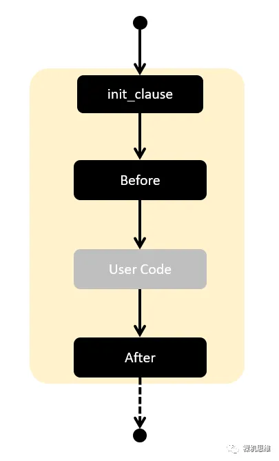

# 探索字节队列的魔法：多类型支持、函数重载与线程安全

## 一、引言
在嵌入式系统和实时应用中，数据的传输和处理是至关重要的。字节队列（Byte Queue）是一种重要的数据结构，它能够高效地存储和管理数据流。通过使用字节队列，我们可以灵活地处理不同类型的数据、确保数据的完整性，并在多线程环境中安全地进行操作。本文将深入探讨字节队列的概念、作用及其实现中的多类型支持、函数重载与线程安全机制。
### 1.1 队列的基本概念
队列是一种先进先出（FIFO，First In First Out）的数据结构。数据通过“入队”（enqueue）操作添加到队列的尾部，并通过“出队”（dequeue）操作从队列的头部移除。在嵌入式系统中，队列常用于：

 - 数据缓冲：在数据产生和消费速率不匹配的情况下，队列可以暂存数据，平衡输入和输出之间的差异。
 - 任务调度：任务或事件的管理可以通过队列来实现，确保它们按照特定顺序被处理。
 - 通信：队列可以在不同模块或线程之间传递信息，从而实现模块间的解耦和同步。
### 1.2 字节队列的不足
尽管字节队列在嵌入式系统中提供了基本的数据存储与管理能力，但其在实际应用中也存在一些明显的不足：

 - 缺乏多类型支持：传统的字节队列往往只能处理单一类型的数据，例如，使用固定的字节数组存储数据，导致不同数据类型之间缺乏灵活性。为了支持不同类型的数据，开发者通常需要创建多个队列，从而增加了代码的复杂性和维护成本。
 - 没有函数重载：在C语言中，函数重载是通过不同的函数名称来实现的，缺乏类似C++的灵活性。这使得在队列操作中无法方便地处理不同数量和类型的参数，导致代码冗长且不易维护。
 - 线程安全机制不足：在多线程环境中，若多个线程同时访问字节队列而没有适当的同步机制，可能会导致数据损坏或不一致。传统的字节队列实现往往没有内置的线程安全支持，增加了并发编程的难度。

## 二、字节队列的改进
### 2.1 多类型支持的实现原理
**问题：** C语言中的数组或缓冲区往往只能存储单一类型的数据。例如，你可以定义一个uint8_t数组来存储字节数据，或者一个int32_t数组来存储整型数据。然而，在嵌入式系统中，我们常常需要处理各种类型的数据——8位、16位、32位的整数、浮点数等等。为了避免为每种类型单独创建队列，我们希望有一个灵活的队列，可以自动支持多种数据类型。

**解决方案：** 我们使用C语言的宏来解决这个问题。通过宏，队列可以自动根据传入的数据类型来计算所需的存储空间。核心思想是：我们不关心具体的数据类型，而是通过宏和类型推导，计算每个数据需要的字节数，并按照字节的形式将数据存入队列中。

**使用typeof推断数据类型:**

C语言的typeof关键字可以根据表达式自动推断出数据类型，并可以通过该类型确定数据的大小。在我们的实现中，队列的操作宏会通过sizeof来获取传入数据的字节大小。

**示例：**

```c
#define enqueue(queue, data) enqueue_bytes(queue, &data, sizeof(typeof(data)))
```
在上述宏中：

 - typeof(data) 会推断出data的类型，然后通过sizeof(typeof(data))确定该类型占用的字节数。
 - 通过将数据的地址传递给底层的enqueue_bytes函数，我们可以统一将所有类型的数据作为字节流处理。

通过这种方式，我们的队列可以支持任意类型的数据，比如8位字节、16位整数、32位浮点数，甚至自定义的数据结构，只要知道它们的大小即可。

### 2.2 函数重载的实现原理
**问题：** 在C++等语言中，函数重载允许你定义多个同名的函数，但参数类型或数量不同。然而，C语言并不原生支持函数重载。这意味着如果我们想实现同名函数，处理不同类型或数量的参数，就需要想出另一种方法。

**解决方案：** 我们可以通过C语言的宏来“模拟”函数重载。宏的灵活性使得我们可以根据不同的参数数量或类型，选择不同的底层函数进行处理。结合\_\_VA_ARGS_\_等可变参数宏的特性，我们可以轻松实现这种重载行为。

**使用宏实现参数数量的重载：** enqueue可以根据传递的参数数量，调用不同的函数。我们使用\_\_VA_ARGS_\_（可变参数）来处理不同数量的参数。

enqueue宏的完整代码如下：

```c
#define __CONNECT3(__A, __B, __C)         __A##__B##__C
#define __CONNECT2(__A, __B)              __A##__B

#define CONNECT3(__A, __B, __C)           __CONNECT3(__A, __B, __C)
#define CONNECT2(__A, __B)                __CONNECT2(__A, __B)
#define SAFE_NAME(__NAME)   CONNECT3(__,__NAME,__LINE__)

#define __PLOOC_VA_NUM_ARGS_IMPL( _0,_1,_2,_3,_4,_5,_6,_7,_8,_9,_10,_11,     \
                                     _12,_13,_14,_15,_16,__N,...)      __N


#define __PLOOC_VA_NUM_ARGS(...)                                                \
    __PLOOC_VA_NUM_ARGS_IMPL( 0,##__VA_ARGS__,16,15,14,13,12,11,10,9,   \
                              8,7,6,5,4,3,2,1,0)

#define __ENQUEUE_0( __QUEUE, __VALUE)                                     \
    ({typeof((__VALUE)) SAFE_NAME(value) = __VALUE;                     \
        enqueue_bytes((__QUEUE), &(SAFE_NAME(value)), (sizeof(__VALUE)));})

#define __ENQUEUE_1( __QUEUE, __ADDR, __ITEM_COUNT)                         \
    enqueue_bytes((__QUEUE), (__ADDR), __ITEM_COUNT*(sizeof(typeof((__ADDR[0])))))

#define __ENQUEUE_2( __QUEUE, __ADDR, __TYPE, __ITEM_COUNT)                 \
    enqueue_bytes((__QUEUE), (__ADDR), (__ITEM_COUNT * sizeof(__TYPE)))
    
#define enqueue(__queue, __addr,...)                    \
    CONNECT2(__ENQUEUE_,__PLOOC_VA_NUM_ARGS(__VA_ARGS__))        \
    (__queue,(__addr),##__VA_ARGS__)
```
**工作原理：** 

通过以上代码，`enqueue`宏会根据传递的参数数量，自动选择不同的实现版本

 - 传递的可变参数如果为0，调用\_\_ENQUEUE_0；
 - 传递的可变参数如果为1，调用\_\_ENQUEUE_1；
 - 传递的可变参数如果为2，调用__ENQUEUE_2。

#### 2.2.1 函数重载的秘密 ——“__PLOOC_VA_NUM_ARGS”宏的深度剖析
__PLOOC_VA_NUM_ARGS宏的代码如下：
```c
#define __PLOOC_VA_NUM_ARGS_IMPL(   _0,_1,_2,_3,_4,_5,_6,_7,_8,_9,_10,_11,_12,  \
                                    _13,_14,_15,_16,__N,...)      __N
#define __PLOOC_VA_NUM_ARGS(...)                                                \
            __PLOOC_VA_NUM_ARGS_IMPL( 0,##__VA_ARGS__,16,15,14,13,12,11,10,9,   \
                                      8,7,6,5,4,3,2,1,0)
```

1. **__PLOOC_VA_NUM_ARGS宏的作用是它可以告诉我们实际传递了多少个参数**

这里，首先构造了一个特殊的参数宏，__PLOOC_VA_NUM_ARGS_IMPL()：

 - 在涉及"..."之前，它要用户至少传递18个参数；
 - 这个宏的返回值就是第十八个参数的内容；
 - 多出来的部分会被"..."吸收掉，不会产生任何后果

\__PLOOC_VA_NUM_ARGS的巧妙在于，它把\_\_VA_ARGS__放在了参数列表的最前面，并随后传递了 "16,15,14,13,12,11,10,9,8,7,6,5,4,3,2,1,0" 这样的序号：

> 当\_\_VA_ARGS\_\_里有1个参数时，“1”对应第十八个参数\_\_N，所以返回值是1
>
> 当\_\_VA_ARGS\_\_里有2个参数时，“2”对应第十八个参数\_\_N，所以返回值是2
>
> ...
>
> 当\_\_VA_ARGS\_\_里有9个参数时，"9"对应第十八个参数\__N，所以返回值是9
>
> 

举个例子：

```c
__PLOOC_VA_NUM_ARGS(0x, D, E, A, D)
```
展开为：

```c
__PLOOC_VA_NUM_ARGS_IMPL(0,0x, D, E, A, D,16,15,14,13,12,11,10,9,   \
                                      8,7,6,5,4,3,2,1,0)
```
__PLOOC_VA_NUM_ARGS的返回值是5，从左往右数，第十八个参数，正好是“5”。

2. **宏连接符##的作用**

```c
#define __CONNECT2(__A, __B)              __A##__B
#define CONNECT2(__A, __B)                __CONNECT2(__A, __B)
```

 宏连接符 ## 的主要作用就是连接两个字符串，我们在宏定义中可以使用 ## 来连接两个字符。预处理器在预处理阶段对宏展开时，会将## 两边的字符合并，并删除 ## 这两个字符。

 使用宏连接符 ##要注意一下两条结论：

 - 第一条：任何使用到胶水运算“##”对形参进行粘合的参数宏，一定需要额外的再套一层
 - 第二条：其余情况下，如果要用到胶水运算，一定要在内部借助参数宏来完成粘合过程

为了理解这一“结论”，我们不妨举一个例子：比如定义一个用于自动关闭中断并在完成指定操作后自动恢复原来状态的宏：

```c
#define SAFE_ATOM_CODE(...)               \
  {                                       \
      uint32_t wTemp = __disable_irq();   \
      __VA_ARGS__;                        \
      __set_PRIMASK(wTemp);               \
  }
```
由于这里定义了一个变量wTemp，而如果用户插入的代码中也使用了同名的变量，就会产生很多问题：轻则编译错误（重复定义）；重则出现局部变量wTemp强行取代了用户自定义的静态变量的情况，从而直接导致系统运行出现随机性的故障（比如随机性的中断被关闭后不再恢复，或是原本应该被关闭的全局中断处于打开状态等等）。为了避免这一问题，我们往往会想自动给这个变量一个不会重复的名字，比如借助  `__LINE__`  宏给这一变量加入一个后缀：

```c
#define SAFE_ATOM_CODE(...)                           \
  {                                                   \
      uint32_t wTemp##__LINE__ = __disable_irq();     \
      __VA_ARGS__;                                    \
      __set_PRIMASK(wTemp);                           \
  }
```
假设这里 SAFE_ATOM_CODE 所在行的行号是 123，那么我们期待的代码展开是这个样子的（我重新缩进过了）：

```c

...
  {                                                   
      uint32_t wTemp123 = __disable_irq();     
      __VA_ARGS__;                                    
      __set_PRIMASK(wTemp);                           
  }
...
```
然而，实际展开后的内容是这样的：

```c

...
  {                                                   
      uint32_t wTemp__LINE__ = __disable_irq();     
      __VA_ARGS__;                                    
      __set_PRIMASK(wTemp);                           
  }
...
```
这里，`__LINE__`似乎并没有被正确替换为123，而是以原样的形式与wTemp粘贴到了一起——这就是很多人经常抱怨的 `__LINE__` 宏不稳定的问题。实际上，这是因为上述宏的构建没有遵守前面所列举的两条结论导致的。

从内容上看，SAFE_ATOM_CODE() 要粘合的对象并不是形参，根据结论第二条，需要借助另外一个参数宏来帮忙完成这一过程。为此，我们需要引入一个专门的宏：

```c

#define CONNECT2(__A, __B)    __A##__B
```
注意到，这个参数宏要对形参进行胶水运算，根据结论第一条，需要在宏的外面再套一层，因此，修改代码得到：

```c

#define __CONNECT2(__A, __B)    __A##__B
#define CONNECT2(__A, __B)      __CONNECT2(__A, __B)
```
修改前面的定义得到：

```c

#define SAFE_ATOM_CODE(...)                           \
  {                                                   \
      uint32_t CONNECT2(wTemp,__LINE__) =              \
          __disable_irq();                            \
      __VA_ARGS__;                                    \
      __set_PRIMASK(wTemp);                           \
  }
```

3. **对enqueue的封装进行展开**

```c
#define enqueue(__queue, __addr,...)                    \
    CONNECT2(__ENQUEUE_,__PLOOC_VA_NUM_ARGS(__VA_ARGS__))        \
    (__queue,(__addr),##__VA_ARGS__)
```

CONNECT2会根据\__PLOOC_VA_NUM_ARGS返回的数量，与\_\_ENQUEUE\_进行连接,

 - \_\_PLOOC_VA_NUM_ARGS返回的数量如果为0，调用\_\_ENQUEUE_0(\_\_queue,(\_\_addr),##\_\_VA_ARGS__)；
 - \_\_PLOOC_VA_NUM_ARGS返回的数量如果为1，调用\_\_ENQUEUE_1(\_\_queue,(\_\_addr),##\_\_VA_ARGS__)；
 - \_\_PLOOC_VA_NUM_ARGS返回的数量如果为2，调用\_\_ENQUEUE_2(\_\_queue,(\_\_addr),##\_\_VA_ARGS__)；

举个例子：

```c
static byte_queue_t my_queue;
uint8_t  data1 = 0XAA;
enqueue(&my_queue,data1);//__ENQUEUE_0(&my_queue,data1)
enqueue(&my_queue,&data1，1);//__ENQUEUE_1(&my_queue,&data1,1)
enqueue(&my_queue,&data1，uint8_t ，1);//__ENQUEUE_2(&my_queue,&data1,uint8_t ,1)
/*__ENQUEUE_0,__ENQUEUE_1,__ENQUEUE_2,展开后调用的都是同一个接口*/
enqueue_bytes(&my_queue,&data1,1)
```

### 2.3 线程安全的实现原理
**问题：** 在多线程环境下，如果多个线程同时对同一个队列进行操作，可能会引发数据竞争问题，导致数据损坏或不一致。为了避免这种情况，我们需要保证每次对队列的操作是原子的，即不可打断的。

**解决方案：** 在嵌入式系统中，常用的方法是通过禁用中断或使用锁机制来保证数据的一致性。在我们的实现中，我们使用禁用中断的方式来确保线程安全。这是一种非常常见的技术，尤其是在实时系统中。

为了尽量降低关中断对实时性的影响，我们只对操作队列指针的操作进行关中断保护，相对耗时间的数据拷贝不进行关中断。

函数伪代码如下：

```c
bool enqueue_bytes(...)
{
    bool bEarlyReturn = false;
    safe_atom_code(){
        if (!this.bMutex){
            this.bMutex= true;
        } else {
            bEarlyReturn = true;
        }
    }
    if (bEarlyReturn){
         return false;
    }
    safe_atom_code(){
        /*队列指针操作 */
       ...
    }
    /* 数据操作*/
    memcpy(...);
    ...
    this.bMutex = false;
    return true;
}
```

**原子宏safe_atom_code()的实现：**

前边的例子中，我们实现了一个SAFE_ATOM_CODE的原子宏，唯一的问题是，这样的写法，在调试时完全没法在用户代码处添加断点（编译器会认为宏内所有的内容都写在了同一行），这是大多数人不喜欢使用宏来封装代码结构的最大原因。

接下来我们用另一种实现方式来解决这个问题,代码如下：

```c

#define __CONNECT3(__A, __B, __C)         __A##__B##__C
#define __CONNECT2(__A, __B)              __A##__B
#define CONNECT3(__A, __B, __C)           __CONNECT3(__A, __B, __C)
#define CONNECT2(__A, __B)                __CONNECT2(__A, __B)
#define SAFE_NAME(__NAME)   CONNECT3(__,__NAME,__LINE__)
#include "cmsis_compiler.h"
#define safe_atom_code()                                            \
        for(  uint32_t SAFE_NAME(temp) =                             \
            ({uint32_t SAFE_NAME(temp2)=__get_PRIMASK();       \
                __disable_irq();                                 \
                  SAFE_NAME(temp2);}),*SAFE_NAME(temp3) = NULL;    \
                    SAFE_NAME(temp3)++ == NULL;                      \
                     __set_PRIMASK(SAFE_NAME(temp)))
#endif
```
**工作原理：**

safe_atom_code()通过一个循环结构确保在队列操作期间，中断被禁用。循环结束后自动恢复中断。

#### 2.3.1 for循环的妙用
首先构造一个只执行一次的for循环结构：

```c
for (int i = 1; i > 0; i--) {
    ...
}
```
对于这样的for循环结构，几个关键部分就有了新的意义：

 - 在执行用户代码之前（灰色部分），有能力进行一定的“准备工作”（Before部分）；
- 在执行用户代码之后，有能力执行一定的“收尾工作”（After部分）；
- 在init_clause阶段有能力定义一个“仅仅只覆盖” for 循环的，并且只对 User Code可见的局部变量——换句话说，这些局部变量是不会污染 for 循环以外的地方的。




利用这样的结构，我们很容易就能构造出一个可以通过花括号的形式来包裹用户代码的原子操作safe_atom_code()，在执行用户代码之前关闭中断，在执行完用户代码之后打开中断，还不影响在用户代码中添加断点，单步执行。

**需要注意的是，如果需要中途退出循环，需要使用`continue`退出原子操作，不能使用`break`。**
### 2.4 总结
通过上述的多类型支持、函数重载和线程安全的实现，我们大大增强了字节队列的灵活性和实用性：

 1. **多类型支持：** 自动推断数据类型和大小，支持不同类型数据的队列操作。
 2. **函数重载：** 通过宏模拟C语言的函数重载，灵活处理不同数量和类型的参数。
 3. **线程安全：** 通过禁用中断机制确保队列操作在多线程环境中的原子性，避免数据竞争问题。

这些改进使得我们的字节队列不仅可以在单线程环境中高效运行，还能在复杂的多线程系统中保持数据的一致性与安全性。
## 三、API 接口

```c
#define queue_init(__queue,__buffer,__size ,... )                 \
            __PLOOC_EVAL(__QUEUE_INIT_,##__VA_ARGS__)        \
                (__queue,(__buffer),(__size),##__VA_ARGS__)

#define dequeue(__queue,__addr,...)                       \
           __PLOOC_EVAL(__DEQUEUE_,##__VA_ARGS__)        \
                (__queue,(__addr),##__VA_ARGS__)                

#define enqueue(__queue, __addr,...)                    \
           __PLOOC_EVAL(__ENQUEUE_,##__VA_ARGS__)      \
               (__queue,(__addr),##__VA_ARGS__)

#define peek_queue(__queue, __addr,...)                       \
            __PLOOC_EVAL(__PEEK_QUEUE_,##__VA_ARGS__)          \
               (__queue,(__addr),##__VA_ARGS__)

extern
byte_queue_t * queue_init_byte(byte_queue_t *ptObj, void *pBuffer, uint16_t hwItemSize,bool bIsCover);

extern
bool reset_queue(byte_queue_t *ptObj);

extern
uint16_t enqueue_bytes(byte_queue_t *ptObj, void *pDate, uint16_t hwDataLength);

extern
uint16_t dequeue_bytes(byte_queue_t *ptObj, void *pDate, uint16_t hwDataLength);

extern
bool is_queue_empty(byte_queue_t *ptQueue);

extern
bool is_peek_empty(byte_queue_t *ptObj);

extern
uint16_t peek_bytes_queue(byte_queue_t *ptObj, void *pDate, uint16_t hwDataLength);

extern
void reset_peek(byte_queue_t *ptQueue);

extern
void get_all_peeked(byte_queue_t *ptQueue);

extern
uint16_t get_peek_status(byte_queue_t *ptQueue);

extern
void restore_peek_status(byte_queue_t *ptQueue, uint16_t hwCount);

extern
uint16_t get_queue_count(byte_queue_t *ptObj);

extern
uint16_t get_queue_available_count(byte_queue_t *ptObj);

```

##  四、API 说明

1. 初始化队列

```c
queue_init(__queue,__buffer,__size ,... )
```
参数说明：
| 参数名        | 描述             |
| ------------- | ---------------- |
| __QUEUE       | 队列的地址       |
| __BUFFER      | 队列缓存的首地址 |
| __BUFFER_SIZE | 队列长度         |
| 可变参数      | 是否覆盖，默认否 |

初始化队列之前首先需要通过byte_queue_t 结构体定义一个队列对象，和缓冲区的buf。
参考代码：

```c
uint8_t s_cFIFOinBuffer[1024];
static byte_queue_t s_tFIFOin;
queue_init(&s_tFIFOin, s_cFIFOinBuffer, sizeof(s_cFIFOinBuffer));
```

2. 入队

```c
#define enqueue(__queue, __addr,...)
```
参数说明：

| 参数名  | 描述                                                         |
| ------- | ------------------------------------------------------------ |
| __QUEUE | 队列的地址                                                   |
| __ADDR  | 待入队的数据或者数据的地址                                   |
| ...     | 可变参数，需要入队的数据个数，或者数据类型和个数，如果为空，则只入队一个数据 |

参考代码：

```c
    typedef struct data_t{
        uint32_t a;
        uint32_t b;
        uint32_t c;
    }data_t;
    
    uint8_t  data1 = 0XAA;
    uint16_t data2 = 0X55AA;
    uint32_t data3 = 0X55AAAA55;
    uint16_t data4[] = {0x1234,0x5678};

    data_t data5 = {
        .a = 0X11223344,
        .b = 0X55667788,
        .c = 0X99AABBCC,
    };
    // 根据变量的类型，自动计算对象的大小
    enqueue(&s_tFIFOin,data1);
    enqueue(&s_tFIFOin,data2);
    enqueue(&s_tFIFOin,data3);    
    // 一下三种方式都可以正确存储数组
    enqueue(&s_tFIFOin,data4,2);//可以不指名数据类型
    enqueue(&s_tFIFOin,data4,uint16_t,2);//也可以指名数据类型
    enqueue(&s_tFIFOin,data4,uint8_t,sizeof(data4));//或者用字节类型

    //一下两种方式都可以正确存储结构体类型
    enqueue(&s_tFIFOin,data5);//根据结构体的类型，自动计算结构体的大小
    enqueue(&s_tFIFOin,&data5,uint8_t,sizeof(data5));//也可以以数组方式存储

    enqueue(&s_tFIFOin,(uint8_t)0X11); //常量默认为int型，需要强制转换数据类型
    enqueue(&s_tFIFOin,(uint16_t)0X2233); //常量默认为int型，需要强制转换数据类型
    enqueue(&s_tFIFOin,0X44556677);
    enqueue(&s_tFIFOin,(char)'a');//单个字符也需要强制转换数据类型
    enqueue(&s_tFIFOin,"bc");//字符串默认会存储空字符\0
    enqueue(&s_tFIFOin,"def");//字符串默认会存储空字符\0

```

3. 出队

```c
#define dequeue(__queue,__addr,...)  
```
参数说明：

| 参数名  | 描述                                                         |
| ------- | ------------------------------------------------------------ |
| __QUEUE | 队列的地址                                                   |
| __ADDR  | 用于保存出队数据变量的地址                                   |
| ...     | 可变参数，需要出队的数据个数，或者数据类型和个数，如果为空，则只出队一个数据 |

参考代码：

```c
   uint8_t  data[100];
   uint16_t  data1;
   uint32_t  data2;
// 读出全部数据
   dequeue(&s_tFIFOin,data,GET_QUEUE_COUNT(&my_queue));
   dequeue(&s_tFIFOin,data,uint8_t,GET_QUEUE_COUNT(&my_queue))
// 读一个数据，长度为uint16_t类型
   dequeue(&s_tFIFOin,&data1);
// 读一个数据，长度为uint32_t类型
   dequeue(&s_tFIFOin,&data2);
```

4. 查看

```c
#define peek_queue(__queue, __addr,...) 
```
参数说明：

| 参数名  | 描述                                                         |
| ------- | ------------------------------------------------------------ |
| __QUEUE | 队列的地址                                                   |
| __ADDR  | 用于保存查看数据变量的地址                                   |
| ...     | 可变参数，数据类型和需要查看的数据个数，如果为空，则只查看一个数据 |

参考代码：

```c
   uint8_t data[32];
   uint16_t  data1;
   uint32_t  data2;
// 查看多个数据
   peek_queue(&s_tFIFOin,&data,sizeof(data));   
// 查看一个数据，长度为uint16_t类型
   peek_queue(&s_tFIFOin,&data1);
// 查看一个数据，长度为uint32_t类型
   peek_queue(&s_tFIFOin,&data2);
```
##  五、快速使用
代码开源地址：[https://github.com/Aladdin-Wang/wl_queue](https://github.com/Aladdin-Wang/wl_queue)
```c
    #include "ring_queue.h"
    
    uint8_t  data1 = 0XAA;
    uint16_t data2 = 0X55AA;
    uint32_t data3 = 0X55AAAA55;
    uint16_t data4[] = {0x1234,0x5678};
    typedef struct data_t{
        uint32_t a;
        uint32_t b;
        uint32_t c;
    }data_t;
    data_t data5 = {
        .a = 0X11223344,
        .b = 0X55667788,
        .c = 0X99AABBCC,
    };

    uint8_t  data[100];
    static uint8_t s_hwQueueBuffer[100];
    static byte_queue_t my_queue;

    queue_init(&my_queue,s_hwQueueBuffer,sizeof(s_hwQueueBuffer));
   // 根据变量的类型，自动计算对象的大小
    enqueue(&my_queue,data1);
    enqueue(&my_queue,data2);
    enqueue(&my_queue,data3);

    // 一下三种方式都可以正确存储数组
    enqueue(&my_queue,data4,2);//可以不指名数据类型
    enqueue(&my_queue,data4,uint16_t,2);//也可以指名数据类型
    enqueue(&my_queue,data4,uint8_t,sizeof(data4));//或者用其他类型

    //一下两种方式都可以正确存储结构体类型
    enqueue(&my_queue,data5);//根据结构体的类型，自动计算对象的大小
    enqueue(&my_queue,&data5,uint8_t,sizeof(data5));//也可以以数组方式存储

    enqueue(&my_queue,(uint8_t)0X11); //常量默认为int型，需要强制转换数据类型
    enqueue(&my_queue,(uint16_t)0X2233); //常量默认为int型，需要强制转换数据类型
    enqueue(&my_queue,0X44556677);
    enqueue(&my_queue,(char)'a');//单个字符也需要强制转换数据类型
    enqueue(&my_queue,"bc");//字符串默认会存储空字符\0
    enqueue(&my_queue,"def");

    // 读出全部数据
    dequeue(&my_queue,data,get_queue_count(&my_queue));

```

