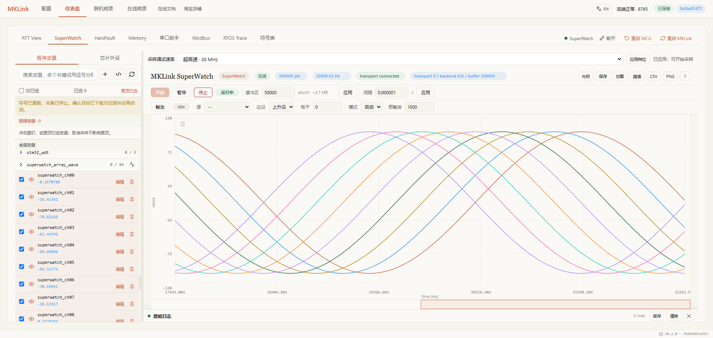

# 让 AI 的判断，回到板子上验证

“这段代码应该能跑”和“板子确实这样运行”，中间差的是一次验证。

AI 可以帮忙改初始化、调任务周期、分析异常。连接 MKLink 后，它还能把程序下载到板子，读取变量、寄存器和日志，再检查修改是否产生了预期结果。

## 下载完成以后，继续问一句

> 看看系统节拍和任务计数有没有在走。

这张实际对话里，AI 完成编译下载后，继续观察了约 5 秒。节拍在递增，主任务和四项任务计数都有变化。工程师拿到的不只是一句“下载完成”，还有程序在执行的依据。

## 变量的变化，直接画出来

> 把目标、反馈和输出画在一起，看看这次参数有没有改善。

*STM32 真机错相正弦波演示。*

MKLink 内部集成 PikaPython，可以把连续读取交给设备执行。AI 交代采集任务后，工具持续接收带时间戳的数据并保存成文件，无需为每个点反复发起一次读取。

少一些调用往返和原始文本，更容易把对话留给分析。需要查看细节时，AI 读取相关片段；你在 Web GUI 放大曲线、看光标、保存截图。

## 发现异常后，继续追原因

反馈有过冲，就比较目标、输出与反馈；缓冲区不更新，就检查传输计数和任务状态；程序进入异常，就保留现场、找到对应源码。

> 根据这次数据修改，再用相同条件验证一次。

Skill、CLI 和 MCP 把这些动作接起来，Web GUI 则让结果可以直接检查。其他调试工具也能被 AI 调用；MKLink 将常用操作、连续采集与网页观察配套提供，减少临时拼装流程的工作。

## 工程师把握目标，数据支持判断

AI 读到了数据，也可能解释错。计数在走不代表全部功能正确；没有丢样的一段曲线也不代表所有工况都正常。把“希望达到什么效果”和“怎样判断改善”说清楚，修改后的验证才有意义。

从你手头最具体的一个问题开始：

[把工程交给 AI](../getting-started/first-project.md) · [STM32 实战](../cases/stm32f103-rt-thread.md) · [HPM 实战](../../mklink/hpm/overview.md)
