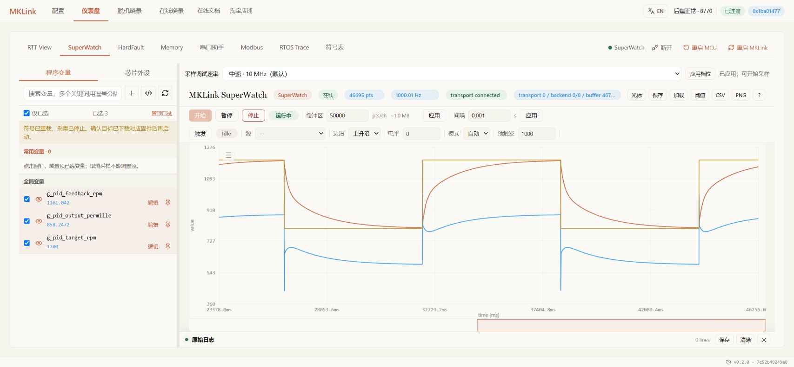

# MKLink × STM32：让 AI 改程序，在网页查看运行结果

算法改完、编译通过后，还要看看程序在板子上运行得对不对。

使用 MKLink 时，你可以告诉 AI 要解决什么问题，让它修改工程、操作设备，再打开网页查看变量曲线和日志，或定位异常对应的源码。

*30 MHz 档，9 路等幅正弦波，相邻相差 22.5°。程序在 STM32 上运行，SuperWatch 直接呈现变量的变化。*

## 单个 4 字节变量的实测采集速度

30 MHz 档下，单变量持续采集 20 秒，平均约 20.17 万次/秒；延长到 120 秒，平均约 19.34 万次/秒。同时读取 4 个连续变量时，每秒完整更新约 3.22 万组。

| 采集内容 | 低速 4 MHz | 中速 10 MHz | 高速 20 MHz | 极速 30 MHz |
| --- | ---: | ---: | ---: | ---: |
| 单个 RAM 变量，4 B | 61,011 次/秒 | 116,901 次/秒 | 175,057 次/秒 | **193,449 次/秒** |
| 4 个连续变量，共 16 B | 10,152 组/秒 | 20,063 组/秒 | 28,372 组/秒 | **32,213 组/秒** |
| 连续 RAM，每块 4 KiB | 274.837 KiB/s | 578.965 KiB/s | 881.522 KiB/s | **1,061.556 KiB/s** |

*STM32F103RET6 真机实测。表中为完整数据的持续读取速度；4 个变量全部读完才算一组。读取速度不等于变量变化频率或网页刷新帧率。*

日常观察可以先用 10 MHz、1 ms 间隔，需要捕捉更细的变化时，再提高档位和采集密度。

## 连接开发板，生成测试波形

连接 MKLink 和开发板，在 AI 开发环境中装好 [MKLink Skill](../../embedded-ai/getting-started/skill.md)，告诉 AI 工程位置和板型。本例使用 STM32F103RET6，主频为 72 MHz，工程基于 RT-Thread 5.1.0。

> 给这个工程加几路错相的正弦波，下载到板子，打开网页让我看。

在仪表盘的 SuperWatch 页面勾选变量，点击“开始”。通过相邻波峰的间隔查看周期，通过曲线之间的偏移查看相位差。接着告诉 AI“把频率改成 2 Hz，再看一次”，继续比较修改后的波形。

*开发流程示意。左侧交代目标，右侧查看波形。*

AI 通过 CLI 和 MCP 操作设备，你在 Web GUI 中查看结果。命令和变量地址由 AI 查找，后续观察也可以继续使用这套工具。

## 下载完成，让 AI 确认程序正在运行

>  把程序编译并下载，看看系统节拍和任务计数有没有在走。

AI 从工程中找到系统节拍和运行计数，通过间隔读取、比较数值变化，检查程序是否持续运行。这项检查无需打开日志窗口或手工查找地址。

AI 可以按这条指令完成下载、校验和运行检查。系统节拍递增，说明节拍中断正在执行；任务计数递增，则能进一步确认应用仍在运行。

手动下载时，进入在线烧录页面，选好器件和固件后开始。镜像地址与符号文件由 AI 根据当前工程确认。

## 提高采集档位，查看波形细节

> 把采集切到 30 MHz，让我看看这条波形的细节。

在 SuperWatch 顶部选择档位并应用，设置采集间隔后开始。下图是在 Chrome 中连接开发板采集的实际画面。

*实时曲线可以暂停查看，也可以导出保存。*

## 对照目标和反馈，检查调参效果

> 把PID目标、反馈和输出画在一起，看看切换目标后跟得怎么样。

*板上运行的 PID 模型：目标在 800 与 1200 之间切换，另外两条曲线为反馈和输出千分比，不驱动实际电机。*

在 SuperWatch 勾选这三个变量，以 1 ms 间隔开始采集。目标变化后，可以从曲线上查看反馈的跟随速度、是否出现过冲，以及输出是否达到限幅，比单看实时数值更直观。

暂停在需要查看的片段，导出 PNG 保存画面，或导出 CSV 保存数据。下一次改参数时，沿用相同的观察条件，方便比较。

> 保存这次曲线，等我改完参数，帮我比较两次响应。

## 不接串口，也能用命令行调试

MKLink 调试线也能用于收日志、发命令，无需额外连接 USB 转串口，也不占用 UART 引脚。打开 RTT View 即可与板上的命令行交互。

> 把工程的命令行接到 RTT，发个 help，看看有哪些命令能用。

工程接好 RTT 命令行后，在 RTT View 点击“开始”，在底部输入 `help`，选择 CRLF 换行并发送，查看可用命令；输入 `version`，查看程序回显。

查状态、改参数、触发一次操作，都可以沿用工程已有的命令。你可以直接在网页输入，也可以告诉 AI 要做什么，让它发送命令、读取返回结果。

## 读取内存，核对变量值

> 找到这个变量，看看值和类型对不对。需要试写的话，先备份，读回来确认后再恢复。

在 Memory 填入 AI 找到的地址和长度，点击读取。需要试写时，选择工程预留的测试数组，写入后回读确认。

只改工程里明确预留的测试区域。重新编译后让 AI 重新查地址；要长期保存的参数，回到工程修改，不能只改一次 RAM。

## 发生 HardFault 时定位源码

> 看看程序为什么进异常，找到对应代码，先保存现场再恢复运行。

打开 HardFault，点击检查。界面会显示异常原因、故障函数和源码位置，供你回到工程中排查。

先看出错指令，再让 AI 结合源码解释。保存现场后可以复位继续工作；要解决问题，还得修改触发异常的代码。栈扫描的候选位置也应结合源码核对。

## 查看线程运行时间线

> 把任务时间线采下来，看看这几个线程什么时候运行。

在 RTOS Trace 开始采集，展开任务列表，查看各线程的运行片段和切换关系。

发现异常片段时，可以暂停采集，让 AI 对照代码分析。同时留意丢失和溢出计数，避免只凭不完整的时间线判断调度问题。

## 验证程序后，保存为脱机任务

> 把这个程序准备成脱机任务，下次接上板子就能重复下载。

打开脱机烧录页面，核对器件、固件和下载配置，生成任务并部署到 MKLink。先执行一次，确认完成状态和目标运行情况，再用于重复下载。完整步骤见[脱机下载说明](../../mklink/flashing/offline-flash.md)。

排查时，可以把“这次调参有没有过冲”“为什么初始化没走完”或“异常停在哪一行”这样的具体问题连同工程交给 AI，让它结合下载结果、日志、波形和源码分析。你确认结果后，再继续修改。

[接入 MKLink](../../embedded-ai/getting-started/skill.md) · [功能总览](../../mklink/overview.md) · [配套例程与数据](../../assets/examples/stm32f103-rt-thread/README.md)
