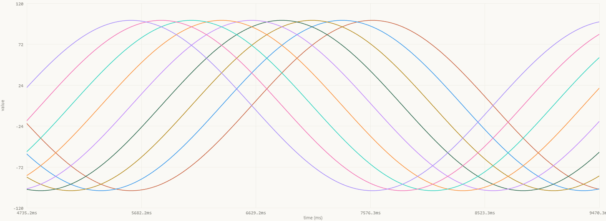
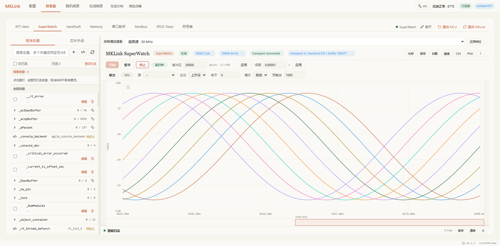
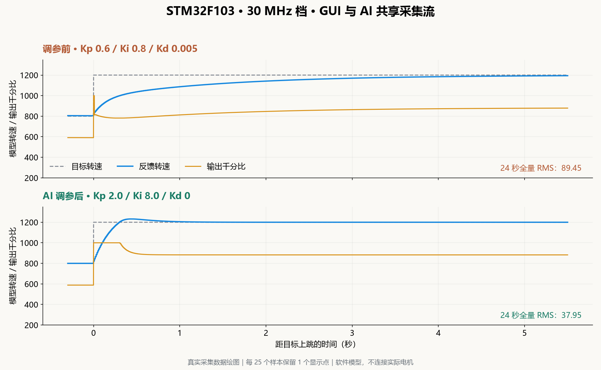
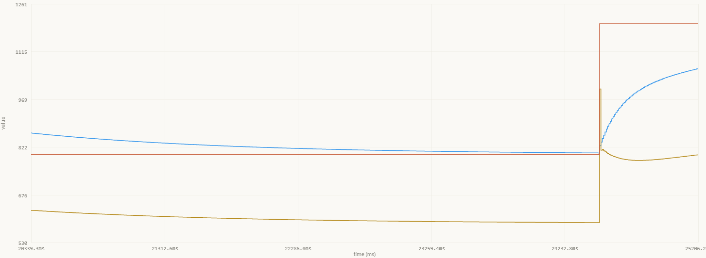
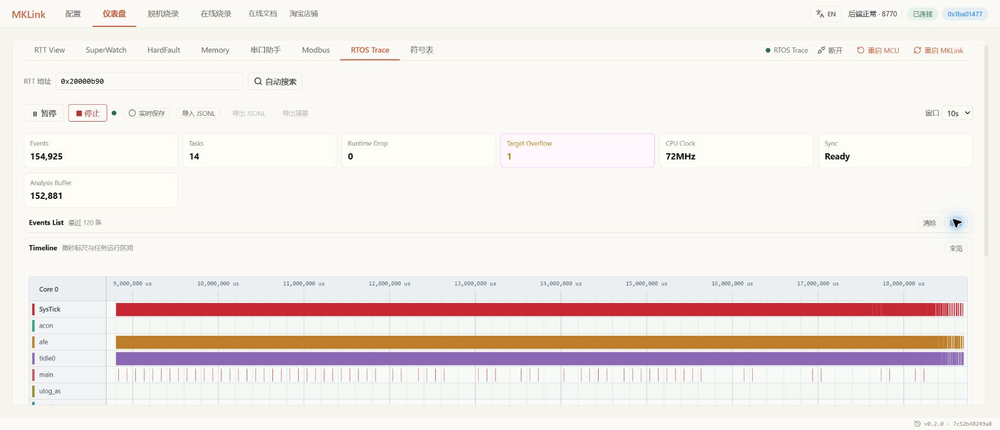

# MKLink x Arm MCU：30MHz SWD + AI驱动，为调试和数据流监控带来无与伦比的体验

**20.17 万次/秒单变量采集（20 秒实测）。连续 4 KiB 内存读取，1,061.56 KiB/s。**

这是 STM32F103RET6 已完成验证的性能基准。通过 MKLink，你可以在程序运行时观察变量、比较调参效果，也可以调用 AI 完成采集和计算。实时数据直接进入调试流程，让你更快验证想法。

## 01｜性能，直接看数据

| 采集内容 | 中速 10 MHz | 高速 20 MHz | 极速 30 MHz |
| --- | ---: | ---: | ---: |
| 单个 RAM 变量，4 B | 116,901 次/秒 | 175,057 次/秒 | **193,449 次/秒** |
| 4 个连续变量，共 16 B | 20,063 组/秒 | 28,372 组/秒 | **32,213 组/秒** |
| 连续 RAM，每块 4 KiB | 578.965 KiB/s | 881.522 KiB/s | **1,061.556 KiB/s** |

*STM32F103RET6 真机实测。性能基准与本次功能演示分别采集。表中持续采样率按探针时间戳统计，包含批间空隙。*

日常观察可以先用 10 MHz、1 ms 间隔，需要捕捉更细的变化时，再提高档位和采集密度。

九路正弦波同时展开，每路幅度 100，相邻相差 22.5°，周期 4 秒。下面这段动图录自 STM32F103 实机连接的 Web GUI：

*动图直接录制网页中的波形画布，约 10 帧/秒；页面刷新帧率、变量更新频率和探针采样率是三个不同指标。九路演示与单变量性能基准分别记录。*

**更少的等待，更专注于设计与验证。**连续采集让你能够回看变化过程，对比不同参数下的响应。需要分析时，直接使用这份数据，减少反复加打印、导出和整理文件的操作。

## 02｜你定目标，用 AI 辅助调参

连接 MKLink 和开发板，在 AI 开发环境中装好 [MKLink Skill](../../embedded-ai/getting-started/skill.md)，告诉 AI 工程位置和板型。本例使用 STM32F103RET6，主频为 72 MHz，工程基于 RT-Thread 5.1.0。

MKLink 提供桌面安装版和 Web GUI。你可以直接操作界面完成调试，也可以调用 AI 辅助分析和执行重复任务，按自己的习惯选择工作方式。

GUI 后端持有设备连接。让 AI 订阅同一条数据流后，你可以在网页观察波形，同时要求它计算误差、比较结果。调试目标和验收标准由你确定，提示词就是对 AI 的任务要求，例如：

> 使用这个 STM32F103 工程，保持 Web GUI 可见，以 30 MHz 观察 PID 的目标、反馈和输出。订阅同一条数据流，分析跟随误差。调整参数，回读确认后重新采集，用相同时间窗口比较误差，让我同步看曲线。

板上运行的 PID 软件模型保留原工程：目标每 6 秒在 800 与 1200 之间切换，控制周期 10 ms，反馈来自一阶模拟对象，输出为千分比；不驱动实际电机。

本轮按上述要求使用 AI 完成采集与调参：先用原参数采集，再把 Kp 从 0.6 调到 2.0、Ki 从 0.8 调到 8.0，Kd 从 0.005 调到 0。每项写入都回读确认，稳定后分别采集 24 秒。

*用真实共享流数据绘图，将两次向上阶跃的起点对齐。RMS 使用完整 24 秒数据；展示曲线每 25 个样本保留 1 个。*

*前半段为调参前波形，后半段为 AI 调参后波形，分别录制约 12 秒*

[查看调参后的完整 Web GUI 截图](../../images/mklink/cases/stm32f103-rt-thread/pid-after-gui-0920.png)

| 指标 | 调参前 | **AI 调参后** |
| --- | ---: | ---: |
| Kp / Ki / Kd | 0.6 / 0.8 / 0.005 | **2.0 / 8.0 / 0** |
| 均方根误差 · 24 秒 | 89.45 | **37.95** |
| 完整三变量数据组 | 492,403 | **494,725** |
| AI 持续接收速度 | 20,504 组/秒 | **20,612 组/秒** |
| 共享流序号缺口 | 0 | **0** |

**均方根误差降低约 57.6%。** 阶跃瞬间的峰值误差仍接近 400，改善发生在随后的跟随和收敛阶段；更快的响应也带来了轻微过冲，图中保留了这一过程。参数改在 RAM 中，复位后恢复原值；需要固化时，再回到工程修改并下载。真实设备还要结合执行器限幅、噪声和稳定裕度验证。

从波形中既能看到跟随误差的改善，也能看到过冲。你可以据此决定是否保留参数，或要求 AI 继续验证其他工况。采集、回读和计算交给工具，方案选择由你掌握。

**MKLink 提供了对人和 AI 都友好的调试底座。**界面便于你观察和操作，共享数据接口便于你使用 AI 完成自动化任务。少做重复操作，就能把更多时间用在控制策略和产品功能上。**这才是 AI 时代，调试器应该有的样子。**

## 03｜下载、看日志、查异常，在一套工作流里完成

### 下载后，检查程序是否正常运行

>  AI提示词：把程序编译并下载，看看系统节拍和任务计数有没有在走。

按这条指令，你可以让 AI 完成下载、校验和运行检查：从工程中找到系统节拍与任务计数，间隔读取并比较变化。系统节拍递增，说明节拍中断正在执行；任务计数递增，则能进一步确认应用仍在运行。

手动下载时，进入在线烧录页面，核对器件、固件和镜像地址后开始。需要协助时，可以让 AI 根据当前工程查找地址与符号文件。

### 不接串口，也能用命令行调试

MKLink 调试线也能用于收日志、发命令，无需额外连接 USB 转串口，也不占用 UART 引脚。打开 RTT View 即可与板上的命令行交互。

> AI提示词：把工程的命令行接到 RTT，发个 help，看看有哪些命令能用。

工程接好 RTT 命令行后，在 RTT View 点击“开始”，在底部输入 `help`，选择 CRLF 换行并发送，查看可用命令；输入 `version`，查看程序回显。

查状态、改参数、触发一次操作，都可以沿用工程已有的命令。你可以直接在网页输入，也可以告诉 AI 要做什么，让它发送命令、读取返回结果。

### 读取内存，核对变量值

> 找到这个变量，看看值和类型对不对。需要试写的话，先备份，读回来确认后再恢复。

在 Memory 填入变量地址和长度，点击读取；也可以让 AI 从符号文件中查找地址。需要试写时，选择工程预留的测试数组，写入后回读确认。

只改工程里明确预留的测试区域。重新编译后让 AI 重新查地址；要长期保存的参数，回到工程修改，不能只改一次 RAM。

### 发生 HardFault 时定位源码

> AI提示词：看看程序为什么进异常，找到对应代码，先保存现场再恢复运行。

打开 HardFault，点击检查。界面会显示异常原因、故障函数和源码位置，供你回到工程中排查。

先看出错指令，再让 AI 结合源码解释。保存现场后可以复位继续工作；要解决问题，还得修改触发异常的代码。栈扫描的候选位置也应结合源码核对。

### 查看线程运行时间线

> AI提示词：把任务时间线采下来，看看这几个线程什么时候运行。

在 RTOS Trace 开始采集，展开任务列表，查看各线程的运行片段和切换关系。

发现异常片段时，可以暂停采集，让 AI 对照代码分析。同时留意丢失和溢出计数，避免只凭不完整的时间线判断调度问题。

### 验证程序后，保存为脱机任务

> AI提示词：把这个程序准备成脱机任务，下次接上板子就能重复下载。

打开脱机烧录页面，核对器件、固件和下载配置，生成任务并部署到 MKLink。先执行一次，确认完成状态和目标运行情况，再用于重复下载。完整步骤见[脱机下载说明](../../mklink/flashing/offline-flash.md)。

本次脱机补测保留工程原有 Bootloader：Boot 位于 `0x08000000`，应用从 `0x08005000` 开始。使用配置中 236 KiB 的应用分区构造大镜像，按**先擦除、再写入、最后完整校验**执行，Boot 区保持不变。

| **236 KiB 应用镜像** | 20 MHz | **30 MHz** |
| --- | ---: | ---: |
| 擦除 | 2.684 s | **2.677 s** |
| 写入 | 7.904 s | **7.841 s** |
| 完整回读校验 | 0.419 s | **0.516 s** |
| 总时间 · 含进度刷新 | 13.993 s | **14.001 s** |
| 单独写入速度 | 29.86 KiB/s | **30.10 KiB/s** |
| 擦除＋写入＋校验综合速度 | 16.87 KiB/s | **16.86 KiB/s** |

*20/30 MHz 各三轮均通过，表中取平均值。每档最后一轮另做完整主机回读校验；表中校验时间为固件内部校验，额外主机核对不计入。总时间包含进度每变化 1% 时的刷新等待，不含复制文件和建立会话。KiB = 1024 字节。*

RAM 读取很快，Flash 写入为什么只有约 30 KiB/s？这次使用标准 `STM32F10x_512.FLM`。MKLink 把算法和页数据送进目标 RAM，再让目标 CPU 调用擦除、编程函数，等待片内 Flash 控制器完成。这里的主要耗时是目标算法执行；提高 SWD 时钟，对整次下载的影响有限。

借助通用 FLM 接口，不同 Arm Cortex 器件可以复用厂商或 Pack 提供的算法，沿用同一套下载流程。具体芯片仍需匹配兼容算法、RAM 与 Flash 布局，并完成适配验证。

从波形到日志，从异常现场到源码，你可以在同一套工作流中推进排查，也可以随时调用 AI 协助分析。MKLink 将高性能读写、可视化操作与自动化接口结合起来，让工具配合你的思路，减少重复劳动，把精力用在解决问题和实现新功能上。

[接入 MKLink](../getting-started/skill.md) · [功能总览](../../mklink/overview.md) · [原有例程与性能基准](../../assets/examples/stm32f103-rt-thread/README.md) · [本次动图与脱机补测记录](../../mklink/development/reports/stm32f103-article-20260920.md)
