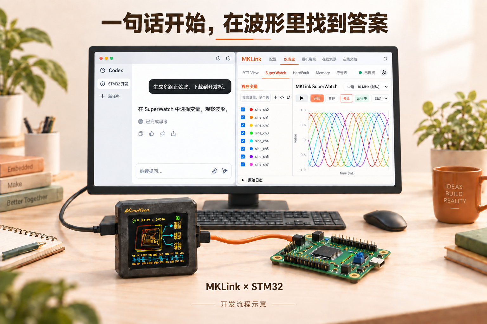

# AI 负责操作，你在网页看结果

使用 MKLink 时，最常见的配合很简单：**在 AI 对话里交代要做什么，在 Web GUI 里看板子发生了什么。**

*开发流程示意：左侧提出问题，右侧查看波形。*

## 四个名字，只需知道各自做什么

| 名称 | 对使用者意味着什么 |
| --- | --- |
| Skill | 让 AI 知道怎样使用 MKLink，并按工程选择操作方式 |
| CLI | AI 执行设备操作的一种入口 |
| MCP | AI 客户端直接调用设备工具的另一种入口 |
| Web GUI | 给你看曲线、发命令、查内存和手动烧录的页面 |

CLI 和 MCP 不需要你分别学一套命令。AI 会根据当前环境选择可用入口；没有 MCP 的客户端，也可以通过 CLI 使用相应能力。

## 比如，改完程序以后

> 把程序编译并下载，看看系统节拍和任务计数有没有在走。

AI 找到当前工程的构建配置和输出文件，完成下载校验，再间隔读取计数。你看到的是编译结果、校验结果，以及计数是否持续变化。

## 再比如，想知道参数改得好不好

> 把目标、反馈和输出画在一起，保存这次数据。

打开 **仪表盘 → SuperWatch**，勾选这些变量并开始采集。看到了过冲，就继续说：

> 帮我比较修改前后的过冲和稳定时间。

连续采集由工具执行，数据保存成文件，AI 按需要分析。你不用逐次读取变量，也不用把整份数据复制到对话里。

## AI 和网页怎样接着用

使用同一个工程，并加载与板上固件匹配的 AXF/ELF。重新编译后，留意配置页显示的是“自动跟踪”还是“文件快照”；快照需要重新选择文件。

需要让 AI 下载新程序或接管设备时，先在网页点击 **停止**，结束正在进行的采集。**暂停图表或切换标签页不会释放设备。** 符号重载也不会自动烧录，确认新程序已下载后再开始观察。

你可以始终让 AI 操作，也可以随时回到网页手动处理。[第一次接入工程](first-project.md)从最常用的下载检查开始。
