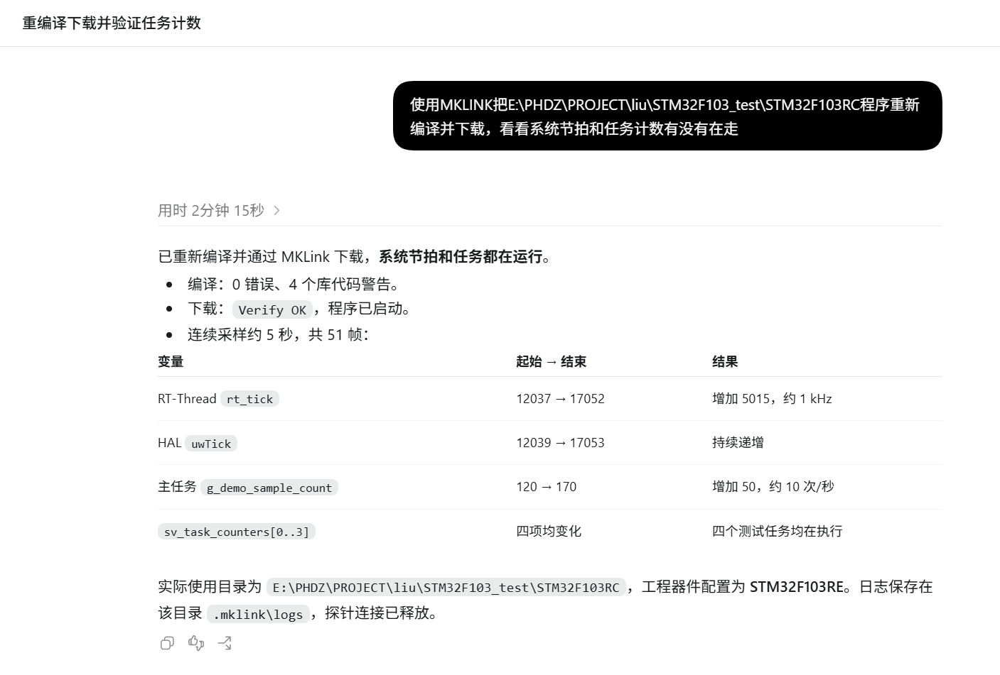

# AI + MKLink：说清问题，直接看板上的结果

改完代码，程序真的跑了吗？反馈为什么慢了一拍？这次死机停在哪一行？

把工程和问题交给 AI，它可以通过 MKLink 编译下载、读取变量、收发命令，再用真实数据检查修改。你在 Web GUI 看曲线、日志和任务时间线，决定下一步怎么改。

## 第一次用，先完成这三步

1. **装好工具**：安装 [MKLink Skill](getting-started/skill.md)，让 AI 检查设备连接并打开 Web GUI。
2. **告诉 AI 工程在哪**：提供工程目录、板上芯片型号和本次要做的事。
3. **看结果**：下载后看运行计数，调算法看曲线，查故障看源码位置。

> 这个工程在 E:\Projects\motor，板子是 STM32F103RET6。帮我编译并下载，看看系统节拍和任务计数有没有在走。

换成自己的工程路径和板型即可。编译器、固件和符号文件由 AI 从工程中查找；工程有多个目标时，选定你要使用的那个。

## 从手头的问题进入

| 现在想做什么 | 接着看 |
| --- | --- |
| 第一次接入自己的工程 | [把工程交给 AI](getting-started/first-project.md) |
| 确认刚下载的程序正在运行 | [编译、下载与运行检查](workflows/flash-workflow.md) |
| 不接串口，直接给板子发命令 | [RTT 命令行与日志](workflows/rtt-workflow.md) |
| 查变量、缓冲区和外设状态 | [变量、内存与寄存器](workflows/memory-workflow.md) |
| 比较调参前后的过冲和响应 | [用曲线调 PID / FOC](workflows/pid-workflow.md) |
| 程序死机，找到出错代码 | [异常定位](workflows/hardfault-workflow.md) |
| 看任务是否被耽误了 | [任务时间线](workflows/systemview-workflow.md) |
| 把程序交给工位重复烧录 | [准备脱机任务](workflows/offline-workflow.md) |

## 先看真实效果

[MKLink × STM32](cases/stm32f103-rt-thread.md)：真实正弦波、四档持续读取性能、RTT 命令行，以及从下载检查到异常定位的用法。

[MKLink × 先楫 HPM](../mklink/hpm/overview.md)：从 hello_world 开始画 16 路波形，继续做在线下载、RTT 交互、数组观察和脱机烧录，附 HPM5301、HPM6E80 实测结果。

**Skill 告诉 AI 怎么用工具，CLI 和 MCP 负责执行，Web GUI 把结果展示给你。** 日常使用不用记调用命令。想了解它们如何配合，看[AI 操作与网页观察](getting-started/interfaces.md)。
