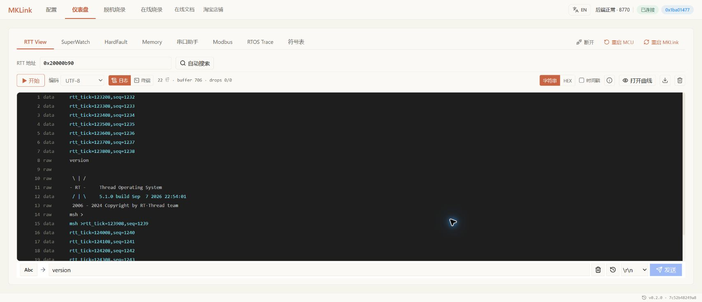
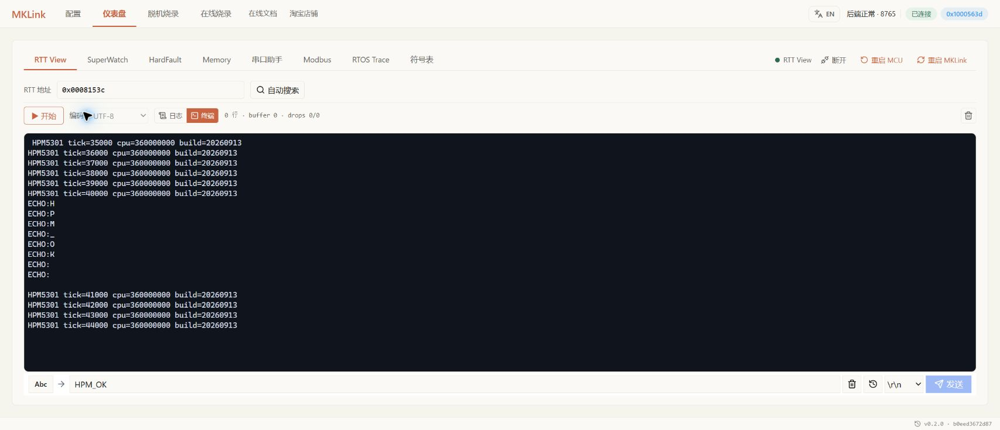

# 不接串口，也能给板子发命令

产品 UART 已经被占用，也不妨碍调试。**RTT 通过调试口双向通信，MKLink 的 RTT View 可以直接作为板上的命令行终端。**

> 把工程的命令行接到 RTT，发个 help，看看有哪些命令能用。

## 工程接好一次，以后直接用

程序需要集成 RTT，并把命令行的输入和输出都接过去。以 STM32 示例的 RT-Thread 工程为例，可以复用原有命令行；只有日志输出时，输入命令还不会自动生效。

接好后，打开 **仪表盘 → RTT View**，定位当前固件的 RTT 控制块并点击“开始”。在底部输入 `help`，选择工程要求的换行方式并发送；本例使用 CRLF。

## AI 也可以替你操作

> 发个 help，看看有哪些状态查询命令，再查一下当前运行状态。

查询参数、切换测试模式、触发一次业务操作，都沿用板上已经实现的命令。AI 可以读取返回结果，继续对照源码分析；你也可以随时在网页输入。

## 日志用来解释发生了什么

> 抓一段日志，看看初始化停在哪一步。

初始化、通信收发和状态切换适合记录成文本；周期、相位和过冲则适合放到 [SuperWatch 曲线](pid-workflow.md)里观察。

HPM 配套例程也演示了 RTT 双向收发。图中的短文本回显用于检查通信链路，并不表示例程已经包含完整命令行。

## 没有回显时先看这里

确认程序正在运行、输入已接入命令处理、命令名称与换行符正确。重新编译后使用当前符号文件查地址，不照抄旧截图中的地址。需要切换采集或下载时，点击“停止”释放当前会话。

[RTT 网页操作](../../mklink/observation/rtt.md) · [RTT 的使用原理](../../mklink/articles/mcu-debugging-companion.md)
