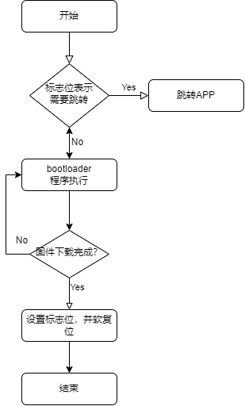
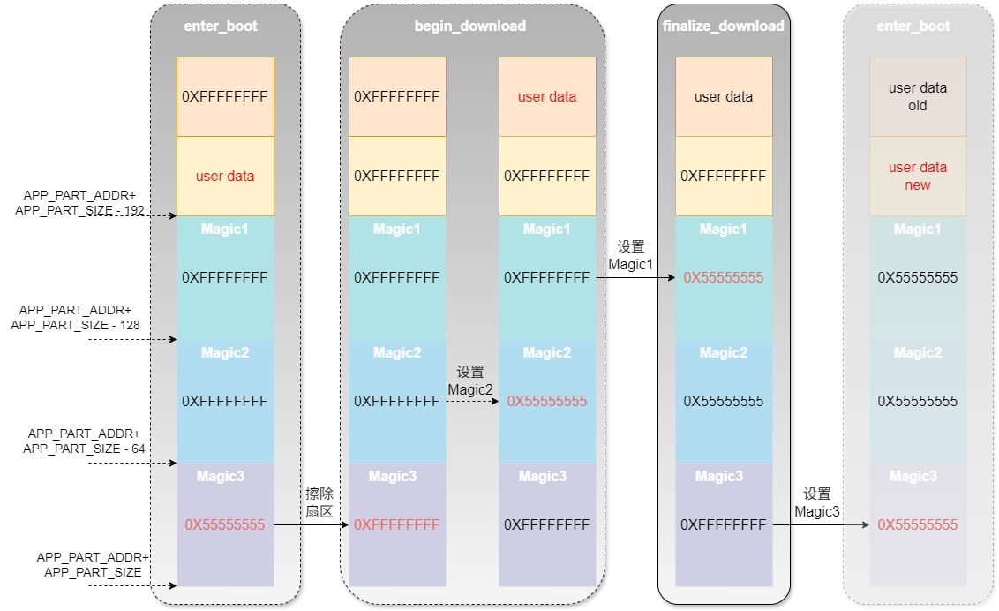
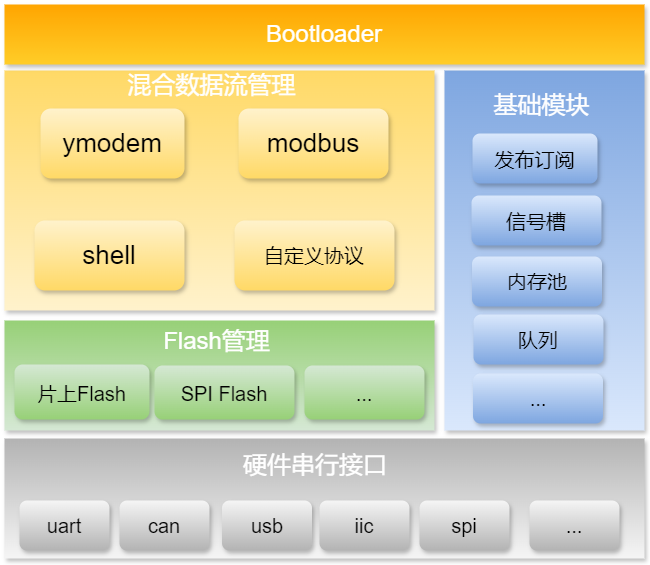

# MicroBoot简介

  MicroBoot 是一个由模块化代码组成的框架，旨在简化和加速嵌入式单片机程序的升级和开发过程。

开源地址：

github：https://github.com/Aladdin-Wang/MicroBootRom

## 1、引言

那些让人崩溃的BootLoader升级灾难

> 你有没有为写BootLoader无从下手发愁过？
>
> 你有没有为出厂的产品还需要开盖刷程序苦恼过？ 
>
> 你有没有为程序升级失败，”而抓耳挠腮过？
>
> 你有没有因为固件升级Bug被老板当众灵魂拷问：“为啥烧进去就起不来了？”

## 2、MicroBoot：彻底的解决升级难题

### 问题1：bootloader 在跳转到app前没有清理干净存在的痕迹

**问题描述：** 固件更新完毕后从 bootloader 跳转至 APP 前需对所用的外设 deinit ，以使外设恢复至上电时的初始状态。但是当使用复杂的外设收取固件包时， deinit 也将变得复杂，甚至很难排除对 APP 的影响。因此最佳的方法是升级完固件进行软复位，再次进入bootloader在程序运行之前，先通过判断标志的方式，来直接跳转到app，这样就相当于给APP提供了一个干净的外设环境。

程序复位执行流程如下图所示：



设置标志位的常见方法

> 传统的设置标志位以实现复位后保留状态的方法通常有以下两种：：
>
> - **备份寄存器**：利用芯片中的不受软件复位影响的可供用户使用的寄存器 (如 STM32 中的备份寄存器)；
>
> - **No-Init 数据段**：将标志位放在特殊的内存段（例如`.bss.noinit`），使其在复位后避免被重新初始化。
>


### 问题2： APP单独运行没有问题，通过Bootloader跳转到APP运行莫名死机

**问题描述：**在近几年的嵌入式社区中，流传着不少关于面相**Cortex-M**的**Bootloader**科普文章，借助这些文章，一些较为经典的代码片断和技巧得到了广泛的传播。

在从**Bootloader**跳转到用户**APP**的过程中，使用函数指针而非传统的汇编代码则成了一个家喻户晓的小技巧。相信类似下面 **JumpToApp()** 函数，你一定不会感到陌生：

```c
typedef  void (*pFunction)(void);

void JumpToApp(uint32_t addr)
{
  pFunction Jump_To_Application;

  __IO uint32_t StackAddr;
  __IO uint32_t ResetVector;
  __IO uint32_t JumpMask;

  JumpMask = ~((MCU_SIZE-1)|0xD000FFFF);

  if (((*(__IO uint32_t *)addr) & JumpMask ) == 0x20000000) 
  {
    StackAddr = *(__IO uint32_t*)addr;
    ResetVector = *(__IO uint32_t *)(addr + 4);

    __set_MSP(StackAddr); 
    Jump_To_Application = (pFunction)ResetVector;
    Jump_To_Application(); 
  }
}
```

但是这段家喻户晓，被世人奉为真理的代码，却隐藏着很深的BUG，相信很多小伙伴都遇到过通过Bootloader跳转到APP后，程序时好时坏的灵异事件，具体详情请看这篇文章：[震惊！这个隐藏的Bootloader漏洞究竟有多少人中招？](https://mp.weixin.qq.com/s/uVktPkcbh2XAVo2QAluxnA)

**解决方案：**

完全用汇编来处理从**Bootloader**到**App**的最后步骤，才是最稳定可靠的方案：

```c
#if defined (__ARMCC_VERSION) && (__ARMCC_VERSION >= 6010050)
/* Avoids the semihosting issue */
__asm("  .global __ARM_use_no_argv\n");
#elif defined(__GNUC__)
/* Disables part of C/C++ runtime startup/teardown */
void __libc_init_array (void) {}
#endif

#if defined(__CC_ARM)
__asm void modify_stack_pointer_and_start_app(uint32_t r0_sp, uint32_t r1_pc)
{
    MOV SP, R0
    BX R1
}
#elif defined(__GNUC__)
void modify_stack_pointer_and_start_app(uint32_t r0_sp, uint32_t r1_pc)
{
    uint32_t z = 0;
    __asm volatile (  "msr    control, %[z]   \n\t"
                      "isb                    \n\t"
                      "mov    sp, %[r0_sp]    \n\t"
                      "bx     %[r1_pc]"
                      :
                      :   [z] "l" (z),
                      [r0_sp] "l" (r0_sp),
                      [r1_pc] "l" (r1_pc)
                   );
}
#else
#error "Unknown compiler!"
#endif
```

> 温馨提示：看不懂汇编没关系，复制到AI帮你理解！

### 问题3： 需要 APP 传递信息给 Bootloader

**问题描述：**在一些嵌入式设备中，由于产品型号和应用场景的不同，固件升级的接口（如 UART、CAN、USB等）和波特率配置需要改变。这种情况下，很多人的思路是希望bootloader也能自己给自己更新，但是这不就更加增加了工程的复杂性，变成了无限套娃！正确的解法应该是参考内置在单片机的bootrom那样，bootrom提供必要的接口API，可以让app传递参数给Bootloader，尽量让bootloader固化，**一个稳定可靠的bootloader，是产品快速迭代的基石！**，开发bootloader不能像开发app那样的思路野蛮生长！

**解决方案：**

**1.定义传递信息的用户数据结构体：**

BootLoader定义了一个默认的用户数据结构体，一共192个字节，APP可以在192个字节内随意向bootloader传递数据：

```c
// <o>The user data size
//  <i>Default: 192
#define USER_DATA_SIZE            192

typedef struct {
    char chProjectName[16];
    char chHardWareVersion[16];
    char chSoftBootVersion[16];
    char chSoftAppVersion[16];	
} msgSig_t;
typedef struct {
    union {
        msgSig_t sig;
        uint8_t B[USER_DATA_SIZE];
    } msg_data;
} user_magic_data_t;
```

**2.提供类似bootrom的函数接口：**

BootLoader提供了一组函数的API，并将接口位置固定到BOOT_FLASH_OPS_ADDR地址，这样APP就可以方便的调用了

```c
typedef struct {
    void (*fnGoToBoot)(uint8_t *pchDate, uint16_t hwLength); 
    bool (*target_flash_init)(uint32_t addr); 
    bool (*target_flash_uninit)(uint32_t addr); 
    int  (*target_flash_read)(uint32_t addr, uint8_t *buf, size_t size); 
    int  (*target_flash_write)(uint32_t addr, const uint8_t *buf, size_t size); 
    int  (*target_flash_erase)(uint32_t addr, size_t size); 
} boot_ops_t;
#define BOOT_FLASH_OPS_ADDR 0x08001000
#define __ARM_AT(x) ".ARM.__at_"#x
#define ARM_AT(x) __ARM_AT(x)
#if defined(__CC_ARM)  // ARM Compiler 5 (AC5)
    #define BOOT_FLASH_SECTION __attribute__((at(BOOT_FLASH_OPS_ADDR)))
#elif defined(__ARMCC_VERSION) && (__ARMCC_VERSION >= 6000000)  // ARM Compiler 6 (AC6)
    #define BOOT_FLASH_SECTION __attribute__((section(ARM_AT(BOOT_FLASH_OPS_ADDR))))
#elif defined(__GNUC__)  // GCC
    #define BOOT_FLASH_SECTION __attribute__((section(".boot_flash_ops"), used, aligned(4)))
#else
    #define BOOT_FLASH_SECTION
#endif

__attribute__((used))
static volatile const boot_ops_t tBootOps BOOT_FLASH_SECTION = {
    .fnGoToBoot = enter_bootloader,
    .target_flash_init = target_flash_init,
    .target_flash_erase = target_flash_erase,
    .target_flash_write = target_flash_write,
    .target_flash_read = target_flash_read,
    .target_flash_uninit = target_flash_uninit
};
```

**3.APP的代码可以调用这些函数，并传递数据给bootloader：**

APP需要重新定义用户数据，添加需要向bootloader传递的数据。

```c
typedef struct {
    /*定义用户数据*/
    char chProjectName[16];
    char chHardWareVersion[16];
    char chSoftBootVersion[16];
    char chSoftAppVersion[16];
    char chPortName[16];
    int wPortBaudrate;
} msgSig_t;
typedef struct {
    union {
        msgSig_t sig;
        char B[sizeof(msgSig_t)];
    } msg_data;
} user_data_t;

user_data_t  tUserData = {
    .msg_data.sig.chProjectName = "app",
    .msg_data.sig.chHardWareVersion = "V1.0.0",
    .msg_data.sig.chSoftBootVersion = "V1.0.0",
    .msg_data.sig.chSoftAppVersion =  "V1.0.0",
};

typedef struct {
    void (*fnGoToBoot)(uint8_t *pchDate, uint16_t hwLength);
    bool (*target_flash_init)(uint32_t addr);
    bool (*target_flash_uninit)(uint32_t addr);
    int  (*target_flash_read)(uint32_t addr, uint8_t *buf, size_t size);
    int  (*target_flash_write)(uint32_t addr, const uint8_t *buf, size_t size);
    int  (*target_flash_erase)(uint32_t addr, size_t size);
} boot_ops_t;
```

比如通过UART接口来升级程序，就可以这样使用：

```c
void uart_boot()
{
    rt_memcpy(tUserData.msg_data.sig.chPortName, "UART1", rt_strlen("UART1"));
    tUserData.msg_data.sig.wPortBaudrate = 115200;
    boot_ops_t *ptBootOps = (boot_ops_t *) 0x08001000;
    ptBootOps->fnGoToBoot((uint8_t *)tUserData.msg_data.B, sizeof(tUserData));
    rt_hw_cpu_reset();
}
MSH_CMD_EXPORT(uart_boot, go to bootloader);
```

APP的程序如果有操作flash的需求，便可以直接使用bootloader提供的这组API了。这样不仅APP和Bootlader可以共用一个flash驱动来节省空间，还有一个更妙的作用：

> 如果你使用的是类似STM32H750这样的芯片，内部只有128K的flash，一般内部flash的128k是用来做bootloader，app程序是需要跑在外部nor flash中的，我们知道nor flash是不支持Read-while-write特性的，因此在APP程序中，是不支持对flash进行擦写的。但是如果app调用的是bootloader提供的flash驱动函数时，程序已经运行在了单片机的内部flash中，这个时候便可以对nor flash进行擦写了！如果你碰巧又有保存数据的需求，那就妥妥的为你省了另外一颗flash芯片，这省下的都是成本！
>

**4.防止参数掉电丢失，将数据固化在flash合理的位置：**

该方案在APP分配的FLASH空间末端一共占用了570个字节，具体作用可以看下边的表格。为什么要放在app区域的末端，是一个巧妙的设计，聪明的你肯定会觉得flash是按照扇区擦除的，那这相当于占用了APP的一整个扇区，远远高于570个字节！但是实际上并不会占用整个扇区，app的代码依然可以使用最后一个扇区，具体原因可以往下看。

FLASH空间占用如下：

| 描述                  | 用户数据备份区（192 字节） | 用户数据区（192字节） | Magic1 （64字节） | Magic2 （64字节） | Magic3 （64字节） |
| --------------------- | -------------------------- | --------------------- | ----------------- | ----------------- | ----------------- |
| **enter_bootloader**  | 0XFFFFFFFF...              | **user_data**         | 0XFFFFFFFF        | 0XFFFFFFFF        | 0x55555555        |
| **begin_download**    | **user_data**              | 0XFFFFFFFF...         | 0XFFFFFFFF        | 0x55555555        | 0XFFFFFFFF        |
| **finalize_download** | **user_data**              | 0XFFFFFFFF...         | 0x55555555        | 0x00000000        | 0XFFFFFFFF        |

- **APP 参数写入**：在需要固件升级时，APP 会将接口类型、波特率等升级信息写入指定的用户数据区。
- **Boot参数读取**：Bootloader 在启动时首先读取该存储区域，提取接口和波特率参数，并据此初始化通信配置。

用户数据在FLASH中的位置，以及变化过程如下图所示：



bootloader在升级app程序的不同阶段数据变化：

**阶段1：进入Bootloader（enter_bootloader）**

- 对于全片擦除过的单片机，此时**Magic1**和**Magic2**的值为`0xFFFFFFFF`，表示还未开始下载过程，**Magic3**被设置为`0x55555555`，表明这是一个等待升级程序的状态。此时user data的值为`0xFFFFFFFF`，当APP调用`enter_bootloader`接口，将会把app传递进来的数据写进用户区。

```c
void enter_bootloader(void)
{
    uint32_t wData = 0X55555555;
    target_flash_init(APP_PART_ADDR);	
    target_flash_write((APP_PART_ADDR + APP_PART_SIZE - (3*MARK_SIZE) - (USER_DATA_SIZE)), pchDate, USER_DATA_SIZE);
    target_flash_write((APP_PART_ADDR + APP_PART_SIZE - MARK_SIZE), (const uint8_t *)&wData,  sizeof(wData));
    target_flash_uninit(APP_PART_ADDR);
}
```


**阶段2：开始下载（begin_download）**

- 当固件下载开始时，MicroBoot会首先对**Magic**所在的扇区擦除，然后将**Magic2**的值设置为`0x55555555`，并将**用户区**的数据重新写到**用户数据备份区**。
- 此时，**Magic1**为`0xFFFFFFFF`，**Magic3**也保持为`0xFFFFFFFF`，这些状态便于系统在出现断电时判断下载是否已部分完成，从而支持断电重启还能留在bootloader，并且可以从**用户数据备份区**获取用户数据。

```c
void begin_download(void)
{
    memset(chBootMagic, 0X55, sizeof(chBootMagic));
    target_flash_init(APP_PART_ADDR);	
    target_flash_erase(APP_PART_ADDR + APP_PART_SIZE - (3*MARK_SIZE), 3*MARK_SIZE);
    target_flash_write((APP_PART_ADDR + APP_PART_SIZE - (3*MARK_SIZE) - 2 * (USER_DATA_SIZE)), tUserMagicData.msg_data.B, USER_DATA_SIZE);
    target_flash_write((APP_PART_ADDR + APP_PART_SIZE - (2*MARK_SIZE)), chBootMagic[1], MARK_SIZE);
    target_flash_uninit(APP_PART_ADDR);
}
```


**阶段3：完成下载（finalize_download）**

- 当固件下载完成且数据写入成功后，MicroBoot会将**Magic1**的值设置为`0x55555555`，标志着下载过程已顺利完成。

- 此时，**Magic2**的值仍为`0x55555555`，而**Magic3**的值保持为`0xFFFFFFFF`，从而标识此阶段为下载完成、准备进入应用程序的状态。

```c
void finalize_download(void)
{
    memset(chBootMagic, 0X55, sizeof(chBootMagic));
    target_flash_init(APP_PART_ADDR);	
    target_flash_write((APP_PART_ADDR + APP_PART_SIZE - 3*MARK_SIZE), chBootMagic[0], MARK_SIZE);
    target_flash_uninit(APP_PART_ADDR);
}
```


**阶段4：重新进入Bootloader并跳转到APP**

- 在系统完成固件升级后，MicroBoot会执行软复位，系统重新进入bootloader。

- bootloader在检查到**Magic1**和**Magic2**均为`0x55555555`，而**Magic3**为`0xFFFFFFFF`时，就会识别到这是一个升级完成的状态。

- 这时，MicroBoot无需对外设进行反初始化，而是直接跳转到APP，从而为应用程序提供一个干净的外设环境。


**阶段5：从APP再次进入Bootloader**

- 在APP正常运行后，如果想再次进入bootloader进行升级，调用MicroBoot提供的进入bootloader的接口，将会把**Magic3**设置为`0x55555555`，复位后，将会再次回到阶段1。

- 当下次进入bootloader时，看到**Magic1**、**Magic2**和**Magic3**均为`0x55555555`。

> 程序在升级的全流程中，只在开始升级的时候，调用的begin_download()函数对app区域进行了全部擦除，并不会对app的最后一个扇区做单独的擦除操作，因此并不会影响app代码使用最后一个扇区，也就是bootloader使用的标志及数据，仅占用了app区域的最后570个字节！
>

**bootloader安全跳转代码如下：**

```c
__attribute__((constructor))
static void enter_application(void)
{
    target_flash_init(APP_PART_ADDR);
    do {
        // User-defined conditions for entering the bootloader
        if(user_enter_bootloader()){
            target_flash_read((APP_PART_ADDR + APP_PART_SIZE - (3 * MARK_SIZE) - USER_DATA_SIZE), tUserMagicData.msg_data.B, USER_DATA_SIZE);
            break;			
        }
        // Read the magic values from flash memory to determine the next action
        target_flash_read((APP_PART_ADDR + APP_PART_SIZE - 3 * MARK_SIZE), chBootMagic[0], 3 * MARK_SIZE);

        // Check if Magic3 is 0X55555555, indicating to read user data from a specific location
        if ((0X55555555 == *(uint32_t *)&chBootMagic[2]) || (0 == *(uint32_t *)&chBootMagic[2])) {
            target_flash_read((APP_PART_ADDR + APP_PART_SIZE - (3 * MARK_SIZE) - USER_DATA_SIZE), tUserMagicData.msg_data.B, USER_DATA_SIZE);
            break;
        }
        // Check if Magic2 is 0X55555555,Magic1 is !0X55555555, indicating to read user data from a specific location
        if ((0X55555555 == *(uint32_t *)&chBootMagic[1]) && (0X55555555 != *(uint32_t *)&chBootMagic[0])) {
            target_flash_read((APP_PART_ADDR + APP_PART_SIZE - (3 * MARK_SIZE) - 2 * USER_DATA_SIZE), tUserMagicData.msg_data.B, USER_DATA_SIZE);
            break;
        }
         		
        //Check if the value at the address (APP_PART_ADDR + 4) has the expected application identifier
        uint32_t wValue = 0;
        target_flash_read((APP_PART_ADDR + APP_PART_OFFSET), (uint8_t *)&wValue, 4);
        target_flash_uninit(APP_PART_ADDR);		
        // If all checks are passed, modify the stack pointer and start the application
        #ifdef __riscv
        if ((wValue) == (0xffffffff) || (wValue) == (0) ) {
            break;
        }		
        modify_stack_pointer_and_start_app((APP_PART_ADDR + APP_PART_OFFSET));
        #else
        // Check if the value at the address (APP_PART_ADDR + 4) has the expected application identifier
        if ((wValue & 0xff000000) != (APP_PART_ADDR & 0xff000000)) {
            break;
        }		
        modify_stack_pointer_and_start_app(*(volatile uint32_t *)APP_PART_ADDR,
                                           (*(volatile uint32_t *)(APP_PART_ADDR + APP_PART_OFFSET)));
        #endif
    } while(0);	
    target_flash_uninit(APP_PART_ADDR);	
}
```

函数修饰符 `__attribute__((constructor))`告诉编译器在程序启动时自动调用这个函数。即在主程序的 `main()` 函数之前执行，它的主要功能是检查系统当前的状态，并根据状态决定是进入APP还是停留在bootloader。代码中增加了**用户自定义的进入bootloader条件**，代码通过调用`user_enter_bootloader()`检查用户是否指定了进入bootloader模式，这个检查是为了给用户留出手动控制的空间，比如通过外部按键强制进入bootloader，或者延时启动app，如果返回值为`true`，则直接退出函数，保持在bootloader中。

### 问题4： APP有bug，跳转后，直接死机怎么办？

很多人做 Bootloader 时，都会遇到一个经典问题：

> 设备一上电就直接跳转到 APP，一旦 APP 异常，设备就“锁死”了

比如：

- APP 崩溃
- 向量表错误
- Flash 写坏
- 升级中断

结果：**设备无法再次进入 Bootloader，直接变砖。**

**解决方案：**

- 上电先进入 Boot，给一个“安全时间窗口”，等待用户下发升级指令。
- 通过外部按键等接口，上电强制留在bootloader。

microboot在上电执行跳转之前，为用户预留了一个`user_enter_bootloader`的弱函数，用户可以通过实现这个函数，来自定义强制进入bootloader的方式。

```c
__attribute__((weak))
bool user_enter_bootloader(void)
{
    return false;
}

```

**在 Bootloader 设计中，一个关键问题是：**

- 如何区分“上电复位”和“软复位”？

因为：

- **只有上电时，才需要进入 Boot 的安全窗口**
- **软复位后，应该直接进入 APP**

解决方法是使用“不被复位初始化的变量（NOINIT），通过修改链接脚本，将一段内存定义为 **NOINIT 区域**：

```c
LR_IROM1 0x08000000 0x00040000  {    ; load region size_region
  ER_IROM1 0x08000000 0x00040000  {  ; load address = execution address
   *.o (RESET, +First)
   *(InRoot$$Sections)
   .ANY (+RO)
   .ANY (+XO)
  }
  RW_IRAM1 0x20000000 0x0000C000  {  ; RW data
   .ANY (+RW +ZI)
  }
  RW_IRAM_NO_INIT +0 UNINIT  {
	* (.bss.noinit)
  }   
}
```

> 温馨提示：看不懂链接脚本没关系，复制到AI帮你理解！

放在这个noinit段里的变量具有如下特性：

| 场景             | 变量是否保留     |
| ---------------- | ---------------- |
| 上电（Power On） | 不确定（随机值） |
| 软复位（Reset）  | 保留             |

所以设计思路就很明确了：

- 上电时变量无效 → 进入 Boot
-  倒计时结束 → 设置变量 + 软复位
- 复位后变量有效 → 进入 APP

代码如下：

```c
/* 
 * @brief  Boot control flag stored in NOINIT section.
 *         This variable is preserved across reset and used to control
 *         whether the system should jump to APP after reboot.
 */
NOINIT
static volatile uint32_t s_wEnterAppFlag;
#define ENTER_APP_FLAG   0x55555555 /* Magic value indicating that APP entry is allowed */

/*
 * @brief  Check if entering APP is allowed.
 * @retval true  APP can be entered
 * @retval false Stay in bootloader
 */
bool can_enter_app(void)
{
    return (s_wEnterAppFlag == ENTER_APP_FLAG);
}

/*
 * @brief  Enable APP entry.
 *         This sets the flag so that after reboot the system jumps to APP.
 */
void enable_enter_app(void)
{
    s_wEnterAppFlag = ENTER_APP_FLAG;
}

/*
 * @brief  Decide whether to stay in bootloader.
 * @retval true  Stay in bootloader
 * @retval false Jump to APP
 */
bool user_enter_bootloader(void)
{
    return !can_enter_app();
}

/*
 * @brief  Delay timer callback.
 *         If timeout occurs and APP entry is not yet enabled,
 *         enable it and reboot to enter APP.
 *
 * @param  status Timer status
 * @param  pTag   User context (unused)
 */
void on_delay_event(multiple_delay_report_status_t status, void *pTag)
{
    user_magic_data_t *ptMagicData = (user_magic_data_t *)pTag;
    if (status == MULTIPLE_DELAY_TIMEOUT) {
		if(!can_enter_app()){
		    enable_enter_app();
            reboot();/* Reboot to apply APP entry */
		}
    }
}
```

### 问题5： 自定义升级协议传输不稳定

**问题描述：**对于许多工业或者车载项目，现场环境干扰很多，会导致数据传输不稳定，常常因为收到错误数据导致升级失败，需要重新开始升级，很浪费时间。

**解决方案：**

MicroBoot 集成了成熟的 **Ymodem 文件传输协议** 来实现固件升级。相比简单的裸数据传输，Ymodem 在可靠性和工程可用性上有明显优势。

- **分包传输 + 自动校验**
- **自动重传机制（抗干扰核心）**

有了 Bootloader 之后，还需要一个工具来发送固件。传统做法要么自己开发上位机，要么借助xshell这种支持ymodem协议的串口助手，流程繁琐且容易出错。为此我专门给我制作的microlink下载器内置 Ymodem 协议，支持一键升级，无需额外开发上位机，也不需要关心协议细节。连接设备后即可完成固件下载，大幅降低使用门槛，尤其适合现场和售后升级场景。

升级演示视频如下：

<iframe src="https://player.bilibili.com/player.html?bvid=BV1CcsWeoE5o" scrolling="no" border="0" frameborder="no" framespacing="0" allowfullscreen="true" width="640" height="480"> </iframe>


### 问题6： 固件需要加密传输？还需要兼容更多的协议？能不能支持A/B分区升级呀？什么！还想要差分升级？

MicroBoot 从一开始就没有试图“包打天下”，而是只做一件事：

- **把最核心的“安全启动 + 跳转机制”做到极致稳定**

除此之外：

- **所有升级能力全部模块化、可插拔**

**MicroBoot 不是一个“功能很多的 Bootloader”，而是一个“可以承载任何功能的 Bootloader 框架”**

## 3、MicroBoot架构

### 3.1 层次框架





### 3.2 模块化组件

- 环形队列

[一个用C语言编写的支持多类型、函数重载与线程安全的环形队列](./components/queue/queue.md)

- 信号槽

[一个用C语言模拟QT的信号槽的功能](./components/signals_slots/signals_slots.md)

- 发布订阅


- shell


- ymodem

  

- multiple_delay

[一个基于统一 tick 的轻量级多路软件延时服务，支持同时管理多个延时请求，并按高/中/低优先级分别在中断或主循环中分发超时回调](./components/multiple_delay/multiple_delay.md)

## 4、MicroBoot移植教程

- [基于 CMSIS-PACK 移植](./quick-start/cmsis-pack.md)
- [基于源码移植](./quick-start/quick-start.md)
- [移植常见问题](./quick-start/troubleshooting.md)
