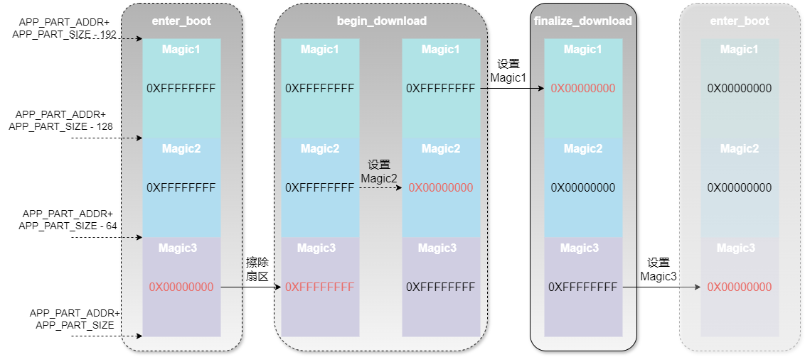
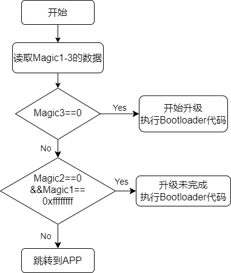

# MicorBoot简介

  MicroBoot 是一个由模块化代码组成的框架，旨在简化和加速嵌入式单片机程序的升级和开发过程。

## 1、引言

那些让人崩溃的BootLoader升级灾难

> 你有没有为写BootLoader无从下手发愁过？
>
> 你有没有为出厂的产品还需要开盖刷程序苦恼过？ 
>
> 你有没有为程序升级失败，产品变成“砖头”而抓耳挠腮过？
>
> 你有没有为升级完成后设备神秘失联而怀疑人生过？
>
> 你有没有因为固件升级Bug被老板当众灵魂拷问：“为啥烧进去就起不来了？”

**灾难 1：升级一半突然断电**

设备断电的瞬间，你的内心崩溃了：“完了，这次开机肯定黑屏。”客户还得拆机刷程序，一切从头再来。

**灾难 2：传输到99%时卡死**

传输固件时，进度条到99%停住不动——仿佛在嘲讽你：“嘿，看起来你离胜利只差一步哦。”偏偏这时客户来电：“还没好？”你只能干笑：“再给我两分钟……”

**灾难 3：现场升级，接线找不到**

客户现场的设备密不透风，调试接口深藏不露，调试工程师硬是趴在设备底下捣鼓半天：“线呢？我明明记得它在这儿啊……”

**灾难 4：升级完成后设备变“失联王”**

终于把固件刷进去，一键重启后，设备再也不响应了。就像刚被你送进冥王星：你呼唤它一万遍，它还是一言不发。

**灾难 5：老板的灵魂拷问**

你费尽心力搞定一版程序，上线后设备却不停死机。复盘会上，老板一句：“为什么烧进去就起不来了？”让你顿时哑口无言。

## 2、MicroBoot：优雅的解决升级问题

 MicroBoot就是为了解决这些灾难而生的，它是我开发的BootLoader框架，专为嵌入式单片机设备的升级而优化。从断电保护到断点续传，从校验机制到高效通信，它全面提升了升级过程的可靠性，让固件升级变得轻松愉快。

**问题1：** 固件更新完毕后从 bootloader 跳转至 APP 前需对所用的外设 deinit ，以使外设恢复至上电时的初始状态。但是当使用复杂的外设收取固件包时， deinit 也将变得复杂，甚至很难排除对 APP 的影响。因此最佳的方法是升级完固件进行软复位，再次进入bootloader在程序运行之前，先通过判断标志的方式，来直接跳转到app，这样就相当于给APP提供了一个干净的外设环境。

程序复位执行流程如下图所示：


常见方法及其局限性

> 传统的设置标志位以实现复位后保留状态的方法通常有以下两种：：
>
> - **备份寄存器**：利用芯片中的不受软件复位影响的可供用户使用的寄存器 (如 STM32 中的备份寄存器)；
>
> ​       这种方法需要额外的设置，并且因单片机型号而异，增加了跨平台兼容的难度。
>
> - **No-Init 数据段**：将标志位放在特殊的内存段（例如`.bss.noinit`），使其在复位后避免被重新初始化。
>
>   这种方法需要修改链接文件（分散加载文件），对不熟悉链接文件的开发者来说操作难度较高。
>

这两种方法都存在一定的局限性：设置复杂，且在断电情况下标志可能丢失。

**解决方案：**

MicroBoot采用了一种更优雅的“Magic Flag”方案。该方案在APP分配的FLASH空间末端设置三个标志（Magic1、Magic2、Magic3），总共占用192字节，每个标志占64字节，并根据固件升级的阶段来设置相应的标志。

| 描述                  | Magic1 （64字节） | Magic2 （64字节） | Magic3 （64字节） |
| --------------------- | ----------------- | ----------------- | ----------------- |
| **enter_bootloader**  | 0XFFFFFFFF        | 0XFFFFFFFF        | **0x00000000**    |
| **begin_download**    | **0XFFFFFFFF**    | **0x00000000**    | 0XFFFFFFFF        |
| **finalize_download** | **0x00000000**    | **0x00000000**    | 0XFFFFFFFF        |

Magic Flag在FLASH中的位置，以及变化过程如下图所示：



标志的使用阶段

**阶段1：进入Bootloader（enter_bootloader）**

- 对于全片擦除过的单片机，此时**Magic1**和**Magic2**的值为`0xFFFFFFFF`，表示还未开始下载过程，**Magic3**被设置为`0x00000000`，表明这是一个等待升级程序的状态。

```c
void enter_bootloader(void)
{
    uint32_t wData = 0;
    target_flash_write((APP_PART_ADDR + APP_PART_SIZE - MARK_SIZE), (const uint8_t *)&wData, sizeof(wData));
}
```


**阶段2：开始下载（begin_download）**

- 当固件下载开始时，MicroBoot会首先对**Magic**所在的扇区擦除，然后将**Magic2**的值设置为`0x00000000`。

- 此时，**Magic1**为`0xFFFFFFFF`，**Magic3**也保持为`0xFFFFFFFF`，这些状态便于系统在出现中断时判断下载是否已部分完成，从而支持断电续传。

```c
void begin_download(void)
{
    memset(chBootMagic, 0, sizeof(chBootMagic));
    target_flash_erase(APP_PART_ADDR + APP_PART_SIZE - (3*MARK_SIZE), 3*MARK_SIZE);
    target_flash_write((APP_PART_ADDR + APP_PART_SIZE - (2*MARK_SIZE)), chBootMagic[1], MARK_SIZE);
}
```


**阶段3：完成下载（finalize_download）**

- 当固件下载完成且数据写入成功后，MicroBoot会将**Magic1**的值设置为`0x00000000`，标志着下载过程已顺利完成。

- 此时，**Magic2**的值仍为`0x00000000`，而**Magic3**的值保持为`0xFFFFFFFF`，从而标识此阶段为下载完成、准备进入应用程序的状态。

```c
void finalize_download(void)
{
    memset(chBootMagic, 0X00, sizeof(chBootMagic));
    target_flash_write((APP_PART_ADDR + APP_PART_SIZE - 3*MARK_SIZE), chBootMagic[0], MARK_SIZE);
}
```


**阶段4：重新进入Bootloader并跳转到APP**

- 在系统完成固件升级后，MicroBoot会执行软复位，系统重新进入bootloader。

- bootloader在检查到**Magic1**和**Magic2**均为`0x00000000`，而**Magic3**为`0xFFFFFFFF`时，就会识别到这是一个升级完成的状态。

- 这时，MicroBoot无需对外设进行反初始化，而是直接跳转到APP，从而为应用程序提供一个干净的外设环境。


**阶段5：从APP再次进入Bootloader**

- 在APP正常运行后，如果想再次进入bootloader进行升级，调用MicroBoot提供的进入bootloader的接口，将会把**Magic3**设置为`0x00000000`，复位后，将会再次回到阶段1。

- 当下次进入bootloader时，看到**Magic1**、**Magic2**和**Magic3**均为`0x00000000`。


**程序复位执行流程如下图所示：**



**对应的代码：**

```c
__attribute__((constructor))
static void enter_application(void)
{
    do {
        // User-defined conditions for entering the bootloader
        if(user_enter_bootloader()){
            break;			
        }
        // Read the magic values from flash memory to determine the next action
        target_flash_read((APP_PART_ADDR + APP_PART_SIZE - 3 * MARK_SIZE), chBootMagic[0], 3 * MARK_SIZE);

        // Check if Magic3 is 0x00, indicating to read user data from a specific location
        if ((0 == *(uint32_t *)&chBootMagic[2])) {
            break;
        }

        // Check if Magic2 is 0x00 and Magic1 is 0xFFFFFFFF, indicating to read user data from a different location
        if ((0 == *(uint32_t *)&chBootMagic[1]) && (0XFFFFFFFF == *(uint32_t *)&chBootMagic[0])) {
            break;
        }
		
        // Check if the value at the address (APP_PART_ADDR + 4) has the expected application identifier
        if (((*(volatile uint32_t *)(APP_PART_ADDR + 4)) & 0xff000000) != (APP_PART_ADDR & 0xff000000)) {
            break;
        }
		
        // If all checks are passed, modify the stack pointer and start the application
        modify_stack_pointer_and_start_app(*(volatile uint32_t *)APP_PART_ADDR,
                                           (*(volatile uint32_t *)(APP_PART_ADDR + 4)));

    } while(0);	
}
```

函数修饰符 `__attribute__((constructor))`告诉编译器在程序启动时自动调用这个函数。即在主程序的 `main()` 函数之前执行，它的主要功能是检查系统当前的状态，并根据状态决定是进入APP还是停留在bootloader。代码中增加了**用户自定义的进入bootloader条件**，代码通过调用`user_enter_bootloader()`检查用户是否指定了进入bootloader模式，这个检查是为了给用户留出手动控制的空间，比如通过外部按键强制进入bootloader，如果返回值为`true`，则直接退出函数，保持在bootloader中。。


**程序升级执行流程如下图所示：**


**问题2：** 产品升级接口不固定，波特率不固定


| 描述          | 用户数据备份区（192 字节） | 用户数据区（192字节） | Magic1 （64字节） | Magic2 （64字节） | Magic3 （64字节） |
| ------------- | -------------------------- | --------------------- | ----------------- | ----------------- | ----------------- |
| 进入bootloade | 0XFFFFFFFF...              | **user_data**         | 0XFFFFFFFF        | 0XFFFFFFFF        | 0x00000000        |
| 开始下载固件  | **user_data**              | 0XFFFFFFFF...         | 0XFFFFFFFF        | 0x00000000        | 0XFFFFFFFF        |
| 固件下载完成  | **user_data**              | 0XFFFFFFFF...         | 0x00000000        | 0x00000000        | 0XFFFFFFFF        |


**问题3：** APP单独运行没有问题，通过Bootloader跳转到APP运行莫名死机


```c
#if defined (__ARMCC_VERSION) && (__ARMCC_VERSION >= 6010050)
/* Avoids the semihosting issue */
__asm("  .global __ARM_use_no_argv\n");
#elif defined(__GNUC__)
/* Disables part of C/C++ runtime startup/teardown */
void __libc_init_array (void) {}
#endif

#if defined(__CC_ARM)
__asm void modify_stack_pointer_and_start_app(uint32_t r0_sp, uint32_t r1_pc)
{
    MOV SP, R0
    BX R1
}
#elif defined(__GNUC__)
void modify_stack_pointer_and_start_app(uint32_t r0_sp, uint32_t r1_pc)
{
    uint32_t z = 0;
    __asm volatile (  "msr    control, %[z]   \n\t"
                      "isb                    \n\t"
                      "mov    sp, %[r0_sp]    \n\t"
                      "bx     %[r1_pc]"
                      :
                      :   [z] "l" (z),
                      [r0_sp] "l" (r0_sp),
                      [r1_pc] "l" (r1_pc)
                   );
}
#else
#error "Unknown compiler!"
#endif
```


**问题4：** 升级一半突然断电或者通讯收到干扰中断


**问题5：** 上位机太复杂客户不会用


## 3、MicorBoot架构

### 3.1 层次框架


### 3.2 模块化组件

- bootloader


- ymodem


- 通用Flash驱动


- 环形队列

[一个用C语言编写的支持多类型、函数重载与线程安全的环形队列](./components/queue/queue.md)

- 信号槽


- 发布订阅


- shell


- 混合数据流引擎


