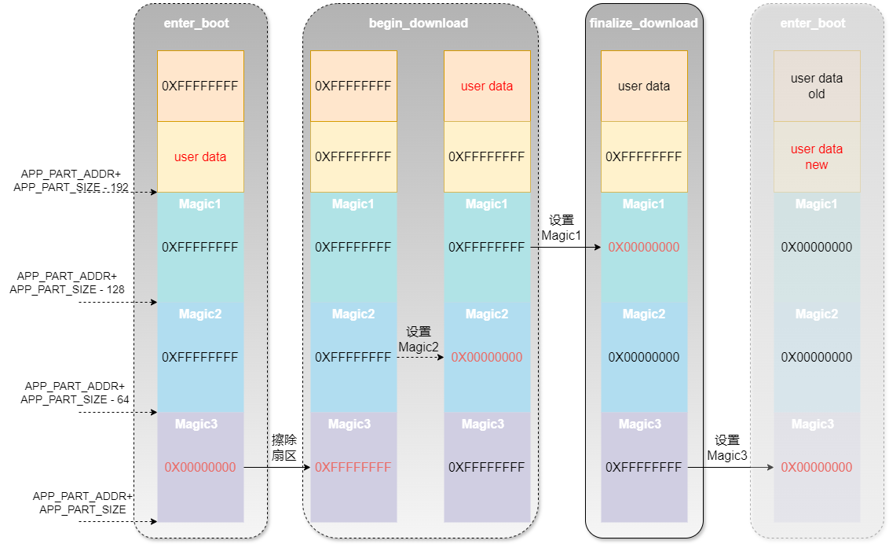

# MicroBoot简介

  MicroBoot 是一个由模块化代码组成的框架，旨在简化和加速嵌入式单片机程序的升级和开发过程。

开源地址：

github：[https://github.com/Aladdin-Wang/MicroBoot](https://github.com/Aladdin-Wang/MicroBoot)

gitee：[https://gitee.com/Aladdin-Wang/MicroBoot](https://gitee.com/Aladdin-Wang/MicroBoot)

## 1、引言

那些让人崩溃的BootLoader升级灾难

> 你有没有为写BootLoader无从下手发愁过？
>
> 你有没有为出厂的产品还需要开盖刷程序苦恼过？ 
>
> 你有没有为程序升级失败，产品变成“砖头”而抓耳挠腮过？
>
> 你有没有为升级完成后设备神秘失联而怀疑人生过？
>
> 你有没有因为固件升级Bug被老板当众灵魂拷问：“为啥烧进去就起不来了？”

**灾难 1：升级一半突然断电**

设备断电的瞬间，你的内心崩溃了：“完了，这次开机肯定黑屏。”客户还得拆机刷程序，一切从头再来。

**灾难 2：传输到99%时卡死**

传输固件时，进度条到99%停住不动——仿佛在嘲讽你：“嘿，看起来你离胜利只差一步哦。”偏偏这时客户来电：“还没好？”你只能干笑：“再给我两分钟……”

**灾难 3：现场升级，接线找不到**

客户现场的设备密不透风，调试接口深藏不露，调试工程师硬是趴在设备底下捣鼓半天：“线呢？我明明记得它在这儿啊……”

**灾难 4：升级完成后设备变“失联王”**

终于把固件刷进去，一键重启后，设备再也不响应了。就像刚被你送进冥王星：你呼唤它一万遍，它还是一言不发。

**灾难 5：老板的灵魂拷问**

你费尽心力搞定一版程序，上线后设备却不停死机。复盘会上，老板一句：“为什么烧进去就起不来了？”让你顿时哑口无言。

## 2、MicroBoot：优雅的解决升级问题

 MicroBoot就是为了解决这些灾难而生的，它是我开发的BootLoader框架，专为嵌入式单片机设备的升级而优化。从断电保护到断点续传，从校验机制到高效通信，它全面提升了升级过程的可靠性，让固件升级变得轻松愉快。

**一个稳定可靠的bootloader，是产品快速迭代的基石！**

### 问题1：bootloader 在跳转到app前没有清理干净存在的痕迹

**问题描述：** 固件更新完毕后从 bootloader 跳转至 APP 前需对所用的外设 deinit ，以使外设恢复至上电时的初始状态。但是当使用复杂的外设收取固件包时， deinit 也将变得复杂，甚至很难排除对 APP 的影响。因此最佳的方法是升级完固件进行软复位，再次进入bootloader在程序运行之前，先通过判断标志的方式，来直接跳转到app，这样就相当于给APP提供了一个干净的外设环境。

程序复位执行流程如下图所示：


常见方法及其局限性

> 传统的设置标志位以实现复位后保留状态的方法通常有以下两种：：
>
> - **备份寄存器**：利用芯片中的不受软件复位影响的可供用户使用的寄存器 (如 STM32 中的备份寄存器)；
>
> ​       这种方法需要额外的设置，并且因单片机型号而异，增加了跨平台兼容的难度。
>
> - **No-Init 数据段**：将标志位放在特殊的内存段（例如`.bss.noinit`），使其在复位后避免被重新初始化。
>
>   这种方法需要修改链接文件（分散加载文件），对不熟悉链接文件的开发者来说操作难度较高。
>

这两种方法都存在一定的局限性：设置复杂，且在断电情况下标志可能丢失。

**解决方案：**

MicroBoot采用了一种更优雅的“Magic Flag”方案。该方案在APP分配的FLASH空间末端设置三个标志（Magic1、Magic2、Magic3），总共占用192字节，每个标志占64字节，并根据固件升级的阶段来设置相应的标志。

| 描述                  | Magic1 （64字节） | Magic2 （64字节） | Magic3 （64字节） |
| --------------------- | ----------------- | ----------------- | ----------------- |
| **enter_bootloader**  | 0XFFFFFFFF        | 0XFFFFFFFF        | **0x00000000**    |
| **begin_download**    | **0XFFFFFFFF**    | **0x00000000**    | 0XFFFFFFFF        |
| **finalize_download** | **0x00000000**    | **0x00000000**    | 0XFFFFFFFF        |

Magic Flag在FLASH中的位置，以及变化过程如下图所示：


标志的使用阶段

**阶段1：进入Bootloader（enter_bootloader）**

- 对于全片擦除过的单片机，此时**Magic1**和**Magic2**的值为`0xFFFFFFFF`，表示还未开始下载过程，**Magic3**被设置为`0x00000000`，表明这是一个等待升级程序的状态。

```c
void enter_bootloader(void)
{
    uint32_t wData = 0;
    target_flash_write((APP_PART_ADDR + APP_PART_SIZE - 64), (const uint8_t *)&wData, sizeof(wData));
}
```


**阶段2：开始下载（begin_download）**

- 当固件下载开始时，MicroBoot会首先对**Magic**所在的扇区擦除，然后将**Magic2**的值设置为`0x00000000`。

- 此时，**Magic1**为`0xFFFFFFFF`，**Magic3**也保持为`0xFFFFFFFF`，这些状态便于系统在出现断电时判断下载是否已部分完成，从而支持断电续传。

```c
void begin_download(void)
{
    memset(chBootMagic, 0, sizeof(chBootMagic));
    target_flash_erase(APP_PART_ADDR + APP_PART_SIZE - (192), 3*MARK_SIZE);
    target_flash_write((APP_PART_ADDR + APP_PART_SIZE - (128)), chBootMagic[1], MARK_SIZE);
}
```


**阶段3：完成下载（finalize_download）**

- 当固件下载完成且数据写入成功后，MicroBoot会将**Magic1**的值设置为`0x00000000`，标志着下载过程已顺利完成。

- 此时，**Magic2**的值仍为`0x00000000`，而**Magic3**的值保持为`0xFFFFFFFF`，从而标识此阶段为下载完成、准备进入应用程序的状态。

```c
void finalize_download(void)
{
    memset(chBootMagic, 0X00, sizeof(chBootMagic));
    target_flash_write((APP_PART_ADDR + APP_PART_SIZE - 192), chBootMagic[0], MARK_SIZE);
}
```


**阶段4：重新进入Bootloader并跳转到APP**

- 在系统完成固件升级后，MicroBoot会执行软复位，系统重新进入bootloader。

- bootloader在检查到**Magic1**和**Magic2**均为`0x00000000`，而**Magic3**为`0xFFFFFFFF`时，就会识别到这是一个升级完成的状态。

- 这时，MicroBoot无需对外设进行反初始化，而是直接跳转到APP，从而为应用程序提供一个干净的外设环境。


**阶段5：从APP再次进入Bootloader**

- 在APP正常运行后，如果想再次进入bootloader进行升级，调用MicroBoot提供的进入bootloader的接口，将会把**Magic3**设置为`0x00000000`，复位后，将会再次回到阶段1。

- 当下次进入bootloader时，看到**Magic1**、**Magic2**和**Magic3**均为`0x00000000`。


**程序复位执行流程如下图所示：**


**对应的代码：**

```c
__attribute__((constructor))
static void enter_application(void)
{
    do {
        // User-defined conditions for entering the bootloader
        if(user_enter_bootloader()){
            break;			
        }
        // Read the magic values from flash memory to determine the next action
        target_flash_read((APP_PART_ADDR + APP_PART_SIZE - 3 * MARK_SIZE), chBootMagic[0], 3 * MARK_SIZE);

        // Check if Magic3 is 0x00, indicating to read user data from a specific location
        if ((0 == *(uint32_t *)&chBootMagic[2])) {
            break;
        }

        // Check if Magic2 is 0x00 and Magic1 is 0xFFFFFFFF, indicating to read user data from a different location
        if ((0 == *(uint32_t *)&chBootMagic[1]) && (0XFFFFFFFF == *(uint32_t *)&chBootMagic[0])) {
            break;
        }
		
        // Check if the value at the address (APP_PART_ADDR + 4) has the expected application identifier
        if (((*(volatile uint32_t *)(APP_PART_ADDR + 4)) & 0xff000000) != (APP_PART_ADDR & 0xff000000)) {
            break;
        }
		
        // If all checks are passed, modify the stack pointer and start the application
        modify_stack_pointer_and_start_app(*(volatile uint32_t *)APP_PART_ADDR,
                                           (*(volatile uint32_t *)(APP_PART_ADDR + 4)));

    } while(0);	
}
```

函数修饰符 `__attribute__((constructor))`告诉编译器在程序启动时自动调用这个函数。即在主程序的 `main()` 函数之前执行，它的主要功能是检查系统当前的状态，并根据状态决定是进入APP还是停留在bootloader。代码中增加了**用户自定义的进入bootloader条件**，代码通过调用`user_enter_bootloader()`检查用户是否指定了进入bootloader模式，这个检查是为了给用户留出手动控制的空间，比如通过外部按键强制进入bootloader，如果返回值为`true`，则直接退出函数，保持在bootloader中。。


**程序升级执行流程如下图所示：**


### 问题2： 需要 APP 传递信息给 Bootloader

**问题描述：**在一些嵌入式设备中，由于产品型号和应用场景的不同，固件升级的接口（如 UART、SPI、I2C 等）和波特率配置并不统一。这种情况下，Bootloader 无法在启动时确定应该使用的通信接口和波特率设置，因此需要从应用程序（APP）传递相关信息给 Bootloader，以便其在固件升级前做好正确的配置。

如果没有有效的机制让 APP 将接口和波特率信息传递给 Bootloader，可能会导致 Bootloader 和 APP 之间的通信不匹配，升级无法进行，甚至引发系统崩溃。

**解决方案：**

有了以上在flash中设置标志的思路，那就顺水推舟，再增加两个用户区的空间，给bootloader和app一个沟通数据的桥梁。

- **APP 参数写入**：在需要固件升级时，APP 会将接口类型、波特率等升级信息写入指定的用户数据区。

- **Bootloader 参数读取**：Bootloader 在启动时首先读取该存储区域，提取接口和波特率参数，并据此初始化通信配置。

- **兼容性检测**：如果读取的参数不符合预期，Bootloader 将回退至默认配置或停止启动，以保证通信的可靠性。

这种机制不仅灵活地适配了不同型号设备的升级需求，还提高了 Bootloader 的兼容性和稳定性。

更新后的FLASH空间如下：

| 描述                  | 用户数据备份区（192 字节） | 用户数据区（192字节） | Magic1 （64字节） | Magic2 （64字节） | Magic3 （64字节） |
| --------------------- | -------------------------- | --------------------- | ----------------- | ----------------- | ----------------- |
| **enter_bootloader**  | 0XFFFFFFFF...              | **user_data**         | 0XFFFFFFFF        | 0XFFFFFFFF        | 0x00000000        |
| **begin_download**    | **user_data**              | 0XFFFFFFFF...         | 0XFFFFFFFF        | 0x00000000        | 0XFFFFFFFF        |
| **finalize_download** | **user_data**              | 0XFFFFFFFF...         | 0x00000000        | 0x00000000        | 0XFFFFFFFF        |

用户数据在FLASH中的位置，以及变化过程如下图所示：



修改相应的代码：

**阶段1：进入Bootloader（enter_bootloader）**

- 对于全片擦除过的单片机，此时user data的值为`0xFFFFFFFF`，当APP调用`enter_bootloader`接口，将会把app传递进来的数据写进用户区。

```c
void enter_bootloader(uint8_t *pchDate, uint16_t hwLength)
{
    uint32_t wData = 0;
    target_flash_write((APP_PART_ADDR + APP_PART_SIZE - (3*MARK_SIZE) - (USER_DATA_SIZE)), pchDate, USER_DATA_SIZE);
    target_flash_write((APP_PART_ADDR + APP_PART_SIZE - MARK_SIZE), (const uint8_t *)&wData, sizeof(wData));
}
```


**阶段2：开始下载（begin_download）**

- 当固件下载开始时，MicroBoot会首先对**Magic**所在的扇区擦除，然后将**用户区**的数据重新写到**用户数据备份区**。

- 此时，**用户区**为`0xFFFFFFFF`，如果断电重启，系统将从**用户数据备份区**获取数据。

```c
void begin_download(void)
{
    memset(chBootMagic, 0, sizeof(chBootMagic));
    target_flash_erase(APP_PART_ADDR + APP_PART_SIZE - (3*MARK_SIZE), 3*MARK_SIZE);
    target_flash_write((APP_PART_ADDR + APP_PART_SIZE - (3*MARK_SIZE) - 2 * (USER_DATA_SIZE)), tUserData.msg_data.B, USER_DATA_SIZE);
    target_flash_write((APP_PART_ADDR + APP_PART_SIZE - (2*MARK_SIZE)), chBootMagic[1], MARK_SIZE);
}
```

------

**BootLoader程序复位执行的代码也要做相应的改变：**

```c
__attribute__((constructor))
static void enter_application(void)
{
    do {
		// User-defined conditions for entering the bootloader
		if(user_enter_bootloader()){
            target_flash_read((APP_PART_ADDR + APP_PART_SIZE - (3 * MARK_SIZE) - USER_DATA_SIZE), tUserData.msg_data.B, USER_DATA_SIZE);
            break;			
		}
        // Read the magic values from flash memory to determine the next action
        target_flash_read((APP_PART_ADDR + APP_PART_SIZE - 3 * MARK_SIZE), chBootMagic[0], 3 * MARK_SIZE);

        // Check if Magic3 is 0x00, indicating to read user data from a specific location
        if ((0 == *(uint32_t *)&chBootMagic[2])) {
            target_flash_read((APP_PART_ADDR + APP_PART_SIZE - (3 * MARK_SIZE) - USER_DATA_SIZE), tUserData.msg_data.B, USER_DATA_SIZE);
            break;
        }

        // Check if Magic2 is 0x00 and Magic1 is 0xFFFFFFFF, indicating to read user data from a different location
        if ((0 == *(uint32_t *)&chBootMagic[1]) && (0XFFFFFFFF == *(uint32_t *)&chBootMagic[0])) {
            target_flash_read((APP_PART_ADDR + APP_PART_SIZE - (3 * MARK_SIZE) - 2 * USER_DATA_SIZE), tUserData.msg_data.B, USER_DATA_SIZE);
            break;
        }
		
        // Check if the value at the address (APP_PART_ADDR + 4) has the expected application identifier
        if (((*(volatile uint32_t *)(APP_PART_ADDR + 4)) & 0xff000000) != (APP_PART_ADDR & 0xff000000)) {
            break;
        }
		
        // If all checks are passed, modify the stack pointer and start the application
        modify_stack_pointer_and_start_app(*(volatile uint32_t *)APP_PART_ADDR,
                                           (*(volatile uint32_t *)(APP_PART_ADDR + 4)));

    } while(0);	
}
```

**BootLoader定义了一个默认的用户数据结构体，一共192个字节，APP可以在192个字节内随意向bootloader传递数据：**

```c
// <o>The user data size
//  <i>Default: 192
#define USER_DATA_SIZE            192

typedef struct {
    char chProjectName[16];
    char chHardWareVersion[16];
    char chSoftBootVersion[16];
    char chSoftAppVersion[16];
} msgSig_t;
typedef struct {
    union {
        msgSig_t sig;
        uint8_t B[USER_DATA_SIZE];
    } msg_data;
} user_data_t;
```

**BootLoader为了方便App操作进入bootloader，并正确的传递数据，定义好了进入bootloader的接口，和操作Flash的函数，并将接口位置固定到0x08001000地址，这样APP就可以方便的操作Flash了**

```c
typedef struct {
    void (*fnEnterBootloaderMode)(uint8_t *pchDate, uint16_t hwLength);
    bool (*target_flash_init)(uint32_t addr); 
    bool (*target_flash_uninit)(uint32_t addr);
    int  (*target_flash_read)(uint32_t addr, uint8_t *buf, size_t size); 
    int  (*target_flash_write)(uint32_t addr, const uint8_t *buf, size_t size); 
    int  (*target_flash_erase)(uint32_t addr, size_t size); 
} boot_ops_t;

__attribute__((used))
static const boot_ops_t tBootOps  __attribute__ ((section(__ARM_AT(0x08001000)))) = {
    .fnEnterBootloaderMode = enter_bootloader,
    .target_flash_init = target_flash_init,
    .target_flash_erase = target_flash_erase,
    .target_flash_write = target_flash_write,
    .target_flash_read = target_flash_read,
    .target_flash_uninit = target_flash_uninit
};
```


------

**APP区代码：**

APP需要重新定义用户数据，添加需要向bootloader传递的数据。

```c
typedef struct {
    char chProjectName[16];
    char chHardWareVersion[16];
    char chSoftBootVersion[16];
    char chSoftAppVersion[16];

    /*添加用户数据*/
    char chPort1Name[16];
    int wPort1Baudrate;
    char chPort2Name[16];
    int wPort2Baudrate;
    char chPort3Name[16];
    int wPort3Baudrate;

} msgSig_t;
typedef struct {
    union {
        msgSig_t sig;
        char B[sizeof(msgSig_t)];
    } msg_data;
} user_data_t;

user_data_t  tUserData = {
    .msg_data.sig.chProjectName = "project",
    .msg_data.sig.chHardWareVersion = HARDWARE_VERSION,
    .msg_data.sig.chSoftBootVersion = BOOTWARE_VERSION,
    .msg_data.sig.chSoftAppVersion =  SOFTWARE_VERSION,
};

typedef struct {
    void (*fnGoToBoot)(uint8_t *pchDate, uint16_t hwLength);
    bool (*target_flash_init)(uint32_t addr);
    bool (*target_flash_uninit)(uint32_t addr);
    int  (*target_flash_read)(uint32_t addr, uint8_t *buf, size_t size);
    int  (*target_flash_write)(uint32_t addr, const uint8_t *buf, size_t size);
    int  (*target_flash_erase)(uint32_t addr, size_t size);
} boot_ops_t;
```

比如通过CAN接口来升级程序，就可以这样做：

```c
void can_boot()
{
    rt_memcpy(tUserData.msg_data.sig.chPort1Name, "CAN1", rt_strlen("CAN1"));
    tUserData.msg_data.sig.wPort1Baudrate = 500000;
    boot_ops_t *ptBootOps = (boot_ops_t *) 0x08001000;
    ptBootOps->fnGoToBoot((uint8_t *)tUserData.msg_data.B, sizeof(tUserData));
    rt_hw_cpu_reset();
}
MSH_CMD_EXPORT(can_boot, go to bootloader);
```

比如通过UART接口来升级程序，就可以这样做：

```c
void uart_boot()
{
    rt_memcpy(tUserData.msg_data.sig.chPort1Name, "UART1", rt_strlen("UART1"));
    tUserData.msg_data.sig.wPort1Baudrate = 115200;
    boot_ops_t *ptBootOps = (boot_ops_t *) 0x08001000;
    ptBootOps->fnGoToBoot((uint8_t *)tUserData.msg_data.B, sizeof(tUserData));
    rt_hw_cpu_reset();
}
MSH_CMD_EXPORT(uart_boot, go to bootloader);
```


### 问题3： APP单独运行没有问题，通过Bootloader跳转到APP运行莫名死机

**问题描述：**在近几年的嵌入式社区中，流传着不少关于面相**Cortex-M**的**Bootloader**科普文章，借助这些文章，一些较为经典的代码片断和技巧得到了广泛的传播。

在从**Bootloader**跳转到用户**APP**的过程中，使用函数指针而非传统的汇编代码则成了一个家喻户晓的小技巧。相信类似下面 **JumpToApp()** 函数，你一定不会感到陌生：

```c
typedef  void (*pFunction)(void);

void JumpToApp(uint32_t addr)
{
  pFunction Jump_To_Application;

  __IO uint32_t StackAddr;
  __IO uint32_t ResetVector;
  __IO uint32_t JumpMask;

  JumpMask = ~((MCU_SIZE-1)|0xD000FFFF);

  if (((*(__IO uint32_t *)addr) & JumpMask ) == 0x20000000) //�ж�SPָ��λ��
  {
    StackAddr = *(__IO uint32_t*)addr;
    ResetVector = *(__IO uint32_t *)(addr + 4);

    __set_MSP(StackAddr); 
    Jump_To_Application = (pFunction)ResetVector;
    Jump_To_Application(); 
  }
}
```

但是这段家喻户晓，被世人奉为真理的代码，却隐藏着很深的BUG，相信很多小伙伴都遇到过通过Bootloader跳转到APP后，程序时好时坏的灵异事件，具体详情请看这篇文章：[震惊！这个隐藏的Bootloader漏洞究竟有多少人中招？](https://mp.weixin.qq.com/s/uVktPkcbh2XAVo2QAluxnA)

**解决方案：**

完全用汇编来处理从**Bootloader**到**App**的最后步骤，才是最稳定可靠的方案：

```c
#if defined (__ARMCC_VERSION) && (__ARMCC_VERSION >= 6010050)
/* Avoids the semihosting issue */
__asm("  .global __ARM_use_no_argv\n");
#elif defined(__GNUC__)
/* Disables part of C/C++ runtime startup/teardown */
void __libc_init_array (void) {}
#endif

#if defined(__CC_ARM)
__asm void modify_stack_pointer_and_start_app(uint32_t r0_sp, uint32_t r1_pc)
{
    MOV SP, R0
    BX R1
}
#elif defined(__GNUC__)
void modify_stack_pointer_and_start_app(uint32_t r0_sp, uint32_t r1_pc)
{
    uint32_t z = 0;
    __asm volatile (  "msr    control, %[z]   \n\t"
                      "isb                    \n\t"
                      "mov    sp, %[r0_sp]    \n\t"
                      "bx     %[r1_pc]"
                      :
                      :   [z] "l" (z),
                      [r0_sp] "l" (r0_sp),
                      [r1_pc] "l" (r1_pc)
                   );
}
#else
#error "Unknown compiler!"
#endif
```

### 问题4： 固件升级过程中频繁中断

**问题描述：**在固件升级过程中，由于通信信号不稳定或数据包丢失，传输可能会频繁中断，导致升级失败。用户常常需要多次尝试才能成功完成固件升级，特别是对于大文件传输，这种情况不仅耗时还影响体验。

**解决方案：**

为了提高传输稳定性，我采用状态机的方式重新开发了 ymodem 协议。此改进后的 ymodem 通过精细管理传输状态，使其更具稳定性和效率，即便在传输过程中断线，也能在超时前重新连接后继续传输，无需重新开始。

1. **ymodem 传输协议**：ymodem 提供了文件校验和分段传输机制，提高了传输过程的鲁棒性。
2. **自动重试机制**：ymodem 协议中带有重试机制，确保每个数据包在成功接收前会自动重发，以提升传输成功率。


### 问题5： 上位机操作过于复杂，客户难以使用

**问题描述：**对于许多客户，传统上位机操作系统设计复杂且需要较高的技术水平，操作不当还可能导致设备升级失败。这不仅增加了技术支持成本，也降低了客户满意度，尤其对于不具备技术背景的用户而言，升级流程显得尤为繁琐。

**解决方案：**

为了解决客户的操作复杂度问题，我开发了专门的 MicroLink 工具，使固件升级过程简单直观。

MicroLink 是一款多功能嵌入式系统开发工具，专为加速和简化开发者在 **研发、调试、量产和售后服务** 各阶段的工作流程设计。与改进后的 ymodem 结合使用时，MicroLink 能显著提升升级体验：

- **拖放式升级**：用户只需将固件文件拖放至 MicroLink 提供的虚拟 U 盘，即可自动完成传输和安装。

- **稳定的断点续传支持**：借助重新开发的 ymodem 协议，即使传输中断，也能自动在恢复后继续传输，避免重复操作。

拖放式升级演示视频如下：

<iframe src="https://player.bilibili.com/player.html?bvid=BV1CcsWeoE5o" scrolling="no" border="0" frameborder="no" framespacing="0" allowfullscreen="true" width="640" height="480"> </iframe>


## 3、MicroBoot架构

### 3.1 层次框架


### 3.2 模块化组件

- bootloader


- ymodem

[一个使用状态机编写的ymodem协议](./components/ymodem/ymodem.md)

- 统一的Flash驱动管理模块


- 环形队列

[一个用C语言编写的支持多类型、函数重载与线程安全的环形队列](./components/queue/queue.md)

- 信号槽

[一个用C语言模拟QT的信号槽的功能](./components/signals_slots/signals_slots.md)

- 发布订阅


- shell


- 混合数据流引擎


## 4、MicroBoot移植教程

- [基于 CMSIS-PACK 移植](./quick-start/cmsis-pack.md)
- [基于源码移植](./quick-start/quick-start.md)
- [基于rtthread软件包移植](./quick-start/RT-Thread.md)
- [移植常见问题](./quick-start/troubleshooting.md)
