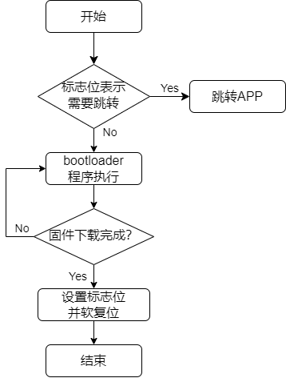

# MicorBoot简介

  MicroBoot 是一个由模块化代码组成的框架，旨在简化和加速嵌入式单片机程序的升级和开发过程。

## 1、引言

那些让人崩溃的BootLoader升级灾难

> 你有没有为写BootLoader无从下手发愁过？
>
> 你有没有为出厂的产品还需要开盖刷程序苦恼过？ 
>
> 你有没有为程序升级失败，产品变成“砖头”而抓耳挠腮过？
>
> 你有没有为升级完成后设备神秘失联而怀疑人生过？
>
> 你有没有因为固件升级Bug被老板当众灵魂拷问：“为啥烧进去就起不来了？”

**灾难 1：升级一半突然断电**

设备断电的瞬间，你的内心崩溃了：“完了，这次开机肯定黑屏。”客户还得拆机刷程序，一切从头再来。

**灾难 2：传输到99%时卡死**

传输固件时，进度条到99%停住不动——仿佛在嘲讽你：“嘿，看起来你离胜利只差一步哦。”偏偏这时客户来电：“还没好？”你只能干笑：“再给我两分钟……”

**灾难 3：现场升级，接线找不到**

客户现场的设备密不透风，调试接口深藏不露，调试工程师硬是趴在设备底下捣鼓半天：“线呢？我明明记得它在这儿啊……”

**灾难 4：升级完成后设备变“失联王”**

终于把固件刷进去，一键重启后，设备再也不响应了。就像刚被你送进冥王星：你呼唤它一万遍，它还是一言不发。

**灾难 5：老板的灵魂拷问**

你费尽心力搞定一版程序，上线后设备却不停死机。复盘会上，老板一句：“为什么烧进去就起不来了？”让你顿时哑口无言。

## 2、MicroBoot：优雅的解决升级问题

 MicroBoot就是为了解决这些灾难而生的，它是我开发的BootLoader框架，专为嵌入式单片机设备的升级而优化。从断电保护到断点续传，从校验机制到高效通信，它全面提升了升级过程的可靠性，让固件升级变得轻松愉快。

**问题1：** 固件更新完毕后从 bootloader 跳转至 APP 前需对所用的外设 deinit ，以使外设恢复至上电时的初始状态。但是当使用复杂的外设收取固件包时， deinit 也将变得复杂，甚至很难排除对 APP 的影响。因此最佳的方法是升级完固件进行软复位，再次进入bootloader在程序运行之前，先通过判断升级完成标志的方式，来直接跳转到app，这样就相当于给APP提供了一个干净的外设环境。

固件升级流程如下图所示：



设置标志位的方法通常有两种方式：

- 利用芯片中的不受软件复位影响的可供用户使用的寄存器 (如 STM32 中的备份寄存器)；

这种方式需要用户手动增加备份寄存器的代码，对于不同的单片机软件适配工作量大。

- 修改分散加载文件，增加不被复位初始化的 ".**bss.noinit**" RAM数据段。

这种方式需要用户手动更改分散加载文件，对于不熟悉分散加载文件的人来说，直接劝退。


既然上述两种方式都不尽如人意，有没有更优雅的方案呢，当然有！

**解决方案：**


| 描述               | Magic1 （64字节） | Magic2 （64字节） | Magic3 （64字节） |
| ------------------ | ----------------- | ----------------- | ----------------- |
| 进入bootloader标志 | 0XFFFFFFFF        | 0XFFFFFFFF        | **0x00000000**    |
| 开始下载固件标志   | **0XFFFFFFFF**    | **0x00000000**    | 0XFFFFFFFF        |
| 下载完成标志       | **0x00000000**    | **0x00000000**    | 0XFFFFFFFF        |


程序复位执行流程如下图所示：


app进入bootloader，通过调用enter_bootloader接口，设置Magic3 标志为**0x00000000**,然后复位单片机。

```c
void enter_bootloader(void)
{
    uint32_t wData = 0;
    target_flash_write((APP_PART_ADDR + APP_PART_SIZE - 64), (const uint8_t *)&wData, sizeof(wData));
}
```

程序升级执行流程如下图所示：


**问题2：** 产品升级接口不固定，波特率不固定


| 描述               | 用户数据备份区（192 字节） | 用户数据区（192字节） | Magic1 （64字节） | Magic2 （64字节） | Magic3 （64字节） |
| ------------------ | -------------------------- | --------------------- | ----------------- | ----------------- | ----------------- |
| 进入bootloader标志 | 0XFFFFFFFF...              | user_data             | 0XFFFFFFFF        | 0XFFFFFFFF        | 0x00000000        |
| 开始下载固件标志   | user_data                  | 0XFFFFFFFF...         | 0XFFFFFFFF        | 0x00000000        | 0XFFFFFFFF        |
| 下载完成标志       | user_data                  | 0XFFFFFFFF...         | 0x00000000        | 0x00000000        | 0XFFFFFFFF        |


**问题3：** APP单独运行没有问题，通过Bootloader跳转到APP运行莫名死机


```c
#if defined (__ARMCC_VERSION) && (__ARMCC_VERSION >= 6010050)
/* Avoids the semihosting issue */
__asm("  .global __ARM_use_no_argv\n");
#elif defined(__GNUC__)
/* Disables part of C/C++ runtime startup/teardown */
void __libc_init_array (void) {}
#endif

#if defined(__CC_ARM)
__asm void modify_stack_pointer_and_start_app(uint32_t r0_sp, uint32_t r1_pc)
{
    MOV SP, R0
    BX R1
}
#elif defined(__GNUC__)
void modify_stack_pointer_and_start_app(uint32_t r0_sp, uint32_t r1_pc)
{
    uint32_t z = 0;
    __asm volatile (  "msr    control, %[z]   \n\t"
                      "isb                    \n\t"
                      "mov    sp, %[r0_sp]    \n\t"
                      "bx     %[r1_pc]"
                      :
                      :   [z] "l" (z),
                      [r0_sp] "l" (r0_sp),
                      [r1_pc] "l" (r1_pc)
                   );
}
#else
#error "Unknown compiler!"
#endif
```


**问题4：** 升级一半突然断电或者通讯收到干扰中断


**问题5：** 上位机太复杂客户不会用


## 3、MicorBoot架构

### 3.1 层次框架


### 3.2 模块化组件

- bootloader


- ymodem


- 通用Flash驱动


- 环形队列


- 信号槽


- 发布订阅


- shell


- 混合数据流引擎


