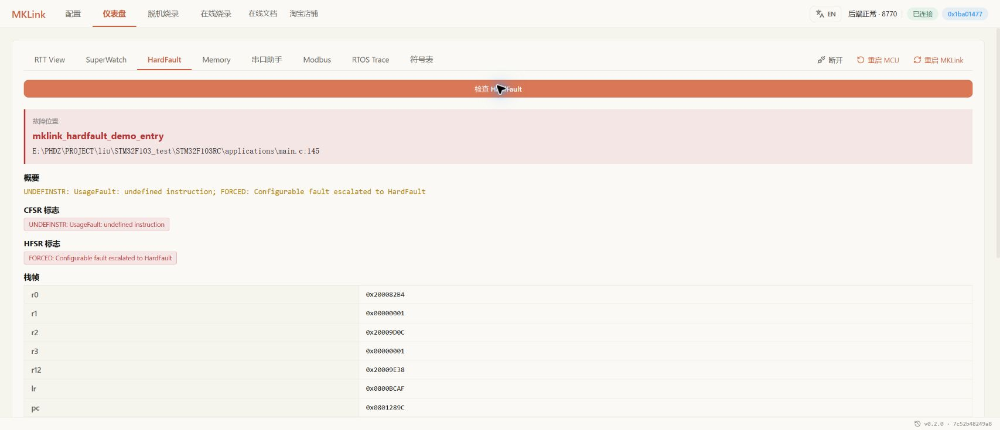
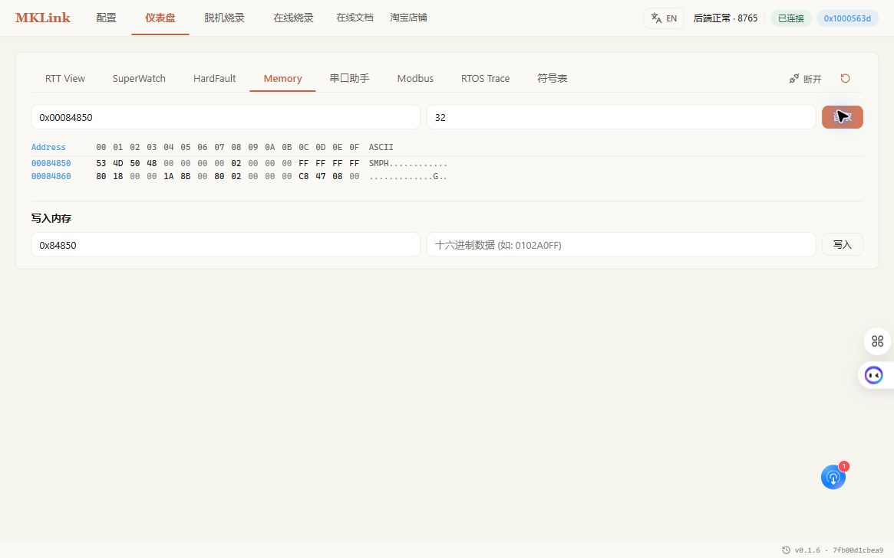

# HardFault / RISC-V Trap：从现场找到出错代码

程序进入异常时，先保留现场，再查原因。复位或重新下载可能清除异常状态，让最有用的信息消失。

> 程序进异常了，先保存现场，找到对应代码，看看是什么原因。

## Cortex-M：打开 HardFault 检查

在“配置”中加载与板上固件匹配的 AXF/ELF，连接目标后进入 **仪表盘 → HardFault**。点击检查，查看异常状态；有有效异常栈时，进一步解码指令地址和返回位置。

让 AI 对照源码查看该位置正在访问什么数据、使用什么指针。自动扫描得到的候选函数名，需要与寄存器和调用路径一起判断。

## 常见状态怎样理解

| 状态 | 通常说明什么 | 接着检查 |
| --- | --- | --- |
| 指令访问违规 | 执行地址或权限有问题 | 函数指针、返回地址和栈是否被破坏 |
| 数据访问违规 | 读写地址或权限有问题 | 指针、数组边界和内存保护配置 |
| 总线错误 | 某次访问未被正确完成 | 访问地址、外设状态和有效的故障信息 |
| 未对齐或除零 | 指令触发了对应异常条件 | 数据布局、运算输入和异常配置 |

并非每次异常都留下有效故障地址。RTOS 的异常入口也可能额外保存寄存器，要按实际栈布局解码。异常位为零，只说明当前没有相应保留状态，不能证明程序从未异常。

## HPM：查看 RISC-V Trap

HPM 使用 RISC-V，不能套用 Cortex-M 的寄存器。需要保留异常原因、出错指令位置和相关状态，再结合 ELF 与源码分析。

| 现场信息 | 用来判断什么 |
| --- | --- |
| mcause | 中断或异常的原因 |
| mepc | 异常发生的位置 |
| mtval | 对应异常可能提供的地址或指令信息 |
| mstatus 与堆栈 | 进入异常时的状态和调用线索 |

配套故障演示将 Trap 信息保存在 RAM 中，可通过 Memory 读取，再按符号定位。自己的工程也应先提供可读取的现场保存方式。

*HPM5301 故障演示的实际画面，地址以当前工程为准。*

## 修复后，回到相同条件再试一次

> 修复后重新编译下载，按刚才的操作复测，再确认任务计数继续增长。

程序重启只是恢复运行；原来的输入或操作不再引发故障，才是修复的依据。对于会被看门狗快速复位的产品，应在工程中设计现场保存，不依赖临时打开窗口抢读。

[用 AI 定位异常](../../embedded-ai/workflows/hardfault-workflow.md) · [STM32 实战](../../embedded-ai/cases/stm32f103-rt-thread.md) · [HPM 实战](../hpm/overview.md)
