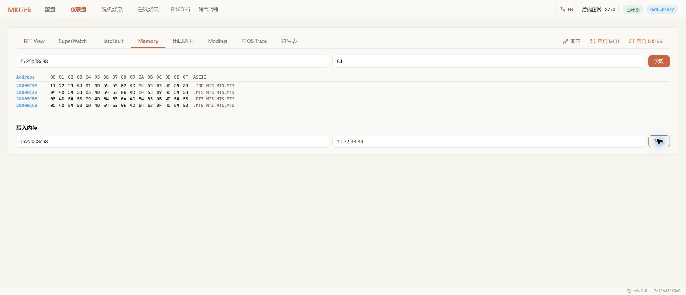

# Memory：查看变量背后的原始数据

想知道变量现在是多少，优先按名字读取；想核对缓冲区内容、相邻字段和内存布局，再打开 Memory。

> 找到这个接收缓冲区，看看内容和长度对不对。

## 按当前工程找到地址

变量地址由当前 AXF/ELF 或 MAP 确认。重新编译、改优化或调整链接布局后，地址可能变化，不照抄旧截图中的数值。

在 **仪表盘 → Memory** 输入起始地址和长度，点击读取。结合十六进制与 ASCII 查看内容；解释变量时同时核对类型、宽度和字节序。

*截图使用工程预留的测试数组。*

## 需要改值时，先保留原值

只操作工程里明确允许调整的变量或测试区。写入前记录原值，写后回读确认；试验结束后恢复，或将确认有效的参数保存进工程。

> 备份这个测试数组，写入后读回来检查，最后恢复原内容。

如果写完立即变回去，可能是任务或中断正在更新它。多个运行变量先后读取，也不保证来自同一时刻。

## 外设状态怎么查

有匹配的芯片描述时，可在 **SuperWatch → 芯片外设** 按寄存器和字段查看。需要手动地址时，让 AI 对照准确型号的参考资料确认。

> 检查 DMA 的传输计数和缓冲区，看看数据为什么不再更新。

只读状态、读后清零和写 1 清零的寄存器，处理方式不同；不要随意试写。需要精确的大整数值时查看读取结果，避免只从浮点曲线反推。

## 常见问题

| 现象 | 先检查 |
| --- | --- |
| 读到全 0 或全 FF | 地址、目标供电和运行状态 |
| 数值和预期不同 | 符号是否匹配、变量类型和字节序 |
| 外设读取报错 | 芯片型号、外设时钟和访问宽度 |
| 写入后马上变化 | 是否被程序周期更新，或选错了对象 |

连续看变化使用 [SuperWatch](../observation/superwatch.md)。让 AI 帮忙查变量、数组和寄存器，看[变量与内存工作流](../../embedded-ai/workflows/memory-workflow.md)。
