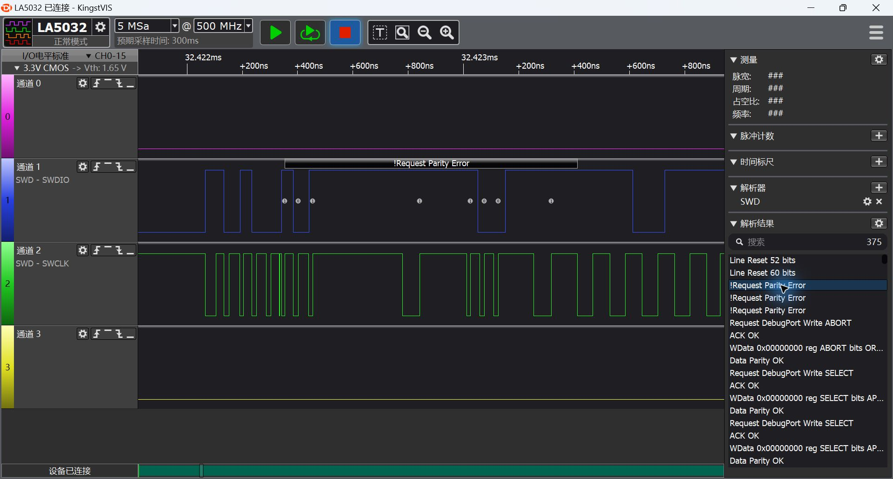

# STM32H743 高速采集、AI 调参与脱机下载验证记录

测试日期：2026-09-19 至 2026-09-20。目标为 STM32H743IITx（2 MiB Flash），下载器为 HPMLink V4。本文保存测试过程，宣传文章只引用已通过的结果。

## 镜像与计时

2 MiB BIN 从 0x08000000 开始，包含可启动程序与确定性填充。镜像 SHA-256：`4d3cbd7364748c47f5099a1e572639c8754757caa42eb4fa2033848b923c770a`。

BIN 脱机路径依次执行覆盖扇区擦除、连续编程、完整回读校验。阶段时间包含相应文件读取与目标访问；进度变化时的 30 ms 刷新等待计入总时间。总时间不含复制文件和建立编程会话。HEX 路径单独验证，不能套用 BIN 三阶段计时。

| 10 MHz · 2 MiB | 时间 | 速度 |
| --- | ---: | ---: |
| 擦除 | 29.756621 s | 不适用 |
| 写入 | 23.595919 s | 86.795 KiB/s |
| 完整校验 | 4.758660 s | 430.373 KiB/s |
| 擦写校验及进度刷新 | 60.567490 s | 33.813 KiB/s |

固件完整校验通过，另由主机回读全部 2 MiB 并逐字节比较通过。主机串口文本回读耗时不计入上述固件计时。

1025 字节尾页测试通过：有效数据相符，页内剩余部分为 0xFF。非页对齐起始地址与超出 Flash 末端的镜像在擦除前拒绝，原有哨兵数据保持。HEX 下载、回读和程序计数递增也已通过。

## 20/30 MHz 稳定性复测（更新至 2026-09-20）

用户移除目标板 SWD 线路上的 TVS 后，原有校准时序在 20/30 MHz 均通过基本 RAM 访问。正式固件没有保留逐位屏障等诊断时序变体。该板的前后对照说明线路负载值得检查，但不能据此断言所有 TVS 都不能用于高速 SWD。

每档完成五轮 2 MiB 擦除、写入和完整校验，其中一轮另由主机独立回读全部 2 MiB 并逐字节比较通过。下表为最后连续三轮的均值：

| SWD 档位 | 擦除 | 写入 | 校验 | 总时间（含进度刷新） | 单独写入 | 擦写校验综合 |
| --- | ---: | ---: | ---: | ---: | ---: | ---: |
| 20 MHz | 29.612 s | 22.224 s | 3.603 s | 57.902 s | 92.15 KiB/s | 35.37 KiB/s |
| 30 MHz | 29.565 s | 21.642 s | 3.241 s | 56.908 s | 94.63 KiB/s | 35.99 KiB/s |

算法：Pack 提供的 `STM32H7x_2048.FLM`，SHA-256 为 `a3ee4764dd6e75ea1fcce835d7400c64f757a29ead59173230573fdf0f8949ca`。不将高频 RAM 吞吐当作 Flash 编程吞吐。

## 写入耗时定位

30 MHz 下，2048 次 ProgramPage 的数据搬运约 2.423 秒；包括 Init/UnInit 在内的 2050 次算法调用，准备约 0.916 秒、等待目标算法约 17.063 秒、收尾约 0.158 秒。等待 FLM 完成占写入阶段约 79%。页数据进入目标 RAM 后，实际 Flash 编程仍由目标 CPU 执行算法、等待片内 Flash 控制器完成。

只用于定位瓶颈的独立 x64 并行度实验算法完成一次 2 MiB 三阶段校验：擦除 13.777480 秒，写入 10.021337 秒，校验 3.240097 秒，总计 29.490357 秒。它没有覆盖 Pack 原文件，也没有作为正式默认算法发布；一次成功不能替代算法适配与长期验证。宣传文章采用上面的标准 Pack 算法结果。

## 软件与运行验证

恢复带 PID 软件模型、错相正弦波和 RTT 的演示 HEX 后，编译为零错误、零警告，下载及主机回读通过；间隔读取运行计数得到不同值，确认应用持续运行。PID 是目标 MCU 上执行的闭环软件模型，不连接实际电机。

## 测试证据

原始 JSON、日志、BIN、实验 FLM 与脚本保存在目标工程 `.mklink/arm-article/`。核心结果文件：`offline-stability-summary.json`、`tvs-removed-20m-repeat.json`、`tvs-removed-30m-repeat.json`、`arm-profile-30m.json`、`arm-x64-lab-30m.json`、`no-drag-hex-smoke.json`。

下图保留的是移除 TVS **之前**的失败记录，不能当作高速链路通过截图：

## 2026-09-20 RAM 与共享流补测

目标程序观测区位于非缓存 AXI RAM。mem_dump 每项采集约 12 秒，主机持续速度含启动、停止；逐样本对照确定性内存内容。4/16/4096 B 三种大小在 20 MHz 与 30 MHz 均为零内容不匹配、零 CRC 错误、零解析丢帧、零固件丢样标记。启动文本前缀被解析器丢弃的字节不作为样本丢失。

| 档位 | 大小 | 完整样本数 | 主机持续速度 | 样本时间戳口径 |
| --- | ---: | ---: | ---: | ---: |
| 20 MHz | 4 B | 497231 | 41119.23 次/s | 42632.42 次/s |
| 20 MHz | 16 B | 319877 | 26451.14 组/s | 27310.53 组/s |
| 20 MHz | 4096 B | 2454 | 811.52 KiB/s | 209.65 块/s |
| 30 MHz | 4 B | 541960 | 44814.31 次/s | 46299.97 次/s |
| 30 MHz | 16 B | 372034 | 30759.87 组/s | 31770.05 组/s |
| 30 MHz | 4096 B | 2918 | 965.00 KiB/s | 249.23 块/s |

RAM 写入指标采用脱机 profiling 的 2048×1 KiB 页数据搬运：20 MHz 2.832544 s、30 MHz 2.422455 s，分别 723.02/845.42 KiB/s。它不包含 Flash 执行等待，与主机 mem_dump 端到端指标不是同一口径。主机通用 write_memory 的大块写测试因文本分块路径过慢被终止，未形成可引用结果；随后复位目标恢复确定性数据，并重新完成 30 MHz 读取验证。

PID 通过 Web GUI 后端采集，AI 仅订阅同一 WebSocket 广播，不占用第二个探针连接。前后各 16 秒、420108/420600 组，RMS 为 12.276314542/4.036483937，降低 67.12%；峰值 38.611885/39.463631，不宣称峰值改善。Kp/Ki 从 0.4/1 调到 2/10，回读验证通过。两次流序号均连续，统计包含周期性元数据帧。图仅对展示数据每 50 点保留一条，RMS 使用全量采集值。

原始文件：`ram-performance-0920.json`、`ram-performance-30m-0920.json`、`pid-before-0920.json`、`pid-after-0920.json`、`pid-parameter-readback-0920.json`。各文件位于目标工程 `.mklink/arm-article/`，本报告配套的 `stm32h743-0920-data.json` 保存紧凑统计。

RTT 上行收到递增 tick/counter；下行 API 接受发送，但此次 SSE 取证未拿到回显，不能据此宣称双向验证完成。SystemView 未作为本轮通过项目。真实浏览器录屏受工具安全检查阻塞，用户同意后补；主文章使用用户提供的实机截图及真实数据绘图，不生成模拟 GUI 动画。移除 TVS 后成功链路的逻辑分析仪时钟截图仍需补录，当前文章以请求档位标注频率。
