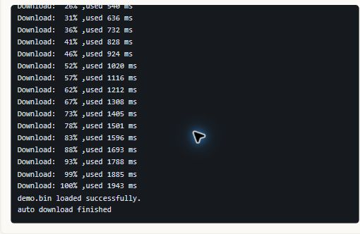

# 脱机下载：准备一次，接板就能烧

把固件、器件配置和需要的算法保存到 MKLink，之后就可以脱离电脑重复下载。它适合小批量生产、返修和现场升级。

先用同一份固件完成一次[在线烧录](online-flash.md)，确认地址和程序运行正常，再准备脱机任务。

## 先把任务准备好

打开 **脱机烧录**，按顺序完成：

1. **选器件**：按实际芯片选择下载算法。可使用匹配的 Pack、本地 FLM 或下载器 U 盘中已有的文件；HPM 使用 ROM API，无需 FLM。
2. **选固件**：加入 BIN/HEX，核对地址。多个镜像按工程需要安排，保留 BootLoader 或参数区时确认擦写范围。
3. **设任务**：V4 可以使用便于识别的任务名；第一次将执行次数设为 1。
4. **生成并部署**：点击“生成预览”，核对文件、地址和次数，再“部署到 U 盘”。

默认按扇区擦除。只有明确需要清空整片 Flash 时才选择全片擦除，它会删除相应内容，也可能明显增加烧录时间。

## 先执行一遍，再交给工位

点击 **触发测试**，观察执行日志。部署成功说明文件存进下载器，实际下载和校验完成后，还要确认板子的程序能够运行。

> 把刚验证过的程序做成脱机任务，执行一次，再看看系统节拍和任务计数。

## HPM 怎样配置

选择准确器件、板型和 BIN，核对镜像基址后生成任务。示例 HPM5301 的配置如下，换工程后以实际构建结果为准。

[HPM 实战文章](../hpm/overview.md)同时介绍在线下载、波形和 RTT 交互。

## 拿走电脑以后怎样用

**V3 / V4**：接好目标板和电源，按下载器外壳按键执行，查看指示或屏幕中的结果。V4 使用多个任务时，先确认当前选中的是哪个。

**工装触发**：按对应型号的接口定义接入。V2 无独立按键，可通过 TDI/GND 触发，TDO 提供结果提示；接工装前核对电平和触发要求。

连续工作时，完成一块再换下一块，留意任务是在等待接入还是等待上一目标断开。执行中不要拔线或切断目标电源，失败后先查看原因。

## 常见问题

| 现象 | 检查什么 |
| --- | --- |
| 没找到下载器 U 盘 | 数据线、磁盘挂载和 MICROKEEN 卷标 |
| 找不到算法 | 精确芯片型号和算法覆盖范围，必要时导入厂家 FLM |
| 等待目标超时 | 目标供电、调试线、地线和复位连接 |
| 烧录完成但不启动 | 镜像地址、启动配置、校验结果和运行状态 |
| 任务还是旧程序 | 重新部署当前固件，确认选中的任务 |

[用 AI 准备脱机任务](../../embedded-ai/workflows/offline-workflow.md) · [固件升级](firmware-upgrade.md)
