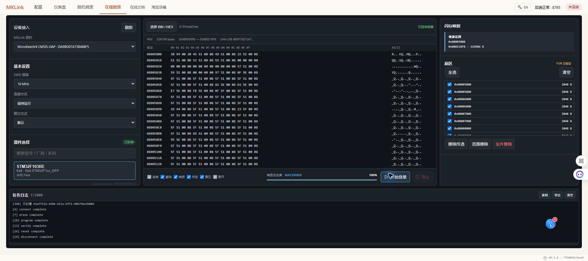

# 在线编译与烧录

有完整工程，就使用工程已有的工具链编译下载；手里已有固件，也可以直接在 Web GUI 烧录。完成后检查校验结果，再确认程序运行。

> 把程序编译并下载，看看系统节拍和任务计数有没有在走。

AI 操作与运行检查的实际对话见[编译、下载与运行检查](../../embedded-ai/workflows/flash-workflow.md)。

## 使用现有 IDE 工程

在 Keil、IAR 等兼容工具中选择 MKLink 对应的调试接口，核对构建目标和下载算法，编译后下载。也可由 AI 使用工程原有工具链完成。

工程带有 BootLoader 或参数区时，先核对应用范围，不用整片擦除代替地址检查。

## 在网页里下载 BIN / HEX

1. 打开 **在线烧录**，选择连接的 MKLink 与精确芯片型号。
2. 需要芯片 Pack 时，安装或导入对应描述和算法。
3. 点击“选择 BIN / HEX”加载固件。BIN 填写工程实际下载基址，HEX 使用文件中的地址。
4. 检查镜像范围，开始烧录，等待作业完成并确认校验通过。

重新编译后，自动跟踪的文件可更新内容；普通上传或拖入的文件快照要重新选择。加载新文件不会自动开始烧录。

## HPM 使用 ROM API

选择准确 HPM 型号和板卡，再选编译生成的 BIN。**HPM 不需要选择 FLM。** 示例使用的 `0x80000400` 是该镜像的基址，自己的工程以构建结果为准。

完整使用方法见[MKLink × 先楫 HPM](../hpm/overview.md)。

## 下载后确认什么

校验通过说明写入内容经过检查，接着看系统节拍、任务计数或业务响应。更新匹配的 AXF/ELF 后，就能继续观察变量。

页面提示设备被占用时，先停止 RTT、SuperWatch 或 RTOS Trace。烧录显示“停止中”时，等待操作结束和设备释放，再进行下一项任务。

程序确认好后，可继续[准备脱机下载](offline-flash.md)。
