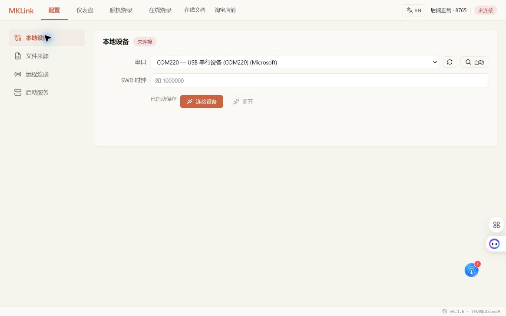

# 连接硬件，加载当前工程

在 **配置** 页面连接 MKLink，再选择与目标程序匹配的符号文件，就可以按变量名看曲线和查状态。

## 先接好调试线

STM32 示例使用 SWD，连接 SWDIO、SWCLK 和 GND，需要复位控制时连接 RST。HPM 示例使用 JTAG，按开发板接口定义连接。供电按实际板卡确认：目标板已经供电时，避免再接一路供电输出。

不确定板型或引脚，可以先告诉 AI 板卡型号，让它核对接线。

## 在配置页连接

在“本地设备”中自动搜索，或选择当前 MKLink 端口，点击“连接设备”。

在“文件来源”中选择当前构建的 AXF/ELF/OUT。它包含变量地址和类型，也可用于源码定位和 RTT 地址查找；正常使用不需要额外手工加载 MAP。

固件镜像用于下载，符号文件用于解释数据，两者必须对应同一次构建。只有 BIN/HEX 时可以烧录；想按名字查变量，还需要配套符号文件。

## 重新编译以后怎么办

看配置页的文件状态：

- **自动跟踪**：原文件变化后可重新加载符号，确认加载完成再观察。
- **文件快照**：需要重新选择最新文件。支持文件访问授权的浏览器，在刷新或关闭页面后也可能需要重新授权。

重载符号会停止相关采集，不会自动烧录新程序。先完成下载，再开始新一轮观察。

## 也可以一句话交给 AI

> 加载这个工程刚编译好的符号文件，连接板子，打开 SuperWatch。

[在线烧录](../flashing/online-flash.md) · [SuperWatch](../observation/superwatch.md) · [第一次让 AI 接手工程](../../embedded-ai/getting-started/first-project.md)
