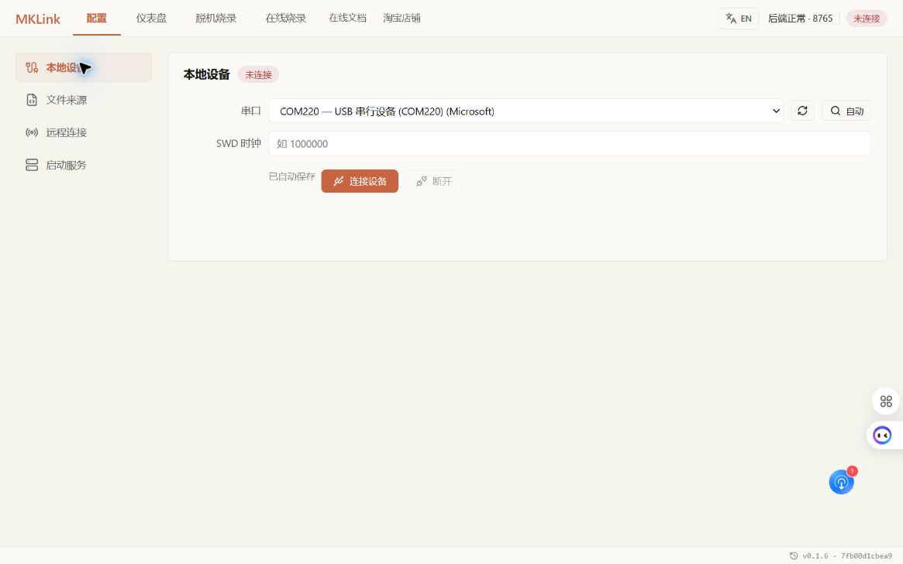
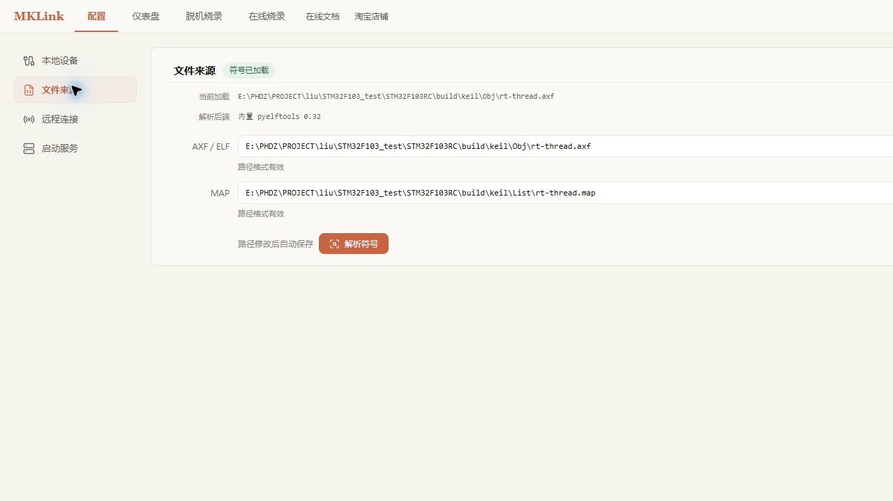

# 连接硬件，加载当前工程

在 **配置** 页面连接 MKLink，再选择与目标程序匹配的符号文件，就可以按变量名看曲线和查状态。

## 先接好调试线

STM32 示例使用 SWD，连接 SWDIO、SWCLK 和 GND，需要复位控制时连接 RST。HPM 示例使用 JTAG，按开发板接口定义连接。供电按实际板卡确认：目标板已经供电时，避免再接一路供电输出。

不确定板型或引脚，可以先告诉 AI 板卡型号，让它核对接线。

## 在配置页连接

在“本地设备”中自动搜索，或选择当前 MKLink 端口，点击“连接设备”。

在“文件来源”中选择当前构建的 AXF/ELF/OUT。它包含变量地址和类型，也可用于源码定位和 RTT 地址查找；正常使用不需要额外手工加载 MAP。

固件镜像用于下载，符号文件用于解释数据，两者必须对应同一次构建。只有 BIN/HEX 时可以烧录；想按名字查变量，还需要配套符号文件。

## V4 配套版本：先认设备，再共享工程

以下步骤用于配套 V4 新固件、0.3.0 上位机及相应 Skill 的开发版本；先按
[版本检查](../development/v4-shared-cdc.md#version-check)确认条件，不能仅凭文档推断公开安装包已包含这些功能。

1. 多台下载器接入时，明确选择 USB 序列号对应的设备，不让 GUI 或 AI 默认使用枚举列表第一台。可在“后台管理”设置本机别名，例如“控制板”。别名不改变硬件身份。
2. 为不同下载器使用独立工程目录，并确认各自的镜像和 AXF/ELF/OUT。COM 编号变化不是换板或换工程的依据。
3. 同一下载器的 GUI、CLI 和 MCP 共享工程、符号与采集设置。先在 GUI 开始采集，再让 AI 复用现有采集；修改工程或重载符号前，留意其他窗口正在进行的工作。
4. 关闭一个窗口不会取消其他客户端或正在执行的任务。需要停止时使用对应操作，不能把关窗口当作可靠取消。

> 连接“控制板”，确认当前工程与已烧录固件一致，复用已有采集读取最近数据，不要停止其他窗口。

远程 GUI 需先在下载器所在电脑加载符号；功能范围与本地不同，见
[远程观测与使用边界](../development/v4-shared-cdc.md#remote-view)。

## 重新编译以后怎么办

看配置页的文件状态：

- **自动跟踪**：原文件变化后可重新加载符号，确认加载完成再观察。
- **文件快照**：需要重新选择最新文件。支持文件访问授权的浏览器，在刷新或关闭页面后也可能需要重新授权。

重载符号会停止相关采集，不会自动烧录新程序。先完成下载，再开始新一轮观察。

## 也可以一句话交给 AI

> 加载这个工程刚编译好的符号文件，连接板子，打开 SuperWatch。

[在线烧录](../flashing/online-flash.md) · [SuperWatch](../observation/superwatch.md) · [第一次让 AI 接手工程](../../embedded-ai/getting-started/first-project.md)
