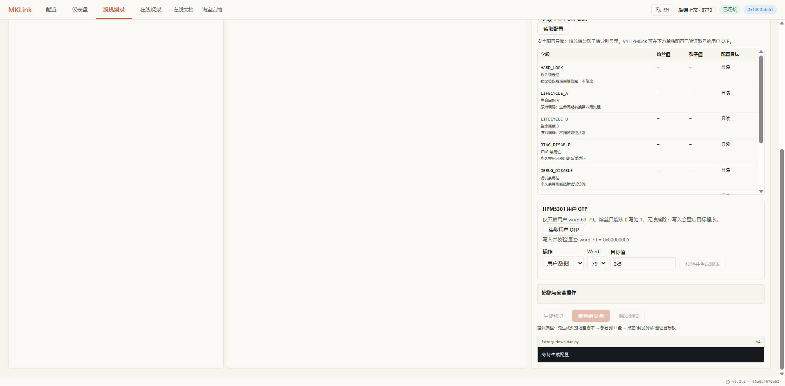
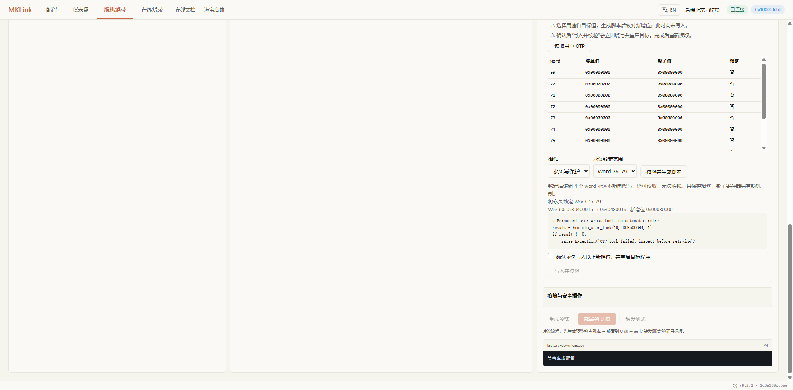

# 使用 GUI 配置 HPM 选项字节与用户 OTP

在 **脱机烧录 → 选项字节 / OTP 配置** 中，可以读取 HPM 的公开配置、给用户 OTP 写入数据，并生成对应脚本。写入前，界面会列出旧值、目标值和新增位，执行后再核对实际熔丝值。

本文对应 **MKLink AI Probe 0.2.2 开发版 + V4 HPMLink 固件**，以 HPM5301 真机为例，实测日期为 2026-09-19。下载器应使用 **HPMLink.uf2**。

## 我应该配置哪一项？

| 你的目的 | 在界面中怎么做 |
| --- | --- |
| 查看芯片是否有保护、启动限制 | 选择芯片，展开“选项字节 / OTP 配置”，点击“读取配置”；先只读，不勾选擦除或加锁 |
| 保存应用自己的设备编号、功能标志 | 在“HPM5301 用户 OTP”中选择“用户数据”，读旧值，再设置目标值 |
| 防止已经写好的用户数据再次被烧写 | 完成数据校验后，选择“永久写保护”，核对它影响的整个组 |
| 开启安全启动、关闭调试、配置加密密钥 | 普通 GUI 暂未开放；不是勾选用户组写保护就能实现。不要照抄实验安全值 |

第一次使用只需按下面“连接并读取”和“写一个用户 word”操作。用户 OTP 不会自动变成应用配置：应用程序需要按你定义的格式读取、解释它。没有明确用途时先只读。

## 先确认可操作范围

| 内容 | 当前 GUI 支持 |
| --- | --- |
| HPM5301 公开配置 | 读取 HARD_LOCK、生命周期 A/B、JTAG/DEBUG 禁用位、SW_VER、USB VID/PID，分别显示熔丝与影子值 |
| 用户数据 | HPM5301 Word 69–79，读、计划预览、烧写和校验 |
| 永久写保护 | 用户组 18（Word 72–75）、组 19（Word 76–79） |
| 生命周期、禁用调试、根证书、密钥 | 普通 GUI 不提供任意烧写；本页后半部分仅记录专用实验的验证情况 |
| 其他 HPM 系列 | 不能直接套用 HPM5301 的地址和写入范围，仍须按型号适配、验证 |

OTP 熔丝只能把 **0 置为 1**，不能擦除。例如 `0x5 → 0x7` 合法，`0x5 → 0x1` 会试图清除 bit2，应被拒绝。永久锁也不能解除。写入或锁定会复位目标程序，进行测试前应停止业务运行。

## 连接并读取

1. 在“配置”页选择 HPMLink 的命令串口并连接目标。USB 转 UART 口用于串口日志，不是下载器命令口；电脑重启或更换 USB 接口后应重新确认串口。
2. 打开“脱机烧录”，选定 **HPM5301**，下载器型号选择 **V4**。HPM 下载使用 ROM API，无需 FLM。
3. 展开右侧“选项字节 / OTP 配置”，点击“读取配置”。熔丝值表示 OTP 内容，影子值表示当前加载的影子寄存器，不能把两者混为一谈。
4. 在下方“HPM5301 用户 OTP”中点击“读取用户 OTP”，查看每个 word 的值与锁定状态。

只操作用户 OTP 时，不必添加应用 BIN/HEX。读到 `—` 代表没有有效快照，不是值为零。切换芯片、重新连接后须重新读取，原有确认与计划会清除。

### 配置列表里的字段是什么意思？

| 字段 | 初学者应如何理解 |
| --- | --- |
| HARD_LOCK | 永久写保护的位图。不是“整片加密”开关；下方用户组锁定功能会替你计算对应位 |
| LIFECYCLE A / B | 安全生命周期的两份编码，必须一起看。1为普通开发、3为安全启动、7为返厂、B为不可返厂；不能像普通下拉选项那样来回切换 |
| JTAG_DISABLE | 1表示禁用JTAG，可能连芯片ID也无法再读取；0仅表示这一位没禁用 |
| DEBUG_DISABLE | 1表示限制调试；即使读到ID，也可能不能读写内存 |
| SW_VER | 启动镜像的版本限制。不是应用界面里的版本号，不能为了“升级版本”随便填大 |
| USB VID / PID | 目标芯片ROM USB厂商/产品标识，不是MKLink的USB信息，也不是串口号 |

这些字段目前均为只读，GUI 中也会直接显示含义。**熔丝值**是永久内容，**影子值**是当前寄存器副本。两者不同应先检查复位和保护状态，不要直接重复烧写。

## 写一个用户 word

以下示例在空白实验芯片上，把 Word 79 写为 `0x00000005`。Word是编号，一个word为32位（4字节）；`0x`表示十六进制。请先确认你的应用没有占用这个word：

1. 选择“用户数据”，Word 选择 `79`。
2. 输入目标值 `0x5`，点击“校验并生成脚本”。
3. 核对旧值为 `0x00000000`、目标值为 `0x00000005`、新增位为 `0x00000005`。
4. 确认本次永久写入及目标复位，点击“写入并校验”。
5. 看到成功提示后，再点击“读取用户 OTP”，检查实际值。


*实机预览：确认框未勾选时不能执行；生成脚本本身不会烧写。*

生成的脚本携带预期旧值，防止拿旧快照直接写新芯片。本例的预览内容是：

```python
result = hpm.otp_user(79, 0, 5, 1)
if result != 0:
    raise Exception('OTP failed: inspect before retrying')
```

这段是下载器端 PikaPython 脚本。不要改成主机 Python 直接运行，也不要复制到另一型号上试写。预览不代表已经烧写；**“写入并校验”会立即操作当前连接的目标**，与页面底部“部署到 U 盘”是不同动作。



*Chrome 真机截图：右侧提示 `word 79 = 0x00000005`。上方公开配置未读取时仍显示 `—`，不影响下方独立用户区操作。点击图片可查看原始分辨率。*

### 以后还想增加一个标志位怎么办？

重新读取后，旧值是`0x5`。要再置bit1，应填写完整结果`0x7`，预览应显示新增位`0x2`，确认后写入。本轮新芯片已经按此步骤完成`0 → 5 → 7`，熔丝与影子读回一致。

若填成`0x1`，会试图清除原来已写入的位，校验会拒绝，不能通过重试解决。OTP也不能用“全片擦除”恢复空白。

## 永久锁定用户组

1. 先完成该组所有数据写入，并重新读取确认。
2. 操作选择“永久写保护”。
3. 选择 `Word 72–75` 或 `Word 76–79`，点击“校验并生成脚本”。
4. 检查受影响的 **4 个 word**，确认后点击“写入并校验”。
5. 重新读取，检查整组锁定状态。

本次实测锁定 Word 76–79，HARD_LOCK 从 `0x30400016` 变为 `0x30480016`，只新增 bit19；复位后 Word 79 仍为 `0x5`。界面将整组标为已锁，不能再生成该 word 的写入计划。



*新芯片回归使用Word79=`0x7`，同样只新增HARD_LOCK的bit19。选择范围后，先确认组内其余三个word以后也不需要再写。*

锁定按组生效，不能只锁该组中的一个 word。组 17 包含 USB 配置 Word 68，因此 GUI 不开放该组永久锁。此功能保护熔丝编程，影子寄存器还有独立的锁机制。

如果提示 `HARD_LOCK is write-locked in the current boot state`，表示永久锁控制字本身当前已禁止写入，不是按钮故障。此次 RETURN 生命周期实验中确实观察到此状态。

## 出错时如何处理

| 现象 | 含义与处理 |
| --- | --- |
| 预期旧值不匹配 | 芯片状态已变化；重新读取并核对，重新生成计划 |
| Word 已锁 / 计划按钮不可用 | 不再尝试烧写该组；检查是否选错 word |
| 空响应、部分响应 | 读取未完成，不能解释成零值 |
| CHIP_ID 无法读取、调试可能受保护 | IDCODE 可读不等于内存可读；不要继续按缓存值操作 |
| 写入返回错误或中途断线 | 结果可能不确定；先回读，不要自动重放烧写命令 |

在本次签名镜像测试中，旧固件有一次在目标尚未确认暂停时访问寄存器，OTP 操作返回 `-8`。回读确认 Word 79 仍为零。修复固件增加有界的暂停状态等待后，同一镜像的用户字写入与永久锁均通过。遇到类似问题，应使用包含该修复的 HPMLink 测试固件，不应反复点击写入。

## 安全字段验证进度

安全功能验证使用独立 UART、实验专用证书及可弃芯片，**没有作为普通 GUI 的安全字段烧写入口发布**。

| 项目 | 已观察到的结果 |
| --- | --- |
| DEBUG/JTAG 禁用 | 先前芯片已验证禁用后的调试访问变化，UART 程序继续运行 |
| SW_VER | 旧版本启动头被拒绝，满足版本的镜像恢复运行 |
| 根证书哈希与签名启动 | 256 位实验根哈希写入后，正确签名镜像运行 |
| SECURE → RETURN | 复位后状态保持；RETURN 恢复调试及未签名程序启动 |
| SECURE → NONRET | 本次新芯片 A/B 均变为 `0xB`，复位后签名程序继续运行 |
| 密钥撤销 | 撤销根 0 后，根 1 签名镜像继续启动；撤销根 1 后，同一镜像复位后不再输出应用心跳 |
| 断电保持 | 第四颗用户Word79=7和组19锁在用户实际断电重上电后保持；不代表全部安全态均做过断电测试 |
| SCRIBE（废弃） | 第四颗从RETURN写入A/B=F，复位后15秒未收到应用UART心跳；此为破坏性实验，不作为普通GUI选项开放 |
| 仍待验证 | 安全态物理断电保持、独立调试鉴权、EXIP/MASTER_KEY，以及其他型号真机测试 |

SECURE 测试中曾出现所有受保护地址都返回 `0x20150407` 的现象。该值不是有效 OTP 内容；GUI 通过实时芯片身份检查拒绝显示伪配置。只有 IDCODE 正常，不能据此判断烧录、内存访问或安全配置读取正常。

## 为什么其他系列不能直接照抄

其他型号沿用同样的教程结构：先选准确型号，再看本型号可读/可写项目、每项含义及生效条件，最后预览和校验。若界面提示不支持，应保留原型号等待适配，不能改选HPM5301来绕过限制。本页截图和写入范围只代表HPM5301。

SDK 1.11.0 的多个系列使用类似字段名称，但 OTP 基址和密钥长度存在差异，例如 HPM5301 的 OTP 基址为 `0xF3050000`，HPM6E80 为 `0xF3158000`；HPM5E31 的 EXIP 密钥为 128 位，HPM5301 为 256 位。

这些是源码核对结果，不是跨型号烧写资格。移植时应先确认准确型号、OTP 映射、ROM API 和可用 RAM，再从用户字读写与回读开始验证。

相关操作：[HPM 生态概览](overview.md) · [HPM5301 实战](hpm5301-freertos.md) · [脱机烧录](../flashing/offline-flash.md)。
