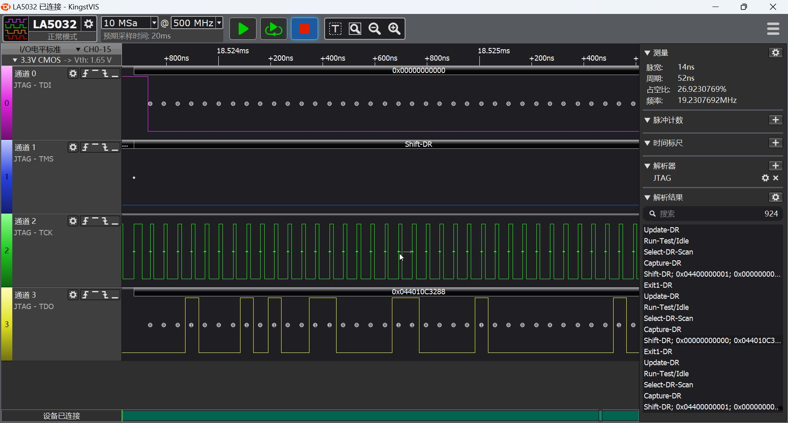
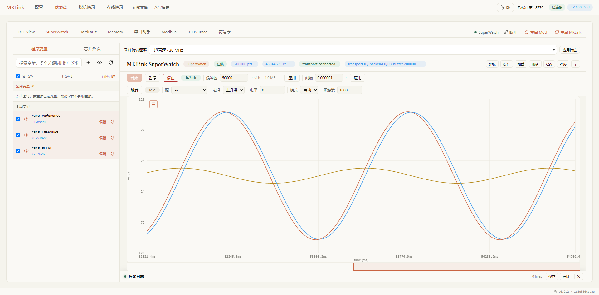
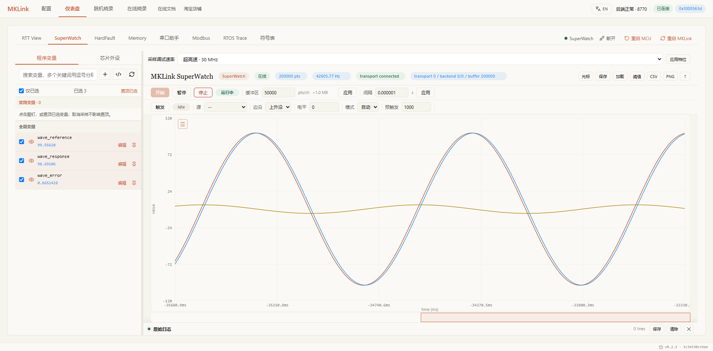
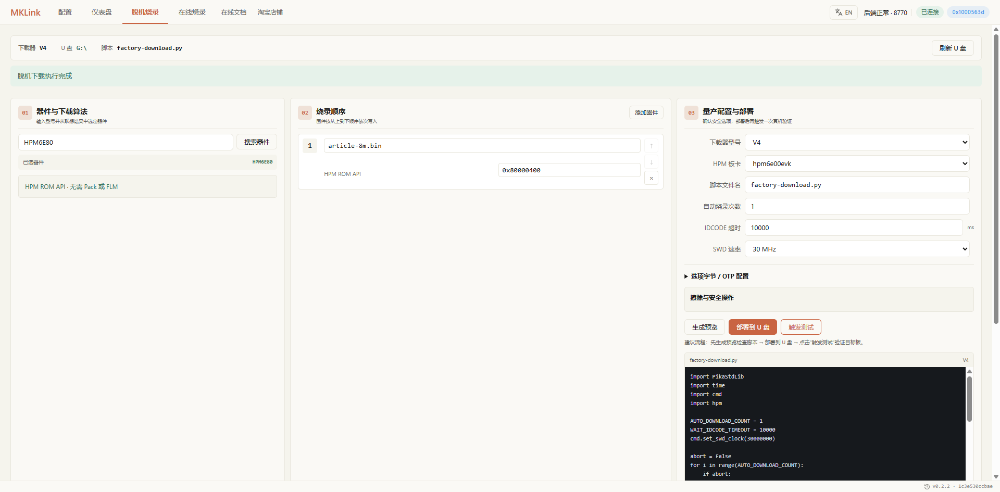
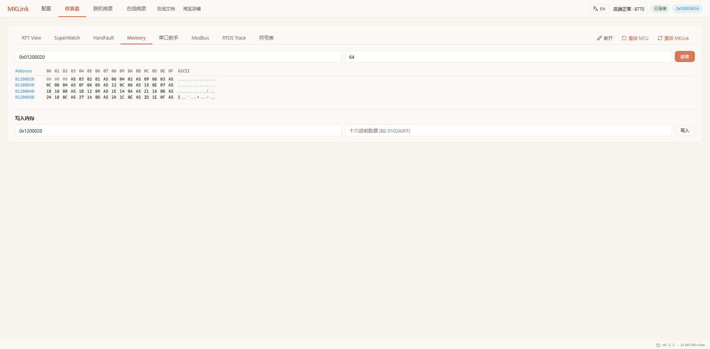

# HPM6E80 20/30 MHz 性能与功能验证记录

本文为 [MKLink × 先楫 HPM](overview.md) 的技术附件，保留测试条件、完整数字与未覆盖范围。测试日期：2026-09-19。

## 环境与计时口径

- 目标 HPM6E80，HPM6E00EVK，16 MiB QSPI NOR；HPM SDK 1.12.1 `samples/hello_world`，核心 0，Flash XIP Debug。
- 下载器 HPMLink V4，本轮优化固件；不是 ARM MicroLink 固件。未操作 OTP。
- 8 MiB 为可运行程序加固定测试填充，地址 `0x80000400`。交替修改填充内容，避免把重复写入相同数据当成擦写验证。
- 镜像先复制到下载器 U 盘，再由下载器本地执行 HPM ROM API。主机负责触发和验收，不逐块提供编程数据。
- 写入时间包含 U 盘文件读取、传输、ROM 编程和进度刷新。整数百分比改变时等待 30 ms，整包约 3 秒，计入写入时间；无固定每 4 KiB 等待。
- 写入速度 = 镜像大小 ÷ 写入时间；擦写速度 = 镜像大小 ÷（擦除＋写入）；三步综合速度 = 镜像大小 ÷（擦除＋写入＋校验）。统一采用 KiB/s（1024 B）。复制文件及初始化不在这三个计时段内。
- 新版探针在所有 ROM 写入完成后启动独立的全镜像校验阶段，读取 U 盘原文件并与 Flash 逐字节比较，失败不会报告烧录成功。主机又做一次完整独立回读和 SHA-256 验收，这次额外资格验证耗时不重复计入产品校验时间。
- 每个下表轮次都完整回读 8 MiB、逐字节比较并核对 SHA-256；仅日志“成功”不足以通过。

## 8 MiB 最终版三阶段实测

| 档位 | 擦除 | 写入 | 校验 | 写入速度 | 擦写速度 | 擦写校验综合速度 |
| --- | ---: | ---: | ---: | ---: | ---: | ---: |
| 20 MHz | 32.265 s | 14.230 s | 15.484 s | 575.69 KiB/s | 176.19 KiB/s | 132.17 KiB/s |
| 30 MHz | 32.136 s | 12.952 s | 13.404 s | 632.49 KiB/s | 181.69 KiB/s | 140.05 KiB/s |

- 20 MHz：擦写合计 46.495 s，擦写校验合计 61.979 s；其中进度等待 2.933 s 已计入写入。主机额外独立回读 42.324 s，通过。
- 30 MHz：擦写合计 45.088 s，擦写校验合计 58.492 s；其中进度等待 2.927 s 已计入写入。主机额外独立回读 40.593 s，通过。

[三阶段结构化数据](../../assets/examples/hpm6e80-hello-world/flash-three-phase-measurements.json)与[探针原始返回及主机完整比对](../../assets/examples/hpm6e80-hello-world/resident24-large-verified.json)保留计时和 SHA-256。20/30 MHz 使用不同填充镜像，两个轮次均完成全量双重验收。

## 先前优化阶段（历史计时口径）

| 阶段 | 档位 | 擦除 s | 写入 s | 合计 s | 写入 KiB/s | 整体 KiB/s |
| --- | ---: | ---: | ---: | ---: | ---: | ---: |
| 修复稳定性后基线 | 20 MHz | 90.840 | 117.633 | 208.473 | 69.64 | 39.30 |
| 修复稳定性后基线 | 30 MHz | 91.512 | 115.270 | 206.782 | 71.07 | 39.62 |
| 对齐擦除＋4 KiB缓冲 | 20 MHz | 31.455 | 109.388 | 140.843 | 74.89 | 58.16 |
| 对齐擦除＋4 KiB缓冲 | 30 MHz | 31.366 | 107.432 | 138.798 | 76.25 | 59.02 |
| SBA缓冲及回读核对 | 20 MHz | 31.511 | 66.018 | 97.529 | 124.09 | 84.00 |
| SBA缓冲及回读核对 | 30 MHz | 31.492 | 58.299 | 89.791 | 140.52 | 91.23 |
| 批量 SBA 写入＋目标双缓冲 | 20 MHz | 31.696 | 33.673 | 65.369 | 243.28 | 125.32 |
| 批量 SBA 写入＋目标双缓冲 | 30 MHz | 31.677 | 29.899 | 61.576 | 273.99 | 133.04 |

历史数值见 [flash-measurements.json](../../assets/examples/hpm6e80-hello-world/flash-measurements.json)。最后两行的“写入”包含 RAM 暂存区回读，另有主机 Flash 校验。新版将完整镜像校验独立为第三步，因此不可将旧 273.99 KiB/s 和新写入速度直接作为同口径优化倍数。

主要修复：

1. Abstract 写入遇忙不再执行探针 EBREAK；完成状态、错误返回和 AUTOEXEC 清理有界。
2. 非对齐写入头长度按剩余数据夹紧，避免长度下溢；对齐地址不再多写一个头。
3. 擦除范围一次取整，允许连续对齐块擦除，避免从扇区内偏移 0x400 开始逐 4 KiB 调用造成相邻扇区重复擦除。
4. 使用 4 KiB 编程缓冲；仅对已核对别名的 hpm6e00evk 使用 SBA 搬运，编程前回读缓冲核对。别名不满足时回退。
5. 目标等待期间让出 CPU，避免长时间阻塞 USB/看门狗；算法返回错误传递给上层。

此前一次长擦除出现过约 74 秒超时，USB 仍连接；增加了 PC/DCSR/地址诊断。后续表中轮次均完成且回读一致。这是有限轮次验证，不等于多小时稳定性认证；该历史超时不隐去。

## 最终实现与内存分配

参考 `MicroLink_Plus/MicroLink/flashloader` 的目标双缓冲思路，使用实测验收，没有沿用参考报告的旧速度。

- 目标 ILM 中运行常驻编程循环，两个 32 KiB 槽交替使用。上一块执行 ROM 编程时，探针准备下一块；序号最后发布，消费完成后才释放槽位，最后一块完成且 ROM 返回成功后才进入校验。
- 探针按需动态申请一个文件缓冲和 4 KiB SD 预读缓存，尝试 32、24、16 KiB，最后退到无预读缓存的 4 KiB。当前设备 32＋4 KiB 申请失败，24＋4 KiB 成功；真实测速日志均为 `FLASH_CHUNK bytes=24576 cache=4096`。这与目标上固定的两个槽位是不同的内存。
- 连续 SBA 写入每 1 KiB 检查 DMI/SBA 状态及地址推进；DMI 分派和循环位于 ILM，算法和控制区仍回读比对。数据缓冲的重复回读移到全部写完后的完整 Flash 校验阶段，错误不会被“成功”日志掩盖。
- SD 整扇区使用 32 位 FIFO；文件读取期间启用 4 KiB 预读，退出后清除缓存指针，写扇区使缓存失效。SD 运行请求提高到 25 MHz，初始化和 SDK CID 检查降速路径保留。这个内部 SD 频率与对目标的 20/30 MHz JTAG 档位不同。
- 保留整数进度变化时 30 ms 等待。大镜像校验每块休眠 1 ms，给较低优先级的看门狗和 USB 线程运行机会。

中间版本曾在长校验期间复位：`rt_thread_yield()` 只让同优先级任务运行，不能保证低优先级看门狗获得调度。改为每块 `rt_thread_mdelay(1)` 后，最终两档 8 MiB 校验均完成。没有把这个失败轮次计为成功测速。

最终探针构建 ILM 尚余约 3.7 KiB、DLM 约 0.7 KiB；动态缓冲来自已预留堆，并非新增静态 28 KiB。没有挪用串口接收缓冲来凑空间。扩大的目标 ILM 地址布局只对核对过的 HPM6E00EVK 启用，其他板型不据此宣称已经适配。

512 KiB 两档写入和双重校验通过，见[小镜像记录](../../assets/examples/hpm6e80-hello-world/resident24-small-verified.json)。20/30 MHz 分别测试 51073、51074、51075 字节尾块，六次完整校验通过，见[尾块记录](../../assets/examples/hpm6e80-hello-world/resident24-boundaries.json)。主机模型覆盖四档 DMI 分派、流水线最后响应出错、目标 ROM 错误及取消退出。

最后恢复 51072 字节演示程序，完整校验通过，`wave_tick` 从 6012 增至 6550，见[恢复记录](../../assets/examples/hpm6e80-hello-world/resident24-fixture-flash.json)。前一阶段恢复曾出现首次 ID=0、1 MHz 重连恢复，根因尚未定位；当前有限轮次通过不等于多小时或多板认证。

固件：`HPMLink-20260919-resident24.uf2`，SHA-256：`4adecdd4aaa69bbd4d5ae5f738bb831b676a71ea9dde511f6498c1aa1815a8c5`。

本轮未改变已校准的 JTAG 波形内核，下面时钟图沿用同一内核的捕获；大镜像由主机触发 U 盘本地编程。旧版 GUI 烧录截图继续标注为历史留档，不能代替本轮测速日志。

## 引脚实际时钟

Kingst LA5032，500 MSa/s，CH2 接 TCK，CH0/1/3 分别接 TDI/TMS/TDO。统计数据移位阶段，不把事务间空闲段混入 TCK 周期。

| 档位 | 常见周期 | 截图选中周期 | 仪器读数 |
| --- | --- | --- | --- |
| 20 MHz | 52、54 ns | 52 ns | 19.230769 MHz |
| 30 MHz | 32、34 ns | 34 ns | 29.411765 MHz |

2 ns 采样量化影响单周期读数。数字逻辑分析仪可验证时序，不替代模拟信号完整性测量。

## mem_dump 持续接收

每种负载约 5 秒，已知内存图案逐包比较，CRC 错误及帧丢失均为 0。主机速率包含启动与接收耗时；目标时间戳速率按记录首尾时间计算，两者分列。固定值验证读取一致性，不代表目标每秒更新同样次数。

| 档位 | 每组大小 | 完整组数 | 主机持续组/秒 | 目标时间戳组/秒 | 主机 MiB/s |
| --- | ---: | ---: | ---: | ---: | ---: |
| 20 MHz | 4 B | 450480 | 90082.97 | 96226.49 | 0.34364 |
| 20 MHz | 64 B | 35064 | 7012.14 | 7403.89 | 0.42799 |
| 20 MHz | 4096 B | 952 | 190.393 | 201.295 | 0.74372 |
| 30 MHz | 4 B | 528168 | 105625.80 | 113109.07 | 0.40293 |
| 30 MHz | 64 B | 43320 | 8662.61 | 9148.17 | 0.52872 |
| 30 MHz | 4096 B | 1156 | 231.195 | 244.248 | 0.90311 |

64 B 完整一组才计一次；4 KiB 包验证顺序、CRC 和内容。单变量数字不能乘通道数当成完整多变量组率。

## AI 与 WebGUI 共享采集

网页后端独占物理探针，AI 订阅 `/ws/streams/superwatch`，解析相同记录及时间戳。没有另开串口争抢探针。

### 当前文章 GIF：0.01 调到 0.10

在最终版固件上，将测试工程 RAM 参数 `response_gain` 设为 0.01，采集并分析后改为 0.10。每次写入先停止 SuperWatch，写完回读比对，再恢复共享采集。源码默认值仍为 0.05。

| 指标 | 0.01 | 0.10 |
| --- | ---: | ---: |
| 完整三通道组数 | 507241 | 511841 |
| 主机采集时间 | 12.022 s | 12.016 s |
| 目标时间轴组/秒 | 42332.00 | 42762.72 |
| 主机持续组/秒 | 42193.98 | 42596.04 |
| 响应幅值 | ±84.79 | ±99.82 |
| 误差峰值 | 52.74444 | 5.64481 |
| 序号缺口 | 0 | 0 |

误差峰值下降约 89.3%。两段时间戳严格递增、所有值有限，CRC 错误、丢帧和固件错误标记增量均为 0。[调整前记录](../../assets/examples/hpm6e80-hello-world/gif-before-check.json)、[调整后记录](../../assets/examples/hpm6e80-hello-world/gif-after-check.json)保留原始计数。

GIF 源帧来自 Chrome 正在显示的图表 canvas：原始录制 301 帧，最大帧间隔 103 ms。当前成品选取两次独立采集各 5 秒，橙色标题“调参前波形”、绿色标题“AI调参后波形”，直接切换，不包含中间步骤卡。两段之间有停止、写参数、回读及重新采集操作，不代表连续时间轴。仅合成透明背景、等比例缩放、加标题图例和降低帧率，未重绘波形。成品 1100×499、50 帧、10 秒。[录制信息](../../assets/examples/hpm6e80-hello-world/gif-recording-manifest.json)。

### 0.05 调到 0.10 的早期演示留档

30 MHz、三个 float 变量、请求间隔 1 μs（满速请求，并不保证 1 MHz 采样）。例程波形任务每 1 ms 更新一次，参考幅值 ±100，频率 1 Hz。

| 指标 | response_gain=0.05 | response_gain=0.10 |
| --- | ---: | ---: |
| 参考信号幅值 | ±100 | ±100 |
| 估计频率 | 1.00203 Hz | 1.00190 Hz |
| 响应幅值 | ±99.25824 | ±99.82282 |
| 误差峰值 | 11.84944 | 5.64481 |
| 误差 RMS | 8.34624 | 3.99087 |

第一段记录 510134 组，目标时间跨度 11.851172 秒，约 43044.94 组/秒；主机 12.01290 秒约 42465.51 组/秒。序号连续、时间递增，所有值有限。两次分析的共享流统计见 [共享流统计](../../assets/examples/hpm6e80-hello-world/shared-stream-measurements.json)。参数写入发生在停止采集后，回读确认再重启，不承诺多个变量原子一致。

## 其他功能与例程修复

- RTT：通道 0 连续输出运行计数；发送 `HPM_OK`，收到回显。短文本双向验证通过，不作为 RTT 极限吞吐压测。
- SystemView：SDK 默认配置缺少 FreeRTOS OS 回调；示例改为一次初始化并传入 `SYSVIEW_X_OS_TraceAPI`，避免二次初始化分配错误 RTT 通道。软件采集 25535 事件、109330 字节，已同步，丢字节/包均为 0；Chrome 另一次采集 140787 事件、5 个任务，RuntimeDrop 为 0。
- Memory：4 KiB 固定图案完整比对通过；Chrome 显示其中 64 字节。
- 在线下载：补齐 HPM6E80 精确型号搜索入口，目录测试 36 项通过。Chrome 30 MHz 下载最新 51072 字节 demo.bin，完整校验、复位完成。
- 脱机下载（双缓冲优化前的 GUI 留档）：Chrome 将 8 MiB 镜像和脚本部署到 U 盘，30 MHz 触发执行，擦除 31.588 s、写入 58.302 s，合计 89.890 s。该额外轮次全量回读逐字节一致、SHA-256 相同，见 [回读记录](../../assets/examples/hpm6e80-hello-world/gui-offline-verified.json)。
- FreeRTOS：更改配置后完整 rebuild，确认系统节拍与任务计数增长。本测试程序关闭 D-cache 以保证调试缓冲一致性，产品移植应按实际内存属性处理。

## 对比范围与复现

MKLink 报价 358 元由用户提供。本次没有 J-Link Plus 同板、同镜像、同计时口径的数据，不作“2 倍 J-Link Plus”的结论。此前核对的 SEGGER 美国商店 J-Link PLUS Classic 为 798 美元，不等同中国含税到手价，不能直接推导固定 1/10 或 1/25 价格。

[示例源码和配置](../../assets/examples/hpm6e80-hello-world/README.md) 提供本轮 FreeRTOS、RTT、SystemView 与波形代码。8 MiB 镜像使用修复 SystemView 回调前的例程前缀；大镜像测试哈希保持原样，配套源码包提供修复后的演示程序。未操作安全字段，也不把本板结果推广为全部 HPM 型号实测。

### 四路错相正弦波实录

更新演示程序，加入 phase_0、phase_90、phase_180、phase_270，幅值 ±100，频率 1 Hz，每 1 ms 更新。51252 字节镜像经 ROM 下载校验通过，任务计数 6070→6608。30 MHz 共享流 12.0187 秒收到 396047 组，主机持续组率 32952.48 组/秒，样本时间轴 33064.77 组/秒，序号丢失 0，CRC、解析丢帧、固件错误标记均无新增。四路范围均为 [-100,100]。变量依次读取，不宣称四路同时采样。

GIF 为 Chrome 实际图表 canvas 10 fps 录制 10 秒、导出 5 fps；保持正常播放速度，只有标题、图例和等比例缩放。四路波形采集速率与目标 1 kHz 更新速率不同。

[四路原始统计](../../assets/examples/hpm6e80-hello-world/phase-shared-check.json) · [下载及校验](../../assets/examples/hpm6e80-hello-world/phase-fixture-flash.json) · [GIF 录制信息](../../assets/examples/hpm6e80-hello-world/phase-recording-manifest.json)
