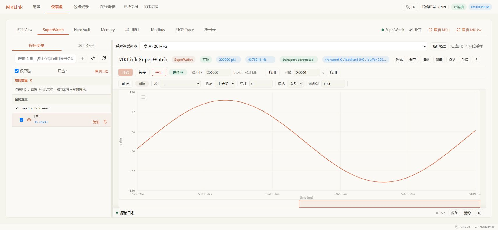
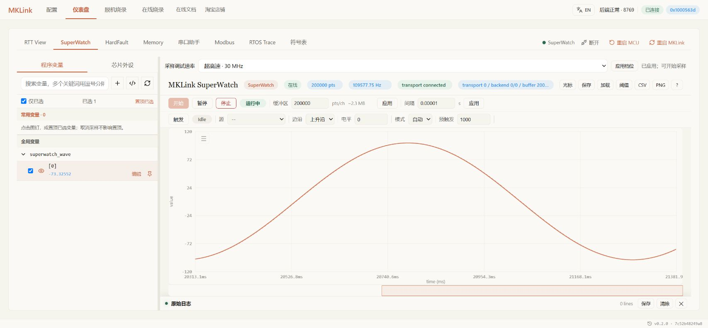

# HPM6E80：工程下载与四档数据观察

在 HPM6E80 上使用 MKLink 时，工程配置、变量地址和性能数据需要按本板重新确认。本例从 SDK 1.11.0 的 `hello_world` 出发，完成编译下载与全量回读，再采集RAM和Flash数据，在网页观察运行变量。

通用的 AI 任务描述、GUI 操作方式见 [HPM 使用指南](overview.md)。本页记录 HPM6E80 的具体参数和已验证范围，避免沿用 HPM5301 的地址或性能结论。

## 准备工程与目标

| 项目 | 本例配置 |
| --- | --- |
| 目标 / SDK 器件声明 | HPM6E80 / `HPM6E80xVMx` |
| BOARD | `hpm6e00evk` |
| SDK / 示例 | 1.11.0 / `samples/hello_world` |
| 构建 | SEGGER Embedded Studio 8.24，`flash_xip` Debug |
| CPU | core0，600 MHz |
| 本次 BIN | 37,328 B，基址 `0x80000400` |
| 数据区域 | AXI SRAM；示例数据位于 `0x01280000` 附近，以当前 ELF 为准 |

HPM6E80 与 HPM5301 可能返回相同的 JTAG ID。连接成功和时钟确认不等于识别了精确型号，应结合实物、SDK 工程与器件配置确认目标。

## 开始使用

把工程路径和准确板型告诉 AI：

> 编译这个 HPM6E80 工程，下载并回读校验，确认运行计数更新。随后采集需要观察的变量，打开网页让我查看曲线。

本例已完成37,328 B镜像的全量回读，1 ms计数器正常更新。需要手动下载时，在网页选择HPM6E80、hpm6e00evk和当前BIN；加载同次ELF后，再进入SuperWatch选择变量。

**四档为4/10/20/30 MHz，默认10 MHz。** 先用默认档观察，需要更密集的数据时再提高档位。AI与网页轮流使用探针，切换前结束当前采集。

## 在网页里观察

下面选择 `superwatch_wave[0]`，以200000点缓冲区、10 µs请求间隔采集。四档应用与采集中切换20→30 MHz已经实测；切档后旧流先停止，再重新开始采集。

*20 MHz窗口显示93,769.16 Hz。*

*30 MHz窗口显示109,577.75 Hz。截图显示率与下方独立测量为不同轮次，不代表长时间平均采样率。*

## 最终固件的四档实测

以下矩阵对应最终探针固件 `cbdedefb7a386db84eb5755cca7028538f756b40c2493379526a34f4122d308d`，28 项实板回归全部通过。

| 数据布局 | 4 MHz | 10 MHz | 20 MHz | 30 MHz |
| --- | ---: | ---: | ---: | ---: |
| 固定 RAM 4 B，kSa/s | 34.400 | 60.428 | 86.848 | 100.358 |
| 四个离散 32 位值，k组/秒 | 9.390 | 18.237 | 27.500 | 33.198 |
| 连续 RAM 64 B，k块/秒 | 2.492 | 4.934 | 7.605 | 9.123 |
| RAM 4 KiB，有效载荷 MiB/s | 0.264 | 0.513 | 0.785 | 0.965 |
| Flash 4 KiB，有效载荷 MiB/s | 0.263 | 0.513 | 0.785 | 0.963 |

每组离散数据包含全部四个值，每块 64 B 包含 16 个 32 位值。MiB/s 为有效载荷吞吐，不含协议开销。速率剔除 200 ms 预热、保留后续帧间间隔，根据探针时间戳计算，不是 GUI 刷新率。

20/30 MHz 的 RAM 与 Flash 4 KiB 各测 30 秒；4/10 MHz RAM 4 KiB 各测 15 秒；其余布局各测 5 秒。静态字节逐一比较，动态数据检查有限值、范围和变化，并检查 CRC、帧序、错误标志和时间戳。该最终矩阵未出现内容、CRC、帧序、时间戳、SBA/DMI 或 USB 错误，升级后的故障/恢复计数保持零。

## 持续采样：与最终回归分开记录

较早候选固件 `304de8c390139906cc7776264594ad3284136da13562cbf7011ef68c744ea6de` 完成下列长测，并通过 5 次重连、每次四档的检查，合计 30 项通过。

| 内容 | 时长（每档） | 20 MHz | 30 MHz |
| --- | ---: | ---: | ---: |
| 固定 RAM 4 B | 300 s | 85.466 kSa/s | 99.501 kSa/s |
| RAM 4 KiB | 120 s | 198.335 块/秒 | 242.410 块/秒 |
| Flash 4 KiB | 120 s | 198.978 块/秒 | 242.706 块/秒 |
| 四个离散值 | 30 s | 26.211 k组/秒 | 32.782 k组/秒 |

固定单变量分别采到 25,564,464 / 29,760,480 个样本，最大间隔为 295/299 µs。另有各 30 秒动态变量检查。未发生内容不符、CRC 错误、丢帧、时间戳倒退或新增 SBA/DMI 故障，USB error/full/blocked 为零。设备保留的历史 SBA 故障数 1 没有增长，不应写为设备累计零故障。

最终固件仅补充冷启动诊断变量初始化，四个汇编移位内核与该候选逐字节一致，但它们仍是两份固件：候选的 5 分钟结果不能署为最终固件的 5 分钟结果。30 MHz 持续采样为约 99.50 kSa/s；最终短测约 100.36 kSa/s、早期短测约 107 kSa/s，都不代表持续超过 100 kSa/s 的保证。

## 标称档位与实际时钟

LA5032 以 500 MSa/s 采集，仅统计完整 41 位 Shift-DR 内的连续移位时钟：

| 标称档位 | 实测移位时钟 | 完整 DMI 响应 | 非 DONE 响应 |
| --- | ---: | ---: | ---: |
| 20 MHz | 18.855 MHz | 11,703 | 0 |
| 30 MHz | 29.798 MHz | 17,397 | 0 |

20 MHz 是档位名称，本次实际时钟低于 20 MHz。逻辑分析仪短抓取补充长时间数据校验，不能代替稳定性验证；500 MSa/s 的时间量化也不等于校准频率精度。

## 其他功能与适用边界

在线下载及周期内存采集已有本板证据。脱机下载、RTT、普通 Memory 写入、外设字段、RTOS Trace、串口和 Modbus 可先参考 [HPM 使用指南](overview.md)的操作方法，但尚不能视为本次 HPM6E80 全部完成真机验证；各功能截图与结果按实际测试补充。

候选增加 AXI SRAM 快路径，并调整 20 MHz TDO 采样位置；未添加 RAM 读取重试。此前的 20 MHz 失败、一次 10 MHz 动态数据异常及无有效时钟的分析仪记录保留，原因未明确的异常不归因于某个猜测。

**修改后的 20 MHz 采样位置尚未在 HPM5301 重新实板回归。** HPM5301 原资格仍对应原固件，本页结果不外推到其他板卡、线缆、目标或 ARM 调试。
