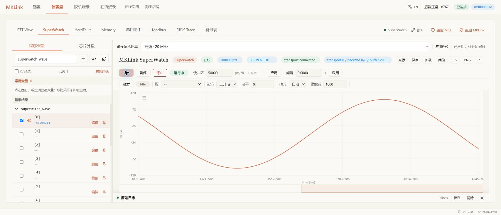
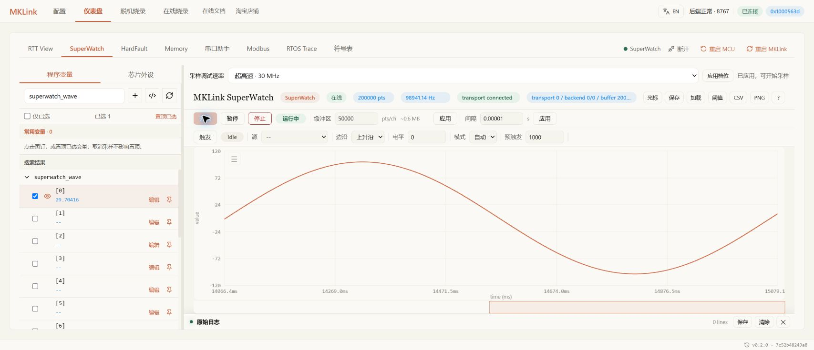

# HPM5301 mem_dump 采样档位（开发版）


## 当前开发版：保留 20 MHz，新增 30 MHz

| 档位 | API 值 | 标称调试时钟 |
| --- | --- | ---: |
| 低速 | `low` | 4 MHz |
| 中速（默认） | `medium` | 10 MHz |
| 高速 | `high` | 20 MHz |
| 超高速 | `ultra` | 30 MHz |

旧配置中的 `high` 继续表示 20 MHz，默认仍为 10 MHz。GUI、CLI 与 MCP 的四档接口已完成开发实现，Chrome 已显示四档；修复版 48 项底层稳定性套件、24 项 CLI/MCP 实际操作及 Chrome 四档应用与曲线观察均已通过。已安装 Skill 快照也已完成独立页面复验；这不等于正式桌面安装包发布。

20/30 MHz 要求 HPM5301 及能够确认相应内核的配套探针固件，仅回显时钟值不算确认。确认失败会恢复 1 MHz 并报错。HPM6E80 尚待换板验证，不能沿用 HPM5301 的结论。

### CLI 与 MCP 用法

CLI 切档前先停止采集并释放其他工具的连接，替换工程、端口和由当前 ELF 确认的地址：

```text
python -m mklink debug-speed ultra --port <port> --project-root <project>
python -m mklink dump-benchmark --port <port> --project-root <project> --speed ultra --duration 3 --period 0.000001 <address>:4
```

`debug-speed` 加 `--save` 可保存工程档位。MCP 调用为 `set_debug_speed(profile="ultra")`；测量接口也可设置 `measure_dump_memory(..., speed_profile="ultra")`。Web 点击“应用档位”会先停止当前采集，随后需重新开始；CLI/MCP 使用者先主动停止流。

!!! info "性能与验证状态"
    以下 4/10/20 MHz 性能表保留为历史基线，不新增未经完成验证的 30 MHz 长测数字。早期 30 秒实验见 [25/30 MHz 开发实验](jtag-high-frequency-experiment.md)。30 MHz 连续 30 分钟及多变量、4 KB、脚本重连矩阵结果见下节；20 MHz 旧版 4 KB 异常已在修复版独立复验通过，CLI/MCP 与 Chrome 源码页面操作也已通过，见下方接口验收。

## 30 MHz 持续采样：旧 7510 固件的开发验证

本轮 30 MHz 套件 45 项全部通过，使用 HPM5301 当前接线及 UF2 `751049018b8cf90150d55f857b367a846af99b8e11961c73192c4c8e0e65f717`。20 MHz 同规格套件在 4 KB 项发生异常并停止，尚不能得出两档均通过或性能提升比例的结论；HPM6E80 未测。

| 数据与用途 | 连续时长 | 完整逻辑样本数 | 平均采样率 | 最大样本间隔 |
| --- | ---: | ---: | ---: | ---: |
| 固定 Flash 4 B，确定性内容校验 | 1800 s | 178,976,184 | 99,674.6046 次/秒 | 306 µs |
| 固定 Flash 64 B，连续内容校验 | 300 s | 2,731,176 | 9,130.9236 块/秒 | 468 µs |
| 固定 Flash 4 KB，周期块采样 | 120 s | 29,532 | 247.2190 块/秒 | 8453 µs |
| 动态 RAM 4 B，运行中变量 | 120 s | 11,950,344 | 100,059.4203 次/秒 | 299 µs |

固定 4 B 的 P99 间隔为 92 µs，无超过 1 ms 的间隔。动态 RAM 观察到 119,706 次值变化；动态值变化与固定内容正确性是不同检查。表中样本数为完整采集计数，速率使用剔除预热后的测量区间，不应直接用总数除以主机请求时长重算。

4 KB 有效载荷为 0.965699 MiB/s。本轮以完整样本**末块**时间戳计算，早期 stage12 使用**首块**，不可混用口径；块采样本身需数毫秒，不套用单变量的 1 ms 间隔标准。

此外，10 次重连中每次均在 4/10/20/30 MHz 读取四个不同地址并通过。整个套件共 194,543,580 个完整逻辑样本，CRC、协议丢帧、固件错误、DMI reserved/failed/busy 增量均为 0，USB errors/full/blocked_us 均为 0。各次启动跳过的 47–50 B 命令回显单独统计，不属于流中重同步。

这些结果不替代 GUI 切档验收，也不把此前约 109 kSa/s 的短测写成长测成绩。[本轮测量摘要](../../assets/examples/hpm5301-hello-world/stage13-30mhz-summary.json)保留逐项结果，省略本地端口与设备标识。

## 20 MHz 对照：旧 7510 固件部分通过，4 KB 异常

同规格开发验证中，固定 Flash 4 B 连续 1800 秒通过，共 169,091,712 个样本，平均 94,164.89387 次/秒，最大间隔 286 µs；固定 Flash 64 B 连续 300 秒通过，共 2,282,136 块，平均 7,631.15163 块/秒，最大间隔 492 µs。

随后 4 KB 周期采集在约 24.85 秒、第 10,119 个物理帧报告 **固件 flag=4**，立即停止。已收到 5,059 个完整逻辑样本，CRC 错误为 0，但固件标记帧为 1，**整套结果为未通过**。CRC 正常不能抵消该异常；后续诊断固件已复现并定位为 SBA 忙冲突，见下节；不能以成功项目替代全套结论。

本状态对应 stage14 的首次异常记录，使用与 stage13 相同的 `751049018b8cf90150d55f857b367a846af99b8e11961c73192c4c8e0e65f717` 固件。旧版成功与失败结果均不直接适用于下述修复候选。当前源码页面的 GUI 实机切档结果见下方接口验收。

### 修复版稳定性：48 项通过

诊断曾复现 SBA 忙冲突：`stage=6`、`addr=0x80001420`、`offset=508`、`status=0x20558407`，其中 `sbbusyerror=1`、`sberror=0`、`sbbusy=0`。修复只对 HPM5301 白名单 XIP 范围内、不超过 512 B 的小块尝试一次有界恢复：等待空闲、清错、从小块首地址逐字等待重读，最后一字禁用预取，验证成功才返回。RAM/MMIO、DMI 错误、总线错误及其他状态不进入该恢复分支。

以下结果对应修复版 UF2 `2927de9be7c0350cdc467addcbb2db8b961e5456c3de6817d09222cb016a11c5`。stage16final 的 **48 项全部通过**，共 20,052,146 个完整逻辑样本、291,041,390 次 DMI 扫描。

| 修复版项目 | 时长 | 完整样本数 | 平均速率 | P99 / 最大间隔（µs） |
| --- | ---: | ---: | ---: | ---: |
| 20 MHz · Flash 4 KB | 600 s | 124,590 | 208.23385 样本/秒 | 4913 / 9057 |
| 20 MHz · Flash 4 B | 30 s | 2,561,088 | 86,410.74192 样本/秒 | 100 / 312 |
| 20 MHz · 动态 RAM 4 B | 120 s | 10,384,584 | 86,952.96560 样本/秒 | 101 / 304 |
| 20 MHz · Flash 64 B | 30 s | 229,584 | 7,746.03160 样本/秒 | 366 / 488 |
| 30 MHz · Flash 4 KB | 300 s | 72,836 | 243.62053 样本/秒 | 4246 / 4298 |
| 30 MHz · Flash 4 B | 30 s | 2,916,936 | 98,429.99674 样本/秒 | 96 / 303 |
| 30 MHz · 动态 RAM 4 B | 30 s | 2,907,864 | 98,134.81317 样本/秒 | 98 / 298 |
| 30 MHz · Flash 64 B | 30 s | 269,400 | 9,091.92096 样本/秒 | 338 / 469 |

20/30 MHz 的 4 KB 有效载荷分别为 **0.81341348 / 0.95164269 MiB/s**，按完整逻辑样本末块时间戳统计。表中完整样本总数与剔除预热后用于速率计算的样本数不同。30 MHz 动态 RAM 记录 29,706 次值变化，固定 Flash 内容则逐块校验。

全部项目的 CRC、协议丢帧、错误标记、DMI reserved/failed/busy 以及 USB errors/full/blocked_us 均为 0。**SBA 忙冲突发生 7 次，均成功恢复，全部出现在 20 MHz 4 KB 600 秒项目**；不能写成没有发生底层冲突。启动命令回显单列，不计作流中丢帧。停止时未收齐的末尾块不计入完整样本。

10 轮重连中，每轮在 4/10/20/30 MHz 各采集 1 秒、读取四个离散变量，均通过。该结果仅适用于本套 HPM5301 接线，HPM6E80 未测。CLI/MCP 与 Chrome 操作另有实机验收，结果如下。

**本修复版没有进行两档各 30 分钟测试。** 各项实际时长见表；早期约 109 kSa/s 属于旧固件短测，本修复版 30 MHz 固定 4 B 的 30 秒结果约为 **98.43 kSa/s**。旧 stage14 失败证据继续保留，不被这次通过记录覆盖。

[修复版 48 项测量摘要](../../assets/examples/hpm5301-hello-world/stage16-final-summary.json)

### 四档接口与 Chrome 实机操作

开发分支 `codex/v0.2.1-development` 的主机提交为 `245314f90b08a4f12455b78b992ef1a6dd621b55`。真实 CLI/MCP 共 24 项操作通过，覆盖四档确认、已知值读取、周期测量、省略 `speed_profile` 时保留当前选择，以及恢复保存的默认 10 MHz。

Chrome 已实际应用四档，并显示 20/30 MHz 动态单变量曲线。采集中应用 30 MHz 会先停止旧后端流，状态轮询恢复“开始”按钮后可重新采集。API 快照约为 86.4 / 98.5 kSa/s；以下截图取自不同瞬间，保留界面原值，不替代独立基准表。





API 的 CRC、read_errors、read_drops 与二进制丢帧均为 0。两次 GUI 累计启动文本 92 B（每次 46 B），不计作采样帧丢失。该轮结束时已停止、保存 10 MHz 并断开连接；这描述验收结束状态，不表示读者打开页面时的实时设备状态。

上述截图来自源码运行的开发页面。随后使用标准安装器安装同一提交的 Skill 快照，2460 个文件摘要核对一致，并在新进程的 Chrome 页面完成 30 MHz 应用与动态曲线复验：状态快照为 98,081.48 次/秒，read_errors、read_drops、CRC 和固件标志均为 0；结束后停止、恢复 10 MHz 并断开。正式发布渠道与桌面安装包未据此变更。

## 2026-09-12：hello_world 历史三档基线

以 SDK 1.11.0 `hello_world` 的新 16 路波形固件重新下载、回读校验后，在上位机提交 `b0eed3672d878d5f07153df587d3ffc233755dd4` 进行下列测试。每组合独立 5 秒、预热 200 ms、请求周期 1 µs；单位为完整样本/秒，一组 16 路值计一个样本。

| 完整样本布局 | 低速 4 MHz | 中速 10 MHz | 高速 20 MHz |
| --- | ---: | ---: | ---: |
| 1 × float，4 B | 33,182.70 | 60,118.17 | 88,306.23 |
| 2 × float，连续 8 B | 18,028.27 | 33,795.72 | 51,168.65 |
| 16 × float，连续 64 B | 2,493.61 | 4,941.72 | 7,916.35 |
| 连续 RAM，4096 B | 67.71 | 132.59 | 209.49 |

12 组 CRC 错误、丢帧和固件丢样标志均为 0。每组合仅一次测试，未测多轮离散程度。详见[新例程、真实截图与 P99 表](overview.md)及[本轮原始 JSON](../../assets/examples/hpm5301-hello-world/benchmark.json)。新固件的波形数组地址是 `0x000804F8`；下方旧记录中的 `0x00080500` 仅属于旧工程。

16 路 GUI 三档追加实测分别显示低速 2503.33、中速 4886.52、高速 7762.55 组/秒；[真实性能截图与测量口径](overview.md#gui)。这些是另一次 GUI 采集，没有覆盖或替换上表 CLI 数值。

## 以下为先前开发验证记录

以下“本轮”“本次报告”和提交号描述原始基线，保留其当时的固件、布局与测试边界；不要与上方重新烧录后的结果混用。

!!! info "开发版验证记录 · 2026-09-12"
    本页上位机参数对应 `codex/v0.2.1-development` 的提交 `ecce7cc4df5e1786e65ec4a2632038aaf6f722af`；本轮批量采样固件以以下 UF2 摘要标识，不能仅用上位机提交判断固件版本。尚未作为正式安装包发布，也未合并；不能据此认定当前下载页的安装包具备这些能力。

## 适用设备与固件

验证组合为一台 MKLink V4 与 HPM5301 目标。探针版本字符串为 V4.4.0，但判断是否为本次测试固件还必须核对 UF2 摘要：

- 本轮批量采样 UF2 大小：1,562,624 字节。
- 本轮 SHA-256：`9836a48e0a2afaa16f83ccf97a15814e42b50c1b9035a446c3d3d510d7f42e18`。
- 历史基线 UF2：1,555,968 字节，SHA-256 `4675eeafb1cf8145dd8aba7fed50e257ac57931d84cc25f009b56de857fd8a4e`。两版的版本字符串均为 V4.4.0，须按摘要区分。
- 本次报告没有写入目标固件或目标 RAM，也没有测试普通 `mem_read/mem_write` 或 RTT 吞吐。
- 本页数据是周期二进制 `mem_dump` 的完整样本测量，不是烧录速度或单次内存读取延迟。

## 历史版本的三个档位

| 档位 | API 值 | 标称调试时钟 |
| --- | --- | --- |
| 低速 | `low` | 4 MHz |
| 中速（新 HPM 连接默认） | `medium` | 10 MHz |
| 高速 | `high` | 20 MHz |

默认值适用于未保存其他档位的新 HPM 连接；已有配置可覆盖默认值。这些是调试时钟档位，不是变量采样频率。上一版电气时序验证中，逻辑分析仪在完整 DMI 移位段测得的时钟分别约为 3.9862、9.4347、19.8916 MHz，不把标称值当作精确 TCK。本轮保持该 JTAG 电气时序，没有再次提高 TCK。

HPM5301 高速档要求固件明确返回匹配的 `JTAG profile`。读取返回值中的 `profile_confirmed` 和 `qualification`，不能只看 `clock_hz`。旧 HPM 固件可能接受低/中档命令，但属于未按本报告实测认证的旧时序。无法确认档位时，实现会恢复 1 MHz 并报错。ARM 高速档目前被禁用，HPM5301 的结果不能外推为 ARM 20 MHz 已验证或其他 HPM 型号已验证。

## SuperWatch 中切换

开发版波形区上方新增“采样调试速率”，可选择低速、中速、高速，然后点击“应用档位”。Web 后端会先停止当前仪表盘采集流，再应用档位；随后需要重新开始采样。Web 选择会保存并在再次连接时应用。

**验证状态：** 早期实现报告记录了组件、API 和硬件测试，包括采样中通过 REST 切档停止旧流和中速重连保留。2026-09-12 后续已在 Chrome 完成 ELF 加载、16 路真实曲线、A/B 光标显示及停止状态应用高速档，见[hello_world 复测截图](overview.md)。后续 GUI 验收未重复测试采集中切档。

## CLI：独立测量，不打开上位机

以下命令中的 `<port>` 必须替换成实际端口。示例地址 `0x00080500` 来自本次目标工程的 4 字节变量，不能直接用于其他固件；先使用匹配 ELF 或符号表核对地址。运行前停止其他采集并释放探针。

```text
python -m mklink debug-speed medium --port <port> --project-root <project> --save
python -m mklink dump-benchmark --port <port> --project-root <project> --speed high --duration 3 --period 0.000001 0x00080500:4
```

- `debug-speed` 的位置参数为 `low|medium|high`，`--save` 将档位保存到所选工程配置；不加该选项不会保存为后续连接配置。
- `dump-benchmark` 的区域是一个或多个 `地址:字节数` 位置参数；`--speed` 可省略以沿用连接配置。
- `--duration` 单位秒，范围 0.5–30；`--period` 单位秒，范围 0.000001–0.1，默认请求 1 µs。
- 最多 15 个区域，总有效载荷不超过 4096 字节。
- 旧调度器将所有小于 50 µs 的请求转换为 1 µs 满速模式，本轮未改；请求 10 µs 不代表严格 100 kHz 定时。50 µs 及以上沿用原节拍路径。
- 请求 1 µs 是饱和吞吐测量设置，**不代表已达到每秒一百万个样本**。
- 原有 `dump-memory` 也支持 `--speed`；它是有界快照入口，不能把一次快照当作周期吞吐测量。

## MCP、SDK 与 REST

下面是 MCP 工具调用形式；先建立目标连接并停止现有数据流。MCP 不使用 CLI 的 `--speed` 参数名。

```python
set_debug_speed(profile="medium")
measure_dump_memory(
    regions=[{"address": 525568, "size": 4}],
    duration=3.0,
    period=0.000001,
    speed_profile="high",
)
```

`525568` 即 `0x00080500`。MCP `set_debug_speed` 在当前连接会话内保留选择；`measure_dump_memory` 省略 `speed_profile` 时沿用会话档位。`dump_memory` 可选 `speed_profile`，仍保留有界快照语义。

SDK 为已连接设备的 `device.set_debug_speed("high")`。REST 为 `GET /api/device/debug-speed` 查询、`POST /api/device/debug-speed` 设置，POST JSON 为 `{"profile":"high"}`。CLI、MCP、SDK 切档要求连接处于空闲状态，不应假设它们都会像 Web 切档那样自动停止仪表盘流。

测量输出包括 `sample_hz`、`payload_bytes_per_second`、`median_interval_us`、`p99_interval_us`、`max_interval_us`、`samples`、`integrity` 与 `timing_source`。采样率以探针时间戳计算，排除最初 200 ms 预热；4096 字节 B1 数据按完整双块样本计数，用首块时间戳代表组装样本。检查 CRC、固件标志、块顺序和字节覆盖。同步前丢弃的 REPL 文本计入 `parser_dropped_bytes`，不能直接解释为样本丢失。

## 本轮批量路径与适用范围


- 固件在固定地址列表之间保持 DMI 在途请求；每个 32 位字两次扫描，下一次写地址同时回收前一次数据。每批最多 24 个完整样本，批末再用两次扫描检查 SBA 状态。模型验证热批次为 `2 × words × samples + 2` 次扫描。
- 仅 HPM5301 已有白名单 DLM/XIP 地址，对齐 32 位、总大小不超过 64 B、最多 16 个 word，使用既有快速采样模式。地址项仍最多 15 个，16 word 不等于 16 个区域。其他布局、MMIO、低速周期及其他芯片保留旧路径。
- 保留原固件的周期语义：请求小于 50 µs 时，dump_period_to_us 将其转换为满速模式；请求 10 µs 不代表严格 100 kHz 定时。50 µs及以上继续原节拍路径。每个样本时间戳记录最后一个 word 的 DMI 响应回收时刻，多变量按顺序读取，并非目标侧原子快照。
- 整批 SBA/DMI 校验成功后才发送；出错丢弃整批数据，发送一个错误标记帧并停止该流。原始中间值不会作为有效样本发布。
- 保持原 DMPM 帧、每样本时间戳与 CRC，CLI/MCP/Web 无需协议升级。USB 队列不足时保留同一批已校验字节，重试排队，不重新采样覆盖。没有移植对方 vendor tunnel、8 KiB 帧或零拷贝协议。
- 新增静态样本暂存 1728 B，未缩小堆。实际链接 DLM 剩余 911 B；JTAG 汇编电气时序保持上一版，未再次提高 TCK。

## 本轮完整矩阵与旧版对比


目标 HPM5301，既有运行中的测试程序，普通 RAM 起点 0x80500。每项采集约 3 秒，请求周期 1 µs以测饱和吞吐，排除起始 200 ms，按 probe 时间戳计算。离散变量间隔 32 B。4 KB 是一整个样本的 4096 字节，两个 B1 分块只计一次完整样本。

表格为本轮完整矩阵一次结果，单位为“完整样本/s · 有效载荷 KiB/s”；不包含 RTT、普通 mem_read/mem_write 或写入测试。

| 布局 | 4 MHz | 10 MHz | 20 MHz |
|---|---:|---:|---:|
| 连续 4 B | 33401.29 · 130.47 | 60223.73 · 235.25 | 88240.65 · 344.69 |
| 连续 8 B | 18363.66 · 143.47 | 33538.11 · 262.02 | 51165.89 · 399.73 |
| 连续 16 B | 9511.70 · 148.62 | 18455.28 · 288.36 | 28079.03 · 438.73 |
| 连续 64 B | 2486.97 · 155.44 | 4893.30 · 305.83 | 7774.03 · 485.88 |
| 连续 256 B | 948.82 · 237.20 | 1855.49 · 463.87 | 2976.10 · 744.02 |
| 连续 512 B | 537.24 · 268.62 | 1061.04 · 530.52 | 1730.59 · 865.29 |
| 连续 2048 B | 137.35 · 274.69 | 270.85 · 541.70 | 441.20 · 882.39 |
| 连续 4096 B | 67.41 · 269.66 | 131.44 · 525.77 | 207.07 · 828.27 |
| 2 × 4 B 离散 | 17862.15 · 139.55 | 34323.87 · 268.16 | 49858.46 · 389.52 |
| 4 × 4 B 离散 | 9399.98 · 146.87 | 17734.05 · 277.09 | 27140.34 · 424.07 |
| 8 × 4 B 离散 | 4840.14 · 151.25 | 9444.67 · 295.15 | 14408.18 · 450.26 |
| 15 × 4 B 离散 | 2636.20 · 154.46 | 5084.14 · 297.90 | 8161.26 · 478.20 |

与上一版 本页下方保留的三档历史基线 相比：

| 布局 | 4 MHz 增幅 | 10 MHz 增幅 | 20 MHz 增幅 |
|---|---:|---:|---:|
| contig_4 | +86.9% | +89.1% | +92.3% |
| contig_8 | +49.5% | +47.2% | +49.4% |
| contig_16 | +178.7% | +176.3% | +163.5% |
| sparse_4 | +99.5% | +93.7% | +86.8% |
| sparse_15 | +105.6% | +99.4% | +97.1% |
| contig_4096 | +0.6% | +0.1% | -0.9% |

4 KB 路径没有本轮专门优化，测量变化约 -0.9%..+0.6%，不宣称收益。20 MHz 单变量首次短测 95.419 kSa/s，完整矩阵为 88.241 kSa/s；保留波动，不只报告峰值。对方 148.74 kSa/s 使用另一套探针/目标及协议，本固件尚未达到。

## 正确性、长间隔和稳定性

五种主机模型编译配置通过；新增批量模型覆盖 1..16 word 的响应归属、严格递增时间戳、各个 DMI 请求位置的错误状态、各数据位置的 sticky 错误、MMIO/不对齐拒绝。实际 C 组帧模型验证 CRC、区域顺序、时间戳、USB 背压时保留原批次，以及整批出错停止。

- 4 MHz：逐帧与既有目标 BIN 比对 97,075 个协议帧；覆盖 4/8/64 B、15 个离散 word 和 4 KB，包含 bit31=1 数据，全部一致。
- 10 MHz：逐帧与既有目标 BIN 比对 175,878 个协议帧；覆盖 4/8/64 B、15 个离散 word 和 4 KB，包含 bit31=1 数据，全部一致。
- 20 MHz：逐帧与既有目标 BIN 比对 266,306 个协议帧；覆盖 4/8/64 B、15 个离散 word 和 4 KB，包含 bit31=1 数据，全部一致。

SuperWatch 实际后端每档单/双通道各 30 秒，请求周期 10 µs；下表为“kSa/s / p99间隔 µs / 最大间隔 µs”。这是后端真机测试，GUI 点击与截图另列。

| 档位 | 单通道 | 双通道 |
|---|---:|---:|
| 4 MHz | 33.367 / 139 / 307 | 18.406 / 160 / 306 |
| 10 MHz | 59.908 / 110 / 310 | 35.013 / 105 / 284 |
| 20 MHz | 88.163 / 94 / 300 | 54.250 / 89 / 296 |

20 MHz 单变量另做三次 3 秒复测：88.382, 87.789, 87.739 kSa/s。

Windows 正常 Python 接收进程下人为阻塞父进程 GIL 150 ms：327,240 个有效样本，88.292 kSa/s，p99 96 µs、最大 317 µs；USB queue-full、DMI、CRC 和固件错误计数增量均为零。冻结安装版和任意长度的 OS 停顿不在此验证范围。

本轮六次 30 秒单/双通道测试均无 CRC、固件错误标记和 DMI 错误。旧版一次 4.361 ms 异常没有被独立复现并定位，不能据此宣称根因已修复。

批量采样和逐帧编码/发送之间仍有间隔，不能称作硬实时等间隔采样。多 word 的时间戳是最后一个 word 完成时刻。启动解析器丢弃的命令回显字节不等于丢样；零错误计数也不是任意主机阻塞下永不丢样的证明。

## 历史基线（上一版固件）

以下保留上一版 UF2 `4675eeaf…8a4e` 的历史基线，不能与上面的本轮批量固件测量混用。

每档约 3 秒、请求周期 1 µs 的连续 4 字节单变量测量：

| 档位 | 完整样本 kSa/s | 有效载荷 KiB/s |
| --- | ---: | ---: |
| 4 MHz | 17.871 | 69.81 |
| 10 MHz | 31.842 | 124.38 |
| 20 MHz | 45.875 | 179.20 |

这里 1 kSa/s = 1000 个完整样本/秒，1 KiB = 1024 字节。多个离散区域、更多字节和测量时长都会改变结果。4096 字节完整样本的三档速率分别为 67.03、131.30、208.92 Sa/s；不能把各区域的值数相加冒充完整样本率。

报告的 30 秒采集结果如下；它与上面的短测是不同测量，不替换短测数据：

| 档位 | 单通道 kSa/s / p99 / 最大间隔 | 双通道 kSa/s / p99 / 最大间隔 |
| --- | --- | --- |
| 4 MHz | 17.703 / 134 µs / 259 µs | 12.298 / 166 µs / 285 µs |
| 10 MHz | 32.870 / 97 µs / 230 µs | 22.868 / 121 µs / 255 µs |
| 20 MHz | 47.848 / 80 µs / 219 µs | 34.274 / 92 µs / 4361 µs |

20 MHz 双通道曾出现 4.361 ms 长间隔，同时观测到 4.215 ms USB IN 时长，原因尚未确定；后续一次复测最大间隔降为 226 µs，不能因此删除先前离群值或宣称硬实时保证。Windows 普通 Python 运行时的独立接收进程通过了受控 150 ms 应用停顿测试，不等于可承受任意系统停顿；冻结可执行文件和其他操作系统不在这项验证范围内。

**本轮仍未达到参考方的 148.74 kSa/s。** 本轮已实现自己的跨样本 DMI 批量路径和批末状态检查；未移植参考方的 vendor tunnel、8 KiB 帧或零拷贝协议。参考方的 HPM6200 探针与 HPM6800 目标不等同于本次验证组合。

## 证据来源

本轮数据来自 [2026-09-12 最终 HIL 报告（固定提交）](https://github.com/MicroKeen/Mklink-AI-Probe/blob/b0eed3672d878d5f07153df587d3ffc233755dd4/Mklink-AI-Probe/docs/verification/v0.2.1-mem-dump-batch.md)。报告已随提交 `b0eed3672d878d5f07153df587d3ffc233755dd4` 推送到开发分支；该提交新增报告与交接，上位机运行代码仍对应 `ecce7cc4df5e1786e65ec4a2632038aaf6f722af`，不代表正式发布。固件按本页 UF2 摘要识别。文档任务只读整理，没有重新操作硬件。

Chrome 窗口已识别到正确页面，但 GUI 工具因无法可靠确认当前 URL 停止本轮操作；没有截图或 GUI 点击完成证据。浏览器可视验收继续待补，不以 API、后端或硬件测试替代。


- [固定提交的实现报告](https://github.com/MicroKeen/Mklink-AI-Probe/blob/ecce7cc4df5e1786e65ec4a2632038aaf6f722af/Mklink-AI-Probe/docs/verification/v0.2.1-mem-dump-profiles.md)
- [开发分支 PR #2](https://github.com/MicroKeen/Mklink-AI-Probe/pull/2)
- 参数按该提交的 `mklink/cli.py`、`mklink/mcp_server.py`、`mklink/debug_speed.py`、`mklink/dump_benchmark.py` 及 SuperWatch 组件核对。本页是报告整理，文档任务未重新操作硬件。
