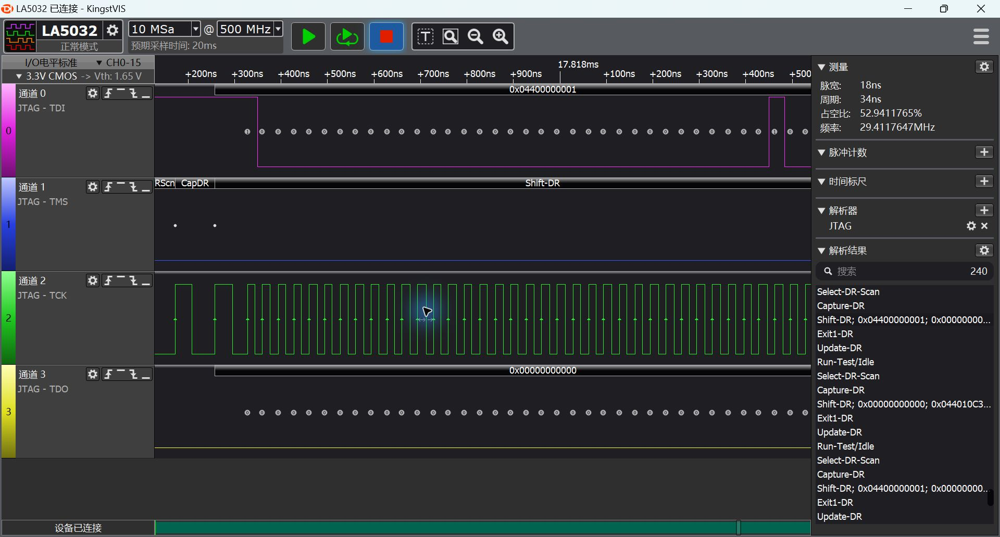
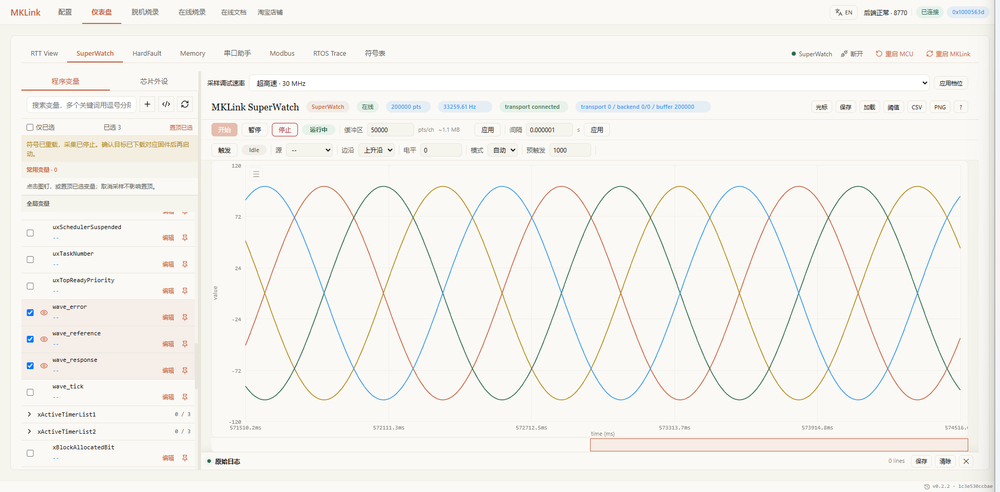
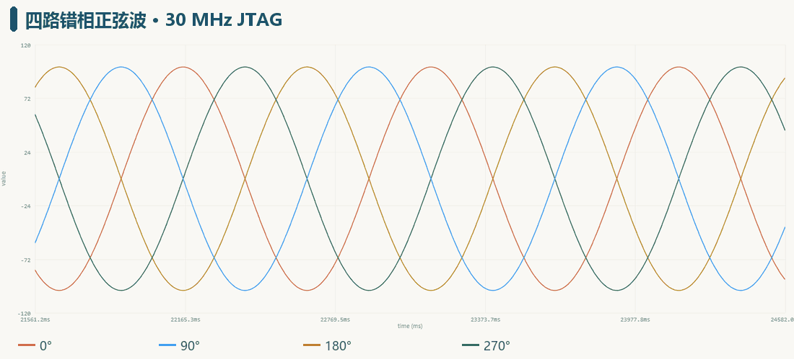
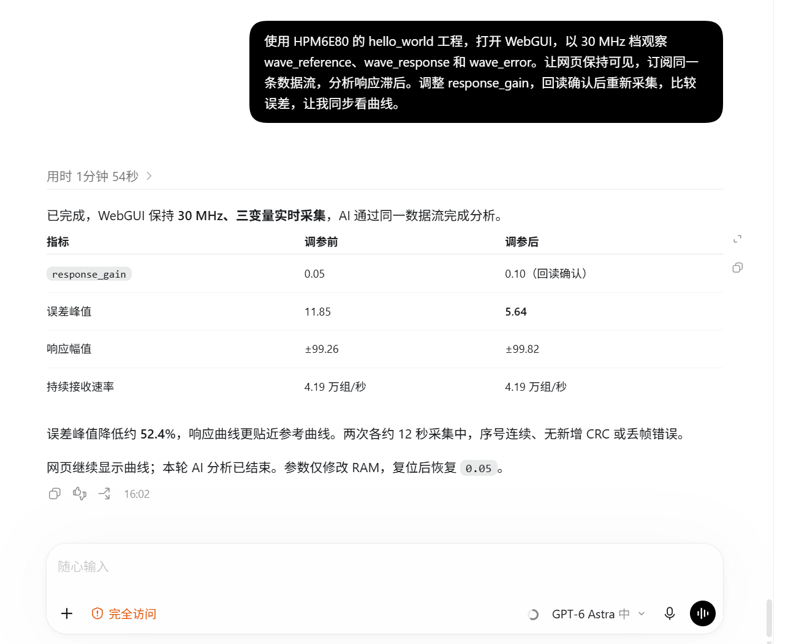
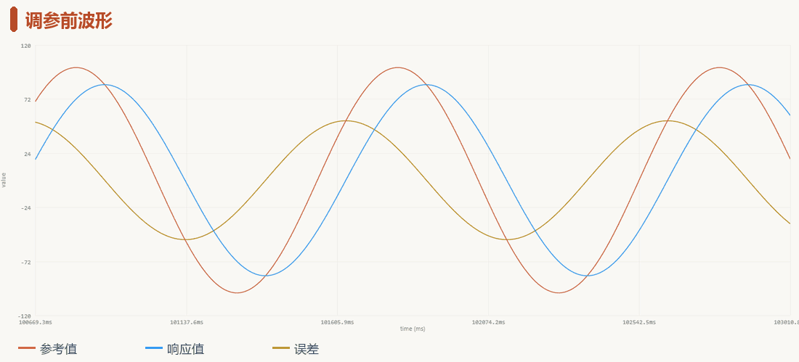
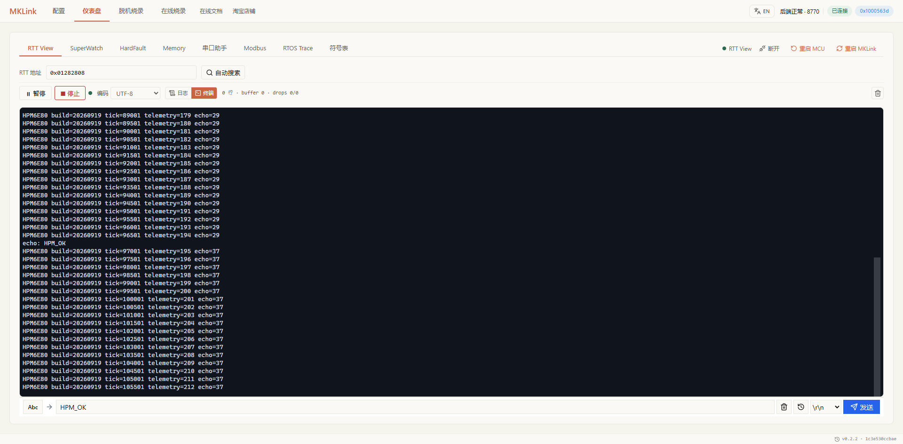
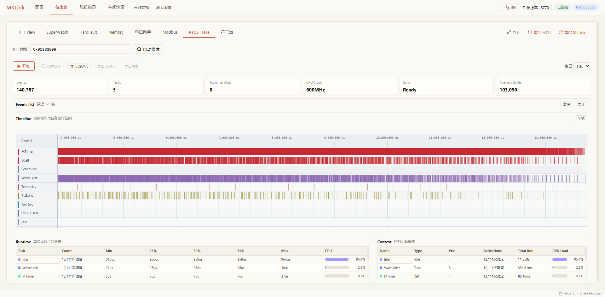
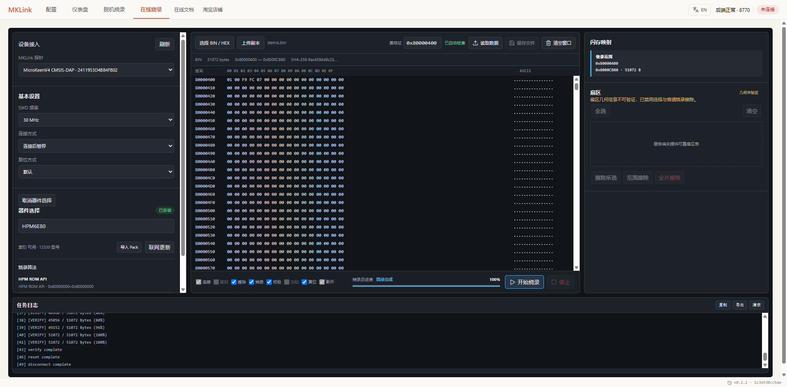

# MKLink x 先楫MCU：30MHz JTAG + AI驱动，为调试和数据流监控带来无与伦比的体验

**632.49 KiB/s 固件写入。10.56 万次/秒单变量持续采集。0.903 MiB/s 连续内存读取。**

**8 MiB 大固件，12.952 秒写完；擦除、写入、完整校验，58.492 秒全部完成。**

这是 HPMLink V4 在先楫 HPM6E80开发板、使用 30 MHz JTAG 的真机的脱机下载数据。 **2X Jlink Plus**的性能，还能让 AI 直接接手下载、读数据和调试，工程师在 WebGUI 同步看波形。

## 01｜性能，直接看数据

带图片、字库和界面资源的大工程，下载速度决定了每次改动要等多久。把 8 MiB 镜像放进 MKLink U 盘，下载器在本地完成擦除、编程和校验：

| **30 MHz · 8 MiB 大固件** | **实测速度** | 耗时 |
| --- | ---: | ---: |
| **写入** | **632.49 KiB/s** | **12.952 s** |
| **擦除＋写入** | **181.69 KiB/s** | **45.088 s** |
| **擦除＋写入＋完整校验** | **140.05 KiB/s** | **58.492 s** |
| 擦除（单独计时） | — | 32.136 s |
| 完整校验（单独计时） | — | 13.404 s |

*HPM6E00EVK，HPM SDK 1.12.1。写入包含文件读取、数据传输、ROM 编程及进度刷新；校验单独计时。复制镜像、初始化另计。KiB = 1024 字节。*

30 MHz 有实际引脚波形作证。逻辑分析仪选中的 JTAG 数据移位周期为 34 ns，读数约 29.41 MHz：

*分析仪采样率 500 MSa/s，单周期读数受 2 ns 时间分辨率影响。*

固件跑起来之后，高速链路继续用于观察数据。四路正弦波依次错开 90°，在 SuperWatch 中同时展开：

四条曲线来自 HPM6E80 每毫秒更新的真实变量。AI 订阅同一条数据流，网页同步显示，四路持续接收约 **3.30 万组/秒**。

| 30 MHz 下的实时读取 | 主机持续接收性能 |
| --- | ---: |
| 单个 4 字节变量 | **105,626 次/秒** |
| 三个 float 变量 | **约 4.3 万组/秒** |
| 四路错相正弦波 | **约 3.30 万组/秒** |
| 连续 4 KiB 内存块 | **0.903 MiB/s** |

单变量、多变量和整块内存，各自按完整记录统计。更密的读取让短暂异常更有机会留下痕迹，也给 AI 分析运行状态提供了足够的数据。

调试时最怕刚有一个想法，就被漫长的下载和来回导数据打断。写入快一点，波形及时出现，就能趁思路还热着，把下一次验证做完。一天里反复修改、下载、观察，这些少等的时间，都会回到工程师手里。

**相比传统调试器，MKLink 把高速烧录、实时观测和 AI 自动化调试带到同一张桌面上。省下等待，也省下重复劳动，这份价值，物超所值。**

## 02｜AI 调参数，你看着波形变好

提示词就是交给 AI 的任务说明，工程路径、要看的变量、希望解决的问题，几句话就够：

*对话实录从默认系数 0.05 调到 0.10，误差下降 52.4%；下方 GIF 展示的是从 0.01 调到 0.10 的另一轮演示。*

下面这段 GIF 来自 **Chrome 中真实运行的 SuperWatch**。橙色是参考值，蓝色是响应值，黄色是误差。开始时蓝线明显滞后，AI 调整参数后，两条线靠近，误差也随之缩小。

*橙色标题是调参前，绿色标题是 AI 调参后；两段为真实采集片段，按正常速度播放。*

这个 HPM6E80 例程每 1 ms 更新一次：参考值是一条幅值 ±100、频率 1 Hz 的正弦波，响应值按 `response_gain` 追踪它。AI 和网页订阅同一条实时数据流，工程师看到的曲线就是 AI 正在分析的数据。

AI 先分析 `response_gain = 0.01` 时的数据，再将它设为 `0.10`，重新采集核对：

| 实际观测 | 调参前 | 调参后 |
| --- | ---: | ---: |
| 响应幅值 | 约 ±84.79 | 约 ±99.82 |
| 误差峰值 | 52.74 | **5.64** |

**误差峰值降低约 89.3%。** 两段各约 12 秒的数据，AI 分别收到 50.7 万组和 51.2 万组记录，序号连续。这里约 4.3 万组/秒是读取速率，例程自身仍按 1 kHz 更新。

过去想让 AI 帮忙分析，往往得先截波形、导数据，再解释变量和测试条件。现在，把工程和目标告诉它，它就能直接读板子、计算误差，在授权范围内修改参数并验证。你看着实时曲线审核结果，下一句可以接着问：“换成阶跃输入，再看看过冲。”

反复采集、计算、对比，交给 AI 去做；这次调整是否值得保留，仍由你判断。卡在一个问题上时，身边多了一个能实际操作开发板的帮手。每个猜想都能更快进入验证，工程师终于可以把注意力放回问题本身。

*这是演示工程的 RAM 参数调整，复位后恢复源码默认值 0.05。正式控制系统仍需结合噪声、过冲和稳定性选择参数。*

**AI 直接读数据、动手调参数，你同步看波形、判断结果。这才是 AI 时代，下载器应该有的样子。**

## 03｜工程师常用的工作流，一个 Skill 接着做

### RTT：日志和指令双向走

打开 RTT View，直接看启动信息、运行计数和业务日志。本例发送 `HPM_OK`，目标返回 `echo: HPM_OK`，不用占用额外业务串口。

> 看一下启动日志，再发 HPM_OK，确认程序收到并回复了。

### SystemView：哪个任务占了时间，一眼看清

例程接入 FreeRTOS 和 SystemView，RTOS Trace 展示 Wave、Telemetry、RttEcho 等任务的运行片段。AI 分析事件数据，工程师在同一条时间线上核对调度情况。

> 采一段任务时间线，检查波形任务和日志任务有没有互相影响。

### 在线烧录、脱机烧录、内存查看

在线烧录选择 HPM6E80 和对应板卡，通过 HPM ROM API 下载，无需寻找 FLM。需要重复烧录时，将镜像和配置部署到下载器 U 盘；需要检查缓冲区时，打开 Memory 查看原始字节。

> 下载当前程序并校验，检查系统节拍是否在走，再把它保存成脱机任务。

这些操作可以沿用同一份工程上下文。AI 做完下载，可以继续检查内存、采集日志、分析波形。你不用换个工具就重新说明芯片、工程和变量，也少了反复找地址、复制日志的琐碎操作。

从“帮我下载这版程序”到“看看这个任务为什么慢了”，调试能顺着问题一路往下走。把机械操作接起来，把精力留给设计和排错，忙了一天之后，手里多的是验证过的结果。

**下载器，也可以既要又要：既要烧得快，也要看得清、调得顺，在一套工作流里完成开发任务。** 安装 [MKLink Skill](../../embedded-ai/getting-started/skill.md)，接好开发板，把工程路径告诉 AI，从自己的工程开始。

[配套例程与操作说明](../../assets/examples/hpm6e80-hello-world/README.md) · [完整测试记录与计时口径](hpm6e80-performance-validation.md) · [HPM 选项字节配置](gui-otp.md)
