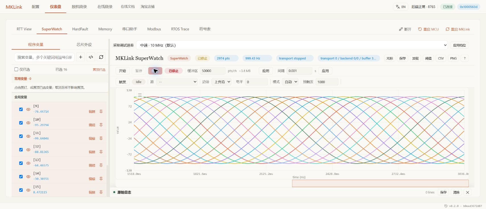
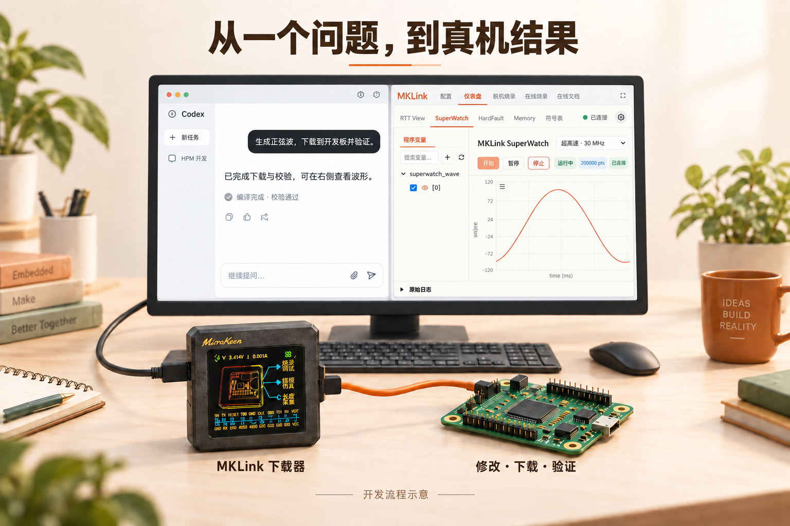
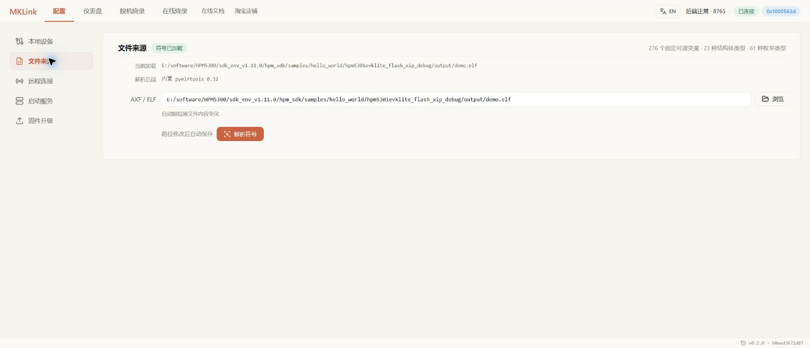
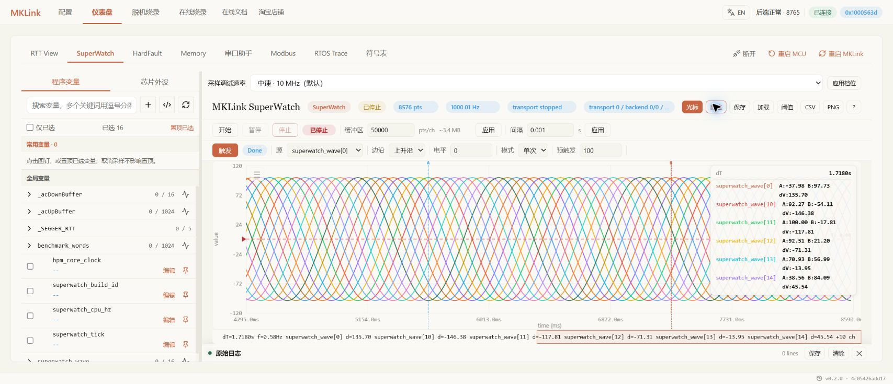
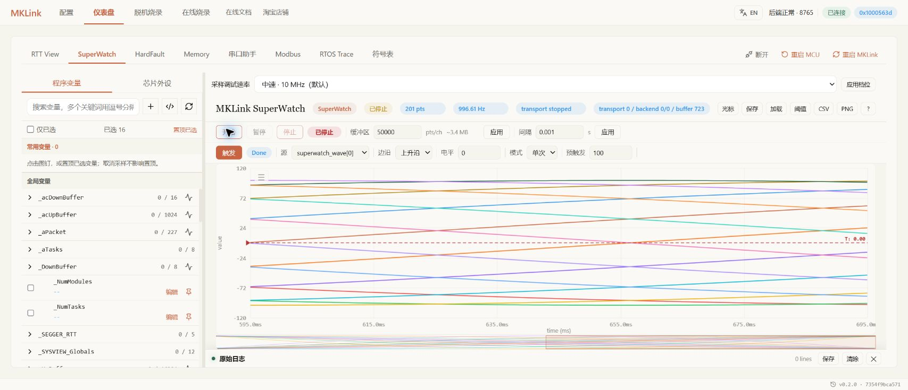
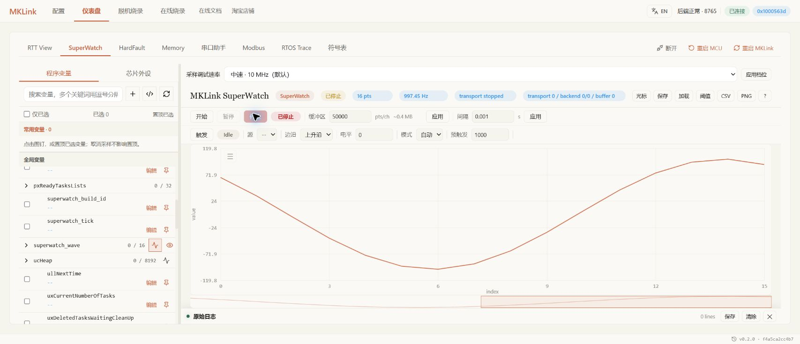
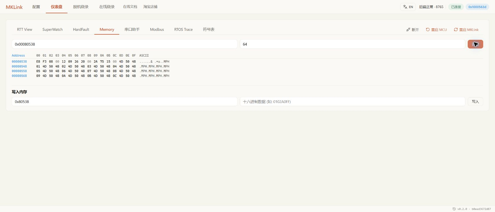
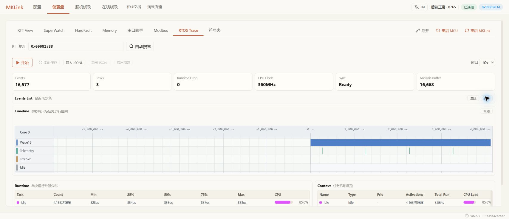

# MKLink × 先楫 HPM：改完代码，直接看真机结果

**程序烧进去了，然后呢？**

做控制算法，想知道曲线有没有过冲；调通信，想知道指令有没有收到；改任务周期，想知道程序是否按时运行。工程师真正关心的，是改动在板子上产生了什么结果。

用 MKLink，可以把这些问题直接交给 AI：修改工程、编译下载、读取日志、采集变量，再打开网页看结果。你负责提出目标、判断效果，重复的设备操作由 AI 接着做。

*这是板上运行的 16 路变量，不是模拟曲线。幅值 ±100、频率 1 Hz，相邻通道相差 22.5°。*

## 持续 10 万次/秒，16 路变量一起看

**HPM6E80 单变量持续读取约 10 万次/秒，连续 64 B 每秒完整更新约 9,123 组，连续 RAM 读取约 0.965 MiB/s。** 4、10、20、30 MHz 四档可选，默认 10 MHz。

| 采样内容 | 4 MHz | 10 MHz | 20 MHz | 30 MHz |
| --- | ---: | ---: | ---: | ---: |
| 单个 RAM 变量 | 34,400 次/秒 | 60,428 次/秒 | 86,848 次/秒 | **100,358 次/秒** |
| 连续 64 B | 2,492 组/秒 | 4,934 组/秒 | 7,605 组/秒 | **9,123 组/秒** |
| 连续 RAM 4 KiB | 0.264 MiB/s | 0.513 MiB/s | 0.785 MiB/s | **0.965 MiB/s** |

*HPM6E80 真机实测，统计完整数据的持续读取速度。连续 64 B 相当于 16 个 32 位值，读完整组才计一次；读取速度不等于网页刷新帧率。*

HPM5301 在 30 MHz 下，连续 64 B 实测约 **9,092 组/秒**。

## 第一次用，先让一组波形跑起来

准备好连接的开发板，在 AI 开发环境中安装 [MKLink Skill](../../embedded-ai/getting-started/skill.md)，并告诉 AI 工程所在位置和准确板型。本例从 HPM SDK 的 `hello_world` 开始，也可以使用[配套示例源码](../../assets/examples/hpm5301-hello-world/hpm5301-doc-fixtures.zip)。

接下来，把目标说清楚：

> 给 hello_world 加 16 路错相正弦波，幅值 ±100、频率 1 Hz。下载到板子，打开网页让我看。

AI 完成设备操作后，你在网页的 **仪表盘 → SuperWatch** 选择波形变量，点击“开始”，就能观察实际变化。需要截图时，可以自己导出，也可以让具备浏览器操作能力的 AI 保存。

**下一步不必从头配置。** 比如继续说：“把频率改为 2 Hz，重新下载，用相同条件比较两次波形。”工程、采集数据和预期目标都在同一次讨论里。

*开发流程示意（AI 生成）：左侧交代目标，右侧查看波形。*

开始前确认板型与接线，按接入说明完成安装。网页与 AI 切换操作时，先结束当前采集。

## 改完程序，怎样确认真的下载成功？

下载窗口显示完成，只是第一步。更有用的是确认：**板子现在运行的，确实是刚改过的程序。**

> 把当前程序下载并校验，再看一下日志，确认新程序跑起来了。

AI 可根据工程核对镜像位置、完成下载与回读，再查看运行变量。你不需要记住下载命令，也不需要手工抄变量地址。

打开 **在线烧录**，选择目标器件、板卡和编译生成的 BIN，核对镜像基址后开始。完成时检查校验结果，再到 RTT 或 SuperWatch 看启动信息与运行计数。

*HPM5301 在线下载实机界面：核对镜像与地址，查看完成状态。*

HPM 使用 ROM API 下载，无需选择 FLM。本文两块板的示例镜像基址均为 `0x80000400`，但自己的工程仍应以实际构建结果为准。重新编译后，同时更新 BIN 与 ELF：前者用于下载，后者让网页找到正确的变量。

*在“配置”中加载同次构建的 ELF，后续便可按变量名查找，不必照抄内存地址。*

## 算法改得对不对？先看曲线

只看某一时刻的值，很难发现过冲、抖动和相位偏差。SuperWatch 将运行中的变量画成曲线，适合观察算法输出、控制状态和随时间变化的参数。

> 看这几个变量 5 秒，检查幅值和周期。保存下来，改完再比较。

进入 **SuperWatch**，搜索并展开变量，勾选需要的通道。日常观察先用默认 **10 MHz**、间隔 **1 ms**，点击“开始”；看到关注的变化后点击“停止”，保留曲线分析。

观察数组时，选择各个元素可得到多路连续曲线；选择数组父项则用于查看元素分布。前面的 16 路正弦就是选择 `[0]` 至 `[15]` 的结果。

### 量周期、看差值：把光标放上去

打开“光标”，将 A/B 放到两个关注的位置，就能查看时间差与数值差。测量周期时，选择同一通道相邻的两个波峰；图中的频率读数取决于光标间隔，不是自动识别结果。

### 偶发变化一闪而过：用单次触发留住它

例如想观察变量从负值变成正值的一刻：选择该变量为触发源，设置“上升沿”、阈值 `0`、模式“单次”，再开始采集。达到条件后，曲线自动保留。

*本例配置保留触发前 100 点、触发点及后 100 点，共 201 点。适合检查事件发生前后发生了什么。*

### 查一段缓冲区：切到数组快照

想检查采样缓冲区、查找表或算法中间结果时，选择数组，设置起始元素与数量，再开始读取。此时横轴是元素索引，可以直接观察整段数据的分布。

完成观察后，用 **PNG** 保存画面，用 **CSV** 保存数据。把 CSV 交给 AI，可以继续计算幅值、周期和修改前后的差异。示例导出文件见[16 路波形数据](../../assets/examples/hpm5301-hello-world/superwatch-export.csv)。

## 不接串口，也能收日志、发指令

RTT 通过调试口双向通信，不占用业务 UART。初始化日志和指令回显可以在同一个页面查看；接好自己的命令行后，还能直接查状态、改参数。

> 给初始化和状态切换加点日志，再发一次 HPM_OK，看看板子有没有收到。

打开 **RTT View**，使用当前工程的 RTT 地址或搜索功能，点击“开始”。底部输入框可以发送短文本，接收区显示目标的日志和回显。结束后停止接收，再切换到其他采集功能。

*运行日志与指令回显，在同一个窗口查看。*

目标程序需要先集成 RTT；配套源码已经提供扩展配置。图中演示的是短文本回显，完整命令行需要连接工程自己的命令处理。可以让 AI 完成接入，再回到网页确认。没有日志时，先检查运行状态、代码是否输出以及符号文件是否匹配。

## 数据为什么不对？直接检查内存

波形上的异常，可能来自变量类型、初始化内容或写入位置。Memory 适合查看原始字节，也适合在明确的测试区内检查一次写入是否生效。

> 看看这个变量的值和类型对不对。要试写就先备份，读回来确认后恢复。

在 **Memory** 填入待查看的地址与长度，点击读取。地址可让 AI 从当前工程符号中查找。需要修改时，只操作自己明确预留的测试变量，写入后重新读取核对。

*直接查看板上内存；试写时使用工程预留的测试区域。*

RAM 中的修改通常不会跨复位保存。要长期保留参数，应回到工程修改相应配置。对于正在更新的多个变量，连续读取也不等于同一时刻的原子快照。

## 任务有没有按时运行？打开时间线

变量变化异常，不一定是算法本身的问题。FreeRTOS 工程还可以结合任务时间线，查看任务何时运行、如何切换，再回到代码分析。

> 把任务时间线采下来，看看波形更新和日志任务有没有互相影响。

目标程序完成 SystemView 适配后，打开 **RTOS Trace** 开始采集，查看任务列表和运行片段，停止后检查事件记录。

*配套 RTOS 示例中，Wave16 更新波形，Telemetry 输出日志。裸机 hello_world 需要先加入相应 RTOS 与跟踪支持。*

## 同一个程序要反复下载？保存成脱机任务

调试确认后的程序，可以连同下载配置保存到 MKLink。以后重复烧录时，直接使用准备好的任务，减少重复选择文件和填写参数。

> 把这个程序做成脱机任务，执行一次，确认板子运行正常。

打开 **脱机烧录**，选择器件、板卡和 BIN，首次将次数设为 `1`。点击“生成预览”核对配置，再“部署到 U 盘”，最后“触发测试”。

*HPM5301 脱机任务配置。换工程后重新生成任务，避免沿用旧镜像。*

部署成功表示文件已保存到下载器；还要查看执行日志，确认烧录结束，并检查目标程序是否运行。

*从网页触发任务后，查看下载器执行日志，确认程序下载完成。*

## 换成自己的工程，照样从问题开始

不必一次打开所有功能。想确认新程序运行，就看下载校验和启动日志；想比较算法变化，就看波形和 CSV；想查数据内容，就读 Memory；想解释任务关系，就看 RTOS 时间线。

把问题、工程和预期结果告诉 AI，完成一轮后在网页核对。下一轮沿用同样的采样条件，变化就更容易比较。

外设字段、VOFA、串口与 Modbus 还有各自的观察入口，可按工程需要继续使用。HPM6E80 目前已有下载、采样和 GUI 实测；本文 RTT、Memory、脱机与任务时间线采用 HPM5301 例程展示。

- [接入 MKLink Skill](../../embedded-ai/getting-started/skill.md)
- [示例源码与数据](../../assets/examples/hpm5301-hello-world/README.md)
- [HPM6E80 工程与性能](hpm6e80.md)
