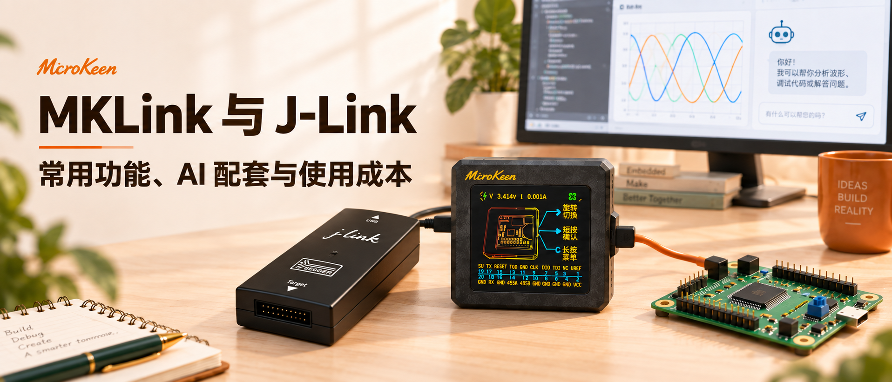
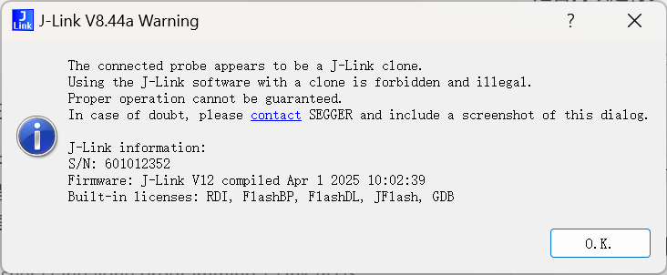
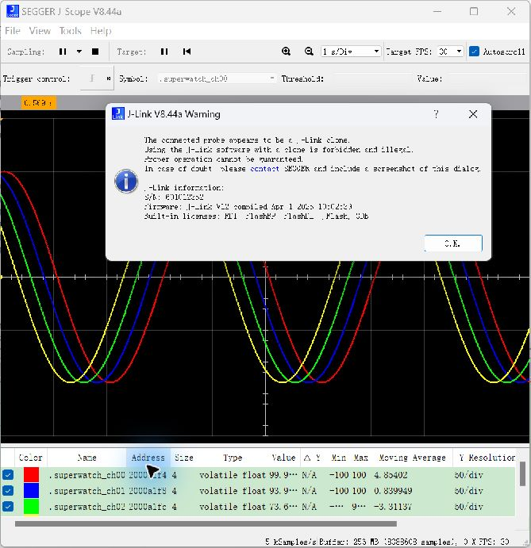

# MKLink 与 J-Link：常用功能、AI 配套与使用成本

> **摘要**：从日常下载调试，到 AI 协作与脱机烧录，MKLink 与 J-Link 各有哪些特点？本文结合真机实测，对比常用功能、AI 配套和使用成本，看看 MKLink 如何将调试、数据观察与重复烧录整合到一台设备中，为工程师选型提供参考。

MKLink 已覆盖工程师通常使用 J-Link 完成的大多数日常工作：在线下载、断点单步、读取内存、RTT 命令行，以及运行变量和任务状态观察。

在这些基础上，MKLink V4 还把 **AI 配套工具、Web GUI、设备端脚本和独立脱机下载** 集成到一起。研发时连接电脑调试，程序定型后保存成脱机任务，同一台设备继续用于重复烧录。

*30 MHz 档，9 路错相正弦波。波形由 STM32 程序产生，SuperWatch 通过调试接口读取。*

## 四字节变量实测突破 20 万次/秒

在 STM32F103RET6 上，MKLink 的 **30 MHz 档单变量持续采集，20 秒实测约 20.17 万次/秒**。同时观察 4 个连续变量，每秒完整更新约 **3.22 万组**；连续 RAM 读取超过 **1 MiB/s**。

| 采集内容 | 低速 4 MHz | 中速 10 MHz | 高速 20 MHz | 极速 30 MHz |
| --- | ---: | ---: | ---: | ---: |
| 单个 RAM 变量，4 B | 61,011 次/秒 | 116,901 次/秒 | 175,057 次/秒 | **193,449 次/秒** |
| 4 个连续变量，共 16 B | 10,152 组/秒 | 20,063 组/秒 | 28,372 组/秒 | **32,213 组/秒** |
| 连续 RAM，每块 4 KiB | 274.837 KiB/s | 578.965 KiB/s | 881.522 KiB/s | **1,061.556 KiB/s** |

*STM32F103RET6 真机实测，按完整采集时段的数据时间戳统计持续读取速度。变量全部读完才算一组；读取速度不等于程序更新变量的频率或网页刷新帧率。*

## 都能接 AI，MKLink 提供现成的配套入口

J-Link 有 Commander 命令行、GDB Server 和 SDK，AI 可以调用它们完成下载、读内存和调试。MKLink 的价值在于将常用操作与 AI 工具、数据保存和网页观察配套提供。

MKLink 提供的是配套的 **Skill、CLI、MCP 与 Web GUI**。工程师交代目标，AI 负责选工具、查变量和执行操作；需要判断波形、日志或内存内容时，打开网页查看。

> 把程序编译并下载，看看系统节拍和任务计数有没有在走。

## 一次交代采集任务，让 AI 少做重复工作

**MKLink 内部集成 PikaPython，将连续读取封装成设备端采集任务。**
配置好变量与周期后，由下载器持续采样，输出带时间戳的数据。AI 不必为每个采样点重新发起一次工具调用。

> 把这几个变量连续采 5 秒，保存数据，帮我看看周期和相位有没有问题。

这句话背后，配套工具负责查找变量、启动采集、接收数据并保存文件；AI 得到采集结果后，再按问题需要读取片段或分析摘要。Web GUI 则让工程师直接看见曲线。

| 工作方式 | AI 需要处理什么 | 数据怎样进入分析 |
| --- | --- | --- |
| 围绕单次读内存临时编排 | 安排重复读取、解析返回值、拼接时序 | 容易产生大量调用记录和原始文本 |
| MKLink 配套连续采集 | 指定变量、周期、时长，检查结果 | 连续数据保存成文件，按需读取与分析 |

**少一些工具往返，少一些原始文本，更容易把上下文留给问题本身。** 对原先逐次调用、逐次返回数据的流程，这种方式能降低调试编排复杂度，也有助于节省 token。节省多少取决于工具输出与分析方式；把整份原始数据全部塞进对话，仍会消耗上下文。

## MKLink，把Jlink的常用调试和脱机能力一起配齐

| 工程师要做什么 | MKLink V4 | J-Link / SEGGER 工具体系 |
| --- | --- | --- |
| IDE 下载、断点和单步 | CMSIS-DAP 接入兼容 IDE | 原生 J-Link 调试支持，成熟的 IDE 生态 |
| 让 AI 操作设备 | 配套 Skill、CLI、MCP | Commander、GDB Server、SDK，可用于构建自动化流程 |
| 连续看变量 | SuperWatch，在 Web GUI 中按符号选择 | J-Scope，支持 HSS、RTT 等采集方式 |
| 不接 UART 使用命令行 | Web RTT View 收发命令、查看日志 | RTT Viewer / RTT Client 等入口 |
| 查内存、异常和任务调度 | Memory、HardFault、RTOS Trace 集中在仪表盘 | J-Mem、调试器及 SystemView 等工具 |
| 在线烧录 | IDE 或 Web 在线烧录，检查镜像、下载和校验 | Commander、IDE、J-Flash 等；功能授权按型号确认 |
| 脱离电脑重复烧录 | 内置存储与脱机任务，保存后可独立执行 | SEGGER 对应独立脱机需求的产品是 Flasher 系列 |
| UART、RS485、Modbus 调试 | 内置 UART、RS485，配套串口与 Modbus 入口 | 部分型号内置 VCOM；RS485、Modbus 按外部接口与工具配置 |

## SuperWatch 的重点：直接读变量，也能把数据用起来

调 PID 时，知道反馈值“现在是 998”还不够。更关心的是：目标跳变后多久跟上，有没有过冲，输出有没有碰到限幅。

SuperWatch 从匹配的 AXF/ELF 查找变量，经调试口持续读取，不需要为画曲线编写串口打包代码。在同一页面可以完成多通道显示、A/B 光标、触发、数组观察，以及 CSV、PNG 导出。

> 保存这次曲线，帮我比较修改前后的过冲和稳定时间。

*板上的 PID 演示模型，用于观察目标、反馈与输出关系。*

J-Scope 同样具备变量曲线、触发和数据保存功能。MKLink 的特点是把 SuperWatch 与 AI 操作、Memory、RTT 等入口放在同一套工作环境中，便于从“看到异常”继续追到“找到原因”。

## RTT：不接串口，也能发命令

**RTT 本身来自 SEGGER，J-Link 同样擅长这项功能。** 只要目标程序接好 RTT 命令行，两者都可以通过调试接口交互，不需要额外占用 UART 引脚。

MKLink 将它放进 Web GUI：打开 **RTT View**，输入 `help` 查看命令，输入程序支持的指令查询状态、调整参数或触发操作。也可以交给 AI 发送并解释返回结果。

> 发个 help，看看板子支持哪些命令，再查一下运行状态。

这里的便利是入口统一。看完命令回显，再切到 SuperWatch 观察变化，或到 Memory 检查变量内容。

## 开发时在线调试，交付时直接脱机下载

在线下载并不是 MKLink 独有。J-Link 的 Commander、IDE 集成和 J-Flash 都能承担相应工作。MKLink 提供 Web 在线烧录入口，也可以让 AI 根据工程完成编译、下载、校验和运行检查。

> 把当前程序下载并校验，再确认任务计数在递增。

程序确认好之后，小批量烧录又是另一种需求：电脑能否拿走，操作员能否按键执行，多个镜像能否按顺序下载。

MKLink V4 可以保存固件和任务，通过按键或机台触发重复执行。屏幕显示与多脚本选择，让同一台设备从研发调试继续用于工位，无需为这项基础脱机需求再添一台专用烧录器。[MKLink 脱机下载](flashing/offline-flash.md)

## 除了波形，排查还要接得上

遇到异常值，Memory 可以查看原始内存；进入 HardFault，可以结合异常现场与源码定位；线程之间互相影响，可以查看 RTOS Trace。MKLink 把这些入口放在同一仪表盘里，AI 可以围绕同一个工程继续分析。

> 保留异常现场，找到对应代码，解释为什么会走到这里。

在 **RTOS Trace** 开始采集，展开任务列表，查看运行片段。线程之间的切换关系直接出现在时间线上。

这些能力各有前提：符号文件要匹配固件，RTT 和任务跟踪需要程序适配，寄存器解释也要对应目标内核。统一入口减少操作切换，工程师仍要判断结论。

## 盗版设备的弹窗，也是使用成本

SEGGER 软件将连接的探针识别为疑似仿制设备，并提示无法保证正常工作。

波形采集时，J-Scope 也再次弹出了同类提示。对手动调试，它意味着额外确认；对 AI 连续操作或自动化脚本，它会打断原本无需人工看守的流程。

SEGGER 的软件使用条款限定其软件用于原厂及授权 OEM 产品。因此，低价盗版不能按“同等正版功能、同等支持”来计算采购成本。

**MKLink 使用自己的配套工具和 CMSIS-DAP 接口，不需要冒充 J-Link 身份来使用。** 对希望让 AI 持续执行下载、采集和检查的工程师，设备身份、软件更新与日常操作能否稳定配合，同样值得比较。

## 哪些工程师值得选购？

如果你需要的是日常 MCU 开发，希望 AI 接手重复的设备操作，自己通过网页看曲线、发命令、查内存，并且偶尔需要脱机重复烧录，**MKLink V4 是值得优先考虑的一台工具。**

它的价值来自几件经常用到的事放在一起：

- **常用功能覆盖完整**：下载、断点单步、内存读写、RTT 与运行观察；
- **AI 更容易用起来**：配套 Skill、CLI、MCP，连续采集减少重复编排和上下文文本；
- **结果看得见**：Web GUI 展示曲线、命令回显、异常现场和任务时间线；
- **同一台设备继续用于烧录工位**：保存任务后，可脱离电脑重复执行；
- **采购门槛低**：358 元含线材，适合个人开发者、研发团队和小批量生产。

这里的功能覆盖指日常 MCU 开发需求。特定芯片支持、SEGGER 专有调试能力、工具授权和高级跟踪需求，仍应按项目核对；已有稳定 J-Link 工具链的团队也可以按实际分工搭配使用。

**在上述常用场景里，以更低的投入同时获得调试、AI 配套和脱机能力，就是 MKLink V4 值得选购的理由。**

[MKLink V4 官方店铺](https://item.taobao.com/item.htm?ft=t&id=1020501356342) · [产品与功能总览](overview.md) · [接入 AI](../embedded-ai/getting-started/skill.md) · [STM32 实战](../embedded-ai/cases/stm32f103-rt-thread.md) · [HPM 实战](hpm/overview.md)
