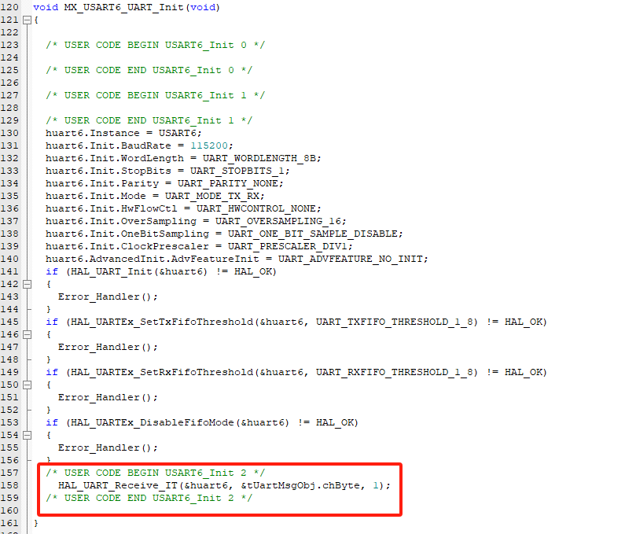
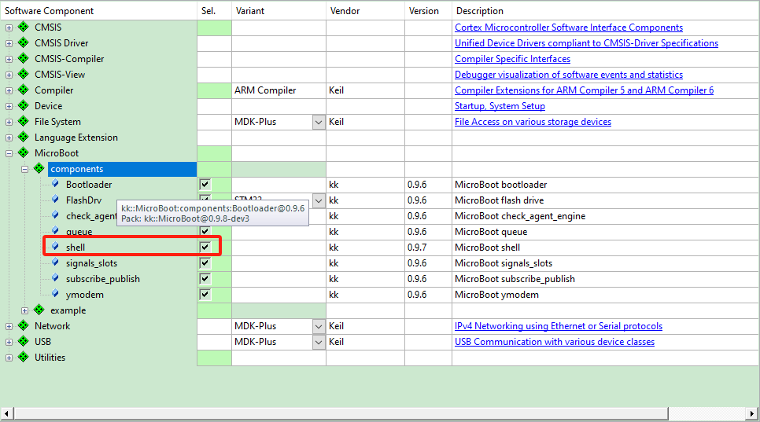

# 基于 CMSIS-PACK 移植

## 1.准备工作

准备一份基础的裸机源码 (可通过 STM32CubeMx 可视化软件创建也可按照工程项目所需文档手动创建) 工程，如一份 stm32 包含一个支持 **printf 的串口初始化**代码。

基于CMSIS-PACK移植的DEMO例程地址：

github：[https://github.com/Aladdin-Wang/MicroBoot_Demo](https://github.com/Aladdin-Wang/MicroBoot_Demo)

gitee：[https://gitee.com/Aladdin-Wang/MicroBoot_Demo](https://gitee.com/Aladdin-Wang/MicroBoot_Demo)

## 2.安装Pack包

在 **MDK** 中部署 **MicroBoot **的第一步是获取对应的 **cmsis-pack**，对于可以流畅访问 Github 的朋友来说，通过下面的网址直接找到最新的 .pack 文件。

[https://github.com/Aladdin-Wang/MicroBoot/releases](https://github.com/Aladdin-Wang/MicroBoot/releases)

下载结束后双击文件进行安装,一路 Next 安装即可


## 3.添加MicroBoot到工程

**步骤一：加入组件** 

在 MDK 工程中通过工具栏的快捷按钮，来打开 RTE 配置窗口：


在 Manage Rum-Time Environment 里 "Software Component" 栏找到 MicroBoot，并将其展开：

如果只想使用MicroBoot的ota功能，可以勾选ymodem_ota，如下图所示，你会发现在窗口中看到橙色的警告：


这里警告的含义是说：**ymodem_ota**依赖了其他模块，但你没有勾选它们。简单的单击左下角的 Resolve 按钮，RTE会自动帮你勾选上所依赖的模块。


单击“OK” 按钮完成组件的添加。

根据芯片类型选择FLASH的驱动程序：


**步骤二：配置编译环境**

如果你使用**Arm Compiler 6（armclang）**，则需要打开对**C11**和**GNU扩展**的支持，即直接在"Language C"中选择“**gnu11**”：


**步骤三：模块配置**

在工程管理器中展开 **MicroBoot**，并找到新加入的用户适配器文件（**user_app_cfg.h**)，双击打开后，在编辑器的左下角选择 **Configuration Wizard**，进入图形配置界面：


配置bootloader的参数：

- The starting address of the app：从bootloader跳转到APP的地址；
- The app size：APP占用FLASH的大小，必须对扇区对齐；
- The Boot Flash Ops Addr：对flash进行擦写函数的地址，使用默认值；

**步骤四：添加代码**

假设你以串口（其他串行外设方法类似）的方式传输数据，在usart.h中，添加信号：


在usart.c中，添加data_msg_t的定义


打开串口接收数据中断



在中断接收回调函数中，发射信号：


实现一个串口发送接口：


在main.c中包含头文件：

```c
#include "ymodem_ota.h"
#include "check_agent_engine.h"
```

添加对象

```c
__attribute__((aligned(32)))
uint8_t s_chBuffer[2048] ;
static byte_queue_t                  s_tCheckUsePeekQueue;
static fsm(check_use_peek)           s_fsmCheckUsePeek;
static ymodem_ota_recive_t           s_tYmodemOtaReceive;
```

实现一个获取系统运行时间的函数：

```c
int64_t get_system_time_ms(void)
{
    return HAL_GetTick();
}
```

在**main()** 函数中加入代码：

```c

int main(void)
{
    /* USER CODE BEGIN 1 */

    /* USER CODE END 1 */

    /* MCU Configuration--------------------------------------------------------*/

    /* Reset of all peripherals, Initializes the Flash interface and the Systick. */
    HAL_Init();

    /* USER CODE BEGIN Init */

    /* USER CODE END Init */

    /* Configure the system clock */
    SystemClock_Config();

    /* USER CODE BEGIN SysInit */

    /* USER CODE END SysInit */

    /* Initialize all configured peripherals */
    MX_GPIO_Init();
    MX_USART6_UART_Init();
    /* USER CODE BEGIN 2 */
    queue_init(&s_tCheckUsePeekQueue, s_chBuffer, sizeof(s_chBuffer));
    init_fsm(check_use_peek, &s_fsmCheckUsePeek, args(&s_tCheckUsePeekQueue));
		
    ymodem_ota_receive_init(&s_tYmodemOtaReceive, get_read_byte_interface(&s_fsmCheckUsePeek));
    agent_register(&s_fsmCheckUsePeek, &s_tYmodemOtaReceive.tCheckAgent);

    connect(&tUartMsgObj, SIGNAL(uart_sig), &s_tCheckUsePeekQueue, SLOT(enqueue_bytes));
    connect(&s_tYmodemOtaReceive.tYmodemReceive, SIGNAL(ymodem_rec_sig), &huart6, SLOT(uart_sent_data));

    /* USER CODE END 2 */

    /* Infinite loop */
    /* USER CODE BEGIN WHILE */
    while (1) {
        /* USER CODE END WHILE */

        /* USER CODE BEGIN 3 */
        call_fsm( check_use_peek,  &s_fsmCheckUsePeek );
    }

    /* USER CODE END 3 */
}
```

**步骤五：验证升级功能**

以上就完成了对 **MicroBoot** 模块基本功能的配置，编译下载，如果一切顺利，你应该可以在串口助手中看到3秒钟打印一个字母“C”。


使用 Xshell等带有Ymodem协议的串口助手，来下载文件：


或者直接使用MicroLink进行下载，MicroLink内置Ymodem协议，将需要升级的bin文件，直接拷贝到虚拟U盘中，即可自动完成下载。


## 4.添加shell命令行工具到工程

添加shell组件：



在main.c中添加头文件：

```c
#include "micro_shell.h"

```

添加micro_shell的对象，并实现shell读写数据的函数

```c
static check_shell_t                 s_tShellObj;
uint16_t shell_read_data(wl_shell_t *ptObj, char *pchBuffer, uint16_t hwSize)
{
    peek_byte_t *ptReadByte = get_read_byte_interface(&s_fsmCheckUsePeek);
    return ptReadByte->fnGetByte(ptReadByte, (uint8_t *)pchBuffer, hwSize);
}

uint16_t shell_write_data(wl_shell_t *ptObj, const char *pchBuffer, uint16_t hwSize)
{
	HAL_UART_Transmit(&huart6, (uint8_t *)pchBuffer, hwSize, 100);
	return hwSize;
}
```

在main函数中注册shell

```c
    shell_ops_t s_tOps = {
        .fnReadData = shell_read_data,
		.fnWriteData = shell_write_data,
    };
    shell_init(&s_tShellObj,&s_tOps);
	agent_register(&s_fsmCheckUsePeek, &s_tShellObj.tCheckAgent);
```

完成以上，下载后便可使用命令行功能


