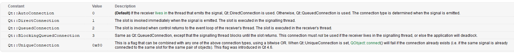

# C语言模拟QT的信号与槽功能

---

## 前言
使用过QT的朋友，应该都对QT的信号与槽机制深有体会，它可以非常方便的实现类与类之间的解耦合、实现对象与对象之间的解耦合、实现两个cpp文件之间的解耦合。

既然信号槽如此好用，嵌入式开发也想拥有，下边就开始用C语言一步步实现它吧...

---


## 一、Qt信号与槽的实现机理
在Qt中实现信号与槽最重要的就是通过元对象系统(MOS)的元对象编译器(MOC)将我们定义的需要使用到信号与槽的类中的信号及信号调用槽函数的方法进行定义（这一步就会生成与源文件对应的moc_xx.cpp文件），然后通过系统提供的关联方法(connect)将信号与槽建立一一对应关系，当发射信号（其实就是调用信号函数）时就会通过信号与槽的对应关系找到对应槽函数进行调用。

这样的好处就是对于使用者而言不必去关心函数指针回调函数这些对于初学者比较不太容易搞清晰的东西，简化了使用者的操作。当然就像我们在享受幸福生活的时候，就一定有人在我们背后默默付出砥砺前行！这里也一样，对于我们使用者简化了操作，那为了实现这样的效果就需要在后台提供更多的支持。

QT Creator官方帮助文档对信号槽使用方法做了详细的介绍，接下来我们就依照官方的使用方法，依葫芦画瓢，用C语言的宏模拟出山寨版的信号和槽。

## 二、简化后的实现步骤
## 1. 定义一些必要的宏
先无脑定义一些与QT中一模一样的宏，然后再思考如何实现它的功能。
```c

#define signals //定义信号

#define emit   //发射信号

#define slots  //定义槽

#define connect //链接信号与槽

#define SIGNAL(x) 

#define SLOT(x) 


```

信号槽的核心机制是**当发射信号时会通过信号与槽的对应关系找到对应槽函数进行调用。** 
我们所要模拟的正是这个核心机制。任务明确了，就开始实现这些宏吧！

###  2. 实现声明信号的宏
QT中定义信号是在类中使用signals声明一个函数，不需要自己实现信号函数，在生成的moc文件中，代替你实现了你声明的信号函数，所以**发射信号的本质就是通过调用信号函数，再调用槽函数**。

既然调用发射信号，就是调用槽函数，那么理论上，只需要把槽函数的地址赋值给一个发射信号的函数指针，就完成偷梁换柱了。

想要定义函数指针，首先需要知道函数类型，那么使用signals宏声明信号，就可以用来声明一个函数类型，然后用这个函数类型，去定义函数指针。

实现定义信号的宏:
```c
#define signals(__NAME,...)               \
          typedef void __NAME( __VA_ARGS__);
```
###  3. 实现发射信号的宏
发射信号就是，利用声明好的函数类型，定义一个函数指针，然后把槽函数地址赋给这个函数指针，然后执行这个函数指针的一段代码：
```c
#define emit(__NAME,__OBJ,...)                     \
           do{                                          \
               sig_slot_t *ptObj = &((__OBJ)->tObject);                \
		       __NAME *__RecFun = ptObj->ptRecFun;   \
		      执行__RecFun((__OBJ)->ptRecObj,__ARG1,__ARG2, __ARG3,...) \
           }while(0)              \
```
其中__NAME是信号名称，__OBJ是信号所在对象的地址，...是可变参数。
这里重点来了，由于执行__RecFun这个函数的时候，我们并不知道有多少个参数，所以无法直接如上边代码那样带入参数，我们必须知道...代表的是几个参数，那么就可以知道使用几个__ARG了。

这个时候，如果看过上篇文章[C语言变参函数和可变参数宏](https://blog.csdn.net/sinat_31039061/article/details/128338331?spm=1001.2014.3001.5502)，应该就能立马想到我们其实已经实现了一个可以获得可变参数宏中参数数量的宏了：`#define VA_NUM_ARGS(...)` ，利用它，宏的重载就可以信手捏来了。先来它8个参数的，应该够用了
```c
#define __RecFun_0(__OBJ)                                     \
            __RecFun((__OBJ))

#define __RecFun_1(__OBJ, __ARG1)                         \
            __RecFun((__OBJ),(__ARG1))

#define __RecFun_2(__OBJ, __ARG1, __ARG2)                         \
            __RecFun((__OBJ),(__ARG1), (__ARG2))

#define __RecFun_3(__OBJ, __ARG1, __ARG2, __ARG3)                 \
            __RecFun((__OBJ),(__ARG1), (__ARG2), (__ARG3))                         

#define __RecFun_4(__OBJ, __ARG1, __ARG2, __ARG3, __ARG4)                 \
            __RecFun((__OBJ),(__ARG1), (__ARG2), (__ARG3), (__ARG4))    
            
#define __RecFun_5(__OBJ, __ARG1, __ARG2, __ARG3, __ARG4, __ARG5)                 \
            __RecFun((__OBJ),(__ARG1), (__ARG2), (__ARG3), (__ARG4), (__ARG5))  

#define __RecFun_6(__OBJ, __ARG1, __ARG2, __ARG3, __ARG4, __ARG5, __ARG6)                 \
            __RecFun((__OBJ),(__ARG1), (__ARG2), (__ARG3), (__ARG4), (__ARG5), (__ARG6)) 

#define __RecFun_7(__OBJ, __ARG1, __ARG2, __ARG3, __ARG4, __ARG5, __ARG6, __ARG7)                 \
            __RecFun((__OBJ),(__ARG1), (__ARG2), (__ARG3), (__ARG4), (__ARG5), (__ARG6), (__ARG7)) 

#define __RecFun_8(__OBJ, __ARG1, __ARG2, __ARG3, __ARG4, __ARG5, __ARG6, __ARG7, __ARG8)                 \
            __RecFun((__OBJ),(__ARG1), (__ARG2), (__ARG3), (__ARG4), (__ARG5), (__ARG6), (__ARG7), (__ARG8)) 
 
```
直接使用开源的面向对象模块PLOOC中已经封装好的__PLOOC_EVAL，来自动选择正确的函数即可，重新实现emit
```c
#define __emit(__OBJ,...) \
   		   __PLOOC_EVAL(__RecFun_,##__VA_ARGS__)              \
                   ((__OBJ)->ptRecObj,##__VA_ARGS__); 

#define emit(__NAME,__OBJ,...)                     \
           do{                                          \
               sig_slot_t *ptObj = &((__OBJ)->tObject);                \
		       __NAME *__RecFun = ptObj->ptRecFun;   \
		      __emit(ptObj, __VA_ARGS__) \
           }while(0)  
           
```
这样发射信号的时候，执行的就是槽函数了，槽函数的第一个参数始终为槽所在的对象地址，从而就完成了对象与对象之间的解耦。
###  4. 取代QObject类
实现发射信号的宏时候，我们需要知道槽函数的地址，和槽函数所在对象的地址，我们定义一个类：

```c
typedef struct sig_slot_t sig_slot_t;
typedef struct sig_slot_t{
	char   chSenderName[SIG_NAME_MAX];//信号名称
    void * ptSenderObj;  //信号所在对象的地址
	void * ptRecObj;    //槽所在对象的地址
	void * ptRecFun;   //槽函数的地址
}sig_slot_t;
```
然后重新定义一个宏，来取代QObject的地位：

```c
#define SIG_SLOT_OBJ  sig_slot_t tObject;
```
然后用法就和QT中一样了，在需要信号的地方，给结构体中，加入SIG_SLOT_OBJ  。
###  5. 实现connect函数
接下来就只剩一个把信号和槽连接起来的宏了

```c
void connect(void *SenderObj, const char *ptSender,void *RecObj,void *RecFun)
{
    if(SenderObj == NULL || ptSender == NULL || RecObj == NULL || RecFun == NULL){
        return;
    }
    sig_slot_t * ptMetaObj = SenderObj;
    ptMetaObj->ptRecFun = RecFun;
    ptMetaObj->ptRecObj = RecObj;
    memcpy(ptMetaObj->chSenderName,ptSender,strlen(ptSender));          
    }while(0);
}
```
###  6. 可有可无的slots
因为槽函数实际上就只是个函数而已，为了与信号遥相呼应，也实现一下：
```c
#define __slots(__NAME,...)             \
            void __NAME(__VA_ARGS__);
            
#define slots(__NAME,__OBJ,...)  \
            __slots(__NAME,_args(__OBJ,##__VA_ARGS__))
```
## 三、完整的代码实现
以上代码只是展示核心部分，并且仅实现了一个信号对应一个槽，不能一个信号对应多个信号和槽，还有诸多类型检查，空指针检查等需要优化的地方，以下是完整的代码实现：

signals_slots.h文件
```c
#ifndef __SIGNALS_SLOTS_H_
#define __SIGNALS_SLOTS_H_
#include ".\app_cfg.h"
#if USE_SERVICE_SIGNALS_SLOTS == ENABLED
#include <stdint.h>
#include <string.h>
#include <stdbool.h>

#define __PLOOC_CLASS_USE_STRICT_TEMPLATE__

#if     defined(__SIGNALS_SLOTS_CLASS_IMPLEMENT__)
    #define __PLOOC_CLASS_IMPLEMENT__
#elif   defined(__SIGNALS_SLOTS_CLASS_INHERIT__)
    #define __PLOOC_CLASS_INHERIT__
#endif

#include "plooc_class.h"

#define SIG_NAME_MAX 20

#define SIGNAL(x) "sig_"#x

#define SLOT(x) x

#define SIG_SLOT_OBJ  sig_slot_t tObject;


#define  args(...)            ,__VA_ARGS__

#define _args(...)            __VA_ARGS__

#define __RecFun_0(__OBJ)                                     \
            __RecFun((__OBJ))

#define __RecFun_1(__OBJ, __ARG1)                         \
            __RecFun((__OBJ),(__ARG1))

#define __RecFun_2(__OBJ, __ARG1, __ARG2)                         \
            __RecFun((__OBJ),(__ARG1), (__ARG2))

#define __RecFun_3(__OBJ, __ARG1, __ARG2, __ARG3)                 \
            __RecFun((__OBJ),(__ARG1), (__ARG2), (__ARG3))                         

#define __RecFun_4(__OBJ, __ARG1, __ARG2, __ARG3, __ARG4)                 \
            __RecFun((__OBJ),(__ARG1), (__ARG2), (__ARG3), (__ARG4))    
            
#define __RecFun_5(__OBJ, __ARG1, __ARG2, __ARG3, __ARG4, __ARG5)                 \
            __RecFun((__OBJ),(__ARG1), (__ARG2), (__ARG3), (__ARG4), (__ARG5))  

#define __RecFun_6(__OBJ, __ARG1, __ARG2, __ARG3, __ARG4, __ARG5, __ARG6)                 \
            __RecFun((__OBJ),(__ARG1), (__ARG2), (__ARG3), (__ARG4), (__ARG5), (__ARG6)) 

#define __RecFun_7(__OBJ, __ARG1, __ARG2, __ARG3, __ARG4, __ARG5, __ARG6, __ARG7)                 \
            __RecFun((__OBJ),(__ARG1), (__ARG2), (__ARG3), (__ARG4), (__ARG5), (__ARG6), (__ARG7)) 

#define __RecFun_8(__OBJ, __ARG1, __ARG2, __ARG3, __ARG4, __ARG5, __ARG6, __ARG7, __ARG8)                 \
            __RecFun((__OBJ),(__ARG1), (__ARG2), (__ARG3), (__ARG4), (__ARG5), (__ARG6), (__ARG7), (__ARG8)) 
 
            
#define __signals(__NAME,...)                                    \
             typedef void PLOOC_CONNECT2(__NAME,_fun_t)( __VA_ARGS__);  

#define signals(__NAME,__OBJ,...)               \
          __signals(__NAME,_args(__OBJ __VA_ARGS__))

#define __emit(__OBJ,...) \
   		   __PLOOC_EVAL(__RecFun_,##__VA_ARGS__)              \
                   ((__OBJ)->ptRecObj,##__VA_ARGS__); 

#define emit(__NAME,__OBJ,...)                     \
           do {sig_slot_t *ptObj = &((__OBJ)->tObject);                \
               do{if(__OBJ == NULL || ptObj == NULL ) break;              \
		           PLOOC_CONNECT2(__NAME,_fun_t) *__RecFun = ptObj->ptRecFun;   \
                   if(__RecFun != NULL) __emit(ptObj __VA_ARGS__);                           \
                   ptObj = ptObj->ptNext;             \
               }while(ptObj != NULL);              \
           }while(0)

#define __slots(__NAME,...)             \
            void __NAME(__VA_ARGS__);
            
#define slots(__NAME,__OBJ,...)  \
            __slots(__NAME,_args(__OBJ,##__VA_ARGS__))

#define connect(__SIG_OBJ,__SIG_NAME,__SLOT_OBJ,__SLOT_FUN)    \
            direct_connect(__SIG_OBJ.tObject,__SIG_NAME,__SLOT_OBJ,__SLOT_FUN)

#define disconnect(__SIG_OBJ,__SIG_NAME)    \
            auto_disconnect(__SIG_OBJ.tObject,__SIG_NAME)


typedef struct sig_slot_t sig_slot_t;
typedef struct sig_slot_t{
	char   chSenderName[SIG_NAME_MAX];
    void * ptSenderObj;  
	void * ptRecObj;
	void * ptRecFun;
    sig_slot_t *ptNext;
    sig_slot_t *ptPrev;
}sig_slot_t;

void direct_connect(sig_slot_t *ptSenderObj, const char *ptSender,void *ptRecObj,void *ptRecFun);
void auto_disconnect(sig_slot_t *ptSenderObj, const char *ptSender);


#undef __SIGNALS_SLOTS_CLASS_INHERIT__
#undef __SIGNALS_SLOTS_CLASS_IMPLEMENT__

#endif
#endif /* QUEUE_QUEUE_H_ */

```
signals_slots.c文件
```c
#include "signals_slots.h"

void direct_connect(sig_slot_t *SenderObj, const char *ptSender,void *RecObj,void *RecFun)
{
    if(SenderObj == NULL || ptSender == NULL || RecObj == NULL || RecFun == NULL){
        return;
    }
    sig_slot_t * ptMetaObj = SenderObj;
    do{
        if(strstr(RecFun,"sig_")){
            memcpy(ptMetaObj->chSenderName,ptSender,strlen(ptSender)); 
            while(ptMetaObj->ptNext != NULL){
                ptMetaObj = ptMetaObj->ptNext;
            }
            ptMetaObj->ptNext = RecObj; 
            ptMetaObj->ptNext->ptPrev = ptMetaObj;          
            ptMetaObj = ptMetaObj->ptNext;
           
            memcpy(ptMetaObj->chSenderName,RecFun,strlen(RecFun));  
            break;            
        }
        
        if(strcmp(ptMetaObj->chSenderName,ptSender) == 0){
           sig_slot_t * ptSenderObj = malloc(sizeof(sig_slot_t));
           while(ptMetaObj->ptNext != NULL){
               ptMetaObj = ptMetaObj->ptNext;
           }
           ptMetaObj->ptNext = ptSenderObj;
           ptMetaObj->ptNext->ptPrev = ptMetaObj;  
           ptMetaObj = ptMetaObj->ptNext;
        }
        ptMetaObj->ptRecFun = RecFun;
        ptMetaObj->ptRecObj = RecObj;
        memcpy(ptMetaObj->chSenderName,ptSender,strlen(ptSender));  
        
    }while(0);
}

void auto_disconnect(sig_slot_t *ptSenderObj, const char *ptSender)
{
    if(ptSenderObj == NULL || ptSender == NULL){
        return;
    }
    sig_slot_t * ptMetaObj = ptSenderObj;
	if(strcmp(ptMetaObj->chSenderName,ptSender) == 0){

	   while(ptMetaObj->ptNext != NULL){
		   ptMetaObj = ptMetaObj->ptNext;
	   }
 
       while(ptMetaObj != NULL){
           ptMetaObj->ptNext = NULL;
           memset(ptMetaObj->chSenderName,0,sizeof(ptMetaObj->chSenderName));
           if(ptMetaObj->ptRecFun != NULL){
               ptMetaObj->ptRecObj = NULL;
               ptMetaObj->ptRecFun = NULL;
               sig_slot_t * ptObj = ptMetaObj;
               free(ptObj);
           }
           ptMetaObj = ptMetaObj->ptPrev;
       }
	}
}


```
## 四、使用方法与QT中的区别
##  1. SIG_SLOT_OBJ取代QObject
 SIG_SLOT_OBJ取代QObject，且只需要在信号所在的类中定义。

###  2. 定义信号不同
QT在类里面声明信号，signals宏是在结构体外声明信号，并且要指定信号名称，信号所在的对象地址，和一些自定义的参数：
```c
  signals(__NAME,__OBJ,...) 
  example：
  signals(send_sig,can_data_msg_t *ptThis,
      args(              
            uint8_t *pchByte,
            uint16_t hwLen
          ));
```
###  3. 发射信号不同
emit宏的括号内需要指定信号名称，信号所在的对象地址，和自定义的参数的数据：
```c
   emit(__NAME,__OBJ,...) 
   example：  
   emit(send_sig,&tCanMsgObj,
      args(
            tCanMsgObj.CanDATA.B,
            tCanMsgObj.CanDLC
         ));
```
###  4. 定义槽不同
与定义信号语法类似
```c
   slots(__NAME,__OBJ,...) 
   example：
   slots(enqueue_bytes,byte_queue_t *ptObj,
      args(
            void *pchByte,
            uint16_t hwLength
         ));
```
###  5. 连接信号与槽
与QT一样一个信号可以连接多个信号或者槽，但是QT支持五种连接属性，目前仅实现了其中的Qt::DirectConnection属性，也就是同步调用方式，异步方式正在持续完善中。


```c
#define connect(__SIG_OBJ,__SIG_NAME,__SLOT_OBJ,__SLOT_FUN)    \
            direct_connect(__SIG_OBJ.tObject,__SIG_NAME,__SLOT_OBJ,__SLOT_FUN)

  example：
  connect(&tCanMsgObj,SIGNAL(send_sig),&s_tFIFOin,SLOT(enqueue_bytes));

#define disconnect(__SIG_OBJ,__SIG_NAME)    \
            auto_disconnect(__SIG_OBJ.tObject,__SIG_NAME)
  example：
  connect(&tCanMsgObj,SIGNAL(send_sig));
```
## 五、信号与槽使用示例
玩信号与槽，少不了要与面向对象打交道，众所周知，C语言不是面向对象的语言，对于面向对象的特性不是很友好，不过不用担心，福利来了，裸机思维公众号作者开源了一套面向对象的C语言框架，可以轻松助你在C语言中零代价的愉快玩耍面向对象。

信号与槽的实现正是依赖了PLOOC中诸多的宏，所以首先需要下载安装PLOOC，具体方法参考：[OOPC开发从未如此简单](https://mp.weixin.qq.com/s/fjYfCysv12q-q0N_SiXDzw)

接下来实现一个将CAN接收的数据，存储到环形队列ringbuf的例子：

can.h文件

```c
#include "signals_slots/signals_slots.h"
typedef struct
{
    SIG_SLOT_OBJ;
    uint8_t  CanDLC;
    union {
        uint8_t B[8];
        uint16_t H[4];
        uint32_t W[2];
    } CanDATA;
}can_data_msg_t;

signals(send_sig,can_data_msg_t *ptThis,
      args(              
            uint8_t *pchByte,
            uint16_t hwLen
          ));
          
extern can_data_msg_t tCanMsgObj;          
```
can.c文件
```c
#include "can.h"
can_data_msg_t tCanMsgObj;
void HAL_CAN_RxFifo0MsgPendingCallback(CAN_HandleTypeDef *hcan)
{
	HAL_StatusTypeDef status;
	CAN_RxHeaderTypeDef rxheader = {0};

	status = HAL_CAN_GetRxMessage(hcan, CAN_RX_FIFO0, &rxheader, (uint8_t *)tCanMsgObj.CanDATA.B);
	if (HAL_OK != status)
			return ;
	/* get id */
	if (CAN_ID_STD == rxheader.IDE)
	{
		tCanMsgObj.CanID_t.CanID = rxheader.StdId;
	}
	else
	{
		tCanMsgObj.CanID_t.CanID = rxheader.ExtId;
	}
	/* get len */
	tCanMsgObj.CanDLC = rxheader.DLC;	

    emit(send_sig,&tCanMsgObj,
        args(
            tCanMsgObj.CanDATA.B,
            tCanMsgObj.CanDLC
         ));
}
```

main.c文件

```c
#include "./signals_slots/signals_slots.h"
#include "can.h"

static uint8_t s_cFIFOinBuffer[1024];
static byte_queue_t s_tFIFOin;

MX_CAN1_Init();
HAL_CAN_Start(&hcan1);
HAL_CAN_ActivateNotification(&hcan1, CAN_IT_RX_FIFO0_MSG_PENDING);
QUEUE_INIT(&s_tFIFOin, s_cFIFOinBuffer, sizeof(s_cFIFOinBuffer));
int main(void)
{
    connect(&tCanMsgObj,SIGNAL(send_sig),&s_tFIFOin,SLOT(enqueue_bytes));
    while(1){
     //do something
    }
}
```

