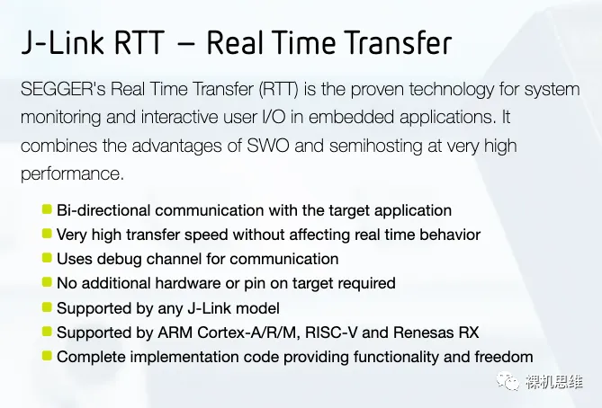

# DAPLink+PikaPython可以替代Jlink吗

1、速度快够不够

2、支持USB转串口够不够

3、从此实现RTTView上位机自由

你听说过**J-Link**的**RTT**么？官方的宣传是这样的：

简单来说，只要拥有了**J-Link**，你就可以享受以下的便利：

- 无需占用**USART**或者**USB**转串口工具，将**printf**重定位到一个由J-LINK提供的虚拟串口上；
- 支持任何J-LINK声称支持的芯片
- 高速通信，不影响芯片的实时响应

它的缺点也是明显的：

- **你必须拥有一个J-Link**，如果你使用的是 **CMSIS-DAP**或者**ST-Link**之类的第三方调试工具，就无法享受这一福利；

- 需要使用J-Link RTT Viewer这个不人性化的上位机；

4、谁说下载必须要专业的上位机

5、来自开源社区，回馈开源社区

6、彩蛋

震惊？SystemView也能支持