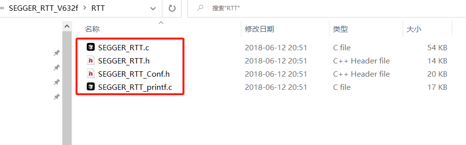

# 超越JLINK？这是DAPLink的最后一块拼图

你听说过**J-Link**的**RTT**么？官方的宣传是这样的：


简单来说，只要拥有了**J-Link**，你就可以享受以下的便利：

- 无需占用**USART**或者**USB**转串口工具，将**printf**重定位到一个由J-LINK提供的虚拟串口上；
- 支持任何J-LINK声称支持的芯片
- 高速通信，不影响芯片的实时响应


它的缺点也是明显的：

- **你必须拥有一个J-Link**，如果你使用的是 **CMSIS-DAP**或者**ST-Link**之类的第三方调试工具，就无法享受这一福利；
- 你必须在工程中手动插入一段代码。


在我之前的文章 [正版 J-Link 速度很牛么？中国工程师用开源轻松拿捏](https://mp.weixin.qq.com/s/ocaBIDV0DxBJwXpgW1X7OQ) 中，使用开源的 DAPLink 替代 J-Link，我已经实现了许多 J-Link 不具备的功能：

### 功能特点

- [x] 支持SWD/JTAG接口，下载调试速度超越JLINK V12（时钟10Mhz）
- [x] 支持USB转串口，最大10M波特率无丢包
- [x] 支持使用OpenOCD的IDE下载调试ARM/RISC-V等芯片
- [x] 支持大量Cortex-M系列芯片U盘拖拽下载，内置大量下载算法，自动识别目标芯片
- [x] 内置ymodem协议栈，U盘拖拽文件自动触发ymodem通过串口传输文件到目标设备（需配合带ymodem协议的[bootloader](https://github.com/Aladdin-Wang/MicroBoot)）
- [x] 支持系统固件升级，为后续添加更多功能
- [x] 采用winusb对window10免驱，即插即用
- [x] 支持3V3/5V大电流输出电源
- [x] 内置防倒灌和过流保护，外部电流无法反向流入USB口，防止损坏USB

### 购买地址

淘宝链接：https://item.taobao.com/item.htm?ft=t&id=826800975011


尽管 DAPLink 已经实现了许多强大的功能，但评论区仍有不少用户表示无法替代 J-Link 的 “**RTTView** 和 **J-Scope** 功能”：


如果我告诉你，其实开源社区早就已经开发了支持DAPLINK的RTTView和J-Scope波形显示功能，你是否心动呢？

**RTTView开源地址：**https://github.com/XIVN1987/RTTView，作者为**XIVN1987**

**百度云下载链接**：https://pan.baidu.com/s/1IoWHLUBfUtZa_lgp0Gt6rw?pwd=2jtt 


### 实现原理

**RTTView**

RTT 的原理很简单，**SEGGER_RTT** 定义了一个 `SEGGER_RTT_CB` 结构体，通过 RTT 打印和接收的数据会存储在 `_SEGGER_RTT` 变量中。上位机通过调试器读写 `_SEGGER_RTT` 的内容，即可实现 RTTView 功能。

SEGGER_RTT_CB代码结构体如下：

```c
typedef struct {
  char                    acID[16];                                 
  int                     MaxNumUpBuffers;                          
  int                     MaxNumDownBuffers;                       
  SEGGER_RTT_BUFFER_UP    aUp[SEGGER_RTT_MAX_NUM_UP_BUFFERS];     
  SEGGER_RTT_BUFFER_DOWN  aDown[SEGGER_RTT_MAX_NUM_DOWN_BUFFERS];
} SEGGER_RTT_CB;

SEGGER_RTT_PUT_CB_SECTION(SEGGER_RTT_CB_ALIGN(SEGGER_RTT_CB _SEGGER_RTT));
SEGGER_RTT_PUT_BUFFER_SECTION(SEGGER_RTT_BUFFER_ALIGN(static char _acUpBuffer  [BUFFER_SIZE_UP]));
SEGGER_RTT_PUT_BUFFER_SECTION(SEGGER_RTT_BUFFER_ALIGN(static char _acDownBuffer[BUFFER_SIZE_DOWN]));

```

RTTView的上位机就是通过调试器读写单片机内存中\_SEGGER_RTT结构体变量的数据，因为此变量存储了读写数据的所有信息,
要读此变量需要先知道此变量在内存中的位置，这可以通过查看MDK编译生成的.map文件来实现，如下：


可知，\_SEGGER_RTT在地址0x24000400处，RTTView的上位机可以自动检测设定地址起始的128KB,来寻找\_SEGGER_RTT变量。

**波形显示**

波形显示的原理与RTTView显示的原理类似，上位机通过加载MDK编译生成的.map文件，来获取全局变量的RAM位置， 然后通过调试器读取用户想要显示波形的变量地址，然后绘制波形。

### RTTView功能

**MCU移植RTT：**

RTT的源码是作为J-Link软件包的一部分，在Jlink安装目录中的 Sample/RTT中，如我电脑上的路径：

C:\Program Files (x86)\SEGGER\JLink_V632f\Samples\RTT

- 将以下文件复制到工程目录下，然后添加到代码中，添加头文件路径。




- 编写MCU代码

比如将RTT移植到shell命令行中

```c
#include "SEGGER_RTT.h"

int reboot(void)
{
    SCB->AIRCR = 0X05FA0000 | (uint32_t)0x04;
    return 0;
}
MSH_CMD_EXPORT(reboot, reboot)
    
uint16_t shell_read_data(wl_shell_t *ptObj, char *pchBuffer, uint16_t hwSize)
{
	return SEGGER_RTT_Read(0,(uint8_t *)pchBuffer, hwSize);
}

uint16_t shell_write_data(wl_shell_t *ptObj, const char *pchBuffer, uint16_t hwSize)
{
	return SEGGER_RTT_Write(0, pchBuffer,hwSize);
}

int main(void)
{
    ...
    SEGGER_RTT_Init();
    ...
    shell_ops_t s_tOps = {
        .fnReadData = shell_read_data,
		.fnWriteData = shell_write_data,
    };
    shell_init(&s_tShellObj,&s_tOps);
}
```

移植成功后，RTTView 可以显示 shell 的输出效果：


### 波形显示功能

为了展示波形数据，我们可以通过 MCU 输出一个正弦波形作为示例。以下是相关代码：

```c
__USED uint32_t approx_t = 0; 
__USED uint32_t sine_var;
#define MAX_VALUE 1000000  
#define MIN_VALUE 0    
#define PERIOD 1000 
#define M_PI 3.14159265358979323846
#include <math.h>
uint32_t approx_sine(uint32_t t) {
    double angle = 2.0 * M_PI * (t % PERIOD) / PERIOD;
    double sine_value = (sin(angle) + 1.0) / 2.0; 
    return (uint32_t)(MIN_VALUE + sine_value * (MAX_VALUE - MIN_VALUE));
}

int main(void)
{
    ...
    while (1) {
        ...
        sine_var = approx_sine(approx_t);
        approx_t++;	
        HAL_Delay(1);		
    }    
}
```

在编译生成的 `.map` 文件中，可以看到 `sine_var` 的地址，例如地址为 `0x24001A68`：


**配置 RTTView 显示波形**

- 打开 RTTView，加载 `.map` 文件。

- 选择需要显示波形的变量（如 `sine_var`）。

- 勾选波形显示。


效果如下：


## MDK下的类似功能

**其实MDK中内置了一种非常简单廉价的方式，可以让你实现类似的功能**，并具有以下特点：

- **支持所有的调试仿真器**
- **MDK原生功能，连CMSIS-Pack都不用安装**
- **点几下鼠标就可以通过RTE完成部署**
- **除了简单的初始化函数外，无需手动插入代码**
- **可以将你的printf输出直接打印在MDK的Debug (printf) View窗口中**


**步骤一：RTE配置**

1. 打开 **RTE 配置**窗口（菜单：`Project -> Manage -> Run-Time Environment`）。
2. 勾选以下选项：
   - 在 **CMSIS-Compiler** 下勾选 **CORE**；
   - 在 **STDOUT(API)** 下勾选 **I/O**；
   - 如果未勾选过 **CMSIS-View -> EventRecorder**，系统会提示警告，单击 **Resolve** 自动修复。


完成后，工程管理器中会新增相关文件：


至此，所需的工具都已经成功地加入到工程中了。

如果你在**RTE**中找不到 **CMSIS-Compiler** 和 **CMSIS-View**，说明你的**MDK**版本较低——如果不想升级**MDK**，则可以通过下面的链接从官方直接下载对应的**cmsis-pack**：

**https://www.keil.arm.com/packs/cmsis-compiler-arm/**

**https://www.keil.arm.com/packs/cmsis-view-arm/**

**步骤二：添加noinit段**

打开工程配置窗口“**Options for Target**”，切换到“**Linker**”选项卡：


打开**.sct**，在 **RW_IRAM1** 后面追加如下的代码：

```c
    ZI_RAM_UNINIT +0 UNINIT {
        .ANY (.bss.noinit)
    }
```

效果大约类似这样：


 **EventRecorder** 有一段数据放置在了 “**.bss.noinit**” section中——以求芯片复位后不会破坏其中原有的内容。

这里步骤的核心思想是在 **scatter script** 内紧接着为 **RW**和**ZI**的 **execution region**为 **.bss.noinit** 提供一个属性为**UNINIT**的专属**execution region**。

**步骤三：服务初始化**

在包含 **main()** 函数的C代码文件中，按照如下的格式添加对头文件的包含：

```c

#include <RTE_Components.h>

#undef __USE_EVENT_RECORDER__
#if defined(RTE_Compiler_EventRecorder) || defined(RTE_CMSIS_View_EventRecorder)
#   define __USE_EVENT_RECORDER__  1
#endif

#if __USE_EVENT_RECORDER__
#   include <EventRecorder.h>
#   include "EventRecorderConf.h"
#endif
```

在 **main()** 函数中添加对**EventRecorder**服务的初始化：

```c
void main(void)
{
    ...
#if __USE_EVENT_RECORDER__
    EventRecorderInitialize(0, 1);
#endif
    printf(""hello world\r\n"");
    ...
}
```

如果你从未使用过**EventRecorder**也不必惊慌，这段代码的主要作用是为**printf**专门开启一个数据通道。

理论上，到这里，我们就已经完成了部署，可以在进入调试模式后，通过**MDK**的 **Debug (printf) View**窗口来观察 **printf** 的输出结果了。

编译，一切顺利的话，进入调试模式后通过菜单 **View->Serial Windows->Debug (printf) View** 打开窗口：


运行后，可以在 **Debug (printf) View**窗口中看到如下的结果：


### 结语

**不管RTTView还是EventRecorder，只在调试阶段有意义**，如果我们需要在产品的正常工作模式下使用 **printf**，还是老老实实在 **CMSIS-Compiler->STDOUT(API)** 中勾选 **Custom**：


实现 **stdout_putchar()** 函数——用它来发送字符到具体的外设吧，比如：

```c

int stdout_putchar(int ch)
{
    if ('\n' == ch) {
        int temp = '\r';
        while(Driver_USART0.Send(&temp, 1) != ARM_DRIVER_OK);
    }
    
    if (Driver_USART0.Send(&ch, 1) == ARM_DRIVER_OK) {
        return ch;
    }
    
    return -1;
}
```


**如果你的产品不方便外接下载口，但是又有调试的需求**，建议移植一个轻量级的 shell 命令行工具（如对接 UART、CAN 等外设）。这样既能在不影响程序正常运行的情况下实现异步输出，还能记录日志到 Flash 中，方便问题分析。


**敬请期待下一篇文章：手把手教你实现轻量级命令行工具！**
