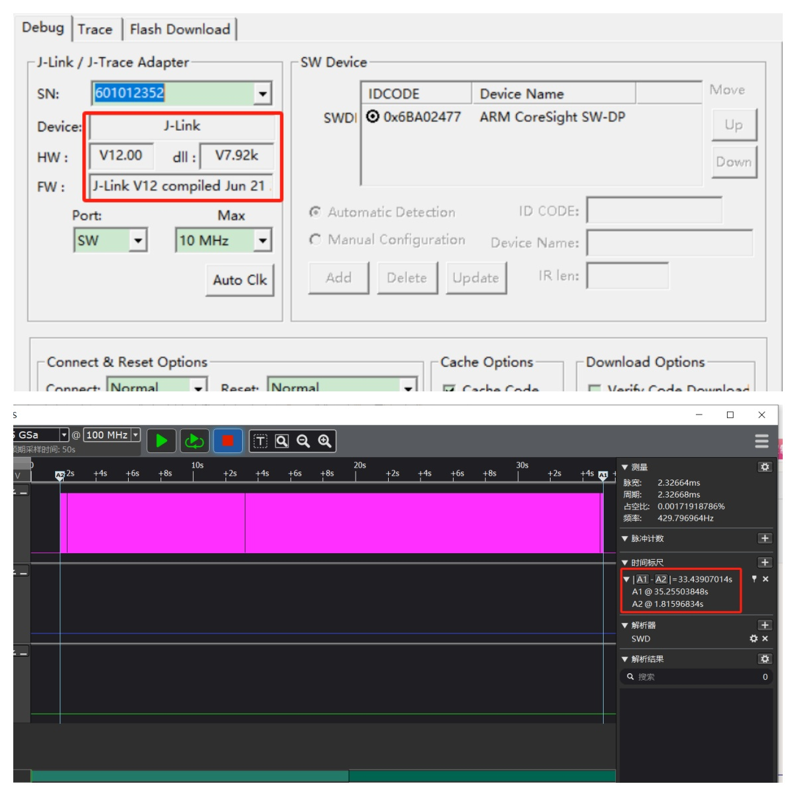
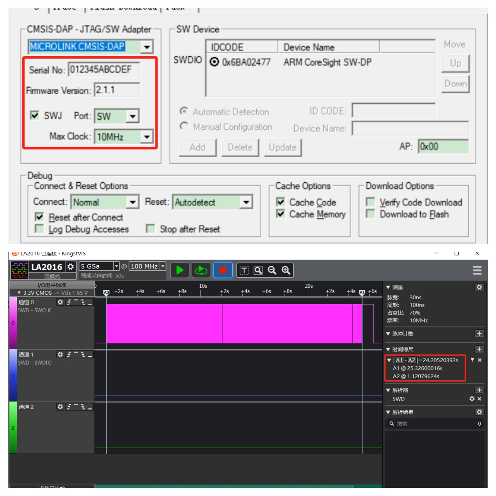
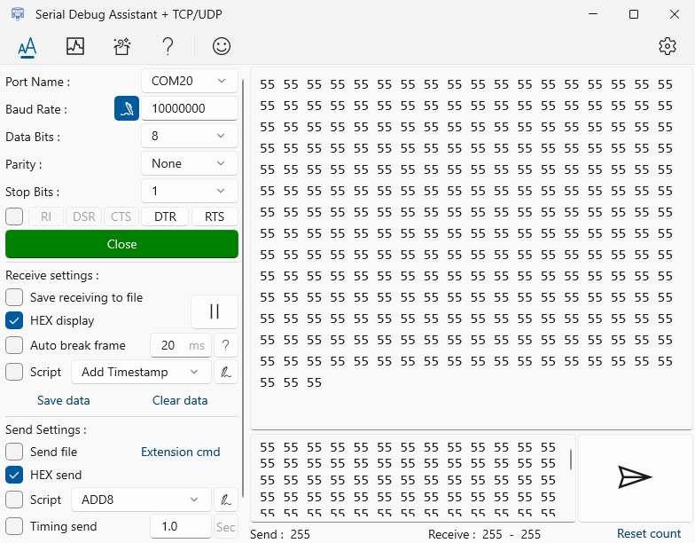
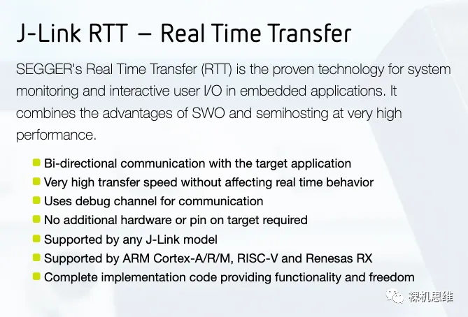
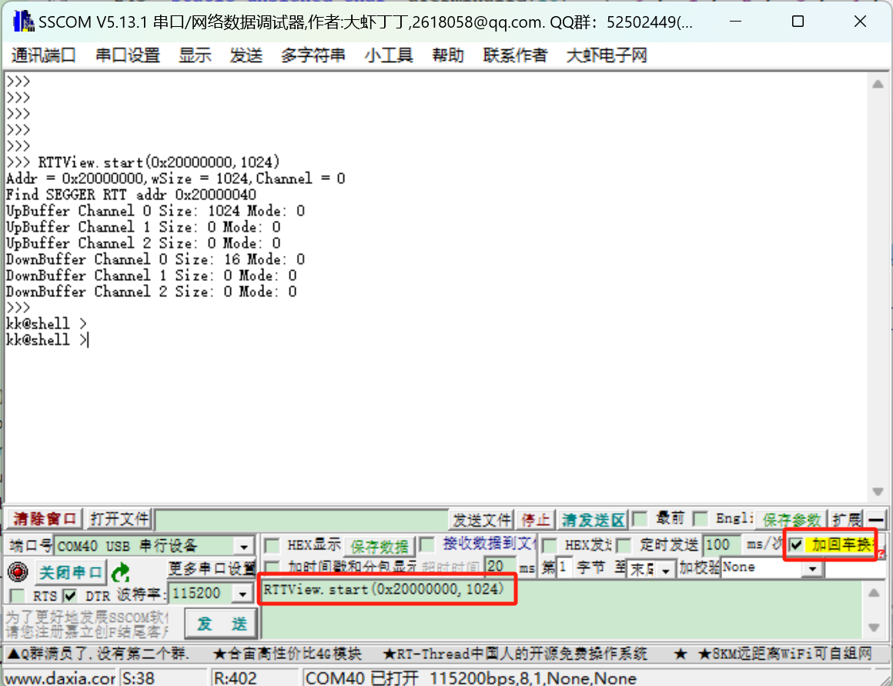

# DAPLink+PikaPython可以替代Jlink吗

[TOC]

## 一 、我为什么替换掉JLink

- 正版价格昂贵


- 盗版检测：the connected probe appears to be a j-link clone


- 连接故障：The connected J-Link is defective


- 硬件损坏

市面上常见的盗版jlink，质量一言难尽，两三百的jlink在我手里至少坏的也有七八个了！

## 二、为什么选择DAPLINK

### 1、下载速度再也不是劣势

与目前市面上最新的J-LINK-V12速度对比，目标芯片使用STM32H743，开发环境MDK V5.39，分别使用**MicroLink**和**Jlink V12**将**2558KB**的HEX文件下载到内部FLASH中。使用逻辑分析仪测试时钟引脚，计算出擦除，编程，校验全过程的时间，**MicroLink**使用时间为**24.205秒**，**Jlink V12**使用时间为**33.439秒**，测试数据如下图：

**Jlink V12测试结果：**



**MicroLink测试结果：**



下载过程中CLK的时钟波形：


**测试结果对比：**

| 调试器        | 总耗时（擦除，编程，校验） |
| ------------- | :------------------------: |
| **MicroLink** |        **24.205秒**        |
| J-LINK V12    |          33.439秒          |

### 2、USB转UART的速度一尘绝骑

MicroLink内置USB转串口功能，串口最大支持**10M波特率**，无丢包。



使用逻辑分析仪抓取波形如图所示，每个bit传输的时间为1/10M=100ns。


## 三、还不够？再加上PikaPython呢

DAPLINK还有个最大的优势就是**[开源](https://github.com/ARMmbed/DAPLink)**！开源最大的乐趣就是，认为不爽的地方，直接自己动手改造！Jlink有的我们也可以有，Jlink没有的，我们也要有。

得益于 MicroLink 内置的 **PikaPython 脚本引擎**，我们可以用熟悉的 Python 脚本直接操控 MicroLink，无需复杂开发环境，也不必重新烧录固件。

比如你可以这样做：

- 写一个脚本，定时采集目标芯片的寄存器数据，自动打印到串口；

- 写一个脚本，实现简易的烧录流程，把文件拖进 U 盘就能一键下载；
- 甚至可以根据不同客户需求，快速定制一套上位机交互逻辑，轻松部署到你自己的产测上位机中。

一句话总结：**以前只有工程师才能做的事，现在任何人写个脚本就能搞定！**

### 3、从此实现RTTView自由

你听说过**J-Link**的**RTT**么？官方的宣传是这样的：



简单来说，只要拥有了**J-Link**，你就可以享受以下的便利：

- 无需占用**USART**或者**USB**转串口工具，将**printf**重定位到一个由J-LINK提供的虚拟串口上；
- 支持任何J-LINK声称支持的芯片
- 高速通信，不影响芯片的实时响应

它的缺点也是明显的：

- **你必须拥有一个J-Link**，如果你使用的是 **CMSIS-DAP**或者**ST-Link**之类的第三方调试工具，就无法享受这一福利；

- 需要使用J-Link RTT Viewer这个不人性化的上位机；

**如果你看到这里，那么恭喜你，因为从此刻起RTT的限制被打破了，缺点也将不复存在。**

只要你拥有了**MicroLink**，就可以享受以下的便利：

- 无需占用**USART**或者**USB**转串口工具，将**printf**重定位到一个由**MicroLink**提供的虚拟串口上；
- 不需要使用专门的RTTView上位机，支持任意串口助手；
- 高速通信，不影响芯片的实时响应。

**启动RTT功能：**打开任意串口助手，选择MicroLink的虚拟串口，输入以下指令：

```python
RTTView.start(0x20000000,1024,0)

```

- 0x20000000:搜索RTT控制块的起始地址；
- 1024：搜寻范围大小
- 0：启动RTT的通道

比如将shell命令行工具对接到RTT的通道0中:

```c
uint16_t shell_read_data(kk_shell_t *ptObj, char *pchBuffer, uint16_t hwSize)
{
	return SEGGER_RTT_Read(0,(uint8_t *)pchBuffer, hwSize);
}

uint16_t shell_write_data(kk_shell_t *ptObj, const char *pchBuffer, uint16_t hwSize)
{
	return SEGGER_RTT_Write(0, pchBuffer,hwSize);
}
```



### 4、下载固件从未如此简单，从此告别J-Flash

- **keil能支持的芯片，MicroLink就能支持**

熟悉Keil的朋友们都知道，当我们要下载编译好的镜像到Flash时，首先要做的一步就是选择合适的Flash下载算法，而这个算法本身就是一个FLM文件：


所谓Flash下载算法，是负责擦除、下载数据到flash的一个软件。而Keil的芯片pack包会包含FLM文件以支持芯片的下载。

**解析flm文件的原理：**

解析一下现有的FLM文件，以STM32F4xx_1024.FLM为例：
将ARM:CMSIS Pack文件夹（通常在D:\Users\Administrator\AppData\Local\Arm\Packs\Keil\STM32F4xx_DFP\2.15.0\CMSIS\Flash）中的内容复制到一个新文件夹中。

打开命令行工具，输入`arm-none-eabi-readelf -a STM32F4xx_1024.FLM：`

```c
$ arm-none-eabi-readelf -a STM32F4xx_1024.FLM
...
Symbol table '.symtab' contains 17 entries:
   Num:    Value  Size Type    Bind   Vis      Ndx Name
     0: 00000000     0 NOTYPE  LOCAL  DEFAULT  UND
     1: 00000000     0 NOTYPE  LOCAL  DEFAULT    1 $t
     2: 00000122     0 NOTYPE  LOCAL  DEFAULT    1 $d
     3: 00000144     0 NOTYPE  LOCAL  DEFAULT    2 $d.realdata
     4: 00000148     0 NOTYPE  LOCAL  DEFAULT    3 $d.realdata
     5: 00000000     0 FILE    LOCAL  DEFAULT  ABS FlashPrg.c
     6: 00000000     0 SECTION LOCAL  DEFAULT    1 .text
     7: 00000000     0 FILE    LOCAL  DEFAULT  ABS FlashDev.c
     8: 00000148  4256 SECTION LOCAL  DEFAULT    3 .constdata
     9: 00000000     0 NOTYPE  GLOBAL HIDDEN   ABS BuildAttributes$$THM_ISAv
    10: 00000001    28 FUNC    GLOBAL HIDDEN     1 GetSecNum
    11: 0000001d    46 FUNC    GLOBAL HIDDEN     1 Init
    12: 0000004b    14 FUNC    GLOBAL HIDDEN     1 UnInit
    13: 00000059    44 FUNC    GLOBAL HIDDEN     1 EraseChip
    14: 00000085    76 FUNC    GLOBAL HIDDEN     1 EraseSector
    15: 000000d1    82 FUNC    GLOBAL HIDDEN     1 ProgramPage
    16: 00000148  4256 OBJECT  GLOBAL HIDDEN     3 FlashDevice

No version information found in this file.

Displaying notes found at file offset 0x00002b9c with length 0x0000001c:
  Owner                 Data size       Description
  ARM                  0x0000000c       Unknown note type: (0x40000000)

```

通过**Symbol table**信息我们可以找到**Init、UnInit、EraseSector**和**ProgramPage**函数所在的位置。我们所需要的正是以上函数，接下来的任务只需要写一个上位机，将以上函数提取出来即可，这个工具我已经写好，如图：


通过FLM下载算法转换工具打开文件，可以生成对应的下载算法驱动文件。之所以说MicroLink可以支持keil能支持的芯片，正是因为我们借助了KEIL提供的FLM文件。

- **U盘拖拽下载**

打开U盘内的`flm_config.py`脚本，代码如下所示：

```py
import FLMConfig
ReadFlm = FLMConfig.ReadFlm()
res1 = ReadFlm.load("STM32/STM32F10x_512.FLM.o",0X08000000,0x20000000)
```

`ReadFlm.load`函数的三个参数：

- "STM32/STM32F10x_512.FLM.o" ：选择通过FLM下载算法转换工具转换后的下载算法；

- 0X08000000：默认U盘拖拽下载的FLASH位置；
- 0x20000000：单片机的RAM基地址；


- **指令下载**

  MicroLink内置了一条离线下载的python函数：

  ```python
  load.bin("boot.bin",0X8000000)
  ```

  两个参数的含义：

  - "boot.bin"：下载的文件名字；
  - 0X8000000：下载的地址；

  将需要下载的bin文件复制到U盘中，然后随便使用一个串口助手，打开虚拟串口，输入`load.bin("boot.bin",0X8000000)`加回车，效果如下：

  

  

### 5、产品已经出货，没留下载口，需要升级固件怎么办？

经常有产品因为种种原因无法预留下载口，只能通过串口给产品升级固件。

串口的升级协议最普遍的是采用ymodem传输协议，ymodem协议具有显著的优点：

- **分段传输**：ymodem 提供了文件校验和分段传输机制，提高了传输过程的鲁棒性。

- **自动重试机制**：ymodem 协议中带有重试机制，确保每个数据包在成功接收前会自动重发，以提升传输成功率。

开发一个带有ymodem协议的bootloader和上位机需要较高的技术水平，操作不当还可能导致设备升级失败。这不仅增加了技术支持成本，也降低了客户满意度，尤其对于不了解这个技术的用户而言，升级流程显得尤为繁琐。

**为了避免用户开发复杂的上位机，MicroLink内置了Ymodem协议，支持通过串口进行可靠的文件传输，升级过程一目了然。**


## 四、来自开源社区，回馈开源社区

正是因为无数开源项目的无私共享，MicroLink 才能在短时间内集成如此强大的能力。从底层协议到工具链支持，从调试体验到脚本引擎，我们始终站在开源社区的肩膀上前行。再次感谢以下开源项目的作者：

**CherryDAP开源项目：**

https://github.com/cherry-embedded/CherryDAP

**PikaPython开源项目：**

[https://github.com/pikastech/pikapython](https://github.com/pikastech/pikapython)

**先辑的技术支持R佬；**

https://github.com/RCSN/hpm_sdk_extra

**MicroBoot开源项目：**

https://github.com/Aladdin-Wang/MicroBoot

所以，我也选择**把 MicroLink 的代码、原理图开源**，希望能够回馈社区，并点燃更多创意的火花。

👉 项目地址：https://github.com/Aladdin-Wang/MicroLink

**欢迎 Fork、Star，也欢迎提 Issue、提 PR —— 不只是使用者，你也可以成为 MicroLink 的共建者！**


