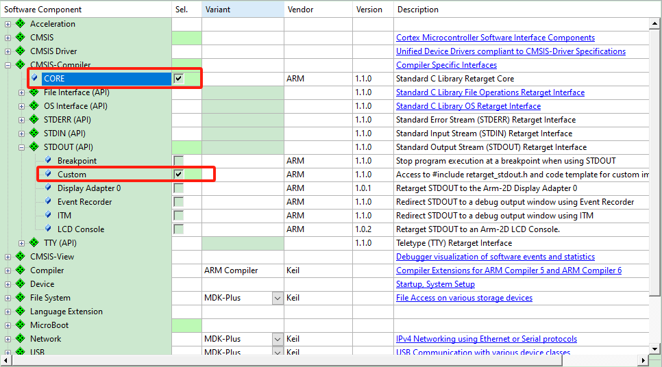
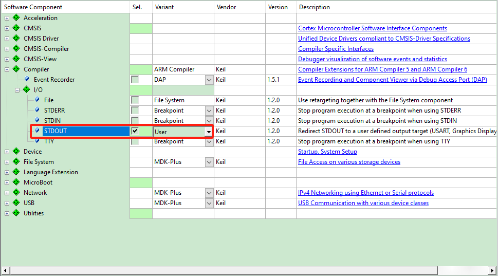

# printf的终极调试大法


## 一、省去串口线，也能使用printf


### **J-Link**的**RTT**实现通过调试接口与目标程序的双向通讯

RTT的全称是Real Time Transfer，它实现了如下功能：

- 与目标应用程序双向通讯；
- 高速通信，不影响芯片的实时响应；
- 使用调试通道，无需添加额外硬件或引脚；
- 支持任何J-Link支持的芯片，提供RTTView上位机

### MicroLink助你使用任意串口助手


## 二、RTT映射到MicroLink虚拟串口原理

### RTT实现原理

RTT 的原理很简单，**SEGGER_RTT** 定义了一个 `SEGGER_RTT_CB` 结构体，通过 RTT 打印和接收的数据会存储在 `_SEGGER_RTT` 变量中。上位机通过调试器读写 `_SEGGER_RTT` 的内容，即可实现 RTTView 功能。

SEGGER_RTT_CB代码结构体如下：

```c
typedef struct {
  char                    acID[16];                                 
  int                     MaxNumUpBuffers;                          
  int                     MaxNumDownBuffers;                       
  SEGGER_RTT_BUFFER_UP    aUp[SEGGER_RTT_MAX_NUM_UP_BUFFERS];     
  SEGGER_RTT_BUFFER_DOWN  aDown[SEGGER_RTT_MAX_NUM_DOWN_BUFFERS];
} SEGGER_RTT_CB;

SEGGER_RTT_PUT_CB_SECTION(SEGGER_RTT_CB_ALIGN(SEGGER_RTT_CB _SEGGER_RTT));
SEGGER_RTT_PUT_BUFFER_SECTION(SEGGER_RTT_BUFFER_ALIGN(static char _acUpBuffer  [BUFFER_SIZE_UP]));
SEGGER_RTT_PUT_BUFFER_SECTION(SEGGER_RTT_BUFFER_ALIGN(static char _acDownBuffer[BUFFER_SIZE_DOWN]));

```

MicroLink通过读写单片机内存中\_SEGGER_RTT结构体变量的数据，因为此变量存储了读写数据的所有信息,
要读此变量需要先知道此变量在内存中的位置，这可以通过查看MDK编译生成的.map文件来实现，如下：


可知，\_SEGGER_RTT在地址0x24000400处，RTTView的上位机可以自动检测设定地址起始的128KB,来寻找\_SEGGER_RTT变量。


### MCU移植RTT

RTT的源码是作为J-Link软件包的一部分，在Jlink安装目录中的 Sample/RTT中，如我电脑上的路径：

C:\Program Files (x86)\SEGGER\JLink_V632f\Samples\RTT

- 将以下文件复制到工程目录下，然后添加到代码中，添加头文件路径。


## MDK下RTT重定向到printf

**步骤一：RTE配置**

- 打开 **RTE 配置**窗口（菜单：`Project -> Manage -> Run-Time Environment`）。

- 勾选以下选项：

​           在 **CMSIS-Compiler** 下勾选 **CORE**；

​           在 **STDOUT(API)** 下勾选 **Custom**；




如果你在**RTE**中找不到 **CMSIS-Compiler** 说明你的**MDK**版本较低，老版本可以找到**Compiler**，勾选STDOUT选择User：



**步骤二：添加stdout_putchar()**

实现 **stdout_putchar()** 函数——用它来把RTTView重定向到printf：

```c
int stdout_putchar(int ch)
{
	SEGGER_RTT_PutChar(0, ch);
    return ch;
}
```


## 三、性能测试


