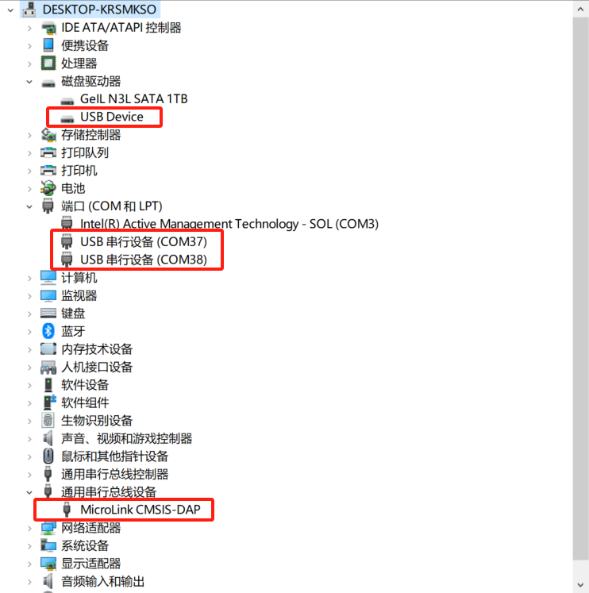

# printf的终极调试大法

## 一、RTT+ MicroLink，让串口调试真正自由

在嵌入式开发中，我们总是离不开**“串口打印”**来调试。

但传统串口调试存在很多明显的痛点：

- ⚡ **速度慢**：输出数据卡顿，占用CPU时间，不能在中断中使用；
- 🔌 **硬件占用**：需要额外占用 MCU 的 UART 接口资源；
- 🔄 **接线麻烦**：需要 USB 转串口工具 + 杜邦线接线，步骤繁琐；
- 🛑 **程序跑飞即断链**：一旦程序异常，串口中断，调试无从下手；
- 🚪 **资源受限**：串口数量有限，调试与功能常常冲突。

### 如何打破这些痛点？

**RTT + MicroLink**完美结合了双方的优势：

- **RTT**：提供高速、非侵入式的数据传输；
- **MicroLink**：将 RTT 通道虚拟为标准 USB CDC 串口，不再依赖 J-Link 专属工具！

**📢 让调试既拥有 RTT 的性能，又能使用任意串口助手，真正做到“即插即用，自由畅快”！**

## 二、一分钟了解 RTT 是什么、怎么用

### 1、RTT 是什么？

RTT，全称 **Real Time Transfer（实时传输）**，是一种**无需中断 MCU 程序执行**，就能实现数据与主机交互的调试技术。

它通过Jlink连接，使用一种内存共享机制，将 MCU 内部的数据实时“搬运”到 PC 上。

**📦 形象理解：：**

> 就像你在 MCU 的 RAM 里放了个“邮箱”，PC 随时来收信，MCU 照常干活，互不打扰。

### 2、RTT 的基本工作原理

🔵 **在 MCU RAM 中，有一个非常重要的结构体：**

> **_SEGGER_RTT 控制块**

🔵 **它的作用是：**

- 保存多个 **UpBuffer（MCU ➡ PC）** 和 **DownBuffer（PC ➡ MCU）** 的信息；
- 包括每个缓冲区的起始地址、大小、写指针、读指针等。

🔵 **收发数据过程：**

- **MCU发送数据** ➔ 只需把数据 `memcpy` 拷贝到 **UpBuffer** 的空闲区域；
- **PC接收数据** ➔ 通过 J-Link 或 MicroLink 读取 UpBuffer 的数据；
- **PC发送指令** ➔ 把数据写入 DownBuffer；
- **MCU读取指令** ➔ 从 DownBuffer 中 `memcpy` 出来。

📷 由于只是内存拷贝，**整个收发过程极快，微秒级完成**，不会打断 MCU 正常工作。


### 3、RTT 怎么用？

只需简单三步：

✅ **步骤一**：集成 RTT 源码

从 SEGGER J-Link 安装目录 `Samples/RTT` 复制以下文件到工程中，并添加头文件路径。

如我电脑上的路径：

C:\Program Files (x86)\SEGGER\JLink_V632f\Samples\RTT


✅ **步骤二**：输出日志到 RTT

```c
#include "SEGGER_RTT.h"
int main(void)
{
    SEGGER_RTT_Init();
    SEGGER_RTT_printf(0, "hello RTT\n");   
    while(1){
        
    }
}
```

✅ **步骤三**：连接调试工具

- 如果使用传统 J-Link，只能用 RTT Viewer / RTT Logger；
- 如果用 MicroLink，可以用**任意串口助手**直接访问 RTT 数据！

## 三、MicroLink：释放 RTT 的真正威力

### 1. 为什么传统 RTT 调试有局限？

虽然 RTT 技术强大，但官方默认的**J-Link RTT Viewer**存在明显局限：

- UI 简陋，功能单一；
- 只支持专用软件，不够开放；
- 不兼容 SSCOM、SecureCRT、RealTerm等强大串口工具；
- 不利于自动化、生产线测试。

### 2、MicroLink 带来的创新

**MicroLink突破传统**，打通了 RTT 和通用串口调试工具之间的隔阂，直接把 RTT 数据转发到 **USB CDC 虚拟串口**，让 MCU 仿佛接了一个超级快的“软串口”！

🔵 MCU端：

- 继续使用 RTT 库发送日志，不需要改变一行代码。

🔵 MicroLink端：

- 通过 USB CDC 映射成标准串口；
- 自动扫描 MCU 内存中 **_SEGGER_RTT** 控制块地址（如 0x20000000）；
- 直接读写 UpBuffer / DownBuffer；
- 完美支持双向通信！

🔵 PC端：

- 用你最喜欢的串口助手直接连 MicroLink串口，爽快收发！

📷 **MicroLink RTT 通道示意图：**


✅ **效果总结：**

- 不再局限于官方 Viewer；
- 不再受限于波特率；
- 不再需要额外串口硬件和线缆；
- 打开任意串口助手即用，极致灵活！

## 四、与传统串口调试的性能对比

| 特性       | 串口         | RTT                           |
| ---------- | ------------ | ----------------------------- |
| 通信速率   | 低           | 高（上 MB 级别）              |
| 占用 CPU   | 较高中断开销 | 几乎无打扰                    |
| 崩溃后可用 | ❌            | ✅ 可访问 RAM 数据             |
| 多通道支持 | ❌            | ✅ 支持多个 Up/Down Buffer     |
| 使用灵活性 | 有限         | 高，可集成在 UI、日志、命令中 |

## 五、快速上手 MicroLink RTT 功能

✅ **步骤一：找到MicroLink 的 USB CDC 虚拟串口**

使用USB TypeC数据线与MicroLink连接以后，电脑设备端会弹出三个设备：



其中端口会弹出两路串行设备：

- **一路为真实的USB转串口**；

- **一路为USB CDC 虚拟串口**，打开串口时，输入回车，会自动回复 `>>>`；

**为了方便区分两路串口，通过USB转串口发送数据LED指示灯会闪烁，通过虚拟串口发送数据LED指示灯不会闪烁。**


✅ **步骤二：使用串口助手类工具访问 MicroLink 的 USB CDC 虚拟串口**

比如使用SSCOM，连接MicroLink的串口，输入以下指令：

```
RTTView.start(0x20000000,1024,0)
```

- 0x20000000:搜索RTT控制块的起始地址；
- 1024：搜寻范围大小；
- 0：启动RTT的通道。


**_SEGGER_RTT** 控制块地址可以通过查看MDK编译生成的.map文件来查看，如下：


可知，\_SEGGER_RTT在地址0x24000400处，可以通过设置搜寻的地址和大小来重新启动MicroLink的RTT功能。

## 六、总结

**MicroLink + RTT = 打破束缚，畅享自由**

 ✅ 不限速，不限工具；

 ✅ 不接线，不怕飞；

 ✅ 不修改，不额外资源占用。

享受真正意义上的“高速、自由、无侵入”调试体验！
