# 实时可视化调试：SystemView 助你掌控RTOS运行态

在嵌入式开发中，调试永远是最痛苦的环节。你是否曾经为了定位一个 **卡顿、死机、优先级反转** 的问题而疲惫不堪？你是否希望能**实时观察系统的运行细节**，比如任务切换、时间片分配、ISR 响应时间？

## 🎯 SystemView 解决了哪些痛点？

传统日志靠串口输出，信息有限、时序混乱，遇到高频中断或多任务调度就无能为力。而 SystemView 是 SEGGER 出品的**实时跟踪分析工具**，它解决了：

- **任务调度不可见？→ 一目了然！**
- **中断响应太慢？→ 毫秒级分析！**
- **性能瓶颈难以定位？→ 函数级耗时统计！**
- **系统卡住没信息？→ 最后一帧也能还原现场！**

SystemView 帮你把 RTOS 从“黑盒”变成“透视玻璃”。

------

## 🔍 SystemView 能做什么？

**SystemView 是一个可以在线调试嵌入式系统的工具**，它能分析系统中哪些**中断、任务**被执行了，以及它们的**执行顺序和时间关系**。同时，它还能记录系统中各种**内核对象**（如信号量、互斥量、事件、消息队列等）的**持有和释放时间点**，这对于调试复杂的多线程系统非常有效。

SystemView 能够实现：

- ✅ 实时任务切换跟踪
- ✅ 中断进出时序图
- ✅ CPU 占用率统计
- ✅ 用户自定义事件插桩
- ✅ 时间轴回放与数据保存
- ✅ 支持多种主流 RTOS（RT-Thread / FreeRTOS / embOS 等）

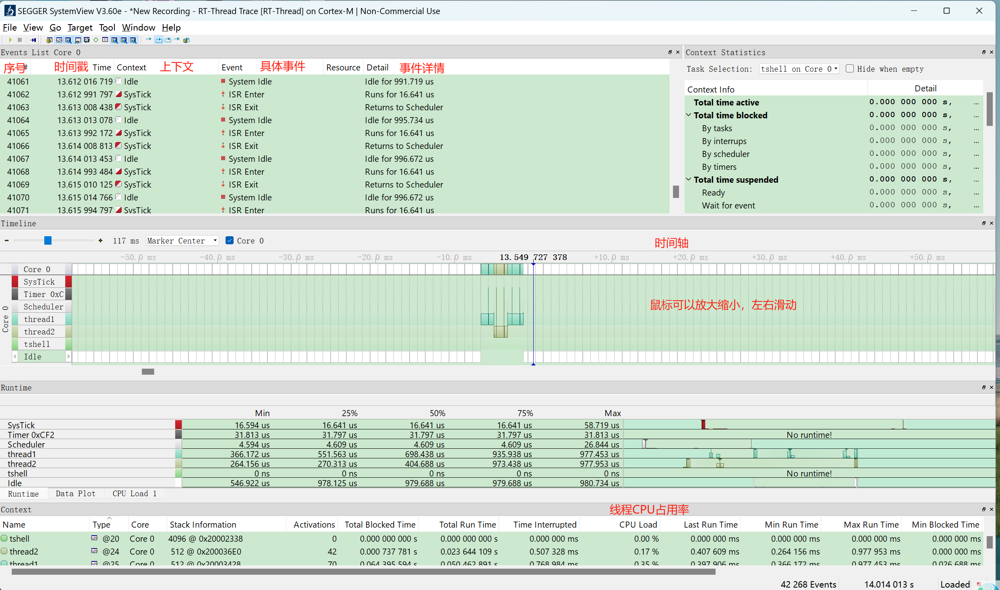

## 🚀 MicroLink 做了哪些创新？

SystemView 过去只能搭配 J-Link 使用，烧录、调试、数据采集一体化不方便，正版J-Link价格也不亲民。

MicroLink 的核心创新在于：

> **将 SystemView 的 UART 模式协议，转发到 MicroLink 内部的 RTT 通道，再通过 SWD 实现数据读写，从而兼容 SEGGER 的整个数据传输链路。**

简单来说：

1. **SystemView PC 工具** 选择 **UART 模式** 进行通信，通过虚拟串口向 MicroLink 发送特定格式的数据；
2. **MicroLink 内部固件** 识别并适配 SystemView 的 UART 协议，对数据包进行解析；
3. MicroLink 将接收到的指令 **映射为对目标 MCU 内存的读写操作**，通过 **SWD 接口** 实现真实的数据访问；
4. MCU 中运行的 **SystemView 嵌入式端程序** 将运行数据（任务调度、事件、ISR 等）写入 RTT UpBuffer；
5. MicroLink **从 RTT Buffer 中读取数据**，再通过串口 **返回给 SystemView PC 工具**；
6. 最终，SystemView 实时显示系统运行过程，形成完整的数据回环。

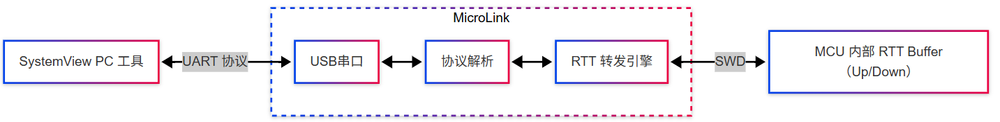

🏆 **你不需要 J-Link，不需要额外接线，不需要改一行代码，只需要：插上 MicroLink，打开 SystemView，选择 UART 模式，点击 Start。**

**🧰 MicroLink**是一款在**DAPLink**的基础上将**在线仿真器**、**USB转串口**、**脱机下载器**、**RTT 通信** 、**SystemView** 、**拖拽烧录** 和 **用户可编程自动化工具**等多种功能集成到一个设备中，为开发者提供一站式解决方案。无论您是下载固件、调试代码、批量生产还是固件升级，MicroLink都能满足您的需求，大大提升开发效率，减少工具切换带来的时间和财务成本。

🔗 淘宝购买链接：
 👉 https://item.taobao.com/item.htm?ft=t&id=895964393739

## ✨ SystemView 移植与使用步骤

SystemView 包含两个部分：

1. 🖥️ **PC 端程序**：由 SEGGER 提供的 SystemView 工具，可收集并可视化展示嵌入式系统运行时的行为，包括任务调度、中断响应、系统事件等。支持实时显示和数据保存以供离线分析。
2. 📦 **嵌入式端程序**：需要集成到 MCU 工程中，负责记录运行信息并通过 **RTT（Real-Time Transfer）模块** 实时发送到 PC。

### 📦 嵌入式端程序移植步骤

只需要利用 RT-Thread 推出的 [Env 工具](https://www.rt-thread.org/download.html) 使能 SystemView 软件包，并对其进行简单的配置，就能完成 SystemView 的嵌入式端程序的配置。

**以STM32 BSP stm32f103-onenet-nbiot为例，内核版本5.2.0，MicroLink固件版本V2.3.1及以上。**

✅ **步骤一**：在 Env 工具中进入 menuconfig 图形化配置工具

打开 Env 工具，使用命令 `cd D:\rt-thread\bsp\stm32` 切换到 RT-Thread 源码 BSP 根目录下的 stm32f103-onenet-nbiot 目录，然后输入命令 `menuconfig` 配置工程。

利用上下键选中 RT-Thread online packages，按回车键进入下级菜单，在 tools packages 中打开 SystemView 。

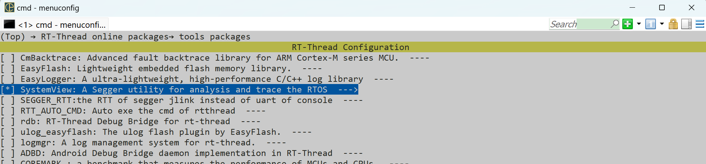

✅ **步骤二**：配置SystemView 

Version选择latest最新版本，其他选项不需要配置。

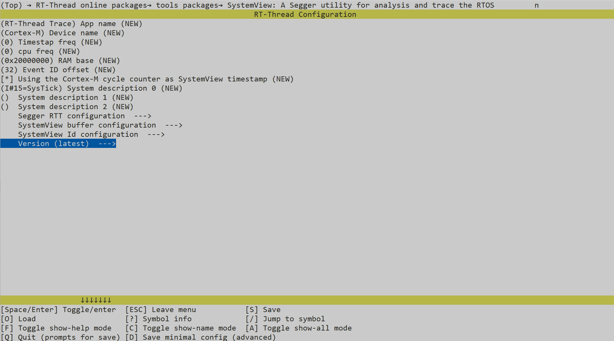

menuconfig 配置选项说明：

| **参数**                     | **描述**                                                     |
| ---------------------------- | ------------------------------------------------------------ |
| App name                     | 应用程序的名字                                               |
| Device name                  | 设备所用内核                                                 |
| Timestap freq                | 时间戳频率 （0 表示使用系统默认频率）                        |
| cpu freq                     | cpu频率（0 表示使用系统默认频率）                            |
| RAM base                     | RAM基地址 默认值：0x2000 0000                                |
| Event ID offset              | 事件ID的偏移 默认值：32                                      |
| Using the Cortex-M cycle ... | 使用系统频率作为时间戳                                       |
| System description 0-2       | 系统描述符 "I#num=name, ..." num 是中断标号, name 是中断名称 |

✅ **步骤三**：打开内核钩子函数

利用上下键选中 RT-Thread Kernel，按回车键进入下级菜单，打开 Enable hook list。

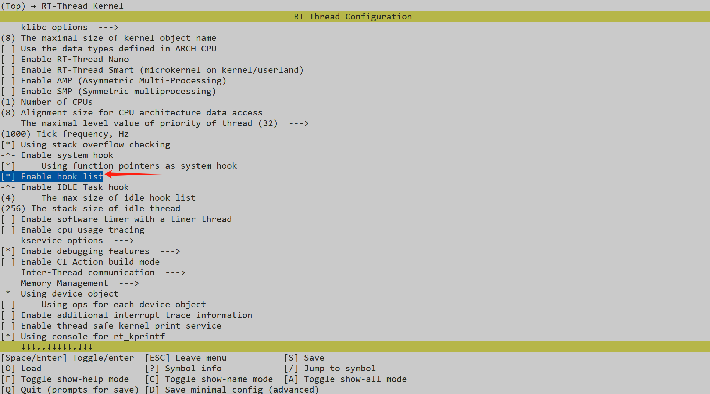

配置好选项之后，按 ESC 返回，退出并保存配置，这样 SystemView 软件包的使能和相关配置就完成了。

后面我们以一个具体的 demo 来讲解 SystemView 工具的使用。

**📄 添加示例代码**

在文件 main.c 中添加以下代码，然后在 main 函数中调用 demo 初始化函数 `demo_init();` 运行 demo。

```c
/*
* 程序清单：systemview 演示代码
*
* 这个例子中将创建一个动态信号量(初始值为0)及两个动态线程，在这个两个动态线程中
* 线程2将试图采用永远等待方式去持有信号量，持有成功之后发送运行标志。
* 线程1将先发送正在运行标志，然后释放一次信号量，因线程2的优先级较高，线程2持有到信号量将线程1抢断。
* 然后线程2发送运行标志之后，获取不到信号量，被挂起，线程1继续运行
*/

#define THREAD_PRIORITY         25
#define THREAD_STACK_SIZE       512
#define THREAD_TIMESLICE        5
/* 指向信号量的指针 */
rt_sem_t sem_food;
/* 线程1入口 */
void thread1_entry(void* parameter)
{
    while (1)
    {
        /* 线程1第一次运行 */
        rt_kprintf("thread1 is run!\n");
        /* 释放一次信号量 */
        rt_sem_release(sem_food);
        /* 线程1第二次运行 */
        rt_kprintf("thread1 run again!\n");
        /* 线程1延时1秒 */
        rt_thread_delay(RT_TICK_PER_SECOND);
    }
}
/* 线程2入口 */
void thread2_entry(void* parameter)
{
    while (1)
    {
        /* 试图持有信号量，并永远等待直到持有到信号量 */
        rt_sem_take(sem_food, RT_WAITING_FOREVER);
        /* 线程2正在运行 */
        rt_kprintf("thread2 is run!\n");
    }
}
/* DEMO初始化函数 */
void demo_init(void)
{
    /* 指向线程控制块的指针 */
    rt_thread_t thread1_id, thread2_id;
    /* 创建一个信号量，初始值是0 */
    sem_food = rt_sem_create("sem_food", 0, RT_IPC_FLAG_PRIO);
    if (sem_food == RT_NULL)
    {
        rt_kprintf("sem created fail!\n");
        return ;
    }
    /* 创建线程1 */
    thread1_id = rt_thread_create("thread1",
                    thread1_entry, RT_NULL,/* 线程入口是thread1_entry, 参数RT_NULL */
                    THREAD_STACK_SIZE, THREAD_PRIORITY, THREAD_TIMESLICE);
    if (thread1_id != RT_NULL)
        rt_thread_startup(thread1_id);
    /* 创建线程2 */
    thread2_id = rt_thread_create("thread2",
                    thread2_entry, RT_NULL,/* 线程入口是thread2_entry, 参数RT_NULL */
                    THREAD_STACK_SIZE, THREAD_PRIORITY - 1, THREAD_TIMESLICE);
    if (thread2_id != RT_NULL)
        rt_thread_startup(thread2_id);
}

```

### 🖥️ PC 端SystemView 配置及使用

✅ **步骤一**：下载 SystemView 分析工具 

[下载链接:https://www.segger.com/products/development-tools/systemview/](https://www.segger.com/products/development-tools/systemview/)

✅ **步骤二**：为 RT-Thread 添加系统描述文件

首先找到开发板目录下的 packages 目录，然后在 packages 目录下找到 segger_debug-xxx 目录，在这个目录里面有一个 SystemView_Description 文件夹，RT-Thread 系统的描述文件就在里面，具体的目录结构如下所示：

```
bsp\\你自己的开发板\\packages\\segger_debug-xxx\\SystemView_Description\\SYSVIEW_RT-Thread.txt
```

将这个文件复制到 SystemView 工具安装目录下的 Description 目录下，这样 SystemView 就可以识别出 RT-Thread 系统了。

✅ **步骤三**：连接MicroLink，启动SystemView 功能

使用串口助手工具连接MicroLink提供的虚拟串口，并发送`SystemView.start(0x20000000,1024,1)`指令，来启动MicroLink的SystemView 功能模块。

```c
SystemView.start(0x20000000,1024,1)
```

- 0x20000000:搜索RTT控制块的起始地址；
- 1024：搜寻范围大小；
- 1：启动RTT的通道。

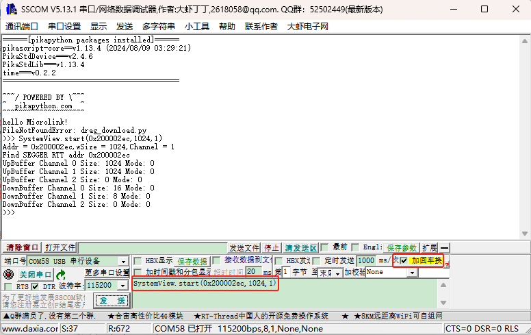

如上图所示提示`Find SEGGER RTT addr 0x200002ec`，说明已成功启动SystemView 功能，然后**关闭串口**。

如果提示`no find _SEGGER_RTT addr`，可以打开map文件，搜索_SEGGER_RTT 变量的地址，如下图所示_SEGGER_RTT 地址为0X200002ec，然后将命令替换为`SystemView.start(0X200002ec,1024,1)`

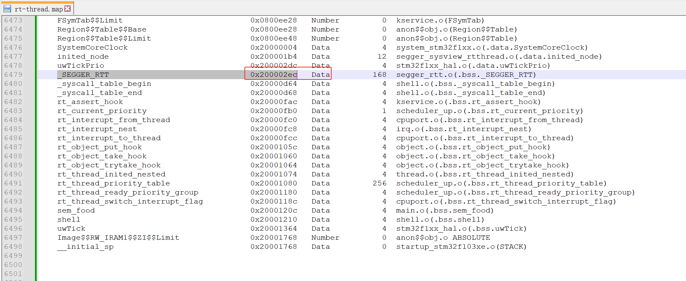

✅ **步骤四**：配置设备信息，开始录制

双击打开 SystemView PC端程序，点击Taget

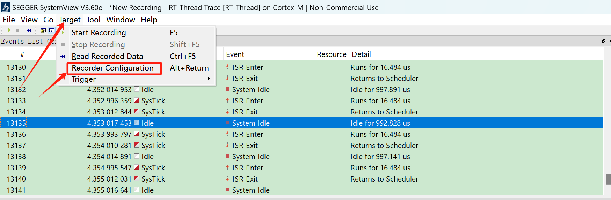

选择UART连接模式

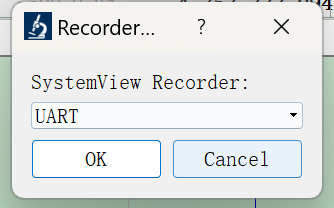

COM口选择刚才配置MicroLink启动SystemView 功能的端口号，由于MicroLink的虚拟串口使用的是USB CDC模式，所以不需要配置波特率，保持默认就行。

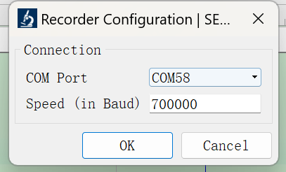

点击OK，启动开始录制按钮，SystemView 就开始实时录制系统信息了。

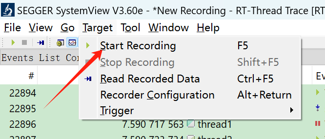

✅ **步骤五**：结束录制，分析系统

点击结束录制按钮，结束录制。将鼠标放置到时间轴窗口里，利用滚轮将事件放大到适合分析的大小

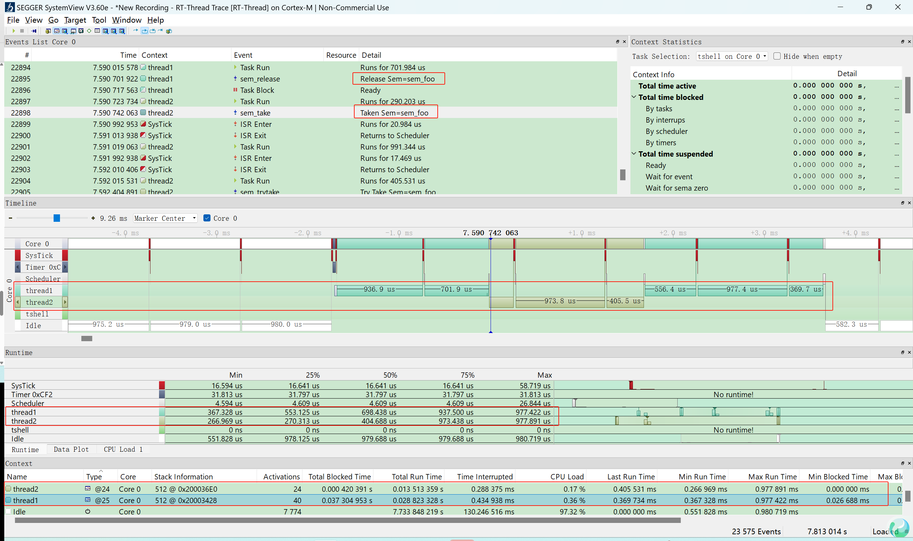

利用 SystemView 工具我们可以看出来，系统的运行确实如我们设想的那样，线程1先开始运行，然后在释放信号量之后被线程2抢断。然后线程2运行，之后因获取不到信号量被挂起，线程1继续运行。从上面的事件列表还可以看到每个线程获取或释放信号量的具体时间。

在这次 demo 中，我们可以总结出系统整体：

- 线程切换有序、无异常延迟；
- CPU 主要处于空闲状态，说明整体系统负载非常低；
- 所有事件、切换、运行时间都精确呈现。

### ❓常见问题答疑（FAQ）

| 问题                                            | 解答                                                         |
| ----------------------------------------------- | ------------------------------------------------------------ |
| **1. 使用 SystemView 会不会影响系统性能？**     | 几乎不会。SystemView 使用 SEGGER 的 RTT 技术通过 SWD 读取内存中的 trace 数据，速度快、占用少。传输数据时采用 `memcpy` 拷贝到缓冲区，不会频繁打断 CPU，数据上传过程不会显著占用总线带宽，性能影响可以忽略。 |
| **2. RTT 缓冲区满了会不会丢数据？**             | 会。若上位机没有及时读取 RTT 缓冲区，旧数据可能被新数据覆盖，造成 trace 丢失。建议增大缓冲区、确保持续连接并避免暂停采集。 |
| **3. SystemView 支持哪些 RTOS？**               | 官方支持 embOS、FreeRTOS、RT-Thread、CMSIS-RTOS 等主流内核，也支持通过接口适配层（`SEGGER_SYSVIEW.c/h`）接入自定义 RTOS。 |
| **4. SystemView 能用于裸机程序吗？**            | 可以，但功能受限。裸机无任务调度，只能记录中断或自定义打点，无法进行任务运行时间分析、调度分析等 RTOS 专属功能。 |
| **5. 可以在正式发布版本中保留 SystemView 吗？** | 不建议。虽然开销小，但 trace 功能占用 RAM/ROM 空间，也可能带来信息泄漏风险。推荐仅在开发调试阶段启用，可用 `#ifdef DEBUG` 控制。 |
| **6. SystemView 支持事后分析模式吗？**          | 支持。除了实时分析外，SystemView 也支持“事后分析”模式：程序运行时将 trace 数据保存到目标板上的RAM 中，之后通过 MicroLink 读取 trace 缓冲区内容进行回放分析，适合定位偶发问题或无法在线连接场景。 |