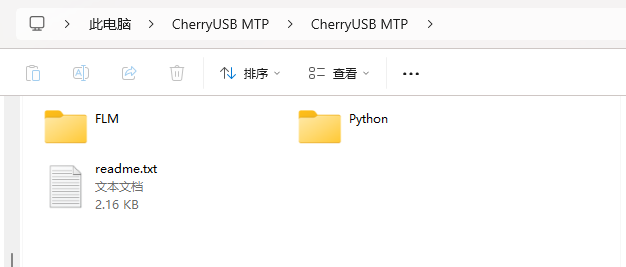

# CherryUSB MTP加持下的拖拽下载简直太爽了

如果你曾用过 STLink、DAPLink 等调试工具，应该对**“U盘拖拽下载”**这个特性不陌生——将 `.bin` 文件拖到识别出来的“U盘”里，MCU 固件就下载完成了，连烧录工具都省了。看上去非常简单、高效。

但当你深入使用后，也许你会发现，这种方式虽然优雅，但也有不少 **“历史包袱”**：

## 🧱 DAPLink 的 U 盘下载模式存在什么问题？

DAPLink 的 U 盘拖拽下载基于传统的 **MSC（Mass Storage Class）协议**，本质上是让 PC 把下载的 `.bin` 文件写入一个“虚拟文件系统”，DAPLink 在后台解析并烧录到目标芯片。

这种方式确实有几个优点：

- ✅ **无需驱动、即插即用**：识别为标准U盘；
- ✅ **操作简单**：拖拽文件即可下载；
- ✅ **适合初学者或生产环境**：界面友好，出错率低。

但也存在明显的局限性：

- ❌ **芯片强绑定**：只能下载 DAPLink 固定支持的几个芯片（如 STM32、NXP 一些型号）；
- ❌ **算法不可扩展**：不支持自定义 Flash 编程算法；
- ❌ **日志信息滞后**：下载完成后需要**重启 DAPLink**，PC 才能看到 `DETAILS.TXT` 等文件显示成功或失败信息；
- ❌ **MSC 协议的文件缓存问题**：某些系统会缓存写入，导致下载失败但提示成功。

## 🧠 优雅的解决方案：脱胎换骨的拖拽体验

为了解决上述问题，我对“拖拽下载”进行了全面升级，打造出基于 **CherryUSB + MTP 协议** 的全新实现：

### ✅ 1. **芯片自由 · 算法可拓展**

抛弃 DAPLink 固定算法的做法，采用flash下载算法与固件分离的策略：

> 👉 支持用户**加载外置 Flash 编程算法**（兼容 Keil 的 FLM 格式），配合 Python 脚本自定义烧录逻辑，实现对任意芯片的拖拽支持。

这意味着，只要你有对应的下载算法，就能适配任何 MCU，真正做到 **“芯片自由”**！

### ✅ 2. **MTP 协议加持 · 即时反馈**

> 📚 **关于 MTP 协议**
>  MTP（Media Transfer Protocol）最初由微软提出，用于在 PC 和便携设备（如手机、相机）之间传输媒体文件。

传统 MSC 模式的另一个痛点是——**你不知道下载是否成功**，直到重启 DAPLink，才能看到 `FAIL.TXT` 提示文件。

采用 **CherryUSB 实现的 MTP（Media Transfer Protocol）** 模式，完美解决这个问题：

- MTP 模式下，每次文件传输完成后，**立即回写**成功或失败信息为文件内容；
- PC 端无需重启下载器，**可即时查看返回的提示文件**内容；
- 更高的稳定性，避免 MSC 的缓存不一致问题。

这就像 U盘拖拽的外衣下，藏着一个智能、可通信的“文件传输助手”。


**🔗 淘宝购买链接：**
 👉 https://item.taobao.com/item.htm?ft=t&id=895964393739

## 🛠 使用教程：MicroLink 拖拽下载就是这么简单

使用 MicroLink 的拖拽下载功能，只需以下几步：

### 🔌 1. 插入 MicroLink，自动识别 MTP 设备

- 插入 MicroLink 后，PC 会识别出一个名为 **CherryUSB MTP** 的 MTP 设备；
- 打开该设备，你会看到一个提示说明文件 `README.TXT`。



### 🔧 2. 配置下载算法与脚本

- 将你的目标芯片烧录算法（FLM 文件），经过工具转换以后，放入FLM目录；
- 编写Python文件夹下的drag_download.py，绑定下载算法。

```python
import FLMConfig
ReadFlm = FLMConfig.ReadFlm()
res1 = ReadFlm.load("FLM/STM32F10x_1024.FLM.o",0X08000000,0x20000000)
# 设置下载速率
cmd.set_swd_clock(5000000)
```

### 📦 3. 拖入 `.bin` 固件文件即可开始下载

- 将你要烧录的固件拖入 MTP 设备；
- MicroLink 自动开始烧录流程。

### 📄 4. 下载完成后生成提示文件

- 下载成功：生成 `SUCCESS.TXT`；
- 下载失败：生成 `FAIL.TXT`，并包含失败原因（如校验失败、通信超时等）；
- 全程**无需重启设备**，即可查看结果。
