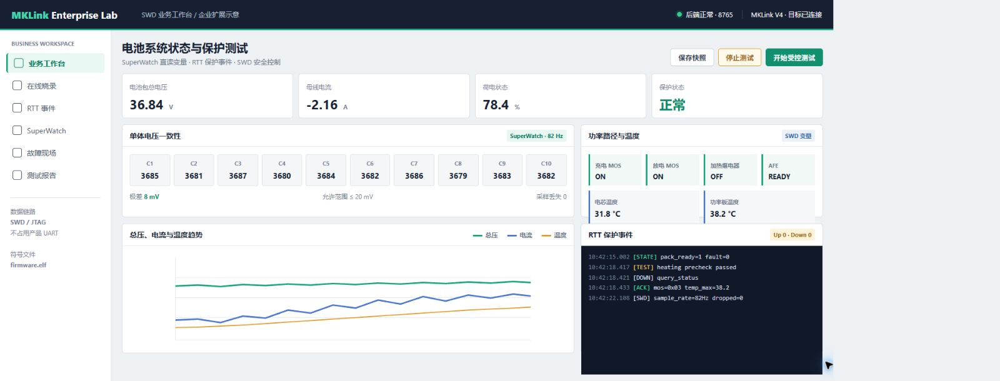
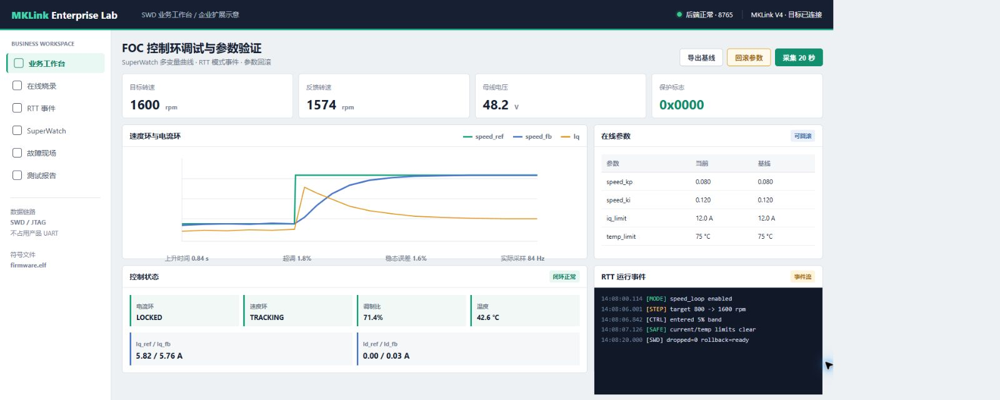
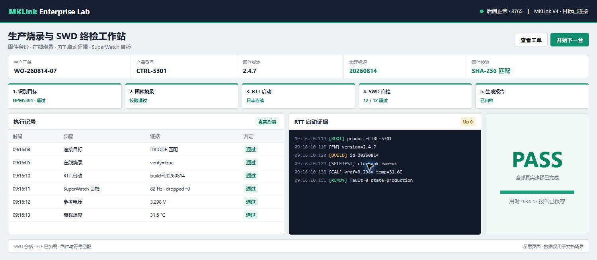

# 用 AI 定制企业专属上位机

MKLink AI Probe 已经提供在线烧录、RTT、SuperWatch、Memory、SystemView、Web GUI 和 Windows 桌面端。企业不必从设备连接和调试协议开始重写上位机，只需把自己的产品变量、运行流程和判定规则交给 AI，就可以在现有能力上增加专用页面。

本教程不要求用户操作 Git，也不要求用户掌握 Vue、FastAPI 或桌面应用打包。Fork、分支、代码修改、测试、同步官方更新和提交 PR 均由 AI 完成。用户负责说明业务、提供工程和协议资料、连接真实设备，并确认结果是否符合产品要求。

!!! note "本页所说的私有协议"
    私有协议可以运行在 RTT Down/Up 通道或固件中的 SWD 调试邮箱中。页面通过 MKLink 的 SWD/JTAG 调试链路与 MCU 交互，不占用产品 UART，也不改变现场总线。

## 适合做成专用页面的业务

一个专用 Web GUI 通常不是把通用仪表盘换个颜色，而是把产品的调试规程和生产步骤固化成可以重复执行的工作流。

| 业务目标 | 可以复用的 MKLink 能力 | 企业补充的内容 |
|---|---|---|
| 电池系统状态和保护测试 | SuperWatch、Memory、RTT、在线烧录 | 单体电压、温度、MOS 状态、保护事件和控制规则 |
| 电机与 FOC 调试 | SuperWatch、变量写入、RTT、故障现场 | Id/Iq、速度环参数、限幅、故障码和安全条件 |
| 生产烧录与终检 | 在线烧录、RTT、SuperWatch、报告数据 | 工单、SN、校准步骤、合格范围和报告格式 |
| 设备维护与故障复现 | RTT、Memory、HardFault、SystemView | 产品状态机、服务模式、故障复现和恢复流程 |

共同原则是：通用硬件能力继续跟随 MKLink 官方仓库，公司的产品协议、工艺参数和业务页面保留在企业自己的仓库中。

## 第一步：让 AI 建立企业版本

先确认当前 AI 已登录可以保存企业源码的 GitHub 或企业 Git 服务，然后直接告诉它：

> 把官方 MKLink AI Probe Fork 到我的账号并建立本地开发环境。先读取仓库里的 AGENTS.md、维护 Skill 和项目说明，运行现有测试并启动 Web GUI。暂时不要修改功能，向我报告企业仓库地址、官方源码版本、测试结果和预览地址。

AI 完成后应给出可核对的结果，而不是只说“环境已经准备好”：

~~~text
企业仓库：<企业或个人仓库地址>
官方上游：Aladdin-Wang/Mklink-AI-Probe
源码基线：<commit>
Web GUI：http://127.0.0.1:<实际端口>
前端测试：通过
后端测试：通过
生产构建：通过
当前未修改业务代码
~~~

如果 AI 没有仓库权限，应让它打开授权页面或说明缺少的权限。不要把访问令牌直接发到对话中。

## 第二步：说明业务，而不是指定代码

用户最重要的工作是讲清楚产品如何运行。建议向 AI 提供：

- 与当前固件匹配的 AXF/ELF 和 MAP；
- 需要读取的变量名称、类型、单位和合理范围；
- RTT 通道、日志格式以及允许发送的调试命令；
- 页面需要完成的实际流程；
- 写参数、启动执行器或升级固件的安全条件；
- 一次完整验收应该得到什么结果。

下面以电池系统测试页面为例：

> 这是电池控制器工程、ELF 和调试说明。我要增加一个电池系统测试页面，通过 SuperWatch 读取总电压、电流、10 路单体电压、3 路温度、MOS 状态和故障码；通过 RTT 显示保护事件，并用 RTT Down 通道执行经过确认的加热测试。先分析现有 GUI、变量和 RTT 格式，整理页面、数据流、安全边界和验收方案，我确认后再开发。

AI 在写代码前应先输出类似下面的分析：

~~~text
数据来源
- SuperWatch：总电压、电流、单体电压、温度、MOS 和故障码
- RTT Up 0：运行日志和保护事件
- RTT Down 0：start_heating / stop_heating / query_status
- 在线烧录：测试固件和恢复固件

安全条件
- 目标温度必须在允许范围内
- 加热命令需要二次确认
- 调试链路中断或故障码出现时自动停止
- 写入前记录原值，测试后恢复
- ELF 与目标固件不一致时禁止开始
~~~

用户确认这份数据来源和安全边界后，再进入实现阶段。

## 第三步：让 AI 完成页面开发

确认方案后继续告诉 AI：

> 按确认的方案开发。保留 MKLink 原有功能，把企业页面、变量定义、RTT 命令和测试单独组织，尽量少改公共模块。页面必须显示真实硬件数据，禁止用随机数冒充设备结果。完成后先启动预览，报告修改范围和当前未完成项。

AI 的阶段性输出应明确哪些是企业功能，哪些公共能力没有被改动：

~~~text
新增
- 电池系统测试页面
- 目标变量组和单位定义
- RTT 保护事件解析
- 受约束的加热测试流程
- 测试记录导出

复用
- MKLink 设备连接
- ELF 符号解析
- SuperWatch 采样
- RTT 上下行
- 在线烧录和资源互斥

未修改
- 下载器固件协议
- 通用烧录后端
- Memory、SystemView 和脱机下载
~~~

### 场景一：电池系统状态与保护测试

页面可以把 SuperWatch 采集的工程变量转换为业务视图：总电压和电流显示当前工作点，单体电压显示一致性，温度和 MOS 状态反映热管理与功率路径，RTT 区域保留保护事件和命令应答。

图中页面是重新设计的业务场景示意，不对应任何客户产品。实际页面必须使用企业自己的 ELF、变量、阈值和 RTT 命令。

### 场景二：FOC 调试与参数验证

电机控制器页面不需要另外设计串口数据帧。SuperWatch 可以直接采集 speed_ref/speed_fb、Id_ref/Id_fb、Iq_ref/Iq_fb、母线电压、控制输出和保护状态；RTT 用于记录模式切换、限幅和故障事件。

参数写入必须限定在固件明确开放的在线调试变量中。每次修改前记录原值、上下限和回滚值，出现过流、过压、失速、温升或故障标志时立即停止。

### 场景三：生产烧录与终检

生产页面可以把原本分散的操作组合为一条流程：识别工单和目标型号、烧录经过批准的固件、读取自检变量、采集 RTT 启动记录、执行校准、判断结果并导出报告。

页面中的 PASS 只能来自实际步骤和真实数据，不能仅凭下载成功判定。至少还要验证固件版本、自检状态、关键测量值和 RTT 启动结果。

## 第四步：让 AI 连接真机验收

页面能够打开不代表功能已经完成。目标板连接后，可以直接说：

> 目标板和 MKLink 已连接。用匹配的 ELF 做一次完整真机测试：连接目标、确认固件版本、采集 SuperWatch 变量、读取 RTT、执行受约束的业务操作，再恢复初始状态。保存关键截图和测试数据。失败就继续定位修复，不要在只打开页面时结束。

建议要求 AI 按固定格式报告：

~~~text
源码与固件：匹配
目标连接：通过
SuperWatch：采样率 <实测值>，后端丢样 <数量>
RTT：控制块 <地址>，通道 <编号>，日志连续
业务动作：命令已确认，设备回读符合预期
异常处理：故障码、超时和中断条件已验证
恢复检查：参数和运行状态已恢复
测试结论：通过 / 不通过
证据：截图、原始日志、数据文件和源码提交
~~~

涉及加热、电机、继电器、功率输出或高压设备时，软件条件不能替代硬件急停、限流、温度和绝缘保护。

## 第五步：生成企业安装包

真机验收通过后再让 AI 打包：

> 把验证通过的企业版打包成 Windows 安装包。产品名称改为“<企业产品名称>”，使用我提供的图标和版本号。安装到干净环境后，再连接真实设备完成一次相同验收。安装包和私有源码不能发布到公共仓库。

AI 应报告安装包位置、文件摘要、源码提交、安装验证和真机结果。只生成安装文件但没有在安装后的程序中复测，不能作为交付完成。

## 同步 MKLink 官方功能

企业版本可以继续吸收官方的烧录、调试和稳定性改进。用户不需要手动处理仓库，只需告诉 AI：

> 检查 MKLink 官方仓库最近的更新，分析哪些改动适合同步。不能覆盖我们的企业页面、变量定义和 RTT 业务命令。先报告可能的冲突和合并方案，我确认后再同步；同步完成后重新运行测试、生产构建和真机验收。

AI 应把结果分为三类：

| 分类 | 示例 |
|---|---|
| 可以直接同步 | 烧录修复、RTT 性能、SuperWatch 稳定性 |
| 需要合并检查 | 公共导航、设备连接和共享页面组件 |
| 保持企业版本 | 私有变量、业务判定、工艺参数和品牌资源 |

企业页面越独立、对公共文件的修改越少，后续同步成本越低。

## 将通用改进提交给官方

如果问题在原版 MKLink 中也能复现，可以让 AI 把通用修复独立出来：

> 这个问题在 MKLink 官方版本也能复现。把修复从企业业务中拆出来，补充回归测试和验证记录，向官方仓库提交 PR。不能包含私有变量名、协议、工艺参数、客户信息、密钥和企业资源。

适合提交官方的内容包括通用错误处理、性能优化、设备兼容性和公共页面缺陷。企业产品流程、私有 RTT 命令和判定阈值应继续留在自己的仓库。

## 用户和 AI 各自负责什么

| 用户负责 | AI 负责 |
|---|---|
| 产品目标和使用场景 | Fork、分支和源码管理 |
| 工程、ELF 和变量含义 | 阅读仓库规则和现有实现 |
| 安全范围和停止条件 | 页面、后端和测试代码 |
| 连接真实硬件 | 启动预览、采集数据和定位问题 |
| 判断设备行为是否正确 | 自动测试、构建、打包和同步上游 |
| 批准最终交付 | 保存证据并整理通用 PR |

AI 可以显著缩短专用上位机的开发和维护周期，但不能代替产品安全设计、硬件保护和最终工程验收。

下一步可以回到 [连接硬件与配置工程](project-config.md)，也可以先阅读 [RTT 终端与曲线](RTT_printf.md) 和 [SuperWatch 与 PID 调试](superwatch.md)，确定企业页面需要复用的数据能力。
