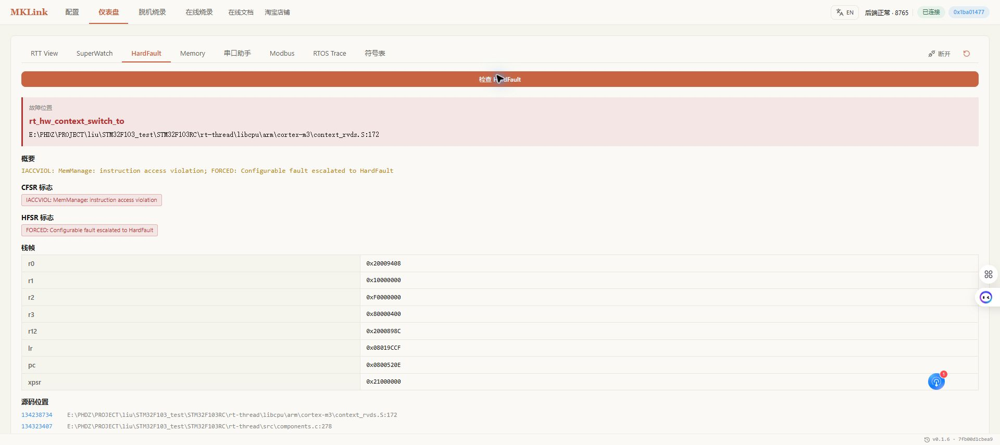
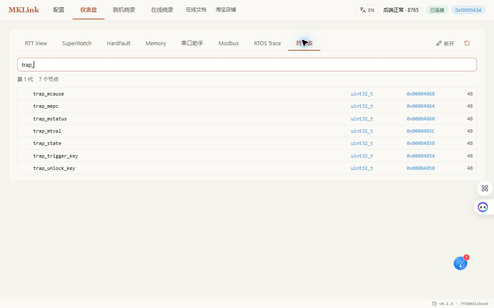

# HardFault / RISC-V Trap 现场分析

HardFault 分析的目标不是猜一个可能原因，而是保存异常发生时的寄存器、异常栈和相关内存，用匹配的 AXF/ELF 将 PC、LR 映射回源码，再通过修改和复验关闭问题。

## 发生故障后先不要做什么

不要立即复位、重新烧录或写内存。这些操作可能清除 Fault 状态和异常栈。先停止自动复位机制，并保存：

- `CFSR`、`HFSR`、`MMFAR`、`BFAR`、`AFSR`；
- 异常栈中的 R0–R3、R12、LR、PC、xPSR；
- 当前 MSP/PSP、故障线程和相关 RAM；
- 与目标中固件完全匹配的 AXF/ELF 和 MAP；
- 复现步骤、输入条件和固件版本。

!!! danger "看门狗会破坏现场"
    产品看门狗可能在数秒后复位目标。调试固件应提供受控的现场保留方式；量产产品则优先把必要寄存器和栈帧保存到保留 RAM、Flash 或外部日志。

## Web GUI 操作

1. 在“配置”页加载当前固件的 AXF/ELF；
2. 连接目标，打开“仪表盘 → HardFault”；
3. 点击检查或解码，先保存原始寄存器；
4. 若页面提供异常栈地址，读取并解码 PC、LR；
5. 将地址映射到函数和源码行；
6. 把“确定事实”“基于事实的推断”“待验证项”分开记录。

Fault 状态全为 0 只说明当前没有保留下来的可配置 Fault 位，不能证明程序从未发生异常。

## STM32F103RET6 受控演示

案例固件增加了一个默认关闭的测试点。只有把解锁值写入 `g_hardfault_demo_arm`，低优先级 `hfdemo` 任务才调用非法 Thumb 地址；正常上电不会触发。

```c
#define MKLINK_HARDFAULT_ARM_VALUE 0x48464C54UL
volatile rt_uint32_t g_hardfault_demo_arm;

if (g_hardfault_demo_arm == MKLINK_HARDFAULT_ARM_VALUE) {
    void (*invalid_function)(void) = (void (*)(void))0xFFFFFFF1UL;
    g_hardfault_demo_arm = 0U;
    invalid_function();
}
```

演示触发时的构建中，解锁变量位于 `0x20007DA8`。写入后立即回读为 0，说明任务已经消费解锁值。随后采集到：

```text
CFSR: 0x00000001
  IACCVIOL: MemManage instruction access violation
HFSR: 0x40000000
  FORCED: configurable fault escalated to HardFault
PC: 0xFFFFFFF0
LR: 0x08012B87
hard fault on thread: hfdemo
```

RT-Thread 还输出了完整异常寄存器和线程表：`hfdemo` 处于 running，其余任务暂停。这里的证据链是：

1. `IACCVIOL` 证明发生了取指访问违规；
2. `FORCED` 证明可配置 Fault 升级为 HardFault；
3. `PC=0xFFFFFFF0` 与故意调用的非法地址一致；
4. `LR=0x08012B87` 返回到 `mklink_hardfault_demo_entry()` 的调用点；
5. 故障线程名为 `hfdemo`，与测试任务一致。



演示结束后重新烧录默认安全固件，确认 RTT 运行时间继续增长且 Fault 状态清除。不要在生产固件中保留可被外部随意触发的故障入口。

重新编译后必须从当前 AXF 重新解析地址。最终安全构建中该变量已移动到 `0x20007DA0`，不能沿用演示触发时的地址。

## 常见 CFSR 位

| 位 | 含义 | 优先检查 |
|---|---|---|
| `IACCVIOL` | 非法取指 | 函数指针、返回地址、栈破坏、执行权限 |
| `DACCVIOL` | 非法数据访问 | 指针、数组边界、MPU 区域 |
| `PRECISERR` | 精确总线错误 | BFAR、PC 对应的读写语句 |
| `IMPRECISERR` | 非精确总线错误 | 更早的缓冲写、DMA、总线时序 |
| `UNALIGNED` | 未对齐访问 | packed 结构、指针转换、总线宽度 |
| `DIVBYZERO` | 除零 | 除数来源和编译器配置 |

只有 `BFARVALID` 或 `MMARVALID` 有效时，BFAR/MMFAR 才能作为故障地址解释。PC 落在无效地址时，还应检查栈溢出、函数指针和返回地址被覆盖。

## 从现场到修复

```text
保存寄存器和栈 -> 用匹配 AXF 定位 -> 找到上游数据来源
 -> 最小修改 -> 重新构建和烧录 -> 同条件复现 -> 确认 Fault 消失
```

修复不能只以“设备重新启动”为完成标准。应重复原触发条件，并确认 Fault 寄存器、日志和相关变量都恢复正常。

## HPM5301 RISC-V Trap 实测

HPM5301 是 RISC-V，不能照搬 Cortex-M 的 CFSR/HFSR。该架构优先保存：

- `mcause`：异常原因；
- `mepc`：异常发生的 PC；
- `mtval`：与异常相关的地址或指令值；
- `mstatus`：机器模式状态；
- 当前任务、栈和与故障相关的 RAM。

案例固件使用双钥匙受控触发，两个值都正确时才执行 `0xFFFFFFFF` 非法指令：

```text
trap_unlock_key  = 0x48504D53
trap_trigger_key = 0x54524150
```

触发后先读取保留 RAM，不复位：

```text
trap_state = 2
mcause      = 2
mepc        = 0x80008B1A
mtval       = 0xFFFFFFFF
mstatus     = 0x00001880
```




`mcause=2` 表示非法指令，`mtval` 与故意执行的指令字一致。使用当前 `demo.elf` 映射 `mepc`：

```text
0x80008B1A -> trigger_illegal_instruction() -> src/main.c:68
```

现场采集完成后重新在线烧录默认安全 BIN，再用 RTT 确认 PID 阶跃、`state=1` 和 `alarm=0` 恢复。完整步骤见 [HPM5301 + FreeRTOS 全功能实战](hpm5301-freertos-case.md)。

## 使用 AI 协助

Cortex-M：

> 保存 Fault 寄存器和异常栈，用当前 AXF 定位 PC/LR；采集完成前不要复位。

RISC-V：

> 保存 RISC-V Trap 的 `mcause/mepc/mtval/mstatus`，用当前 ELF 定位源码；采集完成前不要复位。

AI 必须把寄存器事实、源码推断和待验证项分开，不应在缺少匹配 ELF、异常栈或 Trap CSR 时给出确定根因。
