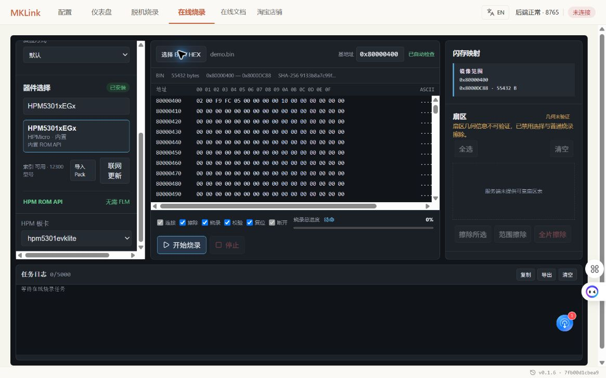
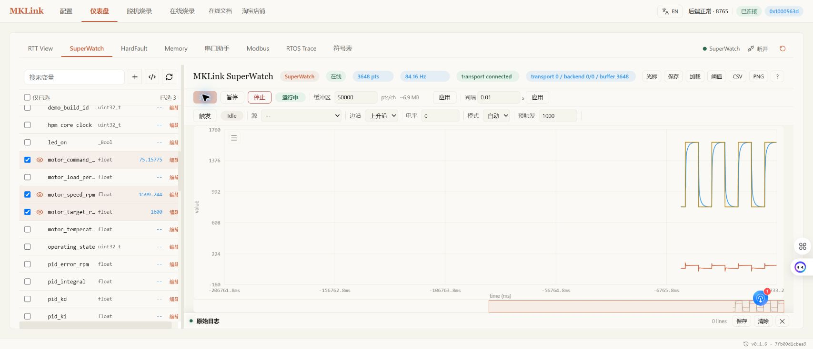
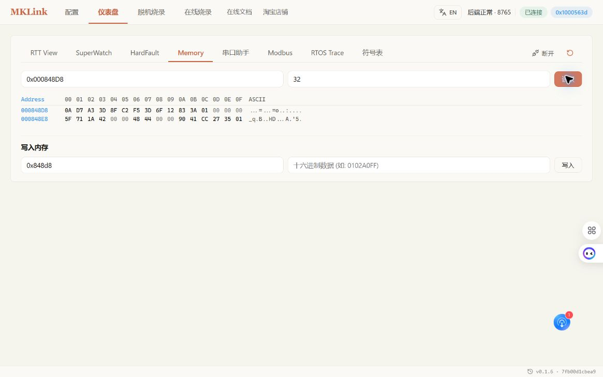

# HPM5301 + FreeRTOS 全功能实战

本章以 HPM5301 EVK Lite 和 HPM SDK 的 FreeRTOS/SystemView 示例为基础，完整走通工程配置、SES 构建、HPM ROM API 在线与脱机烧录、RTT、SuperWatch、VOFA、Memory、RTOS Trace，以及 RISC-V Trap 现场定位。所有地址、日志、曲线和截图均来自同一次实机演示。

## 测试环境

| 项目 | 本次实测值 |
|---|---|
| MCU | `HPM5301xEGx` |
| 开发板 | `hpm5301evklite` |
| 工程 | HPM SDK `samples/segger_sysview/freertos` |
| IDE | SEGGER Embedded Studio 8.24 |
| 内核 | FreeRTOS |
| 探针 | MKLink V4 CMSIS-DAP |
| 下载方式 | HPM ROM API，不使用 FLM |
| BIN 基址 | `0x80000400` |
| RTT 控制块 | `0x00087100` |
| CPU 时钟 | 360 MHz |

构建产物来自 SES Debug 配置：

```text
demo.bin   55,432 bytes
demo.elf  617,641 bytes
demo.map  220,860 bytes
SHA-256   9133B8A7C99F826BE7FA4CD76BB1A18B1AF04FD87379EBA92BA373007F6333DB
```

!!! warning "地址只对本次构建有效"
    重新编译后，变量和 RTT 控制块地址都可能变化。每次都应加载新生成的 ELF/MAP，并重新解析符号；不要把本章地址直接复制到其他工程。

## 1. 准备演示固件

示例保留原有三个 FreeRTOS 任务和 SystemView 事件，并增加一个 10 ms PID 速度环。目标值每 6 秒在 800 rpm 与 1600 rpm 之间切换，一阶对象模拟电机速度，RTT 每 100 ms 输出一次状态。

主要变量如下：

| 变量 | 类型 | 用途 |
|---|---|---|
| `motor_target_rpm` | `float` | 目标转速 |
| `motor_speed_rpm` | `float` | 模拟反馈转速 |
| `motor_command_percent` | `float` | 0–100% 控制输出 |
| `motor_temperature_c` | `float` | 模拟温度 |
| `pid_kp/pid_ki/pid_kd` | `float` | 在线调试参数 |
| `pid_error_rpm` | `float` | 当前速度误差 |
| `operating_state` | `uint32_t` | 运行状态 |
| `alarm_code` | `uint32_t` | 告警码 |

SES 工程使用 `GDB Server` 调试连接。构建完成后先核对输出目录、文件时间和摘要，确保 BIN、ELF、MAP 来自同一配置。

## 2. 配置 Web GUI

在“配置”页选择工程目录，指定 `demo.elf` 和 `demo.map`，本地设备选择 MKLink 对应端口。配置页可以公开本机路径和串口号，但发布截图前仍应检查是否包含用户名、远程 Token 或其他项目隐私。


页面顶部显示“后端正常”及端口后连接目标。符号表应能解析出 PID 和 Trap 变量，RTT 自动搜索应得到 `0x00087100`。

## 3. HPM ROM API 在线烧录

进入“在线烧录”，选择 `HPM5301xEGx` 和 `hpm5301evklite`，加载 `demo.bin`，基址填写 `0x80000400`。页面必须显示“HPM ROM API / 无需 FLM”。



本次任务完整执行：

```text
connect -> erase -> program -> verify -> reset -> disconnect
```

状态为 `SUCCEEDED`，总进度 100%，用时约 13.9 秒。


HPM 下载不要查找、上传或加载 FLM。若页面要求 HPM 选择 FLM，应停止并检查目标型号和软件版本。

## 4. RTT 验证固件运行

打开“仪表盘 → RTT View”，确认地址为 `0x00087100`，连续运行至少 12 秒以覆盖完整阶跃。


真实输出节选：

```text
HPM5301 t=90000 target=1600 speed=847 output=100 temp=38 state=1 alarm=0
HPM5301 t=92000 target=1600 speed=1571 output=74 temp=40 state=1 alarm=0
HPM5301 t=96000 target=800 speed=1541 output=0 temp=42 state=1 alarm=0
```

三行分别显示升阶跃、接近稳态和降阶跃。时间持续增长、目标值切换、反馈跟随以及 `state=1/alarm=0` 共同证明新固件正在运行。

## 5. SuperWatch 观察 PID

选择 `motor_target_rpm`、`motor_speed_rpm`、`motor_command_percent` 三个变量，采样间隔设为 10 ms，窗口设为 2000 点，运行至少 20 秒。




本次实测约 84 Hz，传输和后端均未丢样。曲线历史较长时，阶跃会集中在右侧，可暂停后用滚轮放大局部。观察顺序是：目标值先改变，输出立即响应，速度随后收敛。

调参时一次只改一个参数，并给 `Kp/Ki/Kd` 设上下限、步长和回滚值。真实电机或 FOC 系统还必须保留过流、过压、堵转、失速和温度保护。

## 6. 第三方 VOFA+

VOFA+ 是独立的第三方上位机。MKLink 从目标 RAM 读取变量并从 USB CDC 输出 JustFloat；VOFA+ 选择 MKLink 虚拟串口后显示曲线。它不是 Web GUI 中的内置曲线页面。

本次构建的三通道命令为：

```text
vofa.send(0x000848EC,"float",0x00084890,"float",0x00084894,"float",0.01)
```

三个地址依次对应目标转速、实际转速和输出。重新编译后必须从新 ELF/MAP 重新取地址。


VOFA+ 适合已有数据引擎、触发和游标工作流的工程师；按符号浏览和在线写参时优先使用 SuperWatch。连接方法和停止命令见 [VOFA+ 第三方上位机](vofa.md)。

## 7. Memory 核对原始 RAM

在符号表中确认地址后，从 `0x000848D8` 读取 32 字节，覆盖 `pid_kp/pid_ki/pid_kd` 和相邻运行变量。



浮点数为小端 IEEE 754。Memory 用于核对字节布局和相邻变量，不应替代 ELF 类型化读取。在线写入前必须记录原值并确认变量是固件明确允许调试的参数。

## 8. RTOS Trace / SystemView

示例工程已集成 SEGGER SystemView。进入“RTOS Trace”，自动搜索 RTT 控制块后开始采集。


本次采集识别到：

- 47,147 个事件；
- 4 个任务：`task1`、`task2`、`task3`、`Idle`；
- 360 MHz CPU 时钟；
- MTimer、ECall 和 GPTMR ISR。

8 秒高事件率采集中出现 `session dropped: 1934`。因此这组数据可用于展示任务和 ISR 结构，但不能写成“零丢包精确 CPU 占用”。需要定量分析时，应缩短窗口、降低事件率或增大目标 RTT/SystemView 缓冲后重新采集。

## 9. RISC-V Trap 现场定位

HPM5301 是 RISC-V，不使用 Cortex-M 的 CFSR/HFSR。示例设置双钥匙后执行一条 `0xFFFFFFFF` 非法指令，异常处理函数把 CSR 保存到 RAM 并停留在现场。

```text
trap_unlock_key  = 0x48504D53
trap_trigger_key = 0x54524150
```

触发后采集到：

| 字段 | 值 | 解释 |
|---|---:|---|
| `trap_state` | `2` | Trap 现场已保存 |
| `mcause` | `2` | Illegal instruction |
| `mepc` | `0x80008B1A` | 异常指令地址 |
| `mtval` | `0xFFFFFFFF` | 非法指令字 |
| `mstatus` | `0x00001880` | Trap 时机器状态 |


使用同一次构建的 ELF 映射 `mepc`：

```text
0x80008B1A -> trigger_illegal_instruction() -> src/main.c:68
```

证据链由 `mcause=2`、`mtval=0xFFFFFFFF`、`mepc` 和源码行组成。现场保存后重新在线烧录默认安全 BIN，随后短采 RTT 再次看到 800→1600 rpm 阶跃、`state=1`、`alarm=0`，完成安全恢复。

## 10. 制作 ROM API 脱机任务

进入“脱机烧录”，参数如下：

| 参数 | 值 |
|---|---|
| 下载器 | V4 |
| 目标 | `HPM5301xEGx` |
| 板型 | `hpm5301evklite` |
| 固件 | `demo.bin` |
| 基址 | `0x80000400` |
| 脚本 | `hpm5301_freertos_demo.py` |
| 自动次数 | 1 |

预览必须包含 `hpm.board()` 和 `hpm.program()`，且不能出现 `load.flm()`。


触发测试日志确认设备端打开的是 55,432 字节固件，下载进度到 100%，最后返回：

```text
demo.bin loaded successfully.
auto download finished
```


部署前后都应核对文件大小和 SHA-256，避免同名旧固件被误选。触发成功后仍需用 RTT、版本变量或业务功能验证程序运行。

## AI 执行提示词

提示词保持简洁，工程和硬件边界写清即可：

> 构建 HPM5301 FreeRTOS 工程，用 ROM API 烧录 `0x80000400`；采集 RTT、PID 曲线和 RTOS Trace，保留真实数据并报告丢样。

故障定位可单独下达：

> 触发受控 RISC-V Trap，先保存 `mcause/mepc/mtval/mstatus` 并用当前 ELF 定位源码；完成后重烧安全固件并用 RTT 复验。

## 验收清单

- SES 构建零错误，BIN/ELF/MAP 来自同一次构建；
- 在线烧录完成校验、复位和断开；
- RTT 覆盖至少一个完整阶跃；
- SuperWatch/VOFA 报告实际采样率和丢样；
- SystemView 先报告任务数、时钟和 overflow/drop，再解释数据；
- Trap 现场在复位前保存，并能由 ELF 映射到源码；
- 故障演示后恢复默认安全固件；
- 脱机任务核对文件摘要，并完成真实触发和运行验证。

相关专题：[先楫生态](先辑使用教程.md) · [在线烧录](online-flash.md) · [脱机下载](offline_download.md) · [SuperWatch](superwatch.md) · [HardFault / RISC-V Trap](hardfault.md)
