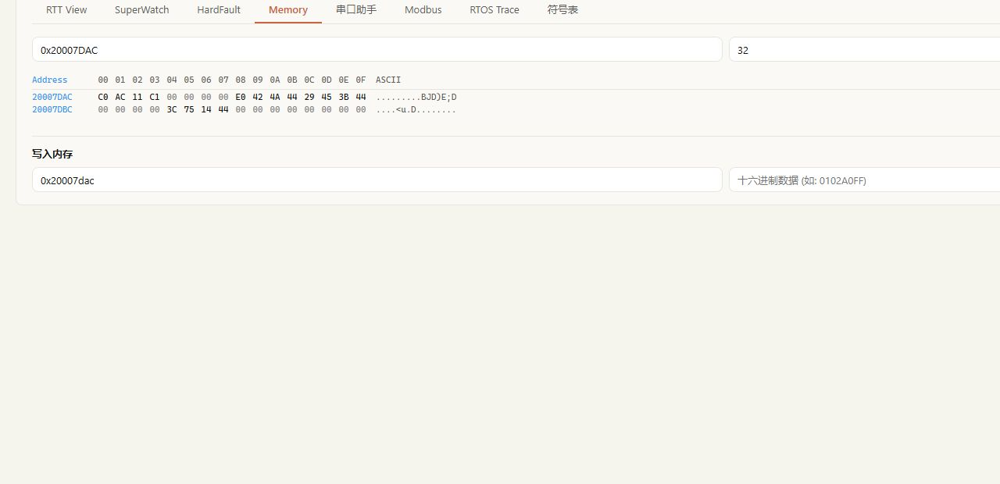

# Memory 内存与寄存器

Memory 用于读取 RAM、Flash 和内存映射寄存器。它适合核对变量底层字节、DMA 缓冲、外设状态和 Fault 寄存器，但不能代替带类型的符号读取。

## 先确定地址来源

可靠的地址应来自以下来源之一：

- 当前构建的 AXF/ELF 和 MAP；
- 芯片参考手册或 CMSIS 头文件；
- 链接脚本、外设基址和项目定义；
- 已确认的数据结构与成员偏移。

重新编译、改变优化或链接布局后，RAM 变量地址可能变化。不要把一次调试得到的地址直接固化到量产脚本。

## 使用 Web GUI 读取

1. 连接目标并打开“仪表盘 → Memory”；
2. 输入起始地址和长度；
3. 先选择只读操作；
4. 读取后同时检查地址列、十六进制字节和 ASCII 区；
5. 对变量数据，用符号页的类型化数值交叉验证。



## STM32F103RET6 实测

一次构建中，PID 变量位于 `0x20007DAC` 附近。在 Memory 页读取 32 字节，可以同时观察误差、反馈、积分和输出附近的原始存储。

浮点数按小端 IEEE 754 存放。手工解释前必须确认：

- 数据宽度和有符号性；
- 字节序和对齐；
- 变量是否被编译器优化；
- 采样期间变量是否正在被中断或任务更新。

若只是想知道 `g_pid_feedback_rpm` 当前是多少，优先在符号页按 `float` 读取；Memory 更适合检查布局、相邻字段和原始字节。

## 读取外设寄存器

读取 DMA、ADC、定时器或 NVIC 前，从芯片参考手册确认地址、位定义和访问属性。

```text
外设基址 + 寄存器偏移 -> 读取正确宽度 -> 保存原值 -> 按位解释
```

同一个位可能是只读状态、写 1 清零或读后清零。不要因为 GUI 提供写入按钮就假设该寄存器可以安全写入。

## 写内存前的检查

!!! danger
    写 RAM 或寄存器会立即改变 MCU 状态。分析偶发故障时，应先保存 Fault 寄存器、异常栈和相关内存，再执行任何写入、复位或恢复操作。

只有同时满足以下条件才写入：

1. 地址属于明确允许在线调整的对象；
2. 类型、字节宽度和取值范围已知；
3. 已记录原值；
4. 写后执行回读；
5. 有明确停止条件和恢复方式。

禁止随意修改 RTOS 控制块、栈、堆、函数指针、向量表、Flash 控制寄存器和安全保护配置。

## 常见问题

| 现象 | 排查 |
|---|---|
| 数据全为 `00` 或 `FF` | 检查供电、SWD 连接、地址范围和目标是否处于复位 |
| 符号值与十六进制不一致 | 检查类型、大小端、AXF 是否匹配和变量是否正在变化 |
| 读取外设总线错误 | 检查器件型号、外设时钟、寄存器地址和访问宽度 |
| 写后立即恢复 | 变量可能被任务/中断周期更新，或地址并非目标变量 |
| 读取导致现场变化 | 某些状态寄存器具有读清除语义，查阅参考手册 |

## 使用 AI 协助

> 只读检查这个变量和相关寄存器，先列出地址来源、位定义和判断条件，不要写入。

下一步：[HardFault 现场分析](hardfault.md)。
