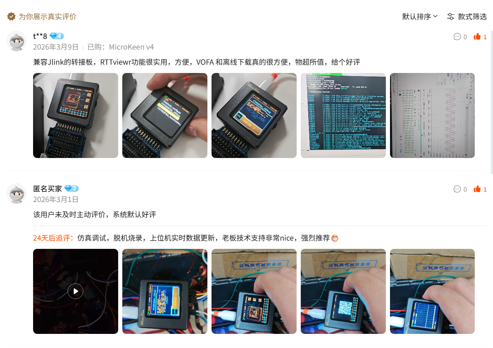
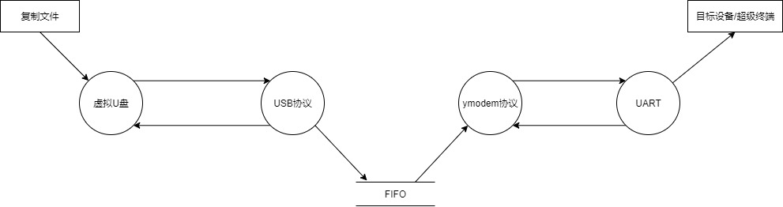
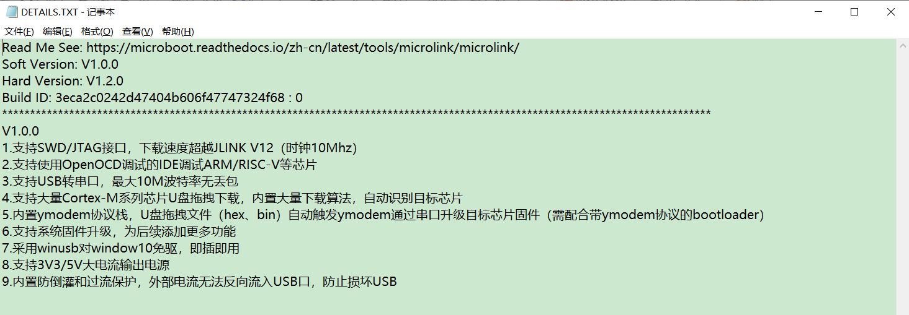
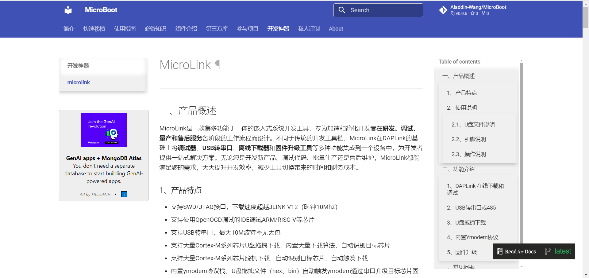
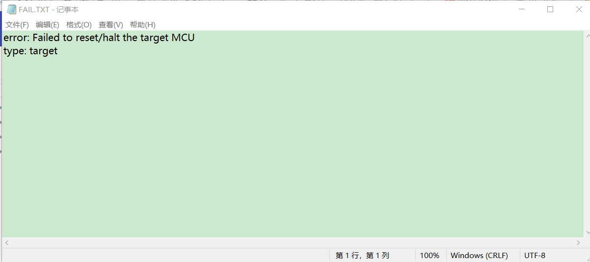
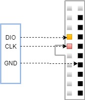
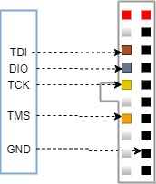

# MicroLink

---

## 一、产品概述

MicroLink是一款集多功能于一体的嵌入式系统开发工具，专为加速和简化开发者在**研发、调试、量产和售后服务**各阶段的工作流程而设计。不同于传统的开发工具链，MicroLink在DAPLink的基础上将**调试器**、**USB转串口**、**离线下载器**和**固件升级工具**等多种功能集成到一个设备中，为开发者提供一站式解决方案。无论您是开发新产品、调试代码、批量生产还是售后维护，MicroLink都能满足您的需求，大大提升开发效率，减少工具切换带来的时间和财务成本。

### 产品特点

- [x] 支持SWD/JTAG接口，下载调试速度超越JLINK V12（时钟10Mhz）
- [x] 支持使用OpenOCD的IDE下载调试ARM/RISC-V等芯片
- [x] 支持USB转串口，最大10M波特率无丢包
- [x] 支持大量Cortex-M系列芯片U盘拖拽下载，内置大量下载算法，自动识别目标芯片
- [x] 内置ymodem协议栈，U盘拖拽文件自动触发ymodem通过串口传输文件到目标设备（需配合带ymodem协议的[bootloader](https://github.com/Aladdin-Wang/MicroBoot)）
- [x] 支持系统固件升级，为后续添加更多功能
- [x] 采用winusb对window10免驱，即插即用
- [x] 支持3V3/5V大电流输出电源
- [x] 内置防倒灌和过流保护，外部电流无法反向流入USB口，防止损坏USB
- [ ] 支持通过U盘读取目标芯片固件
- [ ] 支持通过U盘读取目标芯片任意文件
- [ ] 支持Cortex-M系列芯片脱机下载，自动识别目标芯片，自动触发下载
- [ ] 支持RISC-V系列芯片U盘拖拽下载，内置大量下载算法，自动识别目标芯片
- [ ] 支持RISC-V系列芯片脱机下载，自动识别目标芯片，自动触发下载

结合以上产品特点，为开发者提供了下载调试，批量生产，售后维护，固件升级等一站式解决方案。

### 购买地址

淘宝链接：https://item.taobao.com/item.htm?ft=t&id=826800975011

手机淘宝扫码入口

### 更多技术支持

## 二、功能介绍

### 1、DAPLink 在线下载和调试

MicroLink基于标准的CMSIS-DAP在线调试下载协议，针对传统DAPLink工具下载和调试速度缓慢的问题进行了全面优化。除了在软件上对[ARMmbed DAPLink](https://github.com/ARMmbed/DAPLink)代码进行了深度优化，增加了大量的下载算法，还替换了传输速度更快的[CherryUSB](https://github.com/cherry-embedded/CherryUSB)协议栈，并且在硬件上采用了先辑半导体的高性能芯片HPM5301，该芯片主频高达480MHz，内置PHY的高速USB接口，不仅提升了传输速率，还大幅缩短了下载和调试的时间，使其能够胜任更大规模和更复杂的嵌入式应用项目。

高速SWD支持高达10MHz的稳定时钟频率，为资源有限的嵌入式设备提供快速、可靠的单线调试和下载体验。

- **下载速度对比测试**

与目前市面上最新的J-LINK-V12速度对比，目标芯片使用STM32H743，开发环境MDK V5.39，分别使用**MicroLink**和**Jlink V12**将**2558KB**的HEX文件下载到内部FLASH中。使用逻辑分析仪测试时钟引脚，计算出擦除，编程，校验全过程的时间，MicroLink使用时间为**24.205秒**，Jlink V12使用时间为**33.439秒**，测试数据如下图：

**Jlink V12测试结果：**

**MicroLink测试结果：**

**测试结果对比：**

| 调试器        | 总耗时（擦除，编程，校验） |
| ------------- | :------------------------: |
| **MicroLink** |        **24.205秒**        |
| J-LINK V12    |          33.439秒          |

### 2、USB转串口或485

MicroLink内置USB转串口功能，支持常见的串口和485通信，串口最大支持10M波特率，无丢包。

使用逻辑分析仪抓取波形如图所示，每个bit传输的时间为1/10M=100ns。

### 3、U盘拖拽下载

MicroLink支持U盘拖拽下载功能，使固件更新变得像复制文件一样简单。用户只需将固件文件拖放到虚拟U盘中，MicroLink便能自动完成下载，摆脱对上位机的依赖，极大地降低了操作门槛。

ARM官方DAPLINK的拖拽烧录只能针对某一个型号单片机，要想支持其他单片机必须更新调试器的固件，对使用者门槛较高，导致这么方便的功能食之无味弃之可惜。

MicroLink为了让U盘拖拽下载功能真正走进千家万户，对Cortex-M系列的大量芯片做了适配工作，其中意法半导体STM32，国产芯片兆易创新GD32基本都以适配完成，还在持续增加其他型号。

支持的型号：

| 厂商               | 型号                                               |
| ------------------ | -------------------------------------------------- |
| ST意法半导体STM32  | STM32F0XX,STM32F10X,,STM32F4xx,STM32F7xx,STM32G4xx |
| GigaDevice兆易创新 | GD32E50X，                                         |

U盘拖拽下载支持HEX文件和BIN文件，HEX文件自带地址信息，自动根据HEX中的地址选择烧录的位置，BIN文件默认下载的地址为0x08000000，以下演示视频是将HEX文件复制到U盘中，完成固件下载：

<iframe src="https://player.bilibili.com/player.html?bvid=BV14HsKeJEQ1" scrolling="no" border="0" frameborder="no" framespacing="0" allowfullscreen="true" width="640" height="480"> </iframe>
### 4、内置Ymodem协议

MicroLink内置Ymodem协议，支持通过串口进行可靠的文件传输。Ymodem协议在多次重传时仍能保持数据的完整性，适用于嵌入式系统的固件更新和调试中需要高可靠性传输的场景。

使用内置的ymodem协议发送文件，首先需要目标设备支持ymodem协议接收文件，MicorBoot开源框架集成了ymodem模块，可以方便用户直接安装使用，具体使用方法请看MicorBoot简介。

MicorBoot简介：https://microboot.readthedocs.io/zh-cn/latest/

MicorBoot开源代码：https://github.com/Aladdin-Wang/MicroBoot

数据流图：

**注：当SWD接口连接到板子时，U盘拖拽下载默认使用SWD接口，当只有串口连接时，才自动切换到ymodem协议下载。**

ymodem协议支持传输任意文件，配合MicorBoot可以用来升级固件或者传输音视频等文件到目标设备，以下演示视频是将bin文件复制到U盘中，完成ymodem的文件传输。传输过程中，可以打开串口助手，连接MicroLink的虚拟串口，选择波特率，MicroLink将以串口设定的波特率传输数据，并实时显示ymodem传输的数据。

<iframe src="https://player.bilibili.com/player.html?bvid=BV1CcsWeoE5o" scrolling="no" border="0" frameborder="no" framespacing="0" allowfullscreen="true" width="640" height="480"> </iframe>

### 5、固件升级

MicroLink支持系统固件升级，可以为后续添加更多的功能，升级方式非常简单，只需要将microlink.rbl升级包，复制到MicroLink的U盘中即可自动完成升级，升级完成后会自动重启设备，升级完成可以查看DETAILS.TXT文件，了解升级后的新功能。

升级包下载地址：https://pan.baidu.com/s/1rBDE9_qOrqtNULkzzsm2Rg?pwd=jmfn 

## 三、使用说明

### 1、U盘文件说明

- DETAILS.TXT

DETAILS.TXT记录了MicroLink软硬件版本和每次版本更新的内容。

- MBED.HTM

MBED.HTM是一个在线文档的网址链接，双击该文件即可访问在线文档，进一步了解更多的功能。

- FAIL.TXT

  FAIL.TXT文件只有在U盘拖拽下载失败时，会自动生成，记录了下载失败的原因，如果下载成功，会自动重启U盘，不会生成新的提示文件。

  

### 2、引脚说明

| 引脚名称 | 功能                                |
| -------- | ----------------------------------- |
| 5V       | 5V电源输出                          |
| 3.3V     | 3.3V电源输出                        |
| GND      | GND公共地                           |
| DIO/TMS  | SWD接口数据信号，或JTAG接口模式选择 |
| CLK/TCK  | SWD接口时钟信号，或JTAG接口时钟     |
| TDO      | JTAG接口数据输出                    |
| TDI      | JTAG接口数据输入                    |
| RX/A     | 串口数据接收，或者485接口A          |
| TX/B     | 串口数据发生，或者485接口B          |
| RST      | 复位脚输出                          |

SWD简化接线图：

JTAG简化接线图：

### 3、操作说明

- 以Keil为例

1、在DEBUG栏中选择CMSIS-DAP Debugger

2、与设备连接好SWD引脚，选择MICROLINK CMSIS-DAP，Max Clock下载时钟频率选择10MHz

3、勾选自动复位选项，添加下载算法

- 以SEGGER Embedded Studio为例

1、点击工程， 右击选择“options” ， 在弹出的对话框中点击Debugger,然后选择GDB Server  

2、点击GDB Server,在GDB Server Command Line中查看openocd配置文件,更改此配置文件为 cmsis-dap.cfg

3、与设备连接好JTAG引脚，点击Target,连接connect GDB Server，连接成功后Output窗口如图所示

