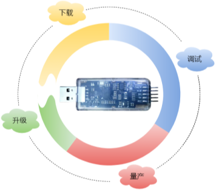

# MicroLink

---

## 一、产品概述

MicroLink是一款集多功能于一体的嵌入式系统开发工具，专为加速和简化开发者在**研发、调试、量产和售后服务**各阶段的工作流程而设计。不同于传统的开发工具链，MicroLink将**调试器**、**USB转串口**、**离线下载器**和**固件升级工具**等多种功能集成到一个设备中，为开发者提供一站式解决方案。无论您是开发新产品、调试代码、批量生产还是售后维护，MicroLink都能满足您的需求，大大提升开发效率，减少工具切换带来的时间和财务成本。

### 产品特点

- 下载速度超越JLINK V12
- 支持ST全系列型号拖拽下载
- 自带串口，最大速度达10M波特率

## 二、功能介绍

### 1、DAPLink 在线下载和调试

MicroLink基于标准的CMSIS-DAP在线调试下载协议，针对传统DAPLink工具下载和调试速度缓慢的问题进行了全面优化。除了在软件上对DAPLink代码进行了深度优化，MicroLink在硬件上采用了先辑半导体的高性能芯片HPM5301，该芯片主频高达480MHz，内置PHY的高速USB接口，不仅提升了传输速率，还大幅缩短了下载和调试的时间，使其能够胜任更大规模和更复杂的嵌入式应用项目。

- 高速SWD：支持高达10MHz的稳定时钟频率，为资源有限的嵌入式设备提供快速、可靠的单线调试和下载体验。

  

- 高速JTAG：多引脚接口，支持复杂的多核微控制器调试，满足更高的调试需求。

### 2、USB转串口或485

MicroLink内置USB转串口功能，支持常见的串口和485通信，开发者可以轻松与嵌入式设备进行数据传输和调试。无需额外的转换器，简化硬件连接，并且支持多种波特率选择，广泛适用于不同应用场景。

### 3、U盘拖拽下载

MicroLink支持U盘拖拽下载功能，使固件更新变得像复制文件一样简单。用户只需将固件文件拖放到虚拟U盘中，MicroLink便能自动完成下载，无需复杂的配置和指令，极大地降低了操作门槛。

### 4、离线固件下载

为量产和批量维护设计的离线下载器功能，使MicroLink能够在不连接电脑的情况下独立工作。通过预加载固件，用户可以轻松在多个设备上进行快速固件烧录，显著提高生产效率。

SWD引脚接触目标板卡，就会自动触发下载

### 5、内置Ymodem协议

MicroLink内置Ymodem协议，支持通过串口进行可靠的文件传输。Ymodem协议在多次重传时仍能保持数据的完整性，适用于嵌入式系统的固件更新和调试中需要高可靠性传输的场景。

### 6、固件升级

