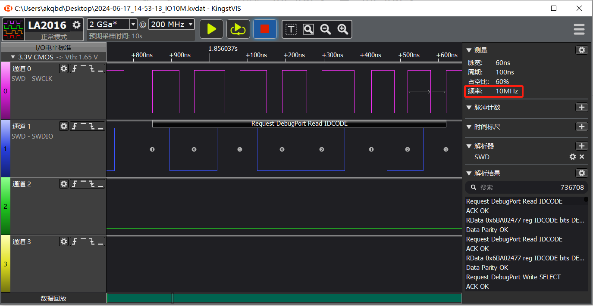

# MicroLink

---

## 一、产品概述

MicroLink是一款集多功能于一体的嵌入式系统开发工具，专为加速和简化开发者在研发、调试、量产和售后服务各阶段的工作流程而设计。不同于传统的开发工具链，MicroLink将调试器、USB转串口、离线下载器、固件升级工具等多种功能集成到一个设备中，为开发者提供一站式解决方案。无论您是开发新产品、调试代码、批量生产还是售后维护，MicroLink都能满足您的需求，大大提升开发效率，减少工具切换带来的时间和财务成本。

## 二、功能介绍

### 1、DAPLink 在线下载和调试

- 高速SWD

  

- 高速JTAG

### 2、USB转串口或485

MicroLink内置USB转串口功能，支持常见的串口和485通信，开发者可以轻松与嵌入式设备进行数据传输和调试。无需额外的转换器，简化硬件连接，并且支持多种波特率选择，广泛适用于不同应用场景。

### 3、U盘拖拽下载

MicroLink支持U盘拖拽下载功能，使固件更新变得像复制文件一样简单。用户只需将固件文件拖放到虚拟U盘中，MicroLink便能自动完成下载，无需复杂的配置和指令，极大地降低了操作门槛。

### 4、离线下载器

为量产和批量维护设计的离线下载器功能，使MicroLink能够在不连接电脑的情况下独立工作。通过预加载固件，用户可以轻松在多个设备上进行快速固件烧录，显著提高生产效率。

### 5、内置Ymodem协议

MicroLink内置Ymodem协议，支持通过串口进行可靠的文件传输。Ymodem协议在多次重传时仍能保持数据的完整性，适用于嵌入式系统的固件更新和调试中需要高可靠性传输的场景。

### 6、固件升级

