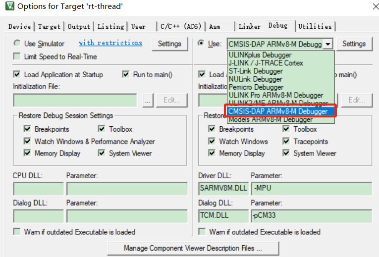
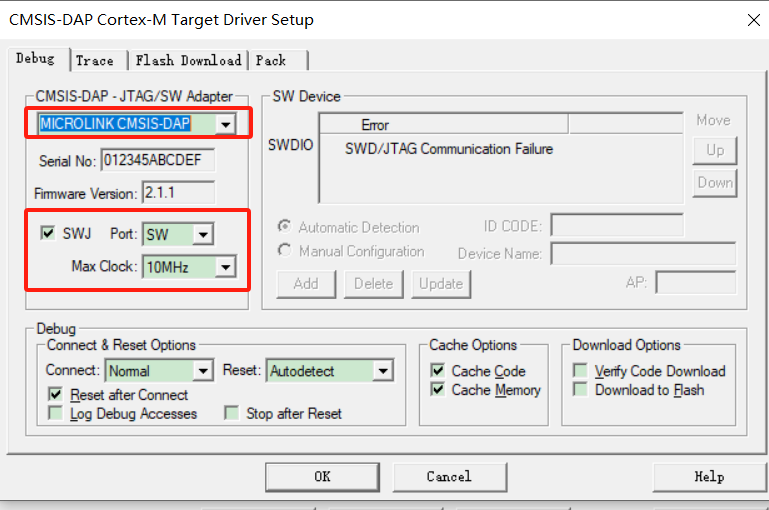
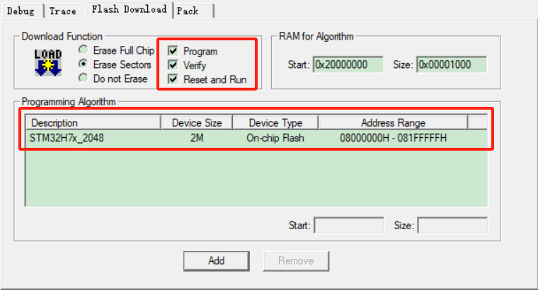
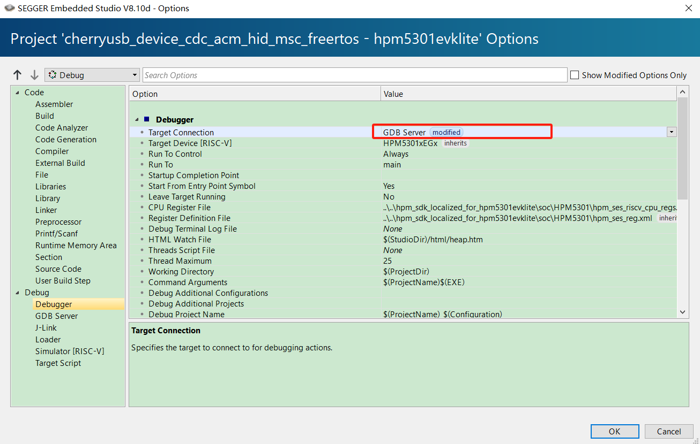
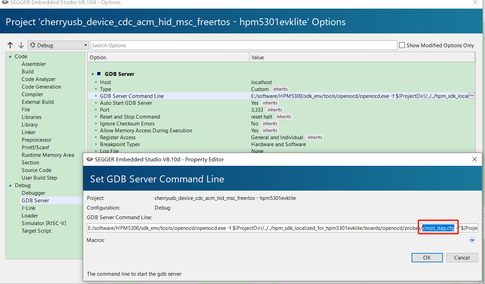
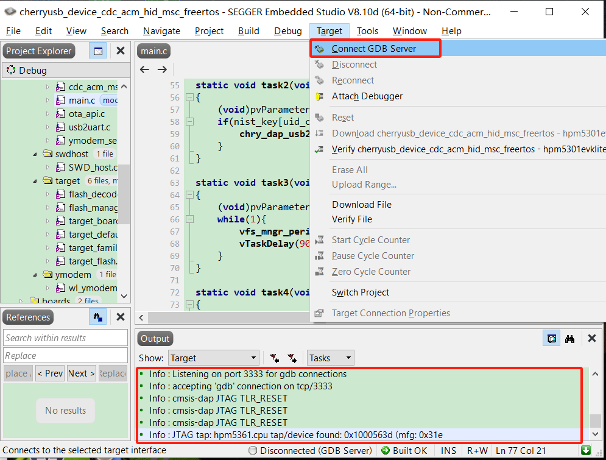
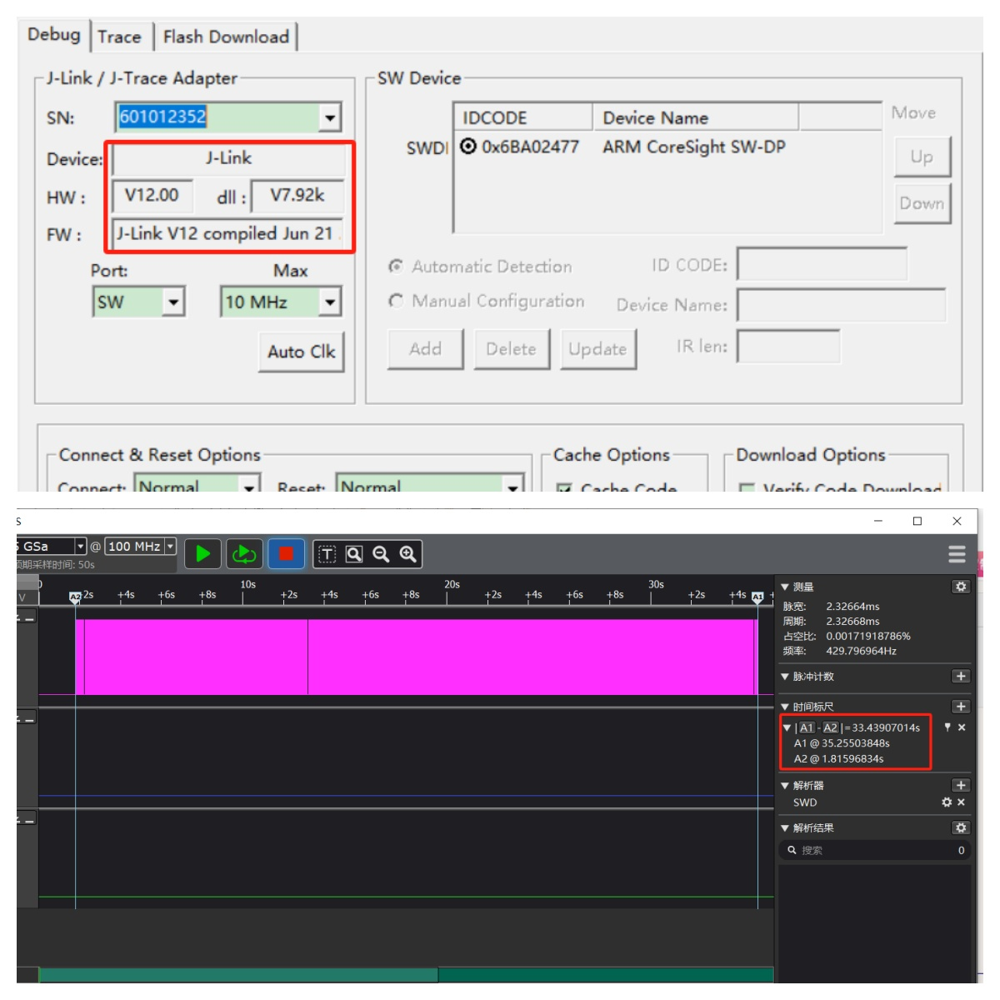
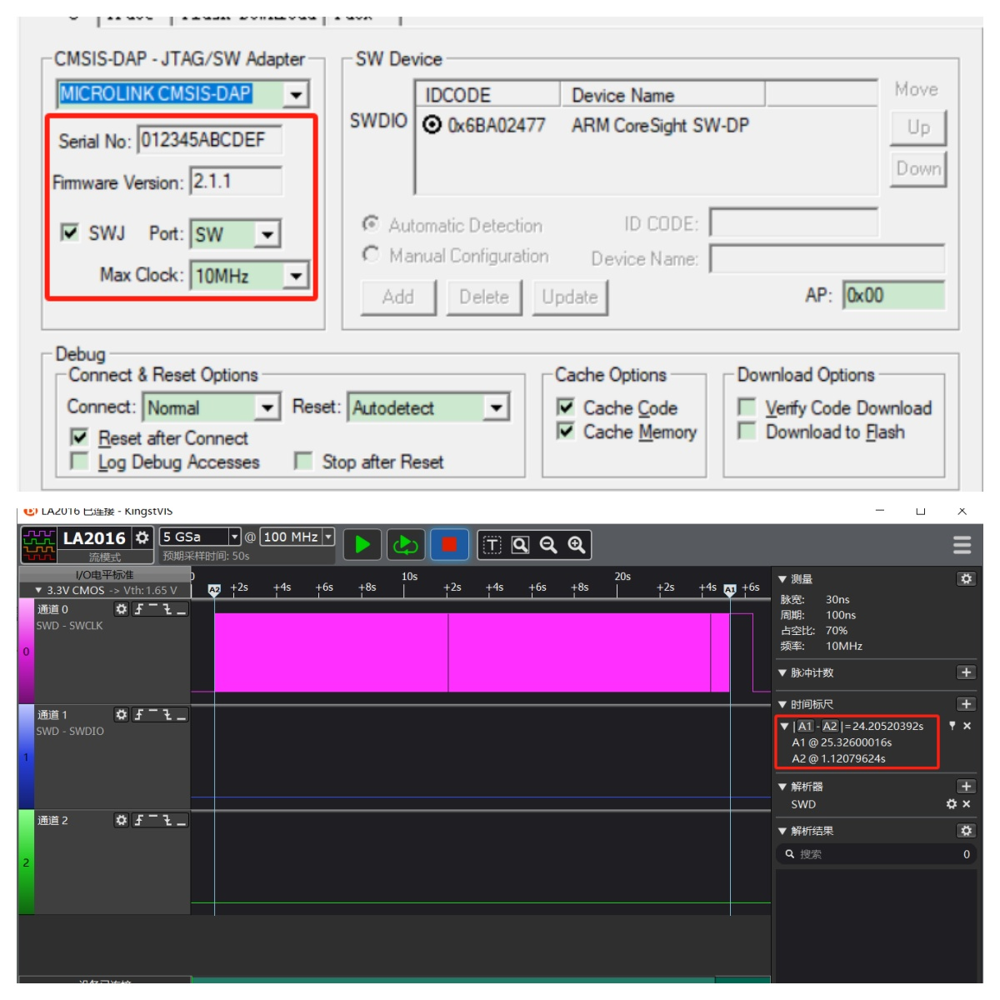
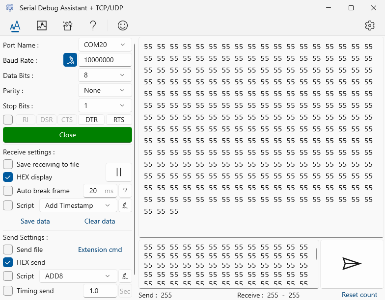
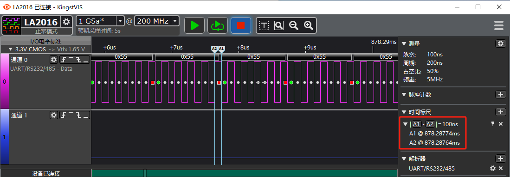

# MicroLink

---

## 一、产品概述

MicroLink是一款集多功能于一体的嵌入式系统开发工具，专为加速和简化开发者在**研发、调试、量产和售后服务**各阶段的工作流程而设计。不同于传统的开发工具链，MicroLink在DAPLink的基础上将**调试器**、**USB转串口**、**离线下载器**和**固件升级工具**等多种功能集成到一个设备中，为开发者提供一站式解决方案。无论您是开发新产品、调试代码、批量生产还是售后维护，MicroLink都能满足您的需求，大大提升开发效率，减少工具切换带来的时间和财务成本。

### 1、产品特点

- 支持SWD/JTAG接口，下载速度超越JLINK V12（时钟10Mhz）
- 支持使用OpenOCD调试的IDE调试ARM/RISC-V等芯片
- 支持USB转串口，最大10M波特率无丢包
- 支持大量Cortex-M系列芯片U盘拖拽下载，内置大量下载算法，自动识别目标芯片
- 支持大量Cortex-M系列芯片脱机下载，自动识别目标芯片，自动触发下载
- 内置ymodem协议栈，U盘拖拽文件（hex、bin）自动触发ymodem通过串口升级目标芯片固件（需配合带ymodem协议的[bootloader](https://github.com/Aladdin-Wang/MicroBoot)）
- 支持读取目标芯片固件
- 支持通过串口读取目标芯片任意文件（需定制）
- 支持系统固件升级，为后续添加更多功能
- 采用winusb对window10免驱，即插即用
- 支持3V3/5V大电流输出电源
- 内置防倒灌和过流保护，外部电流无法反向流入USB口，防止损坏USB

结合以上产品特点，为开发者提供了下载调试，批量生产，售后维护，固件升级等一站式解决方案。

### 2、使用说明

#### 2.1、U盘文件说明

- DETAILS.TXT

- MBED.HTM

- FAIL.TXT

  

#### 2.2、引脚说明

#### 2.3、操作说明

- 以Keil为例

1、在DEBUG栏中选择CMSIS-DAP Debugger

2、选择MICROLINK CMSIS-DAP，Max Clock下载时钟频率选择10MHz

3、勾选自动复位选项，添加下载算法

- 以SEGGER Embedded Studio为例

1、点击工程， 右击选择“options” ， 在弹出的对话框中点击Debugger,然后选择GDB Server  

2、点击GDB Server,在GDB Server Command Line中查看openocd配置文件,更改此配置文件为 cmsis-dap.cfg

3、点击Target,连接connect GDB Server在GDB Server Command Line中查看openocd配置文件,更改此配置文件为 cmsis-dap.cfg

## 二、功能介绍

### 1、DAPLink 在线下载和调试

MicroLink基于标准的CMSIS-DAP在线调试下载协议，针对传统DAPLink工具下载和调试速度缓慢的问题进行了全面优化。除了在软件上对DAPLink代码进行了深度优化，并且在硬件上采用了先辑半导体的高性能芯片HPM5301，该芯片主频高达480MHz，内置PHY的高速USB接口，不仅提升了传输速率，还大幅缩短了下载和调试的时间，使其能够胜任更大规模和更复杂的嵌入式应用项目。

高速SWD支持高达10MHz的稳定时钟频率，为资源有限的嵌入式设备提供快速、可靠的单线调试和下载体验。

- **下载速度对比测试**

与目前市面上最新的J-LINK-V12速度对比，目标芯片使用STM32H743，开发环境MDK V5.39，分别使用**MicroLink**和**Jlink V12**将**2558KB**的HEX文件下载到内部FLASH中。使用逻辑分析仪测试时钟引脚，计算出擦除，编程，校验全过程的时间，MicroLink使用时间为**24.205秒**，Jlink V12使用时间为**33.439秒**，测试数据如下图：

**Jlink V12测试结果：**

**MicroLink测试结果：**

**测试结果对比：**

| 调试器        | 总耗时（擦除，编程，校验） |
| ------------- | :------------------------: |
| **MicroLink** |        **24.205秒**        |
| J-LINK V12    |          33.439秒          |

### 2、USB转串口或485

MicroLink内置USB转串口功能，支持常见的串口和485通信，串口最大支持10M波特率，无丢包。

使用逻辑分析仪抓取波形如图所示，每个bit传输的时间为1/10M=100ns。

### 3、U盘拖拽下载

MicroLink支持U盘拖拽下载功能，使固件更新变得像复制文件一样简单。用户只需将固件文件拖放到虚拟U盘中，MicroLink便能自动完成下载，无需复杂的配置和指令，极大地降低了操作门槛。

### 4、内置Ymodem协议

MicroLink内置Ymodem协议，支持通过串口进行可靠的文件传输。Ymodem协议在多次重传时仍能保持数据的完整性，适用于嵌入式系统的固件更新和调试中需要高可靠性传输的场景。

<iframe src="https://player.bilibili.com/player.html?bvid=BV1CcsWeoE5o" scrolling="no" border="0" frameborder="no" framespacing="0" allowfullscreen="true" width="640" height="480"> </iframe>

### 5、固件升级

## 三、常见问题
