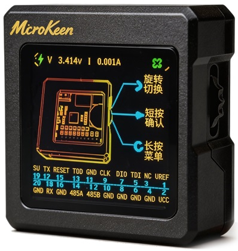
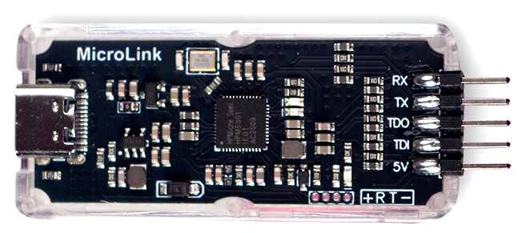
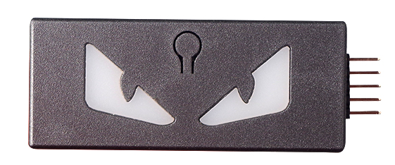

# MKLink 产品与功能总览

MKLink（MicroKeen）把在线调试、固件烧录、串口、RTT、变量采样和脱机生产集中到一台设备中。研发阶段可以在 Keil、IAR 或 Web GUI 中使用；进入小批量生产后，同一台下载器可以保存固件和算法，脱离电脑完成烧录；出现运行故障时，还可以读取内存、Fault 寄存器和 RTOS Trace。

## 先按任务选择功能

| 要完成的工作 | 使用功能 | 需要准备 | 主要入口 | 详细教程 |
|---|---|---|---|---|
| 编译、烧录并确认新程序运行 | 在线烧录 | 工程或 HEX/BIN | IDE、在线烧录 | [在线编译与烧录](online-flash.md) |
| 不接电脑进行单台或连续烧录 | 脱机下载 | 固件、FLM、量产参数 | 脱机烧录 | [脱机下载与量产](offline_download.md) |
| 不占用 MCU 串口查看日志 | RTT View | RTT 控制块 | 仪表盘 / RTT View | [RTT View 日志与终端](RTT_printf.md) |
| 连续观察 PID、FOC 和状态变量 | SuperWatch | 匹配固件的 AXF/ELF | 仪表盘 / SuperWatch | [SuperWatch 与 PID 调试](superwatch.md) |
| 在第三方上位机中显示变量曲线 | VOFA+ | 变量地址、类型、MKLink 虚拟串口 | VOFA+ / JustFloat | [VOFA+ 第三方上位机](vofa.md) |
| 查看 RAM、外设和 Fault 寄存器 | Memory | 地址或 AXF 符号 | 仪表盘 / Memory | [Memory 内存与寄存器](memory.md) |
| 保存异常现场并定位源码 | HardFault / RISC-V Trap | Fault/Trap 现场、匹配的 ELF | 仪表盘 / Memory / HardFault | [故障现场分析](hardfault.md) |
| 分析任务、ISR 和 CPU 占用 | RTOS Trace | RTT、SystemView 适配 | 仪表盘 / RTOS Trace | [RTOS Trace / SystemView](SystemView.md) |
| 调试 UART、RS485 或 Modbus RTU | 串口与 Modbus | 通信参数或点表 | 仪表盘 | [串口与 Modbus](serial-modbus.md) |
| 更新下载器自身功能 | 固件升级 | 对应型号升级包 | U 盘 / UF2 | [固件升级](firmware-upgrade.md) |
| 获取软件、固件、FLM 和源码 | 资料下载 | 下载器型号、目标器件 | 官方资料页 | [资料下载](downloads.md) |

Web GUI 适合人工配置、操作和查看曲线；AI Skill 适合读取工程、调用同一套硬件能力并整理验证证据。两者可以使用同一个工程，但不能同时占用同一探针资源。

使用嵌入式 AI 操作下载器时，从[嵌入式 AI + MKLink 使用概览](../../AI/AI.md)开始。

## 产品型号

### MKLink V2

面向在线下载、调试和高速 USB 转串口。V2 可通过虚拟磁盘拖入固件，脱机机台触发使用 TDI/TDO 引脚。

### MKLink V3

在在线功能基础上增加独立脱机下载、板载存储、目标电压跟随和按键触发，适合研发与小批量生产共用。

### MKLink V4

V4 增加显示、RS485、功率监测、更大的存储空间和可选择的 Python 脱机脚本，适合调试台和量产工位。

| 能力 | V2 | V3 | V4 |
|---|:---:|:---:|:---:|
| CMSIS-DAP 在线下载和调试 | 支持 | 支持 | 支持 |
| USB 转 UART | 支持 | 支持 | 支持 |
| RTT、SystemView、VOFA+ | 支持 | 支持 | 支持 |
| 下载器内部 Python API | 支持 | 支持 | 支持 |
| 脱机 HEX/BIN + FLM | 机台/拖拽场景 | 支持 | 支持 |
| 按键触发脱机烧录 | - | 支持 | 支持 |
| 可选择多个脱机脚本 | - | - | 支持 |
| RS485、功率显示 | - | - | 支持 |

!!! note "以设备实际版本为准"
    不同批次固件可能增加能力。连接下载器后可在 Web GUI 底部查看版本历史，也可读取 U 盘中的 `readme.txt`。升级方法见[固件升级](firmware-upgrade.md)。

## 一套工具覆盖产品生命周期

### 研发

- 在 Keil、IAR 等 IDE 中使用标准 CMSIS-DAP 下载和单步调试；
- 用在线烧录页检查 HEX/BIN 地址范围并完成擦除、编程、校验和复位；
- 用 RTT 查看日志，用 SuperWatch 观察控制环，用 RTOS Trace 分析调度；
- 发生 HardFault 时先保存寄存器和异常栈，再恢复目标。

### 小批量和量产

- 将固件、FLM 和下载脚本部署到下载器；
- 通过按键或机台输入触发；
- 记录固件摘要、脚本版本、器件型号和烧录结果；
- 多镜像工程可以按顺序烧录 BootLoader、参数区和应用程序。

### 售后维护

- 使用 YModem 将升级文件发送给产品 BootLoader；
- 在现场通过 RTT、内存和变量获取运行证据；
- 需要无人值守或异地处理时，再使用受认证的远程 Site Agent。

## 推荐学习路线

第一次使用建议按以下顺序完成：

1. [安装上位机与快速启动](gui-install.md)，确认页面显示“后端正常”；
2. [连接硬件与配置工程](project-config.md)，加载同一次构建的 AXF 和 MAP；
3. [在线编译与烧录](online-flash.md)，完成校验并用 RTT 确认运行；
4. [RTT View](RTT_printf.md) 和 [SuperWatch](superwatch.md)，建立正常运行基线；
5. 根据任务进入 [Memory](memory.md)、[HardFault / RISC-V Trap](hardfault.md) 或 [RTOS Trace](SystemView.md)；
6. 需要生产工位时再配置[脱机下载](offline_download.md)。

本手册的实测案例使用 `STM32F103RET6`、RT-Thread 5.1.0 和 Keil MDK。工程目录保留了历史名称 `STM32F103RC`，但芯片丝印、Keil Device 和下载算法均按 RET6 配置。

先楫案例使用 `HPM5301xEGx`、FreeRTOS、HPM SDK 和 SEGGER Embedded Studio，下载只走 HPM ROM API。完整过程见 [HPM5301 + FreeRTOS 全功能实战](hpm5301-freertos-case.md)。

## AI 与工程师如何配合

AI 可以读取工程、选择操作入口、采集日志和整理证据。写 Flash、写 RAM、复位或改变控制参数前，仍应由工程师确认目标、范围和停止条件。

简洁的任务描述即可：

> 检查当前工程和芯片，编译并使用MKlink烧录。

完整的安装和安全边界见[嵌入式 AI + MKLink 使用概览](../../AI/AI.md)。

## 购买、支持与资料

- [固件升级](firmware-upgrade.md)
- [资料下载](downloads.md)
- [常见问题](questions.md)
- [先楫 HPM 生态](先辑使用教程.md)
- [售后服务与嵌入式 AI 交流群](after-sales.md)
- [下载器内部 Python API](python_api.md)

官方店铺：

- [MKLink V2](https://item.taobao.com/item.htm?ft=t&id=895964393739)
- [MKLink V3](https://item.taobao.com/item.htm?ft=t&id=1013104417098)
- [MKLink V4](https://item.taobao.com/item.htm?ft=t&id=1020501356342)

产品讨论和原理文章收录在导航末尾的“扩展阅读”中。先楫 HPM 的工程流程已单独整理为“先楫生态”，需要技术支持或加入交流群可进入“售后服务”。
