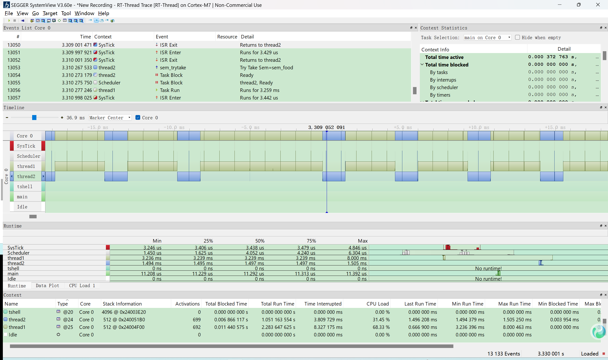
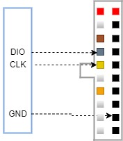
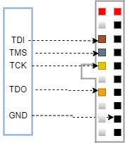
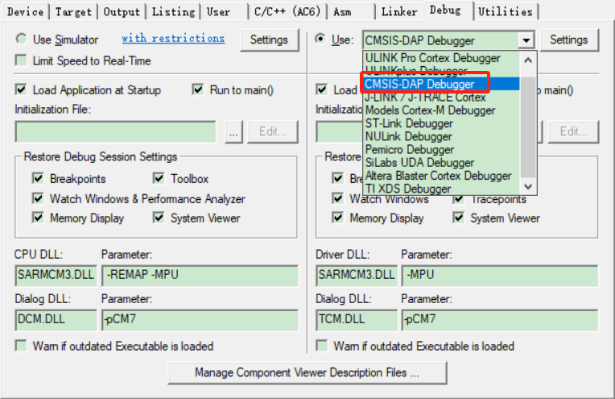
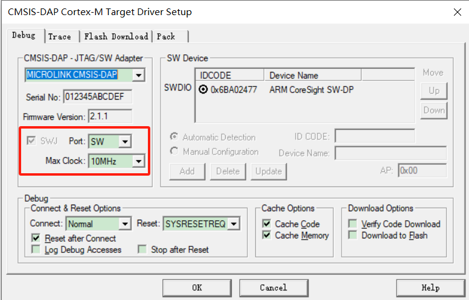

# MicroKeen

---

## 一、产品概述

MicroKeen(简称MKLink)是一款集多功能于一体的嵌入式系统开发工具，专为加速和简化开发者在**研发、调试、量产和售后服务**各阶段的工作流程而设计。不同于传统的开发工具链，MKLink在DAPLink的基础上将**调试器**、**USB转串口**、**离线下载器**和**固件升级工具**等多种功能集成到一个设备中，为开发者提供一站式解决方案。无论您是下载固件、调试代码、批量生产还是固件升级，MKLink都能满足您的需求，大大提升开发效率，减少工具切换带来的时间和财务成本。

### 产品型号

### 1、MicroKeen V2


​                                                         型号1：MKLinkV2 高速在线dap下载器 USB转UART

### 2、MicroKeen V3


​                                                               型号2：MKLinkV3 高速在线/脱机dap下载器 USB转UART

### 3、MicroKeen V3 LCD


​                                                                       型号3：MKLinkV3 LCD高速在线/脱机dap下载器

### 功能对比

| 功能/型号                                       | MKLink V2 | MKLink  V3 | MKLink V3 LCD |
| ----------------------------------------------- | --------- | ---------- | ------------- |
| 高速在线下载调试                                | ✔         | ✔          | ✔             |
| 高速USB转串口(12M)                              | ✔         | ✔          | ✔             |
| USB转RTTVIEW                                    | ✔         | ✔          | ✔             |
| USB转SystemView                                 | ✔         | ✔          | ✔             |
| USB转VOFA+                                      | ✔         | ✔          | ✔             |
| 支持python脚本                                  | ✔         | ✔          | ✔             |
| 支持winusb，win10以上系统免驱                   | ✔         | ✔          | ✔             |
| 自动扫描芯片，提示连接成功                      |           | ✔          | ✔             |
| vref电压自适应，1.8~5V电压                      |           | ✔          | ✔             |
| 脱机下载(bin文件，hex文件)，支持解析FLM下载算法 |           | ✔          | ✔             |
| 内置4MB nor flash                               |           | ✔          |               |
| 内置128MB SD卡                                  |           |            | ✔             |
| 高速USB转485                                    |           |            | ✔             |
| 电压电流显示功率计                              |           |            | ✔             |
| 内置ymodem等自定义协议串口升级固件              |           |            | ✔             |


结合以上产品特点，为开发者提供了**下载调试，批量生产，售后维护，固件升级**等一站式解决方案。


### 购买地址

MKLinkV2        淘宝链接：https://item.taobao.com/item.htm?ft=t&id=895964393739

MKLinkV3        淘宝链接：https://item.taobao.com/item.htm?ft=t&id=1013104417098

MKLinkV3 LCD淘宝链接：https://item.taobao.com/item.htm?ft=t&id=1013104417098


### 更多技术支持

手机扫码添加微信备注**加群**


关注公众号及时获得最新文章


## 二、功能介绍

### 1、DAPLink 在线下载和调试

MicroLink基于标准的CMSIS-DAP在线调试下载协议，针对传统DAPLink工具下载和调试速度缓慢的问题进行了全面优化。为了弥补DAPLINK性能上的不足，硬件方面，采用了**先辑半导体**的高性能**HPM5301**芯片，该芯片主频高达480MHz，内置PHY的高速USB接口；软件方面，将USB协议替换为传输速度更快的**CherryUSB**协议栈，并且对DAPLink固件中的数据处理和通信代码进行了深度优化，减少了内部延迟和等待时间，将SWD时钟速度提升至10MHz。

高速SWD支持高达10MHz的稳定时钟频率，为资源有限的嵌入式设备提供快速、可靠的单线调试和下载体验。


下载过程中CLK的时钟波形：


- **下载速度对比测试**

与目前市面上最新的J-LINK-V12速度对比，目标芯片使用STM32H743，开发环境MDK V5.39，分别使用**MicroLink**和**Jlink V12**将**2558KB**的HEX文件下载到内部FLASH中。使用逻辑分析仪测试时钟引脚，计算出擦除，编程，校验全过程的时间，MicroLink使用时间为**24.205秒**，Jlink V12使用时间为**33.439秒**，测试数据如下图：

**Jlink V12测试结果：**


**MicroLink测试结果：**


**测试结果对比：**

| 调试器           | 总耗时（擦除，编程，校验） |
| ------------- |:-------------:|
| **MicroLink** | **24.205秒**   |
| J-LINK V12    | 33.439秒       |

### 2、USB转串口

MicroLink内置USB转串口功能，支持常见的串口和485通信，串口最大支持12M波特率，无丢包。


使用逻辑分析仪抓取波形如图所示，每个bit传输的时间为1/10M=100ns。


### 3、RTT

只要拥有了**MicroLink**，你就可以享受以下的便利：

- 无需占用**USART**或者**USB**转串口工具，将**printf**重定位到一个由**MicroLink**提供的虚拟串口上；
- 不需要使用专门的RTTView上位机，支持任意串口助手；
- 高速通信，不影响芯片的实时响应。

#### 使用方式

**启动RTT功能：**打开任意串口助手，输入以下指令：

```python
RTTView.start(0x20000000,1024,0)
```

- 0x20000000:搜索_SEGGER_RTT控制块的起始地址；
- 1024：搜寻RTT控制块地址范围大小
- 0: RTT通道

以SSCOM串口助手为例：


**_SEGGER_RTT** 控制块地址可以通过查看MDK编译生成的.map文件来查找，如下：


### 4、SystemView

MicroLink 加入了 **SEGGER SystemView 协议支持**，让你可以在**无需额外硬件**的情况下，轻松进行任务级别的运行态分析与可视化调试。

MicroLink 会将目标设备中 RTOS（如 RT-Thread、FreeRTOS）产生的 SystemView 日志数据通过 **RTT 协议**采集，并通过 USB CDC 虚拟串口转发给 PC。

#### 使用方式

**启动SystemView 功能：**打开任意串口助手，输入以下指令：

```python
SystemView.start(0x20000000,1024,1)
```

- 0x20000000:搜索RTT控制块的起始地址；
- 1024：搜寻RTT控制块地址范围大小
- 1：SystemView使用RTT的通道

**_SEGGER_RTT** 控制块地址可以通过查看MDK编译生成的.map文件来查找，如下：


📌 示例画面：



### 5、VOFA+

MicroKeen（MKLink）已完成对 **VOFA+ 上位机协议的原生适配**，可在功能与使用体验上**完美替代 J-Link 的 J-Scope**。无需额外的 USB 转串口模块或专用数据采集硬件，即可实现**高速、稳定、实时的数据可视化调试**。MKLink 通过 **SWD 直接读取目标芯片内存中的变量数据**，并将其实时封装为 VOFA+ 协议，经 USB CDC 虚拟串口发送至 PC，实现对运行中变量的**曲线显示、波形分析与参数调试**，且不占用 MCU 串口资源、不侵入业务代码。

#### 核心优势

- **无需占用 MCU 串口资源**
   不依赖 USART ，不影响产品原有通信接口设计；
- **基于 SWD 的非侵入式采集**
   不修改业务代码逻辑，对实时性影响极小；
- **支持多种数据类型**
   支持 `int / float / double` 等常见变量类型，自动解析；
- **高速刷新，稳定可靠**
   适配 MKLink 高速 SWD 通道，最高支持1M的读取速率；
- **即插即用**
   直接使用官方 VOFA+ 上位机，无需定制软件。

#### 使用方式

1. 使用 MKLink 连接目标板并正常下载程序；
2. 启动 VOFA+ 上位机，选择MKLink 提供的虚拟串口，发送启动命令。
3. 最多一次支持读取16个常用数据类型的变量

```python
vofa.send(0x20000030,"uint8_t",0x2000154c,"float",0x20001550,"float",0.00001)
```

- 0x20000030:变量1内存地址；
- uint8_t：变量1数据类型；
- 0.00001：读取周期，单位秒，最小支持1us

相关的变量地址可以通过查看MDK编译生成的.map文件来查找，如下：


📌 示例画面：


### 6、脱机下载

MicroLink支持脱机离线下载的功能，借助于强大的PikaPython开源项目，让MicroLink可以使用python脚本进行二次开发，可以非常容易得定制升级流程。

MicroLink的虚拟U盘中有一个`offline_download.py`文件，内容如下：

```python
import PikaStdLib
import time
import cmd
import load

# 自动下载循环次数
AUTO_DOWNLOAD_COUNT = 1
# 等待读取目标IDCODE有效的超时时间（ms）
WAIT_IDCODE_TIMEOUT = 10000
# FLM 文件路径
FLM_FILE_PATH = "FLM/STM32F10x_1024.FLM"
# 目标 Flash 基地址
FLM_FLASH_BASE = 0x08000000
# 目标 RAM 基地址
FLM_RAM_BASE = 0x20000000
# HEX 文件路径（支持通配符）
HEX_FILE_PATH = "rt-thread.hex"
# BIN 文件路径（支持通配符）
BIN_FILE_PATH = "boot.bin"
# BIN 文件下载地址
BIN_FILE_ADD = 0x08000000
# SWD 时钟频率（Hz）
SWD_CLOCK_HZ = 10000000
 # 设置下载速度
cmd.set_swd_clock(SWD_CLOCK_HZ)

 # 自动循环下载 
abort = False
for i in range(AUTO_DOWNLOAD_COUNT):
    if abort:
        break
    print("=== Auto Download Round:", i + 1, "===")
    elapsed = 0
 # 等待连接目标板   
    while True:
        idcode = cmd.get_idcode()
        if idcode not in (0, 0xFFFFFFFF):
            break
        if elapsed >= WAIT_IDCODE_TIMEOUT:
            print("wait idcode online timeout")
            abort = True
            break
        print("=== waited_ms :", elapsed, "===")
        time.sleep_ms(500)
        elapsed += 500
    if abort:
        break
    print("IDCODE: 0x%08X" % idcode)
    time.sleep_ms(200)
 # 加载下载算法 
    if load.flm(FLM_FILE_PATH, FLM_FLASH_BASE, FLM_RAM_BASE) != 0:
        print("load flm failed")
        abort = True
        break
 # 下载bin文件     
    if load.bin(BIN_FILE_PATH,BIN_FILE_ADD) != 0:
        print("load bin failed")
        abort = True
        break        
 # 下载hex文件     
    if load.hex(HEX_FILE_PATH) != 0:
        print("load hex failed")
        abort = True
        break
 # 循环次数为1，只下载一次        
    if  AUTO_DOWNLOAD_COUNT == 1:
        break    
    elapsed = 0
 # 等待断开连接目标板     
    while True:
        idcode = cmd.get_idcode()
        if idcode in (0, 0xFFFFFFFF):
            break

        if elapsed >= WAIT_IDCODE_TIMEOUT:
            print("wait idcode offline timeout")
            abort = True
            break
        time.sleep_ms(500)
        elapsed += 500
if not abort:
    print("auto download finished")
else:
    print("auto download aborted")

```

该代码通过加载FLM算法文件，将多个二进制文件（如boot.bin和rt-thread.hex）分别烧录到STM32内部不同地址的flash中。

> **注意：**请根据您的实际项目需求，修改以下内容：
>
> - **下载算法文件名称**（如 `"FLM/STM32F10x_1024.FLM"`）：应替换为对应芯片和Flash型号的 FLM 文件。
> - **下载文件名称及地址**（如 `"boot.bin"`、`"rt-thread.hex"`，及其对应的地址）：请确保文件名和烧录地址与您的程序结构一致。
>
> 若文件名或地址设置不当，可能导致程序无法正常运行或烧录失败。

🚀 **触发烧录的方式**

MicroLink 下载器支持以下两种方式触发脱机烧录脚本的执行：

1. **按键触发**
    按下 MKLink 脱机下载扩展板上的按键，即可启动脱机烧录流程并执行该脚本。


2. **Python 虚拟终端手动触发**

使用一个串口助手，连接虚拟串口端口，输入`load.offline()`加回车，效果如下：


### 7、内置Ymodem协议下载

MicroLink内置Ymodem协议，支持通过串口进行可靠的文件传输。ymodem协议在多次重传时仍能保持数据的完整性，非常适用于嵌入式系统的固件升级。

使用内置的ymodem协议发送文件，首先需要目标设备支持ymodem协议接收文件，MicorBoot开源框架集成了ymodem模块，可以方便用户直接安装使用，具体使用方法请看MicorBoot简介。

MicroBoot简介：https://microboot.readthedocs.io/zh-cn/latest/

MicroBoot开源代码：https://github.com/Aladdin-Wang/MicroBoot

将需要升级的固件拷贝到U盘中，比如updata.bin，然后随便使用一个串口助手，打开虚拟串口，输入`ym.send("updata.bin")`加回车

参数的含义：

- "updata.bin"：下载的文件名字；
- 支持多个参数，多个文件连续发送；

如果你的bootloader中还没有ymodem协议，可以使用xshell等待ymodem接收协议的上位机，进行快速验证，演示视频如下，使用MicroLink和另外一个串口工具，分别使用sscom5上位机输入命令和xshell上位机进行文件接收

<iframe src="https://player.bilibili.com/player.html?bvid=BV1VYRgYYERg" scrolling="no" border="0" frameborder="no" framespacing="0" allowfullscreen="true" width="640" height="480"> </iframe>


### 8、固件升级

MKLink支持系统固件升级，可以为后续添加更多的功能，升级方式非常简单，只需要将microlink.rbl升级包，复制到MicroLink的U盘中即可自动完成升级，升级完成后会自动重启设备，并删除升级包。升级完成可以查看version.txt文件，了解升级后的新功能。

⚠️ 需要注意的是，如果Microlink没有自动重启升级，请手动重新上电,再重新复制升级包进行升级。

**开发资料下载地址**：https://pan.baidu.com/s/1Dr8Ss16cBRWXtQpyOGrROg?pwd=zyo0 


## 三、使用说明

### 1、U盘文件说明

- readme.txt

readme.txt记录了MicroLink软硬件版本和每次版本更新的内容。


- help.htm

help.htm是一个在线文档的网址链接，双击该文件即可访问在线文档，进一步了解更多的功能。


- 默认配置脚本default_config.py

```python
 # 使能自动扫描芯片
cmd.set_auto_scan(1)
 # 设置默认输出电压(单位mv)
cmd.set_power_on(3300)
```

- 拖拽下载脚本drag_download.py

设备上电会首先读取drag_download.py脚本，根据脚本内容加载Flash下载算法，执行用户指令。

- 脱机下载脚本offline_download.py

根据脚本，执行脱机下载流程。

- xxx.FLM

借助单片机厂家提供的pack包里的xxx.FLM下载算法文件，可以支持任意单片机的脱机下载。

比如STM32F1系列的下载算法所在的电脑默认位置如下：


### 2、引脚说明

| 引脚名称    | 功能                    |
| ------- | --------------------- |
| 5V      | 5V电源输出                |
| 3.3V    | 3.3V电源输出              |
| GND     | GND公共地                |
| DIO/TMS | SWD接口数据信号，或JTAG接口模式选择 |
| CLK/TCK | SWD接口时钟信号，或JTAG接口时钟   |
| TDO     | JTAG接口数据输出            |
| TDI     | JTAG接口数据输入            |
| RX/A    | 串口数据接收，或者485接口A       |
| TX/B    | 串口数据发生，或者485接口B       |
| RST     | 复位脚输出                 |

SWD简化接线图：



JTAG简化接线图：



### 3、端口说明

电脑使用USB TypeC数据线与MicroLink连接以后，电脑设备端会弹出三个设备：


- 磁盘设备


- 串口(两路)

**一路为USB转串口**；

另外一路为**虚拟串口**，打开串口时，输入回车，会自动打印python的信息；

**为了方便区分两路串口，通过USB转串口发送数据LED指示灯会闪烁，通过虚拟串口发送数据不LED指示灯不会闪烁。**


- MicroLink CMSIS-DAP

**如果Keil无法识别，请给keil升级到最新版本（不能低于5.29），并尝试卸载MicroLink CMSIS-DAP设备驱动，重新连接MicroLink**

### 4、操作说明

- 以Keil为例

1、在DEBUG栏中选择CMSIS-DAP Debugger



2、与设备连接好SWD引脚，选择MICROLINK CMSIS-DAP，Max Clock下载时钟频率选择10MHz



3、勾选自动复位选项，添加下载算法


- 以SEGGER Embedded Studio为例

1、点击工程， 右击选择“options” ， 在弹出的对话框中点击Debugger,然后选择GDB Server  


2、点击GDB Server,在GDB Server Command Line中查看openocd配置文件,更改此配置文件为 cmsis-dap.cfg


3、与设备连接好JTAG引脚，点击Target,连接connect GDB Server，连接成功后Output窗口如图所示


